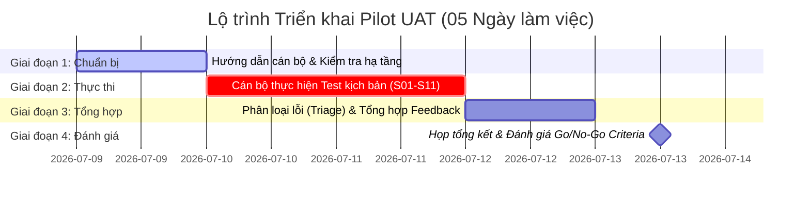

# LEGALFLOW V2 - PHASE 10B
# PILOT UAT EXECUTION PLAN

**Ngày lập kế hoạch:** 08/07/2026  
**Phiên bản áp dụng:** `v2.10.0-production-readiness-deployment-runbook` ➔ Triển khai Pilot UAT (`Phase 10B`)  
**Chuyên trách tổ chức:** Trợ lý kỹ thuật & Điều phối viên UAT (Antigravity AI)

---

## 1. Purpose
Tài liệu **Pilot UAT Execution Plan** là kế hoạch tổng thể tổ chức đợt Kiểm thử Chấp nhận Người dùng cuối thí điểm (`Pilot UAT`) với sự tham gia trực tiếp của các **Cán bộ, Chuyên viên nghiệp vụ và Lãnh đạo phòng thẩm định thực tế** trước khi triển khai chính thức trên toàn quy mô địa phương.
Kế hoạch bảo đảm việc kiểm chứng hệ thống diễn ra bài bản, có cấu trúc rõ ràng, đánh giá toàn diện tính tiện dụng của giao diện, độ chính xác của Trợ lý AI và sự tuân thủ nghiêm ngặt các nguyên tắc pháp lý theo triết lý **Human-in-the-Loop**.

---

## 2. Pilot Objectives
Đợt kiểm thử Pilot UAT đặt ra 8 mục tiêu cốt lõi cần xác minh thực tiễn:
1. **Kiểm tra khả năng sử dụng thực tế (Usability Audit):** Đánh giá tốc độ, độ trực quan và tính thuận tiện của giao diện khi chuyên viên thao tác thụ lý hồ sơ TTHC đất đai hằng ngày.
2. **Kiểm tra AI review (AI Analysis Verification):** Kiểm chứng chất lượng phân tích thẩm định cho 2 thủ tục Cấp GCN lần đầu và Chuyển mục đích sử dụng đất, bảo đảm AI hỗ trợ chính xác theo quy định pháp luật.
3. **Kiểm tra cảnh báo AI (AI Warning Visibility):** Xác nhận thông điệp `BẢN GỢI Ý AI – CÁN BỘ PHẢI KIỂM TRA` hiển thị nổi bật trên UI và trên tài liệu xuất ra, bảo đảm AI không kết luận thay thế cán bộ.
4. **Kiểm tra legal snapshot (Snapshot Integrity):** Kiểm chứng việc lưu vết bất biến Căn cứ pháp lý (`ProcedureAiAnalysisLegalSnapshot`) tại đúng thời điểm AI phân tích.
5. **Kiểm tra export draft (Export Safety):** Kiểm chứng tính năng Xem trước PDF, In và Tải xuống file Word (`.docx`). Bảo đảm 100% file tải xuống có tiền tố `DU_THAO_GOI_Y_AI_...` và có tuyên bố từ chối trách nhiệm pháp lý.
6. **Kiểm tra phân quyền (RBAC Audit):** Kiểm chứng tính chính xác của ma trận phân quyền trên cả UI và API cho 4 vai trò: `ADMIN`, `MANAGER`, `STAFF`, và `VIEWER`.
7. **Kiểm tra lỗi / empty state (Error Handling):** Kiểm chứng phản hồi của hệ thống khi mất kết nối mạng hoặc gọi API thất bại, bảo đảm hiển thị banner lỗi đỏ kèm nút **Thử lại (`Thử lại`)** và không rơi vào nhầm lẫn Empty State.
8. **Ghi nhận góp ý nghiệp vụ (Business Feedback):** Thu thập các ý kiến đóng góp thực tiễn từ chuyên viên trực tiếp thẩm định hồ sơ để tinh chỉnh Prompt AI và cải tiến quy trình TTHC.

---

## 3. Pilot Scope
Phạm vi kiểm thử trong giai đoạn Pilot UAT bao phủ toàn diện 10 khu vực chức năng của LegalFlow v2:
1. **Danh sách hồ sơ (`ProcedureCaseList`):** Tìm kiếm, lọc theo Lĩnh vực (`Đất đai`), lọc theo Trạng thái (`RECEIVED`, `PROCESSING`, `COMPLETED`) và điều hướng chi tiết.
2. **Chi tiết hồ sơ (`ProcedureCaseDetail`):** Kiểm tra thông tin người nộp, thông tin thửa đất, diện tích, tình trạng thụ lý và lịch sử luân chuyển.
3. **AI review (`Tab AI Review`):** Kích hoạt chạy phân tích AI trên hồ sơ mới tiếp nhận, kiểm tra kết quả đối chiếu luật và khuyến nghị.
4. **AI phân tích lại (`Re-run AI Analysis`):** Kích hoạt chạy lại rà soát AI khi hồ sơ có cập nhật thông tin bổ sung, kiểm tra sự tương thích và ghi nhận phiên bản mới.
5. **Căn cứ pháp lý đã sử dụng (`Legal Snapshot Tab`):** Kiểm tra danh sách văn bản luật, điều khoản chi tiết và phiên bản AI Prompt được lưu giữ bất biến.
6. **Dự thảo / In / Xuất văn bản (`Export Action Section`):** Thao tác Xem trước PDF, In trực tiếp và tải xuống phiếu rà soát chuyên môn Word (`DU_THAO_GOI_Y_AI_...`).
7. **Legal Knowledge (`Legal Knowledge Module`):** Tra cứu, rà soát danh sách Văn bản pháp luật, Quy trình, AI Prompts và Checklist phiên bản hóa (`Active` / `Pending` / `Deprecated`).
8. **Quyền ADMIN / MANAGER / STAFF / VIEWER (`RBAC Permissions`):** Thử nghiệm thao tác chéo giữa các tài khoản để xác nhận giới hạn quyền hạn theo đúng ma trận thiết kế.
9. **Health-check (`System Diagnostic`):** Kiểm chứng script chẩn đoán tình trạng dịch vụ (`.\scripts\health-check.ps1`) trước, trong và sau các phiên UAT.
10. **Backup trước pilot (`Pre-Pilot Backup`):** Thực thi và kiểm chứng quy trình sao lưu CSDL nguyên trạng trước khi bắt đầu cho cán bộ vào thao tác kiểm thử.

---

## 4. Out of Scope

Nhằm bảo đảm an toàn bảo mật và tuân thủ quy chế quản trị thông tin, các nội dung sau **TUYỆT ĐỐI NẰM NGOÀI PHẠM VI (`OUT OF SCOPE`)** của đợt Pilot UAT:

> [!CAUTION]
> **NGUYÊN TẮC GIỚI HẠN PHẠM VI (MUST READ):**
> 1. ❌ **KHÔNG dùng để ban hành văn bản thật:** Toàn bộ phiếu rà soát, dự thảo kết luận sinh ra từ hệ thống Pilot mang tính chất tham khảo nội bộ. **Tuyệt đối không khuyến nghị hoặc cho phép dùng văn bản AI trong giai đoạn pilot này để ký đóng dấu ban hành pháp lý thật ra công chúng.**
> 2. ❌ **KHÔNG ký số / ký tay thật từ bản export pilot:** Cán bộ không thực hiện chèn chữ ký số hay ký tay hợp thức hóa trên các file Word mang tiền tố `DU_THAO_GOI_Y_AI_...` tải từ hệ thống thử nghiệm.
> 3. ❌ **KHÔNG gửi văn bản thật:** Không tự động phát hành hay chuyển gửi phiếu rà soát thử nghiệm cho người sử dụng đất hoặc liên thông ra Cổng Dịch vụ công Quốc gia/Tỉnh.
> 4. ❌ **KHÔNG sửa dữ liệu production nếu chưa được phê duyệt:** Mọi thao tác kiểm thử diễn ra trên cơ sở dữ liệu và tài khoản được cấp phát riêng cho đợt Pilot, không can thiệp trực tiếp vào CSDL vận hành chính thức khác.
> 5. ❌ **KHÔNG restore database production trong pilot:** Tuyệt đối không thực thi quy trình Restore (`pg_restore` / `psql`) trên môi trường Production trong suốt thời gian diễn ra Pilot UAT.

---

## 5. Pilot Participants

Đội ngũ tham gia đợt Pilot UAT được cơ cấu chặt chẽ theo 6 vai trò, đảm bảo sự phối hợp nhịp nhàng giữa chuyên viên nghiệp vụ và đội ngũ hỗ trợ kỹ thuật:

| Role | Participant (Đại diện) | Responsibility (Trách nhiệm cụ thể) | Test Account | Notes |
| :--- | :--- | :--- | :--- | :--- |
| **1. ADMIN** | Lãnh đạo / Quản trị viên hệ thống | Kiểm thử toàn diện các chức năng quản trị, giám sát toàn hệ thống, chạy AI Review, xuất văn bản và quản trị tri thức pháp lý. | `admin_uat` | Không sử dụng mật khẩu thực tế trong tài liệu. |
| **2. MANAGER** | Trưởng/Phó phòng Đăng ký & Cấp GCN | Kiểm thử luồng kiểm duyệt kết quả rà soát của chuyên viên, đánh giá chất lượng gợi ý AI và quản lý quy trình nghiệp vụ (`Activate`/`Simulation`). | `manager_uat` | Đóng vai trò thẩm định phê duyệt hồ sơ nội bộ. |
| **3. STAFF** | Chuyên viên thụ lý hồ sơ đất đai | Trực tiếp thao tác xử lý hồ sơ, chạy Trợ lý AI rà soát, xem `Legal Snapshot`, xuất phiếu Word dự thảo (`DU_THAO_GOI_Y_AI_`) và ghi nhận lỗi. | `staff_uat_01` `staff_uat_02` | Là lực lượng kiểm thử chủ lực, tiếp xúc trực tiếp với hồ sơ thực tế. |
| **4. VIEWER** | Cán bộ quan sát / Thanh tra pháp lý | Kiểm thử luồng tra cứu chỉ đọc (`Read-Only`), xác minh không thể chạy AI Review, không thể xuất tài liệu hay thay đổi trạng thái hồ sơ. | `viewer_uat` | Xác minh độ kín khít của hệ thống phân quyền. |
| **5. Technical Support** | Kỹ sư vận hành / Trợ lý AI Antigravity | Giám sát tình trạng máy chủ (Health-check), duy trì hạ tầng Docker, hỗ trợ kỹ thuật trực tiếp và tiếp nhận log lỗi từ cán bộ. | `sys_monitor` | Không can thiệp vào nghiệp vụ thẩm định của cán bộ. |
| **6. UAT Coordinator** | Điều phối viên chương trình Pilot | Theo dõi tiến độ UAT theo timeline, điều phối các phiên làm việc, tổng hợp Phiếu ghi nhận lỗi (`Feedback Register`) và báo cáo Lãnh đạo. | `uat_coord` | Chịu trách nhiệm đánh giá Go/No-Go cuối cùng. |

---

## 6. Pre-UAT Checklist

Trước đúng ngày khởi động Pilot UAT (Ngày 1), Điều phối viên UAT (`UAT Coordinator`) và Kỹ sư vận hành (`Technical Support`) phải rà soát và ký xác nhận bảng kiểm tra 7 mục sau:

| Item | Owner | Evidence / Command | Status | Notes |
| :--- | :--- | :--- | :---: | :--- |
| **1. Đúng Git Tag áp dụng** | Technical Support | `git describe --tags --exact-match` ➔ `v2.10.0-production-readiness-deployment-runbook` | `[DONE]` | Đúng phiên bản đã hoàn thiện tài liệu vận hành Phase 10A. |
| **2. Backup Database Pre-Pilot** | Technical Support | `docker exec legalflow_postgres pg_dump ... > .\backups\pre_pilot_dump.sql` | `[DONE]` | Đã có bản chụp nhanh CSDL nguyên trạng trước khi cán bộ vào test. |
| **3. Health-check Pass** | Technical Support | `.\scripts\health-check.ps1` ➔ Postgres, Backend (3000), Frontend (5173) `[PASS]` | `[DONE]` | Hệ thống hoạt động mượt mà, phản hồi HTTP 200 OK. |
| **4. Tài khoản Test sẵn sàng** | Technical Support | Kiểm tra các tài khoản `admin_uat`, `manager_uat`, `staff_uat`, `viewer_uat` | `[DONE]` | Đã cấp phát đúng `role` trong CSDL, không dùng mật khẩu dễ đoán trên prod. |
| **5. Dữ liệu Test sẵn sàng** | UAT Coordinator | Danh sách 10-20 hồ sơ mẫu Cấp GCN & Chuyển mục đích đã sẵn sàng trên DB | `[DONE]` | Hồ sơ có đầy đủ thông tin thửa đất để AI phân tích. |
| **6. Phổ biến nguyên tắc AI** | UAT Coordinator | Cán bộ đã đọc `LEGALFLOW_V2_PHASE10A_PILOT_UAT_OFFICER_GUIDE.md` | `[DONE]` | Cán bộ hiểu rõ AI chỉ hỗ trợ nội bộ, không thay thế thẩm quyền thẩm định. |
| **7. Biểu mẫu Feedback sẵn sàng** | UAT Coordinator | Sẵn sàng file `LEGALFLOW_V2_PHASE10B_PILOT_UAT_FEEDBACK_REGISTER.md` | `[DONE]` | Cung cấp link Excel/Google Sheet hoặc form Markdown cho tổ thẩm định. |

---

## 7. UAT Timeline

Chương trình Pilot UAT được tổ chức tập trung trong vòng **05 ngày làm việc tiêu chuẩn**, phân bổ lộ trình cụ thể như sau:

* **Ngày 1 (Hướng dẫn & Chuẩn bị):** Khởi động hạ tầng, chạy Pre-UAT Checklist. Tổ chức họp phổ biến tài liệu `Pilot Officer Guide` cho toàn bộ cán bộ tham gia. Cấp phát tài khoản và giải đáp thắc mắc nguyên tắc Human-in-the-Loop.
* **Ngày 2 - Ngày 3 (Cán bộ trực tiếp kiểm thử):** Cán bộ `ADMIN`, `MANAGER`, `STAFF`, `VIEWER` đăng nhập hệ thống, thực hiện kiểm thử thực tế theo bộ 11 kịch bản chuẩn (`Test Scripts`). Ghi nhận ngay các phản hồi và lỗi phát hiện vào `Feedback Register`.
* **Ngày 4 (Tổng hợp & Phân loại lỗi):** Điều phối viên cùng Kỹ sư kỹ thuật họp (`Daily Triage`) rà soát toàn bộ các Phiếu phản hồi đã tiếp nhận. Phân loại mức độ nghiêm trọng (`Critical`/`High`/`Medium`/`Low`/`Suggestion`), xác định nguyên nhân gốc rễ (RCA) cho các lỗi kỹ thuật.
* **Ngày 5 (Đánh giá Go/No-Go & Tổng kết):** Tổ chức cuộc họp Lãnh đạo tổng kết Pilot UAT. Đối chiếu kết quả kiểm thử với bảng Tiêu chí Go/No-Go (`Completion Criteria`). Ký xác nhận biên bản hoàn thành Phase 10B và đề xuất chặng tiếp theo.

---

## 8. Communication Channel
Để bảo đảm thông tin thông suốt và xử lý sự cố tức thì trong suốt 5 ngày Pilot UAT, ban tổ chức thiết lập 3 kênh giao tiếp và quy chế phản hồi chuẩn:
1. **Kênh trao đổi trực tuyến tức thì (Zalo / Microsoft Teams Group):**
   * **Tên nhóm:** `[LegalFlow Pilot UAT] Hỗ trợ kỹ thuật & Nghiệp vụ`
   * **Mục đích:** Cán bộ gửi nhanh ảnh chụp màn hình lỗi, đặt câu hỏi thắc mắc khi đang thao tác hoặc thông báo tình trạng nghẽn mạng.
2. **Kênh tiếp nhận chính thức (Email / System Feedback Form):**
   * **Đầu mối tiếp nhận:** Điều phối viên UAT (`uat-coordinator@legalflow.gov.vn`).
   * **Mục đích:** Tiếp nhận các Phiếu phản hồi UAT (`Feedback Register`) đã điền hoàn chỉnh theo ngày từ các Trưởng bộ phận.
3. **Quy chế thời hạn phản hồi (Response Time SLAs):**
   * **Lỗi `Critical` (Sập hệ thống, mất kết nối, lỗi phân quyền nghiêm trọng):** Kỹ sư trực ca phải xác nhận tiếp nhận trong **15 phút** và đưa ra phương án khắc phục/khôi phục trong tối đa **1 giờ**.
   * **Lỗi `High` (Chức năng AI/Export lỗi, sai lệch căn cứ luật):** Xác nhận trong **30 phút**, xử lý hoặc đưa ra giải pháp thay thế (`Workaround`) trong **4 giờ**.
   * **Lỗi `Medium` / `Low` / `Suggestion`:** Ghi nhận vào danh sách tổng hợp, phản hồi trong cuộc họp chẩn đoán (`Daily Triage`) vào cuối ngày làm việc.

---

## 9. Defect Severity Rules

Mọi sự cố hoặc điểm bất hợp lý phát hiện trong quá trình Pilot UAT được phân định nghiêm ngặt theo 5 cấp độ ảnh hưởng (`Defect Severity Rules`):

| Cấp độ (`Severity`) | Định nghĩa & Tiêu chí xác định | Ví dụ cụ thể trong hệ thống LegalFlow v2 |
| :---: | :--- | :--- |
| **`Critical`** *(Nghiêm trọng tối đa)* | Lỗi làm sập toàn bộ hệ thống, mất mát hoặc hỏng hóc dữ liệu cơ sở, rò rỉ phân quyền nghiêm trọng, hoặc **vi phạm các nguyên tắc an toàn pháp lý tối thượng của Trợ lý AI**. | • Trang web sập (`500 Internal Server Error` toàn cục). • Tài khoản `STAFF` hoặc `VIEWER` có thể gọi API xóa hồ sơ hoặc tự ý `Activate` quy trình pháp lý của `ADMIN`. • **File Word xuất ra thiếu tiền tố `DU_THAO_GOI_Y_AI_...`** hoặc thiếu banner cảnh báo kiểm duyệt thủ công. |
| **`High`** *(Nghiêm trọng cao)* | Lỗi làm vô hiệu hóa một chức năng nghiệp vụ cốt lõi, khiến cán bộ không thể hoàn thành quy trình thẩm định hồ sơ mà không có giải pháp thay thế hợp lệ (`No Workaround`). | • Nhấn nút "Chạy AI Rà soát" bị treo vĩnh viễn hoặc báo lỗi exception. • `Legal Snapshot` không ghi nhận hoặc hiển thị sai văn bản căn cứ (ví dụ: hiển thị Luật Đất đai 2013 thay vì 2024). • Nút "Xuất file Word (.docx)" không phản hồi hoặc tải file bị lỗi `corrupted`. |
| **`Medium`** *(Nghiêm trọng trung bình)* | Lỗi ảnh hưởng đến một phần chức năng hoặc hiển thị giao diện, gây cản trở hoặc hiểu nhầm cho cán bộ nhưng vẫn có cách thao tác khác để hoàn thành công việc (`Has Workaround`). | • Trang Chi tiết hồ sơ tải chậm (> 5 giây). • Khi API lỗi, banner báo đỏ hiện lên nhưng câu thông báo kỹ thuật khó hiểu đối với chuyên viên phi kỹ thuật. • Bố cục bảng biểu trong file Word tải về bị lệch lề nhẹ nhưng nội dung đầy đủ. |
| **`Low`** *(Lỗi nhỏ / thẩm mỹ)* | Lỗi nhỏ về giao diện (`UI/UX`), chính tả, màu sắc icon, hoặc căn lề văn bản, hoàn toàn không làm ảnh hưởng đến logic nghiệp vụ, tính an toàn hay kết quả thẩm định. | • Lỗi chính tả nhỏ trên nhãn nút bấm hoặc chú thích tooltip. • Icon trạng thái bị lệch vài pixel trên màn hình độ phân giải 4K. • Thứ tự sắp xếp mặc định trong dropdown bộ lọc chưa tối ưu. |
| **`Suggestion`** *(Góp ý cải tiến)* | Ý kiến đóng góp, đề xuất bổ sung tính năng tiện ích mới hoặc mong muốn tối ưu hóa luồng trải nghiệm của chuyên viên dựa trên thực tiễn công việc hằng ngày. | • Đề xuất thêm phím tắt (`Hotkey`) để chuyển nhanh giữa các Tab AI Review và Legal Snapshot. • Đề xuất bổ sung nút "Copy nhanh căn cứ pháp lý" vào bộ nhớ tạm (`Clipboard`). • Đề xuất bổ sung thêm trường thông tin số điện thoại người nộp ra bảng danh sách ngoài. |

---

## 10. Go / No-Go Criteria

Kết thúc 5 ngày kiểm thử Pilot UAT, Điều phối viên và Lãnh đạo cơ quan căn cứ vào bảng **Tiêu chí Go / No-Go** dưới đây để ra quyết định đóng gói chặng Pilot:

| Tiêu chí đánh giá | Điều kiện đạt chuẩn Pilot UAT (`Go Criteria`) | Trạng thái bắt buộc |
| :--- | :--- | :---: |
| **1. Lỗi `Critical` (`Zero Critical Defects`)** | **0%:** Hoàn toàn không còn tồn đọng bất kỳ lỗi `Critical` nào liên quan đến sập hệ thống, rò rỉ phân quyền hay an toàn xuất văn bản. | **MUST PASS** |
| **2. Lỗi `High` (`High Defects Mitigated`)** | **0% Unresolved:** Không còn lỗi `High` nào chưa được khắc phục hoặc chưa có giải pháp thay thế (`Workaround`) được Lãnh đạo chấp thuận chính thức. | **MUST PASS** |
| **3. Xác nhận từ Cán bộ (`Officer Sign-off`)** | Tối thiểu **80% cán bộ nghiệp vụ (`STAFF`/`MANAGER`)** tham gia kiểm thử ký xác nhận đánh giá hệ thống hoạt động ổn định, thao tác thuận tiện. | **MUST PASS** |
| **4. Hiển thị Cảnh báo AI (`AI Warning Audit`)** | **100% PASS:** Khối cảnh báo `BẢN GỢI Ý AI – CÁN BỘ PHẢI KIỂM TRA` hiển thị nổi bật, rõ ràng trên tất cả các màn hình AI Review và phiếu rà soát. | **MUST PASS** |
| **5. An toàn Xuất văn bản (`Export Safety Audit`)** | **100% PASS:** Toàn bộ file Word (`.docx`) tải về từ hệ thống Pilot mang đúng tiền tố `DU_THAO_GOI_Y_AI_...` và có tuyên bố từ chối trách nhiệm pháp lý. | **MUST PASS** |
| **6. Khả dụng của Backup (`Pre-Pilot Backup`)** | File backup CSDL trước và sau đợt Pilot (`pre_pilot_dump.sql` / `post_pilot_dump.sql`) được trích xuất an toàn, dung lượng hợp lệ. | **MUST PASS** |
| **7. Toàn vẹn dữ liệu (`Data Integrity Audit`)** | Không phát sinh bất kỳ sự cố mất mát, ghi đè trái phép hay sai lệch dữ liệu hồ sơ TTHC và nhật ký kiểm toán trong suốt đợt Pilot. | **MUST PASS** |

*(Nếu hệ thống đáp ứng trọn vẹn 7 tiêu chí trên, Lãnh đạo ra quyết định **GO ➔ Phê duyệt hoàn thành Phase 10B**. Nếu có bất kỳ tiêu chí nào bị vi phạm, hệ thống được chuyển sang trạng thái **NO-GO ➔ Yêu cầu khắc phục trong Phase 10C**).*
