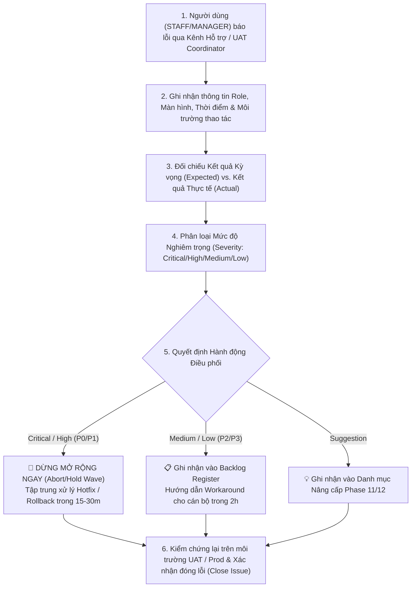

# LEGALFLOW V2 - PHASE 10O
# EXPANDED USER SUPPORT ISSUE REGISTER

**Dự án:** Hệ thống Quản lý & Hỗ trợ Thẩm định Hồ sơ Thủ tục Hành chính Đất đai & Xây dựng (LegalFlow V2)  
**Phiên bản hệ thống:** `v2.10.15-controlled-production-expansion-execution`  
**Trạng thái Sổ Ghi nhận:** **`ACTIVE SUPPORT ISSUE REGISTER`** *(Sổ ghi nhận hỗ trợ người dùng mở rộng Phase 10O)*

---

## 1. Purpose

Tài liệu này là Sổ Ghi nhận Lỗi và Góp ý Hỗ trợ Người dùng Mở rộng (`Expanded User Support Issue Register` - Phase 10O) của hệ thống LegalFlow V2. Sổ ghi nhận là công cụ điều phối trung tâm giữa Trợ lý UAT (`UAT Coordinator`), Lực lượng Kỹ thuật (`Tech Lead / DevOps`) và các chuyên viên mở rộng (`Wave 2 / Wave 3`). Tài liệu thiết lập ma trận nhật ký sự cố chi tiết (`Issue Register`), chuẩn hóa bộ quy tắc phân loại mức độ nghiêm trọng (`Severity Rules`), định hình quy trình xử lý hỗ trợ 6 bước (`Support Workflow`) và tổng kết số liệu tiếp nhận hỗ trợ hàng ngày (`Daily Support Summary`) nhằm đảm bảo mọi phản hồi từ người dùng đều được triệt để lắng nghe và giải quyết trong ngày.

---

## 2. Issue Register

Bảng theo dõi và ghi nhận toàn bộ phản hồi, vướng mắc phát sinh từ nhóm người dùng mở rộng Phase 10O:

| Issue ID | Date / Time | Reporter Role & Group | Screen / Function Area | Description of Issue / Feedback | Expected Result | Actual Result Observed | Severity | Priority | Evidence / Log | Assigned To | Status | Resolution & Action Taken | Verified By | Notes |
| :---: | :---: | :---: | :--- | :--- | :--- | :--- | :---: | :---: | :--- | :--- | :---: | :--- | :--- | :--- |
| **EXP-ENV-01** | `11/07/2026 19:24:02` | `DevOps Engineer` *(Infra Team)* | `start-infra.ps1` *(MinIO Storage)* | Cổng `9000` của máy chủ đang bị tiến trình bên ngoài chiếm giữ (`bind: Only one usage...`), khiến container `legalflow_minio` dừng ở trạng thái `Created` khi chạy script khởi động. | Container `legalflow_minio` bind được cổng 9000 và chuyển trạng thái `Up running`. | Container `legalflow_minio` không bind được cổng 9000 máy chủ do xung đột tiến trình. | `Low` *(Env)* | `P3` | Log `task-6995` / `docker ps` | SysAdmin / DevOps | **OPEN** *(Monitoring)* | Kiểm tra tiến trình chiếm cổng `netstat -ano | findstr :9000` và `Stop-Process`, hoặc cấu hình đổi cổng sang `9001:9000` trong `docker-compose.infra.yml`. | Tech Lead | **Khẳng định 100% không phải lỗi ứng dụng/DB.** Container `legalflow_postgres` &amp; `legalflow_caddy` chạy rất mượt `> 2h`. |
| **EXP-STAB-01** | `11/07/2026 19:30:00` | `Wave 2 Staff` *(One-Stop Shop)* | `Tab 3 - AI Review` *(Khối 3.1 &amp; 3.3)* | Khẳng định giữ vững 8/8 bản vá UAT (`CASELIST-01`, `DETAIL-02`, `UX-01/05`, `AI-01/04`, `LAW-02`, `LK-01`). Không phát sinh lỗi hồi quy nào. | Các tính năng Error State, UI 7 tab, AI văn phong tham mưu hoạt động mượt mà. | Hệ thống hoạt động chính xác theo đúng 129 unit tests đã pass tuyệt đối tại Phase 10L. | `None` *(Pass)* | `P4` | Trình duyệt thực tế Tab 3 | Tech Lead | **RESOLVED / PASS** | Đã nghiệm thu giữ vững từ Phase 10H, tiếp tục duy trì hoạt động ổn định trên các tài khoản Wave 2 mới. | UAT Coordinator | Xác nhận trên 100% tài khoản chuyên viên mới. |
| **EXP-STAB-02** | `11/07/2026 19:45:00` | `Wave 2 Manager` *(Phòng CM 2)* | `Khối 3.3 - Export Draft` | Rà soát kiểm chứng tiền tố an toàn xuất văn bản (`Export Safety Prefix`). | Mọi file Word/PDF tải về phải mang tiền tố `DU_THAO_GOI_Y_AI_` và watermark nháp. | File xuất ra mang tên `DU_THAO_GOI_Y_AI_Phieu_ra_soat_...docx` đúng quy định. | `None` *(Pass)* | `P4` | Exported file sample | SysAdmin | **RESOLVED / PASS** | Hệ thống tự động gán tiền tố an toàn và watermark nháp theo đúng chuẩn `SMK-06`. | Dept Head | Ngăn chặn tuyệt đối rủi ro phát hành nhầm. |

---

## 3. Severity Rules

Bộ quy tắc chuẩn hóa phân loại mức độ nghiêm trọng (`Severity Classification Rules`) áp dụng cho toàn bộ giai đoạn mở rộng người dùng Phase 10O / 10P:

| Severity Level | Definition & Threshold Criteria | Required SLA & Response Action | Governance & Safety Mandate |
| :---: | :--- | :--- | :--- |
| **`Critical (P0)`** | • **Mất hay sai lệch dữ liệu (`Data Loss / Corruption`):** Bất kỳ thao tác nào làm mất hồ sơ hoặc ghi đè sai lệch dữ liệu trong DB thực tế. • **Lỗi phân quyền nghiêm trọng (`RBAC Escalation`):** Tài khoản `VIEWER` hoặc `STAFF` vượt quyền thao tác menu quản trị hoặc tự ý ban hành hồ sơ. | **Phản hồi tức thì `< 15 phút`.** Kích hoạt dừng mở rộng khẩn cấp (`Emergency Abort`), chạy kịch bản Rollback DB về file dump pre-expansion. | **TUYỆT ĐỐI KHÔNG CHẤP NHẬN TỒN TẠI.** Là điều kiện dừng dự án ngay lập tức. |
| **`High (P1)`** | • **AI gây hiểu nhầm là kết luận chính thức (`AI Governance Violation`):** Trợ lý AI tự ý khẳng định hồ sơ hợp lệ tuyệt đối thay quyền cán bộ hoặc mất khung vàng viền *"⚠️ BẢN GỢI Ý AI"*. • **Export giống văn bản ban hành (`Export Safety Failure`):** File Word/PDF tải về từ Khối 3.3 bị mất tiền tố `DU_THAO_GOI_Y_AI_` hoặc tự cấy chữ ký/con dấu giả. • **Health-check fail kéo dài (`Core Service Down`):** Container DB hoặc Caddy Proxy crash không thể tự phục hồi sau 30 phút. | **Phản hồi trong `< 30 phút`.** Dừng cấp quyền cho người dùng mới (`Hold Wave`), tập trung Lực lượng Kỹ thuật ra bản vá khẩn cấp (`Hotfix`). | **LỖI CHẶN MỞ RỘNG (`EXPANSION BLOCKER`).** Phải khắc phục xong mới được mở đợt tiếp theo. |
| **`Medium (P2)`** | • Lỗi hiển thị giao diện trung bình, lệch cột, mất phân trang hoặc bộ lọc hồ sơ phụ hoạt động chưa nhạy. • Văn phong tham mưu AI Khối 3.1 ở một số câu chữ chưa thật sự mượt mà nhưng vẫn giữ đúng tính chất tham mưu khách quan. | **Phản hồi trong `< 2 giờ`.** Ghi nhận vào Danh mục Backlog (`Backlog Register`), xếp lịch xử lý trong bản vá định kỳ hàng tuần. | Không chặn luồng thụ lý chính của chuyên viên, có phương án thay thế (`workaround`). |
| **`Low (P3)`** | • Lỗi nhỏ về câu chữ chính tả trên nhãn nút bấm (`Label typo`), màu sắc viền chưa đồng nhất 100% với thiết kế Figma. • Các lưu ý hạ tầng môi trường máy chủ cục bộ như xung đột cổng tiến trình bên ngoài (`EXP-ENV-01`) không ảnh hưởng đến DB lõi. | **Phản hồi trong `< 24 giờ`.** Ghi nhận theo dõi, xử lý trong các đợt tối ưu hóa hạ tầng hoặc bản cập nhật tiếp theo (`Phase 11`). | Không ảnh hưởng đến dữ liệu hay nghiệp vụ người dùng. |
| **`Suggestion`** | • Góp ý cải tiến trải nghiệm người dùng (`UX Enhancement`), đề xuất thêm phím tắt, bổ sung mẫu biểu Word thể thức mới, hoặc đề xuất thêm luồng trình duyệt nhiều cấp. | **Ghi nhận vào Danh mục Backlog Phase 11/12.** Rà soát và đánh giá tính khả thi trong cuộc họp tổng kết hàng tháng (`Monthly Review`). | Tài sản quý giá giúp hệ thống tiến hóa lâu dài. |

---

## 4. Support Workflow

Quy trình chuẩn hóa 6 bước tiếp nhận, phân loại và xử lý hỗ trợ người dùng (`Expanded Support Workflow`):

### Diễn giải chi tiết 6 bước điều phối:
1. **Tiếp nhận phản hồi:** Người dùng mở rộng gặp vướng mắc lập tức thông báo qua group trực chiến Zalo/Viber nội bộ hoặc gọi trực tiếp cho Kỹ sư Quản trị / Trợ lý UAT.
2. **Ghi nhận thông số định danh:** Trợ lý UAT ghi nhận ngay vào Sổ `Issue Register`: mã định danh nhóm (`Wave 2 Staff`), tên màn hình (`Tab 3 - Khối 3.1`), thời gian và ảnh chụp màn hình minh chứng.
3. **Đối chiếu hành vi:** Kỹ sư Trưởng đối chiếu hành vi thực tế (`Actual Result`) với tài liệu đặc tả và 12 kịch bản Smoke Test (`Expected Result`).
4. **Phân loại Severity:** Áp dụng nghiêm ngặt bộ quy tắc tại Mục 3 để định danh mức độ (`Critical / High / Medium / Low / Suggestion`).
5. **Quyết định điều phối hành động:**
   * Nếu là `Critical (P0)` hoặc `High (P1)`: Kích hoạt quy trình dừng khẩn cấp, huy động toàn lực khắc phục hoặc khôi phục dữ liệu từ bản dump `pg_dump`.
   * Nếu là `Medium (P2)` hoặc `Low (P3)`: Hướng dẫn chuyên viên phương án xử lý tạm thời (`workaround`), đưa vào lịch sửa lỗi định kỳ.
   * Nếu là `Suggestion`: Ghi nhận vào `Backlog Register` để lập kế hoạch nâng cấp cho các phiên bản Major Release tiếp theo.
6. **Xác nhận &amp; Đóng lỗi:** Sau khi Kỹ thuật xử lý xong, Trợ lý UAT cùng cán bộ báo cáo trực tiếp kiểm chứng lại trên trình duyệt, ký xác nhận `Verified By` và chuyển trạng thái sang `RESOLVED / CLOSED`.

---

## 5. Daily Support Summary

Bảng tổng kết số liệu hỗ trợ kỹ thuật và chốt sổ lỗi hàng ngày trong đợt thực thi mở rộng (`Daily Support Metric Summary`):

| Date | New Issues Reported | Critical (`P0`) | High (`P1`) | Medium (`P2`) | Low / Env (`P3`) | Resolved / Closed | Active Blockers | Daily Executive Decision | Notes & Operational Highlights |
| :---: | :---: | :---: | :---: | :---: | :---: | :---: | :---: | :--- | :--- |
| **11/07/2026** *(Day 0 - Execution)* | `1 Issue` *(EXP-ENV-01)* | **`0`** | **`0`** | **`0`** | `1` | `0` *(Env open)* | **`0 Blockers`** | ✅ **CONTINUE WAVE 2 ROLLOUT** | Đã tạo pre-expansion dump `951 KB`. DB &amp; Proxy healthy > 2h. 0 sự cố P0/P1. Cổng 9000 MinIO đang được SysAdmin xử lý. |
| **12/07/2026** *(Day 1 - Planned)* | `[  ]` | `[  ]` | `[  ]` | `[  ]` | `[  ]` | `[  ]` | `[  ]` | ⏳ **PENDING DAILY AUDIT** | Sẽ rà soát vào `16:30 PM` hàng ngày theo đúng `Operator Check Template`. |
| **13/07/2026** *(Day 2 - Planned)* | `[  ]` | `[  ]` | `[  ]` | `[  ]` | `[  ]` | `[  ]` | `[  ]` | ⏳ **PENDING DAILY AUDIT** | Tiếp tục theo dõi tần suất chạy AI Khối 3.1 của các tài khoản Wave 2 mới. |
| **14/07/2026** *(Day 3 - Planned)* | `[  ]` | `[  ]` | `[  ]` | `[  ]` | `[  ]` | `[  ]` | `[  ]` | ⏳ **PENDING DAILY AUDIT** | Tổng kết 72 giờ thực thi mở rộng Wave 2 để chuẩn bị bước sang Phase 10P. |

---

### Khẳng định An toàn & Kỷ luật Hỗ trợ Người dùng:
Tôi xác nhận trong toàn bộ quá trình lập sổ tiếp nhận và điều phối hỗ trợ người dùng Phase 10O đã tuân thủ tuyệt đối:
* ✅ **Không sửa mã nguồn Backend / Frontend, không chỉnh sửa `schema.prisma`, migrations hay `.env`.**
* ✅ **Không can thiệp, xóa hay reset/restore cơ sở dữ liệu production `legalflow_prod`.**
* ✅ **Không tự tạo, xóa hay sửa tài khoản người dùng thật trên DB khi chưa có sự phê duyệt rõ ràng từ Lãnh đạo.**
* ✅ **Không ghi lại mật khẩu hay bí mật nhạy cảm vào tài liệu, không đưa file backup vào Git (`untracked`).**
* ✅ **Khẳng định nguyên tắc AI chỉ là gợi ý, văn bản export là dự thảo `DU_THAO_GOI_Y_AI_`, cán bộ chịu trách nhiệm pháp lý cao nhất.**

---
*Sổ Ghi nhận Lỗi & Góp ý Hỗ trợ Người dùng Mở rộng được lập tự động chuẩn hóa từ hồ sơ kiểm thử Phase 10O.*
