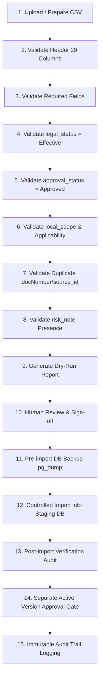

# LEGALFLOW V2 - PHASE 11F
# LEGAL KNOWLEDGE IMPORT TOOL DESIGN SPEC

**Dự án:** Hệ thống Quản lý & Hỗ trợ Thẩm định Hồ sơ Thủ tục Hành chính Đất đai & Xây dựng (LegalFlow V2)  
**Phiên bản hệ thống:** `v2.11.4-legal-knowledge-technical-import-dry-run` -> `Phase 11F Standard`  
**Ngày ban hành Đặc tả:** 11/07/2026  
**Trạng thái Tài liệu:** **`OFFICIAL LEGAL KNOWLEDGE IMPORT TOOL DESIGN SPEC`** *(Đặc tả Thiết kế Công cụ Nạp Tri thức Pháp lý An toàn & Có Kiểm soát)*

---

## 1. Purpose

Tài liệu này là Đặc tả Thiết kế Công cụ Nạp Tri thức Pháp lý An toàn (`Legal Knowledge Import Tool Design Spec` - Phase 11F) của hệ thống LegalFlow V2. Tài liệu được thiết lập nhằm kiến trúc hóa, chuẩn hóa và tài liệu hóa các tiêu chuẩn kỹ thuật cốt lõi cho công cụ nạp dữ liệu tự động (`Import Engine / Service`) trước khi tiến hành triển khai viết mã nguồn ở các phase sau. Đặc tả xác lập các nguyên tắc thiết kế tối cao (`Design Principles`), quy trình nạp 15 bước chặt chẽ (`Proposed Import Workflow`), các yêu cầu chức năng (`Functional Requirements`), yêu cầu phi chức năng (`Non-functional Requirements`), ranh giới ngoài phạm vi (`Out of Scope`) và khẳng định cam kết tuyệt đối: **chỉ thiết kế đặc tả trên tài liệu, chưa triển khai code, chưa nạp dữ liệu thật và tuyệt đối không cho phép AI tự active, tự duyệt hay tự kết luận tính đầy đủ của căn cứ pháp lý**.

---

## 2. Background

Trong lộ trình hoàn thiện và làm giàu kho dữ liệu tri thức pháp lý (Khối 3.2), LegalFlow V2 đã trải qua các giai đoạn chuẩn hóa vững chắc:
* **Phase 11B (`v2.11.1`) đã chuẩn hóa governance:** Ban hành Sổ Đăng ký Nguồn Địa phương, quy chế thẩm định 4 bước và xác lập trách nhiệm kiểm duyệt của Lãnh đạo Phòng.
* **Phase 11C (`v2.11.2`) đã chuẩn hóa metadata template và mapping:** Ban hành Biểu mẫu thuộc tính 29 trường Phase 11C, quy chuẩn 20 quy luật ánh xạ (`Mapping Spec`) và Checklist kiểm chứng 14 điểm.
* **Phase 11D (`v2.11.3`) đã review sample dataset:** Ban hành và rà soát bộ file CSV mẫu 5 bản ghi giả lập (`SAMPLE-001 -> 005`), ban hành phán quyết `GO TO TECHNICAL IMPORT DRY RUN`.
* **Phase 11E (`v2.11.4`) đã audit khả năng technical dry-run:** Thực hiện rà soát tĩnh mã nguồn Khối 3.2 và kiểm chứng tĩnh cấu trúc file CSV mẫu. Ghi nhận hệ thống chưa có API `POST /import` chuyên dụng ngoài script `seed.ts` (vốn ghi thẳng trạng thái `ACTIVE`), từ đó chốt quyết định `GO TO IMPORT TOOL DESIGN`.
* **Phase 11F chỉ thiết kế, chưa code, chưa import:** Bước này tập trung 100% vào việc thiết kế đặc tả kỹ thuật, quy tắc kiểm tra hợp lệ (`Validation Rules`), phân quyền (`RBAC`), nhật ký kiểm toán (`Audit Trail`) và chiến lược phục hồi (`Rollback Strategy`) cho công cụ nạp tự động, tuyệt đối chưa viết code hay nạp bất kỳ bản ghi thực tế nào vào cơ sở dữ liệu `legalflow_prod`.

---

## 3. Design Principles

Công cụ Nạp Tri thức Pháp lý LegalFlow V2 (`Legal Knowledge Import Tool`) được thiết kế dựa trên **8 Nguyên tắc An toàn Tối cao (`8 Mandatory Design Principles`)**:
1. 🛡️ **Import không đồng nghĩa với active (`Decoupled Ingestion & Activation`):** Việc nạp thành công một tập dữ liệu CSV vào cơ sở dữ liệu chỉ đưa các bản ghi vào vùng chờ thẩm định (`Staging Candidate / UpdateLog Workflow`). Tuyệt đối không tự động gán cờ `status = ACTIVE` hoặc kích hoạt hiệu lực pháp lý ngay sau khi import.
2. 🛡️ **Import phải có validation (`Mandatory Pre-import Validation`):** Mọi lô dữ liệu (`Batch`) trước khi parse vào Staging đều phải trải qua bộ kiểm tra 29 cột tiêu đề header và 14 tiêu chí nghiệp vụ Phase 11C. Bất kỳ lỗi sai định dạng ISO hay khuyết trường bắt buộc nào đều khiến dòng dữ liệu bị từ chối (`Rejection`).
3. 🛡️ **Import phải có dry-run trước (`Mandatory Dry-Run Gate`):** Hệ thống bắt buộc phải cung cấp chế độ chạy thử nghiệm không ghi DB (`Dry-Run Mode`) để tạo Báo cáo đối chiếu (`Dry-Run Report`) trước khi cho phép kích hoạt lệnh nạp thật.
4. 🛡️ **Import thật phải có backup (`Pre-import DB Backup Mandate`):** Không một thao tác `execute import` nào được thi hành nếu Quản trị viên chưa xác nhận đã thực hiện sao lưu toàn vẹn cơ sở dữ liệu (`pg_dump Backup Confirmed`).
5. 🛡️ **Import thật phải có rollback strategy (`Transactional Rollback Readiness`):** Công cụ nạp phải áp dụng giao dịch cơ sở dữ liệu (`Prisma $transaction`). Nếu phát hiện lỗi nghiêm trọng trong lô nạp hoặc sau nạp, hệ thống phải có khả năng quay lui (`Rollback`) sạch sẽ về trạng thái trước đó.
6. 🛡️ **Dữ liệu chưa approved không được import (`Approved Data Enforcement`):** Chỉ các bản ghi có thuộc tính `approval_status = Approved` kèm chữ ký thẩm định của chuyên viên Pháp chế (`reviewer`) mới được phép bước vào luồng nạp batch. Dữ liệu `Draft`, `Pending Review` hoặc `Rejected` bị loại bỏ tự động.
7. 🛡️ **Dữ liệu imported không được tự động dùng cho AI review chính thức nếu chưa active (`Active-Only AI Context Usage`):** Trợ lý AI Khối 3.1 chỉ truy xuất ngữ cảnh từ các văn bản đã được Lãnh đạo Phòng phê duyệt kích hoạt hợp pháp (`ACTIVE`). Các văn bản mới nạp ở Staging tuyệt đối bị cách ly khỏi AI prompt.
8. 🛡️ **AI không được tự duyệt, tự import, tự active hoặc tự rollback (`Human Supremacy & Zero AI Autonomous Control`):** AI đóng vai trò tham mưu và phân tích tác động (`Impact Analysis Advisor`). Toàn bộ quyền quyết định nạp (`Import`), phê duyệt (`Approve`), kích hoạt (`Activate`) và hủy bỏ (`Rollback`) thuộc thẩm quyền tuyệt đối của con người (`ADMIN / MANAGER`).

---

## 4. Proposed Import Workflow

Quy trình chuẩn hóa 15 bước nạp Tri thức Pháp lý an toàn và có kiểm soát (`Standardized 15-Step Controlled Import Workflow`):

* **Step 1 (`Upload / prepare CSV`):** Người dùng (`Role.ADMIN`) tải file CSV lên hệ thống qua giao diện hoặc chuẩn bị file tại thư mục import an toàn.
* **Step 2 (`Validate header`):** Bộ phân tích đối chiếu chính xác 29 cột tiêu đề theo chuẩn Phase 11C.
* **Step 3 (`Validate required fields`):** Kiểm tra tính đầy đủ của 17 trường thông tin bắt buộc (`source_id, document_title, document_number, issuing_authority, effective_date...`).
* **Step 4 (`Validate legal_status`):** Xác nhận 100% bản ghi đạt `Effective` (`ACTIVE`). Loại bỏ các văn bản `Expired` hoặc `Unknown`.
* **Step 5 (`Validate approval_status`):** Xác nhận cờ phê duyệt `Approved`. Từ chối nạp mọi bản ghi chưa được Lãnh đạo ký duyệt trên giấy/Sổ Đăng ký.
* **Step 6 (`Validate local_scope`):** Kiểm tra tính hợp lệ của phạm vi địa phương (`Local / National`) và địa bàn áp dụng (`local_applicability`).
* **Step 7 (`Validate duplicate document_number / source_id`):** Kiểm tra trùng lặp mã định danh trong file CSV và đối chiếu với cơ sở dữ liệu hiện hữu để phát hiện rủi ro đụng độ.
* **Step 8 (`Validate risk_note`):** Kiểm tra sự hiện diện của lời nhắc rủi ro pháp lý (`risk_note`) đối với các thủ tục nhạy cảm.
* **Step 9 (`Dry-run report`):** Xuất Báo cáo Diễn tập Nạp (`Dry-Run Report`) ghi nhận chi tiết số dòng hợp lệ, cảnh báo và lỗi từ chối mà **không ghi vào DB**.
* **Step 10 (`Human review`):** Quản trị viên (`ADMIN`) rà soát Báo cáo Dry-Run và xác nhận tiếp tục nạp.
* **Step 11 (`Backup`):** Hệ thống yêu cầu xác nhận đã hoàn tất sao lưu cơ sở dữ liệu `pg_dump` trước thời điểm nạp.
* **Step 12 (`Controlled import`):** Thực thi nạp lô dữ liệu hợp lệ vào vùng chờ Staging (`Prisma $transaction` sinh ra các bản ghi `UpdateLog` ở trạng thái `PENDING_REVIEW` / `DRAFT`), cờ `active_candidate = false`.
* **Step 13 (`Post-import verification`):** Kiểm tra đối chiếu số lượng bản ghi nạp thành công với log hệ thống.
* **Step 14 (`Separate active version approval`):** Lãnh đạo Phòng (`Role.MANAGER`) rà soát từng đề xuất tại vùng Staging và ký duyệt kích hoạt hiệu lực pháp lý (`POST activate-draft-version`) trong một bước làm việc độc lập.
* **Step 15 (`Audit trail`):** Ghi nhận toàn bộ chuỗi sự kiện từ tải file, dry-run, nạp batch đến kích hoạt vào nhật ký kiểm toán bất biến (`UpdateLog Audit History`).

---

## 5. Functional Requirements

Bảng đặc tả 11 Yêu cầu Chức năng Core của Công cụ Nạp Tri thức Pháp lý (`11 Functional Requirements Spec Table`):

| Requirement ID | Requirement (`Feature Name`) | Priority | Acceptance Criteria (`Verification Rules`) | Notes & Architectural Link |
| :---: | :--- | :---: | :--- | :--- |
| **FR-01** | **Import CSV (`Batch Parsing Engine`)** | `HIGH` | Hệ thống có khả năng tiếp nhận và phân tích file CSV `UTF-8` chứa 29 trường thuộc tính Phase 11C, xử lý an toàn các ký tự đặc biệt và dấu nháy kép. | Là module lõi (`ImportService`) sẽ được xây dựng tại Phase triển khai code (`Phase 11G/H`). |
| **FR-02** | **Dry-Run Mode (`Zero-Write Simulation`)** | `HIGH` | Khi kích hoạt `dry-run`, hệ thống chạy trọn vẹn quy trình validate từ bước 2 đến bước 8, xuất báo cáo kết quả chi tiết nhưng bảo đảm `0 DB writes`. | Ngăn chặn tuyệt đối việc nạp mù (`Blind Ingestion`) vào cơ sở dữ liệu. |
| **FR-03** | **Validation Report (`Itemized Error Output`)** | `HIGH` | Báo cáo trả về phải phân rõ 6 chỉ số: `Total Records, Valid Records, Warnings, Rejections, Duplicates, Needs Review`, chỉ rõ số dòng và lý do lỗi. | Giúp cán bộ kỹ thuật dễ dàng sửa file CSV trước khi chạy nạp chính thức. |
| **FR-04** | **Duplicate Detection (`Collision Prevention`)** | `HIGH` | Tự động kiểm tra trùng `source_id` và cặp `(document_number + issuing_authority)` với DB hiện hữu. Nếu trùng, chuyển dòng sang trạng thái `Duplicate / Hold` theo quy tắc quy định. | Bảo vệ chỉ mục duy nhất (`Unique Index`) của bảng `LegalKnowledge` trên Postgres. |
| **FR-05** | **Invalid Row Rejection (`Strict Rejection Rule`)** | `HIGH` | Các dòng vi phạm định dạng ngày ISO, khuyết trường bắt buộc, hoặc có `approval_status != Approved` bị loại bỏ khỏi lô nạp thật (`Row Rejection`). | Đảm bảo nguyên tắc: "Chỉ dữ liệu sạch 100% mới được vào hệ thống". |
| **FR-06** | **Import Summary (`Transaction Log Summary`)** | `MED` | Sau khi `execute import` hoàn tất, hệ thống trả về bảng tổng kết lô nạp kèm danh sách ID các `UpdateLog` đã được sinh ra trong vùng Staging. | Tạo bằng chứng minh bạch phục vụ công tác rà soát sau nạp (`Post-import verification`). |
| **FR-07** | **No Automatic Active (`Zero Auto-Activation`)** | `HIGH` | Bản ghi nạp vào DB bắt buộc bị khóa ở trạng thái chờ (`active_candidate = false`, `status = DRAFT / PENDING_REVIEW`). Cấm gán thẳng `ACTIVE = true`. | Tuân thủ tuyệt đối chốt chặn tách biệt quyền hạn của Lãnh đạo Phòng (`MANAGER`). |
| **FR-08** | **Audit Log (`Immutable Event Tracking`)** | `HIGH` | Mọi lần gọi API `validate, dry-run, execute` đều được ghi log với thông tin actor (`ADMIN`), timestamp, tên file, số bản ghi và IP thực thi. | Phục vụ kiểm toán truy vết trách nhiệm và thanh tra hệ thống 100%. |
| **FR-09** | **Permission Guard (`Dual Role Enforcement`)** | `HIGH` | API nạp batch chỉ cho phép `Role.ADMIN` thực thi; API kích hoạt hiệu lực pháp lý batch chỉ cho phép `Role.MANAGER` thực thi. `STAFF / VIEWER` bị cấm 403. | Thực thi triệt để nguyên tắc bất kiêm nhiệm (`Separation of Duties`). |
| **FR-10** | **Rollback Plan (`Batch Rollback Mechanism`)** | `HIGH` | Cung cấp cơ chế hủy bỏ trọn vẹn lô nạp (`Batch Rollback`) qua API hoặc transaction rollback nếu phát hiện sai sót dữ liệu diện rộng ngay sau khi nạp. | Bảo vệ sự an toàn và tính có thể phục hồi (`Recoverability`) của kho tri thức. |
| **FR-11** | **Backup Reminder (`Pre-import Backup Gate`)** | `HIGH` | Giao diện và API `execute import` bắt buộc yêu cầu cờ xác nhận `confirmDbBackup = true` kèm chuỗi xác nhận văn bản trước khi cho phép xử lý transaction. | Chốt chặn nhắc nhở sống còn trước thao tác ghi dữ liệu hàng loạt. |

---

## 6. Non-functional Requirements

Bảng đặc tả 7 Yêu cầu Phi chức năng Bắt buộc (`7 Non-functional Requirements Spec Table`):

| Requirement (`Category`) | Description (`Architecture & Quality Attribute`) | Priority | Notes & Governance Check |
| :--- | :--- | :---: | :--- |
| **1. Safety (`Data & System Safety`)** | Công cụ import phải hoạt động cô lập, không được phép làm gián đoạn các truy vấn tra cứu pháp lý hay luồng thụ lý hồ sơ TTHC đang vận hành trên production. | `HIGH` | Đảm bảo tính sẵn sàng cao (`High Availability - HA`) của hệ thống lõi Khối 1 & Khối 2. |
| **2. Auditability (`Full Auditability`)** | Mọi thao tác tác động đến kho tri thức pháp lý qua công cụ import phải để lại dấu vết kiểm toán không thể xóa bỏ (`Immutable Audit Log`). | `HIGH` | Tuân thủ quy chuẩn an ninh thông tin và kiểm toán dữ liệu nhà nước. |
| **3. Traceability (`End-to-End Lineage`)** | Mỗi bản ghi pháp lý trong DB phải truy vết được chính xác nguồn gốc từ file CSV nào, nạp ngày nào, bởi tài khoản nào và ai là người phê duyệt ban đầu. | `HIGH` | Đảm bảo tính toàn vẹn nguồn gốc (`Data Lineage & Provenance`). |
| **4. Minimal Privilege (`Least Privilege Access`)** | Phân quyền truy cập công cụ import được thu hẹp tối đa theo nguyên tắc đặc quyền tối thiểu (`Least Privilege`). Chỉ tài khoản `ADMIN` được cấp quyền truy cập công cụ nạp. | `HIGH` | Ngăn chặn rủi ro rò rỉ hoặc thao tác nhầm từ nhân viên nghiệp vụ thông thường. |
| **5. Recoverability (`Rapid Disaster Recovery`)** | Hệ thống phải có khả năng phục hồi về điểm trước import (`Point-in-Time Recovery / Rollback`) trong vòng dưới 15 phút nếu phát hiện sự cố dữ liệu lớn. | `HIGH` | Kế thừa cơ chế sao lưu `pg_dump` và Prisma Transaction của hạ tầng `EXP-ENV-01`. |
| **6. Clear Error Reporting (`Human-Readable Output`)** | Thông báo lỗi trả về từ trình parse CSV phải rõ ràng, chỉ đúng dòng (`Row #`), đúng cột (`Column Name`) và hướng dẫn cách khắc phục cụ thể bằng tiếng Việt chuẩn. | `MED` | Tiết kiệm thời gian rà soát và khắc phục lỗi cho Kỹ thuật viên. |
| **7. No Secret Exposure (`Zero Leakage Guarantee`)** | Báo cáo import, log truy vết và phản hồi API tuyệt đối không chứa thông tin nhạy cảm, mật khẩu kết nối DB, token hay API key dưới bất kỳ hình thức nào. | `HIGH` | Bảo vệ an toàn tuyệt đối cấu trúc bảo mật hệ thống (`Zero Security Leakage`). |

---

## 7. Out of Scope

Nhằm giữ vững sự minh bạch về ranh giới trách nhiệm của phần mềm và ngăn chặn rủi ro vận hành vượt thẩm quyền, 6 hành vi sau đây **TẠI THỜI ĐIỂM NÀY VÀ CẢ TRONG CÔNG CỤ IMPORT NẰM HOÀN TOÀN NGOÀI PHẠM VI (`Strict Out-of-Scope Mandates`)**:
1. 🛑 **Không tự cập nhật văn bản pháp luật từ internet (`Zero Autonomous Web Scraping`):** Công cụ import không tự động bò dữ liệu (`crawl / scrape`) từ các cổng thông tin pháp luật ngoài internet để đưa vào cơ sở dữ liệu. Mọi nguồn dữ liệu phải do con người chuẩn bị và thẩm định.
2. 🛡️ **Không tự xác định hiệu lực pháp lý (`Zero Autonomous Status Inference`):** Công cụ không tự động phán đoán văn bản còn hiệu lực hay đã hết hiệu lực dựa trên ngày tháng. Trạng thái `Effective / Expired` phải được khai báo tường minh trên file CSV bởi cán bộ Pháp chế.
3. 🛑 **Không tự kết luận văn bản đầy đủ (`No Absolute Completeness Claim`):** Trình import và AI Khối 3.1 tuyệt đối không được tự kết luận kho dữ liệu sau nạp là "đầy đủ tuyệt đối" hay "bao phủ 100% pháp luật". AI chỉ đóng vai trò tham mưu.
4. 🛑 **Không tự active version (`Zero Auto-Activation`):** Công cụ import không tự động kích hoạt phiên bản hay thay thế căn cứ luật đang active trên hệ thống.
5. 🛑 **Không tự rollback (`Zero Autonomous Rollback`):** Khi gặp lỗi nghiệp vụ phức tạp, hệ thống không tự ý bãi bỏ hay quay lui phiên bản căn cứ pháp lý đang áp dụng nếu không có lệnh thực thi bằng tay từ Quản trị viên.
6. 🛑 **Không thay cán bộ pháp chế / nghiệp vụ (`Human Supremacy Affirmation`):** Công cụ chỉ là phương tiện nạp dữ liệu kỹ thuật. Cán bộ thụ lý Một cửa, P2 và Lãnh đạo Phòng chịu trách nhiệm tối cao và cuối cùng trong việc rà soát căn cứ pháp lý khi thụ lý hồ sơ thực tế.

---

## 8. Proposed Next Phase

Dựa trên việc ban hành thành công Đặc tả Thiết kế Công cụ Nạp Phase 11F, bước chuyển giao tiếp theo của lộ trình kiến trúc LegalFlow V2 được đề xuất chính thức là:

&rarr; **`Phase 11G: Legal Knowledge Import Tool Implementation Planning`**  
*(Lập kế hoạch triển khai chi tiết, thiết kế DTO/Interface, cấu trúc thư mục module `import-service` và kịch bản kiểm thử tự động cho công cụ import trước khi bước vào viết code thi hành thật)*.

---
*Đặc tả Thiết kế Công cụ Nạp Tri thức Pháp lý (Import Tool Design Spec) được lập tự động từ kết quả Phase 11F.*
