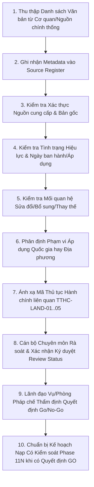

# LEGALFLOW V2 - PHASE 11M
# REAL LEGAL DATASET REVIEW PLAN

## 1. Purpose

Kế hoạch rà soát bộ dữ liệu pháp lý thật (`Real Legal Dataset Review Plan`) được thiết lập nhằm xây dựng khung tiêu chí chuẩn hóa và quy trình thẩm định toàn diện đối với các văn bản pháp luật, quy hoạch, quy trình nội bộ và biểu mẫu thực tế trước khi ra quyết định chính thức có đủ điều kiện nạp vào hệ thống (`Legal Knowledge Import Go/No-Go Decision`).  
Mục tiêu là đảm bảo mọi tri thức pháp lý khi được đưa vào cơ sở dữ liệu của LegalFlow V2 đều có nguồn gốc xác thực, đầy đủ thông tin siêu dữ liệu (`metadata`), xác định rõ hiệu lực và phạm vi áp dụng, đồng thời tuân thủ nghiêm ngặt các nguyên tắc quản trị rủi ro pháp lý và an toàn AI.

## 2. Baseline

- **Previous tag:** `v2.11.12-controlled-import-uat-approved-sample-dataset`
- **Proposed tag:** `v2.11.13-real-legal-dataset-review-import-go-no-go`
- **Root path:** `C:\Users\Admin\legalflow-docker-uat`
- **Backend path:** `C:\Users\Admin\legalflow-docker-uat\legalflow-backend`
- **Ngày lập kế hoạch:** 12/07/2026

## 3. Review Objective

Quá trình rà soát bộ dữ liệu pháp lý thật hướng tới 7 mục tiêu cốt lõi sau:
1. **Xác định nguồn dữ liệu pháp lý thật (`Source Authentication`):** Thẩm định tính chính thống của nguồn cung cấp (như Công báo Chính phủ, Cổng thông tin điện tử Bộ Tài nguyên và Môi trường, UBND tỉnh/thành phố, Cơ sở dữ liệu Quốc gia về Pháp luật).
2. **Kiểm tra thông tin siêu dữ liệu (`Metadata Completeness`):** Đảm bảo đầy đủ số ký hiệu, cơ quan ban hành, ngày ban hành, ngày có hiệu lực, trích yếu và phân loại chuyên mục theo đúng 14 quy tắc chuẩn hóa (`VAL-01` &rarr; `VAL-14`).
3. **Kiểm tra tình trạng hiệu lực (`Legal Status Verification`):** Đối chiếu chính xác tình trạng pháp lý hiện tại (Đang có hiệu lực, Chưa có hiệu lực, Hết hiệu lực một phần, Hết hiệu lực toàn bộ) nhằm gắn nhãn cảnh báo kịp thời cho cán bộ nghiệp vụ.
4. **Kiểm tra phạm vi áp dụng (`Local Scope Assessment`):** Phân định rõ phạm vi áp dụng toàn quốc (`National`) hoặc địa phương cụ thể (`Local - Tỉnh/Huyện/Xã`), đảm bảo hệ thống không áp dụng nhầm quy định địa phương này sang địa phương khác.
5. **Kiểm tra mối quan hệ sửa đổi/bổ sung/thay thế (`Amendment & Replacement Tracking`):** Làm rõ mối liên hệ giữa văn bản mới và văn bản cũ (sửa đổi điều khoản nào, thay thế văn bản nào, bị bãi bỏ bởi quyết định nào).
6. **Kiểm tra liên quan thủ tục (`Procedure Mapping Verification`):** Ánh xạ chính xác căn cứ pháp lý vào từng quy trình thủ tục hành chính cụ thể (`TTHC-LAND-01` &rarr; `TTHC-LAND-05`).
7. **Quyết định đủ điều kiện import hay không (`Go/No-Go Decision`):** Đánh giá tổng thể độ chín muồi và độ sạch của bộ dữ liệu để ra quyết định chấp thuận hay từ chối cho phép chuyển sang giai đoạn nạp thực tế.

## 4. Review Scope

Phạm vi rà soát bao phủ 8 nhóm dữ liệu tri thức pháp lý và nghiệp vụ hành chính đất đai trọng tâm:

| Data Group | Description | Required Evidence | Reviewer | Priority | Notes |
| :--- | :--- | :--- | :---: | :---: | :--- |
| **Central Legal Documents** | Luật, Nghị quyết của Quốc hội; Nghị định của Chính phủ; Quyết định của Thủ tướng Chính phủ về đất đai. | Bản gốc/bản sao có chứng thực từ Công báo hoặc Cổng thông tin Chính phủ (`chinhphu.vn`). | Legal Specialist (`STAFF`/`MANAGER`) | `CRITICAL` | Nền tảng pháp lý cốt lõi cho toàn bộ quy trình TTHC. |
| **Local Regulations** | Quyết định, Chỉ thị của UBND/HĐND cấp Tỉnh/Thành phố quy định chi tiết hạn mức, đơn giá, hạn mức tách/hợp thửa. | Quyết định ban hành chính thức trên Cổng thông tin điện tử tỉnh/thành phố (`congbothongtin...`). | Local Legal Officer (`STAFF`) | `CRITICAL` | Áp dụng đặc thù theo từng địa phương hành chính. |
| **Land-Use Planning Documents** | Quyết định phê duyệt Quy hoạch sử dụng đất cấp Tỉnh; Kế hoạch sử dụng đất hàng năm cấp Huyện. | Quyết định phê duyệt kèm theo bản đồ quy hoạch ranh giới mốc giới tọa độ. | Land Use Planning Specialist (`STAFF`) | `HIGH` | Căn cứ thẩm định điều kiện chuyển mục đích sử dụng đất. |
| **Internal Procedure Documents** | Quyết định ban hành Quy trình nội bộ (SOP), ISO, lưu đồ giải quyết TTHC tại Bộ phận Một cửa và Phòng Chuyên môn. | Quyết định ban hành SOP chính thức từ UBND hoặc Sở TNMT. | Administrative SOP Officer (`STAFF`) | `HIGH` | Chuẩn hóa mốc thời gian SLA và phân công trách nhiệm. |
| **Administrative Templates** | Thông tư, Quyết định quy định biểu mẫu hành chính (Đơn đăng ký, Giấy chứng nhận, Sổ địa chính, Phiếu chuyển thông tin). | Phụ lục biểu mẫu chuẩn hóa ban hành kèm theo Thông tư/Nghị định. | Registry Clerk (`STAFF`) | `MEDIUM` | Căn cứ sinh biểu mẫu tự động tại module Export. |
| **Professional Guidance Documents** | Công văn hướng dẫn nghiệp vụ, giải đáp thắc mắc, sổ tay hướng dẫn kỹ thuật từ Bộ TNMT hoặc Tổng cục Quản lý Đất đai. | Văn bản hướng dẫn nghiệp vụ có chữ ký và đóng dấu của cơ quan thẩm quyền. | Technical Advisor (`STAFF`) | `MEDIUM` | Hỗ trợ giải quyết các tình huống hồ sơ phức tạp, chuyển tiếp. |
| **Amended / Replaced Documents** | Các văn bản sửa đổi, bổ sung, đính chính hoặc thay thế văn bản quy phạm pháp luật hiện hành. | Quyết định/Nghị định sửa đổi kèm theo bảng đối chiếu điều khoản (`Amendment Matrix`). | Legal Specialist (`MANAGER`) | `HIGH` | Đảm bảo tính liên tục và cập nhật lịch sử pháp lý. |
| **Expired / Warning Documents** | Các văn bản đã hết hiệu lực thi hành toàn bộ hoặc một phần cần đưa vào danh sách đen/cảnh báo rủi ro. | Quyết định công bố danh mục văn bản hết hiệu lực định kỳ hàng năm. | Legal Specialist (`MANAGER`) | `HIGH` | Ngăn chặn áp dụng quy định cũ đã bị bãi bỏ. |

## 5. Out of Scope

Nhằm tuân thủ tuyệt đối 18 yêu cầu giới hạn của Phase 11M, các hạng mục sau được xác định ngoài phạm vi thực hiện (`Out of Scope`):
- Không thực thi nạp dữ liệu pháp lý thật (`No real import execution`) vào cơ sở dữ liệu hệ thống trong phase này.
- Không tự động kích hoạt hay thay thế trạng thái (`No active version`) của bất kỳ văn bản pháp luật nào đang thi hành.
- Không hoàn tác phiên bản pháp lý (`No rollback version`).
- Không tạo hay thực thi migration mới (`No migration`).
- Không seed cơ sở dữ liệu (`No seed`).
- Không tự ý thu thập hay tự động tải cập nhật pháp luật từ Internet bằng crawler khi chưa qua thẩm định con người.
- Không sử dụng bộ dữ liệu chưa qua thẩm định chính thức để làm dữ liệu huấn luyện hoặc đánh giá rà soát AI chính thức (`AI review workflow`).

## 6. Review Workflow

Quy trình thẩm định bộ dữ liệu pháp lý thật được chuẩn hóa qua 10 bước kiểm soát tuần tự và chặt chẽ:

1. **Bước 1 (Thu thập):** Cán bộ pháp chế tiếp nhận và thu thập danh mục văn bản từ nguồn công báo/cổng thông tin hợp pháp.
2. **Bước 2 (Ghi nhận Metadata):** Cập nhật đầy đủ 18 trường thông tin siêu dữ liệu vào bảng danh mục nguồn (`Source Register`).
3. **Bước 3 (Thẩm định Nguồn):** Đối chiếu chữ ký, con dấu và URL lưu trữ hợp lệ, đảm bảo văn bản không bị làm giả hay đính chính ngầm.
4. **Bước 4 (Thẩm định Hiệu lực):** Kiểm tra mốc ngày ban hành (`issue_date`) và ngày có hiệu lực (`effective_date`). Nếu đã hết hiệu lực, phải đánh dấu nhãn cảnh báo.
5. **Bước 5 (Thẩm định Sửa đổi/Thay thế):** Cập nhật chính xác mã văn bản bị sửa đổi (`amends_document`) hoặc thay thế (`replaces_document`).
6. **Bước 6 (Phân định Phạm vi):** Ghi rõ mã tỉnh/huyện áp dụng (`local_applicability`), tuyệt đối không để rỗng đối với quyết định địa phương.
7. **Bước 7 (Ánh xạ Thủ tục):** Gán mã thủ tục `TTHC-LAND-01` &rarr; `TTHC-LAND-05` theo đúng phạm vi điều chỉnh của văn bản.
8. **Bước 8 (Xác nhận Reviewer):** Cán bộ thẩm định (`Reviewer`) ký xác nhận `Review Status: Reviewed/Approved` tại từng bản ghi.
9. **Bước 9 (Quyết định Go/No-Go):** Lãnh đạo cấp cao (`MANAGER`/`ADMIN`) tổng hợp bảng kết quả rà soát, ra quyết định `GO`, `GO WITH CONDITIONS` hoặc `NO-GO`.
10. **Bước 10 (Chuyển tiếp):** Chỉ sau khi có quyết định `GO` hoặc `GO WITH CONDITIONS` bằng văn bản chính thức, hệ thống mới được phép xem xét lập kế hoạch thực thi nạp dữ liệu tại Phase 11N tiếp theo.
