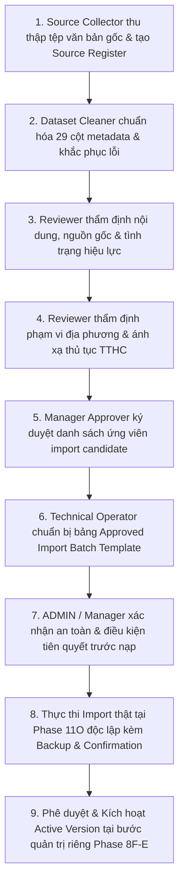

# LEGALFLOW V2 - PHASE 11N
# REAL DATASET APPROVAL WORKFLOW

## 1. Purpose

Quy trình phê duyệt bộ dữ liệu pháp lý thật (`Real Dataset Approval Workflow`) được xây dựng nhằm chuẩn hóa ma trận phân công trách nhiệm (`RACI`), thiết lập các chốt chặn kiểm soát nhiều tầng và quy định rõ ràng quyền hạn, giới hạn thao tác của từng vai trò con người cũng như Hệ thống Trí tuệ nhân tạo (`AI System`).  
Mục tiêu là bảo đảm tuyệt đối không có bất kỳ văn bản quy phạm pháp luật hay quy trình hành chính nào được đưa vào danh sách nạp chính thức (`Approved Import Batch`) nếu chưa trải qua sự rà soát nghiêm ngặt của cán bộ nghiệp vụ và sự phê duyệt bằng văn bản của Lãnh đạo cơ quan thẩm quyền.

## 2. Roles and Responsibilities

Bảng dưới đây xác định rõ trách nhiệm, các thao tác được phép (`Allowed Actions`) và nghiêm cấm (`Not Allowed Actions`) cho 7 vai trò tham gia vào luồng quản trị dữ liệu pháp lý:

| Role | Responsibility | Allowed Actions | Not Allowed Actions | Notes |
| :--- | :--- | :--- | :--- | :--- |
| **Source Collector** (`STAFF`) | Thu thập và tìm kiếm văn bản pháp lý từ các nguồn chính thống hợp pháp của Nhà nước. | Thu thập tệp scan gốc PDF/DOCX từ `chinhphu.vn`, Cổng TTĐT tỉnh; tạo bản ghi mới (`New`) trong Source Register. | Cấm tự ý sửa đổi nội dung văn bản gốc; cấm tự ý gán tình trạng hiệu lực khi chưa đối chiếu công báo; cấm nạp dữ liệu vào DB. | Chịu trách nhiệm về tính xác thực của tệp gốc thu thập ban đầu. |
| **Dataset Cleaner** (`STAFF`) | Làm sạch, chuẩn hóa siêu dữ liệu (`metadata`) và khắc phục các khiếm khuyết trong Cleanup Register. | Điền và chuẩn hóa 29 trường metadata; cập nhật URL nguồn; viết dự thảo `risk_note`; chuyển trạng thái sang `Cleaned`. | Cấm tự ký duyệt thay cán bộ thẩm quyền; cấm tự bãi bỏ văn bản quy phạm trái quy trình; cấm nạp DB (`No import`). | Đảm bảo nguyên liệu dữ liệu thô được chuẩn hóa sạch 100%. |
| **Legal / Procedure Reviewer** (`STAFF` / Specialist) | Thẩm định nội dung pháp lý, kiểm chứng tình trạng hiệu lực, đối chiếu quan hệ sửa đổi/thay thế và phạm vi địa phương/thủ tục. | Kiểm tra đối chiếu 14 hạng mục `REV-01` &rarr; `REV-14`; xác nhận `Reviewer Sign-off`; chuyển Review Status sang `Reviewed / Rejected`. | Cấm ra quyết định phê duyệt cuối cùng (`No Manager Approval`); cấm tự động kích hoạt phiên bản đang thi hành (`No active`). | Chịu trách nhiệm nghiệp vụ trực tiếp về tính chính xác của căn cứ pháp lý. |
| **Manager Approver** (`MANAGER` / Lãnh đạo Vụ Pháp chế) | Thẩm định tổng thể hồ sơ đã qua rà soát, ký duyệt văn bản phê duyệt lô dữ liệu chính thức (`Approved Import Batch`). | Kiểm tra lại toàn bộ checklist; ký duyệt `Approval Status: Approved` trên từng bản ghi; phê duyệt bảng `Approved Import Batch Template`. | Cấm tự ý thay đổi metadata đã được hội đồng chốt mà không qua rà soát lại; cấm tự ý bấm nút thực thi kỹ thuật trên CLI/UI nếu thiếu quy trình. | Người giữ thẩm quyền ra quyết định cao nhất về mặt chất lượng tri thức pháp lý. |
| **ADMIN** (`ADMIN` / Chủ nhiệm Hệ thống) | Quản trị cấu hình toàn cục, quản lý phân quyền RBAC và kiểm soát an toàn hạ tầng hệ thống. | Thiết lập quyền hạn truy cập module Import UI; rà soát an toàn hệ thống; xác nhận điều kiện tiên quyết trước giai đoạn nạp thực tế. | Cấm tự ý nạp dữ liệu pháp lý vào DB khi chưa có văn bản phê duyệt của `Manager Approver`; cấm can thiệp thay đổi nội dung luật. | Chịu trách nhiệm bảo đảm tính toàn vẹn và bảo mật của nền tảng. |
| **Technical Operator** (`OPERATOR` / Ops Team) | Chuẩn bị tệp định dạng CSV/JSON đã duyệt, thực hiện sao lưu cơ sở dữ liệu (`pg_dump`) và vận hành công cụ kiểm thử. | Chạy lệnh backup DB pre-import; chạy kiểm thử `Validate CSV - Dry Run`; lập báo cáo kỹ thuật runtime và health-check. | Cấm thực thi `executeCsvImport` khi thiếu cờ bảo vệ hoặc thiếu biên bản phê duyệt; cấm xóa hay restore DB trái phép. | Chịu trách nhiệm về kỹ thuật vận hành và an toàn sao lưu dữ liệu. |
| **AI System** (`Antigravity AI` / LLM) | Hỗ trợ rà soát cú pháp, phân tích rủi ro văn bản và tóm tắt trích yếu khi được cán bộ chuyên môn yêu cầu (`Suggestion Only`). | Hỗ trợ phát hiện lỗi thiếu cột, sai định dạng ngày tháng; gợi ý tóm tắt trích yếu hoặc gợi ý từ khóa cảnh báo `risk_note` trên văn bản đã xác thực. | **CẤM TỰ XÁC ĐỊNH HIỆU LỰC PHÁP LÝ (`No legal status assertion`); CẤM TỰ DUYỆT (`No auto-approval`); CẤM TỰ IMPORT (`No auto-import`); CẤM TỰ ACTIVE (`No auto-active`); CẤM TỰ ROLLBACK (`No auto-rollback`).** | AI chỉ đóng vai trò trợ lý kỹ thuật hỗ trợ rà soát; không có thẩm quyền pháp lý hành chính. |

## 3. Approval Workflow

Luồng quy trình thẩm định và phê duyệt bộ dữ liệu pháp lý thật được thực hiện nghiêm ngặt qua 9 bước tuần tự:

1. **Bước 1 (Thu thập):** `Source Collector` thu thập tệp gốc có chữ ký số/con dấu từ cơ quan ban hành, ghi nhận vào danh mục nguồn.
2. **Bước 2 (Làm sạch):** `Dataset Cleaner` hoàn thiện bảng `Dataset Cleanup Register`, điền đủ thông tin metadata và xử lý lỗi cú pháp.
3. **Bước 3 (Thẩm định Nội dung):** `Legal Reviewer` kiểm tra đối chiếu nội dung, xác thực chữ ký bản gốc và đối chiếu công báo để chốt tình trạng hiệu lực (`Effective`, `Expired`).
4. **Bước 4 (Thẩm định Phạm vi):** `Procedure Reviewer` kiểm tra mã tỉnh/huyện áp dụng (`local_applicability`) và ánh xạ chính xác vào luồng thủ tục `TTHC-LAND-01` &rarr; `05`.
5. **Bước 5 (Phê duyệt Ứng viên):** `Manager Approver` thẩm định kết quả rà soát của các Reviewer, ký phê duyệt chuyển trạng thái bản ghi sang `Approved`.
6. **Bước 6 (Lập Batch Template):** `Technical Operator` trích xuất danh sách các bản ghi đạt `Approved` 100% để lập bảng `Approved Import Batch Template`.
7. **Bước 7 (Xác nhận An toàn):** `ADMIN` và `Manager` cùng ký xác nhận các điều kiện chốt chặn kỹ thuật (đã sao lưu DB, hệ thống health-check PASS).
8. **Bước 8 (Nạp Thực tế Độc lập):** Lệnh import thật chỉ được thực hiện tại một giai đoạn riêng biệt (`Phase 11O`) có kiểm soát kép (yêu cầu gõ Confirmation Text và Reason).
9. **Bước 9 (Kích hoạt Phiên bản Độc lập):** Sau khi dữ liệu nạp thành công vào DB, việc kích hoạt (`ACTIVE`) phải trải qua quy trình quản trị phiên bản 3 bước riêng biệt tại module Version Governance UI (`Phase 8F-E`).

## 4. Approval Checklist

Trước khi bất kỳ bản ghi hoặc lô dữ liệu nào được ký duyệt chính thức, Hội đồng Thẩm định phải đối chiếu và đánh nhận trên 13 hạng mục kiểm tra bắt buộc (`Approval Checklist`):

| Check Item | Required Evidence | Confirmed: Yes / No / N/A | Reviewer | Approver | Notes |
| :--- | :--- | :---: | :--- | :--- | :--- |
| **1. nguồn chính thống (`Source Authentication`)** | Bản scan PDF có chữ ký số hợp lệ từ `chinhphu.vn` hoặc Cổng TTĐT Sở TNMT/UBND Tỉnh X. | `Yes` | Legal Lead | Manager Approver | Không chấp nhận văn bản từ trang tin tư nhân hay mạng xã hội. |
| **2. số/ký hiệu (`Document Number Check`)** | Số ký hiệu chuẩn xác, đúng theo hệ thống văn bản quy phạm hành chính nhà nước. | `Yes` | Specialist A | Manager Approver | Kiểm tra kỹ tính duy nhất, tránh trùng số ký hiệu. |
| **3. ngày ban hành (`Issue Date Check`)** | Ngày ban hành đúng ISO 8601 (`YYYY-MM-DD`), khớp 100% với ngày ký trên bản gốc scan. | `Yes` | Local Officer B | Manager Approver | Bảo đảm mốc thời gian lịch sử chuẩn xác. |
| **4. ngày hiệu lực (`Effective Date Check`)** | Ngày hiệu lực ISO 8601 (`YYYY-MM-DD`), tuân thủ Luật Ban hành VBQPPL. | `Yes` | Local Officer B | Manager Approver | Đối chiếu các trường hợp có hiệu lực ngay kể từ ngày ký. |
| **5. trạng thái hiệu lực (`Legal Status Verification`)** | Xác nhận tình trạng hiệu lực (`Effective`, `Expired`, ...) dựa trên công báo mới nhất. | `Yes` | Legal Lead | Manager Approver | Loại bỏ ngay lập tức các văn bản đã hết thời kỳ hoặc hết hiệu lực toàn bộ. |
| **6. sửa đổi/bổ sung/thay thế (`Amendment Tracking`)** | Ghi rõ mã số văn bản bị sửa đổi, bổ sung hoặc thay thế để khớp chuỗi lịch sử. | `Yes` | Legal Lead | Manager Approver | Đảm bảo tính liên kết đồng bộ giữa luật cũ và luật mới. |
| **7. phạm vi địa phương (`Local Scope Verification`)** | Phân định rõ toàn quốc (`National`) hay mã địa bàn tỉnh/huyện (`Province X`, `District A`). | `Yes` | Local Officer B | Manager Approver | Tuyệt đối không để rỗng phạm vi đối với quyết định địa phương. |
| **8. liên quan thủ tục (`Procedure Mapping Check`)** | Ánh xạ chuẩn xác vào 5 quy trình thủ tục `TTHC-LAND-01` &rarr; `TTHC-LAND-05`. | `Yes` | SOP Officer D | Manager Approver | Phục vụ tra cứu tự động trong hệ thống nghiệp vụ Một cửa. |
| **9. summary (`Document Summary Check`)** | Tiêu đề và trích yếu đầy đủ, phản ánh trung thực phạm vi điều chỉnh và đối tượng áp dụng. | `Yes` | Specialist A | Manager Approver | Giúp người dùng nhận diện nhanh nội dung cốt lõi. |
| **10. source URL / location (`Storage Verification`)** | Có URL công báo hợp lệ và đường dẫn lưu trữ bản gốc PDF trên MinIO (`minio://...`). | `Yes` | Ops Team | Manager Approver | Bảo đảm khả năng tải về đối chiếu văn bản gốc bất cứ lúc nào. |
| **11. risk note (`Risk Note Verification`)** | Có trường `risk_note` tường minh, hướng dẫn chi tiết xử lý hồ sơ chuyển tiếp hoặc điểm mờ pháp lý. | `Yes` | Legal Lead | Manager Approver | Tăng cường rào chắn an toàn nghiệp vụ cho cán bộ thẩm định. |
| **12. reviewer approved (`Reviewer Sign-off`)** | Cán bộ rà soát đã ký tên xác nhận `Review Status: Reviewed / Cleaned` trên bản ghi. | `Yes` | All Reviewers | Manager Approver | Rõ ràng trách nhiệm cá nhân của người trực tiếp thẩm định. |
| **13. manager approved (`Manager Sign-off`)** | Lãnh đạo Vụ/Phòng Pháp chế đã ký phê duyệt `Approval Status: Approved` trên bản ghi. | `Yes` | — | Manager Approver | Chốt chặn pháp lý cao nhất cho phép đưa bản ghi vào danh sách nạp. |

## 5. Rejection / Deferral Criteria

Để bảo vệ sự tinh khôi và độ chính xác tuyệt đối của cơ sở dữ liệu pháp lý, Hội đồng Thẩm định buộc phải ra quyết định **Từ chối (`Rejection`)** hoặc **Trì hoãn (`Deferral`)** đối với bất kỳ bản ghi nào vi phạm một trong 9 tiêu chí rào chắn sau:
1. **Không rõ nguồn (`Unverified Source`):** Văn bản thu thập từ các trang mạng trôi nổi, không có chữ ký số hợp lệ hay con dấu của cơ quan ban hành hợp pháp.
2. **Không rõ hiệu lực (`Unknown Legal Status`):** Trạng thái hiệu lực để `Unknown` hoặc có tranh chấp, mâu thuẫn thông tin giữa các cổng thông tin điện tử khác nhau.
3. **Thiếu số/ký hiệu (`Missing Document Number`):** Văn bản không có số ký hiệu rõ ràng, sai định dạng hoặc là các dự thảo (`Draft`) chưa được thông qua chính thức.
4. **Thiếu phạm vi địa phương (`Missing Local Scope`):** Quyết định do UBND/HĐND cấp Tỉnh/Huyện ban hành nhưng không xác định rõ địa bàn áp dụng (`local_applicability` rỗng hoặc không hợp lệ).
5. **Chưa rõ văn bản sửa đổi/thay thế (`Unclear Amendment Relation`):** Văn bản có tiêu đề sửa đổi/bổ sung nhưng không ghi cụ thể sửa đổi điều khoản nào của văn bản gốc nào.
6. **Mâu thuẫn với văn bản khác chưa xử lý (`Legal Conflict`):** Nội dung quy định xung đột trực tiếp với một văn bản có hiệu lực pháp lý cao hơn (như Quyết định tỉnh xung đột với Luật Đất đai) mà chưa có ý kiến hướng dẫn của Bộ/Sở.
7. **Chưa có Reviewer (`Missing Reviewer Sign-off`):** Bản ghi chưa được bất kỳ cán bộ nghiệp vụ nào kiểm tra, thẩm định và ký tên xác nhận chịu trách nhiệm (`Review Status` ở mức `New` hoặc `In Review`).
8. **Chưa có Approver (`Missing Manager Sign-off`):** Bản ghi đã qua rà soát nhưng chưa được Lãnh đạo Vụ/Phòng Pháp chế ký duyệt (`Approval Status` ở mức `Pending Review` hoặc `Rejected`).
9. **Risk Note thiếu (`Missing Risk Note`):** Bản ghi có tính chất chuyển tiếp hoặc hạn chế áp dụng phức tạp nhưng để trống lời nhắc cảnh báo rủi ro pháp lý (`risk_note`).

## 6. Final Approval Statement

Mọi văn bản phê duyệt lô dữ liệu chính thức (`Approved Import Batch Template`) trước khi trình chuyển sang giai đoạn nạp thực tế (`Phase 11O`) đều bắt buộc phải đính kèm Lời cam kết phê duyệt chuẩn hóa (`Final Approval Statement`) dưới đây do Lãnh đạo Vụ/Phòng Pháp chế ký tên đóng dấu:

> [!IMPORTANT]
> **LỜI CAM KẾT PHÊ DUYỆT TRƯỚC KHI NẠP (`FINAL APPROVAL STATEMENT`):**  
> *"Bộ dữ liệu tri thức pháp lý này đã được Hội đồng Thẩm định và Cán bộ chuyên môn rà soát, kiểm tra kỹ lưỡng ở mức thông tin siêu dữ liệu (`metadata`), nguồn gốc chính thống, tình trạng hiệu lực, phạm vi áp dụng địa bàn địa phương và ánh xạ liên quan quy trình thủ tục hành chính.  
> Việc cho phép nạp (`Import`) lô dữ liệu này vào cơ sở dữ liệu hệ thống Legal Knowledge **HOÀN TOÀN KHÔNG ĐỒNG NGHĨA VỚI VIỆC KÍCH HOẠT (`NO AUTO-ACTIVE`)** các phiên bản pháp luật đang thi hành và **KHÔNG THAY THẾ TRÁCH NHIỆM KIỂM TRA, ĐỐI CHIẾU CĂN CỨ PHÁP LÝ THỰC TẾ** của cán bộ, công chức, viên chức trong quá trình thẩm định và giải quyết hồ sơ thủ tục hành chính cho người dân và doanh nghiệp."*  
> **LÃNH ĐẠO VỤ / PHÒNG PHÁP CHẾ KÝ VÀ XÁC NHẬN (`MANAGER APPROVER SIGN-OFF`)**
