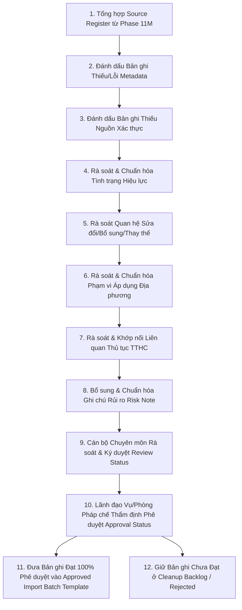

# LEGALFLOW V2 - PHASE 11N
# REAL LEGAL DATASET CLEANUP PLAN

## 1. Purpose

Kế hoạch làm sạch và chuẩn hóa bộ dữ liệu pháp lý thật (`Real Legal Dataset Cleanup Plan`) được thiết lập nhằm khắc phục các khiếm khuyết, chuẩn hóa thông tin siêu dữ liệu (`metadata`), bổ sung nguồn xác thực và xử lý triệt để các rủi ro đã được nhận diện tại giai đoạn rà soát trước đó (Phase 11M - `NO-GO UNTIL DATASET APPROVED`).  
Mục tiêu là biến các tập dữ liệu thô thu thập từ nhiều nguồn thành một bộ tri thức pháp lý sạch (`Clean Legal Knowledge Dataset`), đảm bảo tính chính thống, phân định rõ hiệu lực, phạm vi áp dụng, mối quan hệ sửa đổi/thay thế trước khi đưa vào Hội đồng Phê duyệt chính thức và chuẩn bị cho giai đoạn nạp có kiểm soát (`Controlled Import`).

## 2. Baseline

- **Previous tag:** `v2.11.13-real-legal-dataset-review-import-go-no-go`
- **Proposed tag:** `v2.11.14-real-legal-dataset-cleanup-approval`
- **Root path:** `C:\Users\Admin\legalflow-docker-uat`
- **Backend path:** `C:\Users\Admin\legalflow-docker-uat\legalflow-backend`
- **Ngày lập kế hoạch:** 12/07/2026

## 3. Cleanup Objective

Quá trình làm sạch dữ liệu tập trung vào 8 mục tiêu kỹ thuật và nghiệp vụ cốt lõi:
1. **Hoàn thiện metadata (`Metadata Completeness`):** Bổ sung trọn vẹn 29 trường dữ liệu bắt buộc theo đúng định dạng `VAL-01` &rarr; `VAL-14`, đặc biệt là `source_id`, `document_number`, `issuing_authority`, `document_type`, và `document_title`.
2. **Chuẩn hóa nguồn (`Source Standardization`):** Đối chiếu và xác thực URL hoặc địa chỉ lưu trữ bản gốc PDF/DOCX trên Cổng thông tin điện tử Chính phủ (`chinhphu.vn`), Công báo Chính phủ (`congbao.chinhphu.vn`) hoặc Cổng TTĐT của tỉnh/thành phố ban hành.
3. **Kiểm tra hiệu lực (`Legal Status Verification`):** Làm rõ tình trạng pháp lý hiện thời (`Effective`, `Expired`, `Superseded`, `Pending Effective`), loại bỏ ngay các văn bản quy hoạch hoặc quyết định cũ đã hết hiệu lực thi hành.
4. **Kiểm tra mối quan hệ sửa đổi/bổ sung/thay thế (`Amendment & Replacement Tracking`):** Khớp nối chính xác chuỗi lịch sử văn bản (văn bản nào sửa đổi điều khoản nào, văn bản mới nào bãi bỏ văn bản cũ).
5. **Kiểm tra phạm vi địa phương (`Local Scope Assessment`):** Gán chuẩn xác mã địa bàn tỉnh/huyện/xã (`Province X`, `District A`) cho các quyết định địa phương, tuyệt đối không để rỗng hoặc gây áp dụng chéo trái thẩm quyền.
6. **Kiểm tra liên quan thủ tục (`Procedure Mapping Verification`):** Ánh xạ chuẩn xác vào 5 quy trình thủ tục hành chính trọng tâm (`TTHC-LAND-01` &rarr; `TTHC-LAND-05`).
7. **Xác định bản ghi đủ điều kiện import (`Import Candidate Selection`):** Đưa các bản ghi đã được làm sạch 100%, có chữ ký xác nhận của cán bộ rà soát vào danh sách ứng viên nạp (`Approved Import Batch Template`).
8. **Xác định bản ghi cần loại/trì hoãn (`Rejection & Deferral Handling`):** Đưa các bản ghi còn tranh chấp hiệu lực, thiếu bản gốc hoặc đã hết thời kỳ vào danh sách trì hoãn (`Deferred`) hoặc từ chối (`Rejected`).

## 4. Cleanup Scope

Phạm vi làm sạch và chuẩn hóa bao phủ 8 nhóm tri thức pháp lý hành chính đất đai:

| Data Group | Cleanup Need | Required Evidence | Responsible Role | Priority | Notes |
| :--- | :--- | :--- | :---: | :---: | :--- |
| **Central Legal Documents** | Rà soát các quy định chuyển tiếp, bổ sung mã văn bản bị thay thế (`replaces_document`) và đính chính trích yếu. | Bản scan PDF gốc công báo có chữ ký số của cơ quan ban hành. | Legal Lead (`MANAGER`) | `CRITICAL` | Nền tảng pháp lý cốt lõi cho toàn bộ quy trình giải quyết TTHC. |
| **Local Regulations** | Chuẩn hóa mã tỉnh/huyện áp dụng (`local_applicability`), loại bỏ sự trùng lặp giữa quy định cũ và mới. | Quyết định ban hành chính thức từ Cổng TTĐT UBND/HĐND Tỉnh X. | Local Legal Officer (`STAFF`) | `CRITICAL` | Đảm bảo tính đặc thù thẩm quyền hành chính địa phương. |
| **Land-Use Planning Documents** | Kiểm tra mốc thời gian quy hoạch/kế hoạch, loại bỏ ngay kế hoạch SDĐ năm cũ (`2024`) đã hết hạn. | Quyết định phê duyệt kèm bản đồ/hồ sơ Kế hoạch SDĐ đang hiệu lực (`2026`). | Land Use Planning Specialist (`STAFF`) | `HIGH` | Căn cứ pháp lý tiên quyết khi thẩm định chuyển mục đích SDĐ. |
| **Internal Procedure Documents** | Khớp nối mã thủ tục `TTHC-LAND-01` &rarr; `05` với các bước xử lý, thời gian SLA và cơ quan phối hợp trong SOP. | Quyết định ban hành Quy trình nội bộ (SOP/ISO) có đóng dấu đỏ của UBND Tỉnh. | Administrative SOP Officer (`STAFF`) | `HIGH` | Chuẩn hóa luồng luân chuyển hồ sơ Một cửa - Phòng Chuyên môn. |
| **Administrative Templates** | Bổ sung mã biểu mẫu chuẩn (`form_code`), đường dẫn phụ lục đính kèm theo Thông tư/Nghị định mới nhất. | Phụ lục biểu mẫu ban hành kèm theo Thông tư của Bộ Tài nguyên và Môi trường. | Registry Clerk (`STAFF`) | `MEDIUM` | Phục vụ sinh mẫu đơn và giấy chứng nhận tự động tại module Export. |
| **Professional Guidance Documents** | Làm rõ tính chất công văn hướng dẫn nghiệp vụ là văn bản tham khảo áp dụng cho tình huống hồ sơ cụ thể. | Công văn hướng dẫn nghiệp vụ có chữ ký, con dấu của Tổng cục/Bộ TNMT. | Technical Advisor (`STAFF`) | `MEDIUM` | Hỗ trợ giải quyết các tình huống vướng mắc lịch sử đất đai phức tạp. |
| **Amended / Replaced Documents** | Lập ma trận đối chiếu điều khoản (`Amendment Matrix`) để làm rõ phần nội dung bị sửa đổi hoặc bãi bỏ. | Nghị định/Quyết định sửa đổi bổ sung kèm phụ lục đối chiếu chi tiết. | Legal Lead (`MANAGER`) | `HIGH` | Bảo đảm tính liên tục và cập nhật của lịch sử pháp lý. |
| **Expired / Warning Documents** | Gán nhãn `Expired` và bổ sung ghi chú rủi ro (`risk_note`) cảnh báo cấm áp dụng cho hồ sơ phát sinh mới. | Quyết định công bố danh mục văn bản hết hiệu lực thi hành hàng năm. | Legal Lead (`MANAGER`) | `HIGH` | Tường lửa phòng thủ ngăn chặn sai phạm do áp dụng luật cũ. |

## 5. Out of Scope

Nhằm tuân thủ tuyệt đối 18 yêu cầu giới hạn của Phase 11N, các hạng mục sau được xác định ngoài phạm vi thực hiện (`Out of Scope`):
- Không thực thi nạp dữ liệu pháp lý thật (`No real import execution`) vào cơ sở dữ liệu hệ thống trong phase này.
- Không tự động kích hoạt hay thay thế trạng thái (`No active version`) của bất kỳ văn bản pháp luật nào đang thi hành.
- Không hoàn tác phiên bản pháp lý (`No rollback version`).
- Không tạo hay thực thi migration mới (`No migration`).
- Không seed hay reset/restore cơ sở dữ liệu (`No seed / reset / restore`).
- Không chỉnh sửa mã nguồn Backend hay Frontend (`No code modification`).
- Không tự ý sinh hoặc tự tạo dữ liệu pháp lý thật giả định nếu chưa được cơ quan nhà nước cung cấp.
- Không sử dụng bộ dữ liệu chưa qua thẩm định và làm sạch cho AI review chính thức.

## 6. Cleanup Workflow

Quy trình làm sạch, chuẩn hóa và phê duyệt bộ dữ liệu pháp lý được vận hành qua 12 bước chặt chẽ:

1. **Bước 1 (Tổng hợp):** Trích xuất toàn bộ bản ghi nguồn từ Source Register Phase 11M đưa vào `Dataset Cleanup Register`.
2. **Bước 2 (Lọc Lỗi Metadata):** Tự động và thủ công phát hiện các bản ghi thiếu `source_id`, sai định dạng ngày ban hành/ngày hiệu lực.
3. **Bước 3 (Lọc Nguồn):** Kiểm tra các bản ghi có URL rỗng hoặc đường dẫn không thuộc tên miền chính phủ (`.gov.vn`).
4. **Bước 4 (Khắc phục Hiệu lực):** Đối chiếu công báo để cập nhật `legal_status` chính xác (`Effective`, `Expired`).
5. **Bước 5 (Khắc phục Quan hệ):** Điền mã số văn bản cũ bị bãi bỏ/thay thế vào trường quan hệ tương ứng.
6. **Bước 6 (Khắc phục Phạm vi):** Điền mã `local_applicability` cho các quyết định địa phương, bảo đảm không bị rỗng.
7. **Bước 7 (Khắc phục Thủ tục):** Khớp nối lại mã thủ tục `TTHC-LAND-01` &rarr; `05` theo đúng nghiệp vụ thực tế.
8. **Bước 8 (Khắc phục Risk Note):** Viết tường minh lời nhắc rủi ro pháp lý (`risk_note`) cho từng văn bản.
9. **Bước 9 (Xác nhận Reviewer):** Cán bộ chuyên trách từng nhóm chuyên đề kiểm tra lại và ký xác nhận `Cleaned / Reviewed`.
10. **Bước 10 (Phê duyệt Approver):** Lãnh đạo cấp cao (`MANAGER`) thẩm định toàn bộ lô dữ liệu đã làm sạch, ký quyết định `Approved`.
11. **Bước 11 (Tạo Batch Template):** Chuyển các bản ghi đạt trạng thái `Approved` sang bảng danh sách sẵn sàng nạp (`Approved Import Batch Template`).
12. **Bước 12 (Đóng băng Backlog):** Các bản ghi còn nghi ngờ hoặc hết hiệu lực bị đưa vào danh sách `Deferred / Rejected` và tuyệt đối không đưa vào lô nạp.
