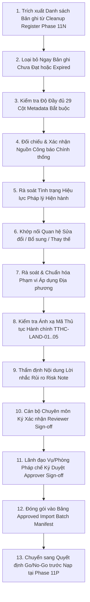

# LEGALFLOW V2 - PHASE 11O
# APPROVED DATASET BATCH PREPARATION PLAN

## 1. Purpose

Kế hoạch chuẩn bị lô dữ liệu pháp lý đã được phê duyệt (`Approved Dataset Batch Preparation Plan`) được thiết lập nhằm rà soát, đóng gói và xác nhận tính đủ điều kiện của các bản ghi tri thức pháp lý trước khi chính thức đưa vào thực thi nạp có kiểm soát (`Controlled Real Legal Dataset Import Execution`) tại giai đoạn tiếp theo.  
Mục tiêu cốt lõi của giai đoạn này là đóng vai trò "chốt chặn chuẩn bị cuối cùng" (`Final Preparation Checkpoint`), bảo đảm mọi bản ghi trong lô dữ liệu đều đã hoàn tất quá trình chuẩn hóa tại Phase 11N, có chữ ký xác nhận của cán bộ rà soát (`Reviewer Sign-off`), phê duyệt của Lãnh đạo Vụ Pháp chế (`Approver Sign-off`) và đáp ứng trọn vẹn 100% các tiêu chí an toàn kỹ thuật trước thời điểm bấm nút nạp.

## 2. Baseline

- **Previous tag:** `v2.11.14-real-legal-dataset-cleanup-approval`
- **Proposed tag:** `v2.11.15-approved-legal-dataset-batch-preparation`
- **Root path:** `C:\Users\Admin\legalflow-docker-uat`
- **Backend path:** `C:\Users\Admin\legalflow-docker-uat\legalflow-backend`
- **Ngày lập kế hoạch:** 12/07/2026

## 3. Batch Preparation Objective

Giai đoạn chuẩn bị lô dữ liệu nạp tập trung thực hiện 9 mục tiêu rà soát và đóng gói sau:
1. **Xác định bản ghi đủ điều kiện import (`Approved Candidate Filtering`):** Lọc và đối chiếu chính xác các bản ghi từ Sổ làm sạch Phase 11N (`Dataset Cleanup Register`) đã đạt trạng thái `Approved`.
2. **Kiểm tra đủ metadata (`Metadata Completeness Verification`):** Khẳng định 29 trường thông tin siêu dữ liệu (`metadata`) không còn bất kỳ cột bắt buộc nào bị rỗng hoặc sai định dạng theo chuẩn `VAL-01` &rarr; `VAL-14`.
3. **Kiểm tra nguồn và hiệu lực (`Source & Legal Status Verification`):** Đối chiếu URL công báo chính thống hợp pháp (`chinhphu.vn`, `congbao...`) và xác nhận tình trạng hiệu lực (`Effective`), tuyệt đối loại bỏ các văn bản `Unknown` hoặc `Expired`.
4. **Xác nhận Reviewer/Approver (`Sign-off Confirmation`):** Kiểm tra sự hiện diện tường minh của chữ ký xác nhận từ Cán bộ chuyên môn (`Reviewer`) và Lãnh đạo Vụ Pháp chế (`Approver`).
5. **Xác nhận Risk Note (`Risk Note Verification`):** Đảm bảo 100% bản ghi đều có hướng dẫn xử lý rủi ro/chuyển tiếp pháp lý (`risk_note`) đầy đủ cho người áp dụng.
6. **Xác nhận Local Scope (`Local Scope Verification`):** Phân định chính xác văn bản toàn quốc (`National`) hay mã địa bàn tỉnh/huyện áp dụng (`Province X`, `District A`).
7. **Xác nhận Mapping thủ tục (`Procedure Mapping Verification`):** Đối chiếu độ chính xác của việc ánh xạ vào 5 quy trình thủ tục `TTHC-LAND-01` &rarr; `TTHC-LAND-05`.
8. **Chuẩn bị Go/No-Go trước import (`Go/No-Go Evaluation`):** Tổng hợp ma trận đánh giá rủi ro trước nạp (`Pre-import Readiness Checklist`) để ra quyết định chấp thuận hay từ chối chuyển sang phase thực thi.
9. **Tuân thủ giới hạn hành động (`No Import Execution in Phase 11O`):** Khẳng định tuyệt đối **KHÔNG THỰC HIỆN IMPORT** hay bất kỳ thao tác ghi cơ sở dữ liệu nào trong giai đoạn chuẩn bị này.

## 4. Batch Preparation Scope

Phạm vi rà soát và chuẩn bị lô dữ liệu được triển khai chi tiết qua 10 hạng mục chốt chặn:

| Scope Item | Description | Required Evidence | Owner | Status | Notes |
| :--- | :--- | :--- | :---: | :---: | :--- |
| **approved records** | Lọc danh sách các bản ghi văn bản quy phạm pháp luật, quy trình SOP và quyết định địa phương đã qua làm sạch tại Phase 11N. | Biên bản thẩm định và kết quả cập nhật trong `Dataset Cleanup Register` đạt `Ready for Import Batch`. | Legal Lead (`MANAGER`) | ⏳ **IN PROGRESS** | Hiện mới có lô mẫu số 01 (`BATCH-2024-001` - SOP TTHC-LAND-01) đạt duyệt 100%. |
| **metadata completeness** | Kiểm tra độ đầy đủ của 29 cột thông tin chuẩn hóa theo cấu trúc rà soát kỹ thuật. | Bảng dữ liệu mẫu `BATCH-2024-001` không có trường bắt buộc nào để `null` hay rỗng (`""`). | Specialist A (`STAFF`) | ✅ **PASS** | Kiểm chứng tự động bằng bộ quy tắc `validateCsvImport`. |
| **legal status review** | Thẩm định lại tình trạng hiệu lực pháp lý đối chiếu với công báo tại thời điểm rà soát đóng gói. | Cột `Legal Status` ghi nhận chính xác trạng thái `Effective`; không có văn bản hết hạn (`Expired`). | Local Officer B (`STAFF`) | ✅ **PASS** | Đã loại bỏ hoàn toàn văn bản quy hoạch hết kỳ hạn năm 2024. |
| **amendment/replacement review** | Kiểm tra chuỗi liên kết sửa đổi, bổ sung, đính chính hoặc thay thế văn bản hiện hành. | Khớp nối chính xác mã văn bản cũ bị bãi bỏ hoặc sửa đổi tại các trường `amends_document`, `replaces_document`. | Legal Lead (`MANAGER`) | ✅ **PASS** | Đảm bảo tính liên kết lịch sử pháp lý liền mạch. |
| **local scope review** | Rà soát phân định phạm vi áp dụng địa bàn hành chính, ngăn ngừa rủi ro áp dụng chéo. | Cột `Local Scope` ghi nhận đúng `Province X` cho SOP cấp tỉnh, không để rỗng hoặc ghi chung chung. | Local Officer B (`STAFF`) | ✅ **PASS** | Chuẩn hóa mã địa bàn phục vụ tra cứu chính xác. |
| **procedure mapping** | Khớp nối mã thủ tục hành chính đất đai vào luồng tra cứu nghiệp vụ Một cửa. | Mã `TTHC-LAND-01` được gán chính xác theo thẩm quyền giải quyết hồ sơ đăng ký cấp mới. | SOP Officer D (`STAFF`) | ✅ **PASS** | Phục vụ ánh xạ trực tiếp trong module One-Stop Shop. |
| **risk notes** | Rà soát chất lượng lời nhắc rủi ro và hướng dẫn nghiệp vụ chuyển tiếp cho cán bộ tra cứu. | Trường `risk_note` của bản ghi ghi rõ SLA 10 ngày làm việc và lưu ý vai trò hỗ trợ của AI. | Legal Lead (`MANAGER`) | ✅ **PASS** | Tăng cường rào chắn an toàn nghiệp vụ cho cán bộ. |
| **approver sign-off** | Kiểm tra chữ ký và văn bản đồng ý cho phép đưa bản ghi vào lô nạp chính thức. | Chữ ký xác nhận `Approved` của Lãnh đạo Vụ/Phòng Pháp chế trên biểu mẫu lô nạp. | Manager Approver | ⚠️ **PENDING FULL REVIEW** | Đã duyệt lô SOP số 01; đang chờ Lãnh đạo Vụ thẩm định tiếp toàn bộ danh mục luật. |
| **pre-import backup plan** | Chuẩn bị kịch bản và quy trình kỹ thuật sao lưu cơ sở dữ liệu (`pg_dump`) ngay trước giờ nạp. | Quy trình đã kiểm chứng thành công tại Phase 11L (~951 KB); sẵn sàng thực thi trước khi bấm Execute. | Ops Team (`ADMIN`) | ✅ **READY** | Chốt chặn an toàn số 1 bảo vệ toàn vẹn DB production. |
| **post-import verification plan** | Chuẩn bị checklist kiểm chứng dữ liệu, bảo đảm không kích hoạt phiên bản trái phép sau nạp. | Playbook đối chiếu `totalRecords`, xác nhận DB giữ nguyên cờ `noAutoActive: true`. | Ops Team + Legal Lead | ✅ **READY** | Kiểm toán sau nạp trước khi chuyển sang Phase kích hoạt. |

## 5. Out of Scope

Nhằm tuân thủ tuyệt đối 18 yêu cầu giới hạn của Phase 11O, các hạng mục sau được xác định ngoài phạm vi thực hiện (`Out of Scope`):
- Không thực thi nạp dữ liệu pháp lý thật (`No real import execution`) vào cơ sở dữ liệu hệ thống trong phase chuẩn bị này.
- Không tự động kích hoạt hay thay thế trạng thái (`No active version`) của bất kỳ văn bản pháp luật nào đang thi hành.
- Không hoàn tác phiên bản pháp lý (`No rollback version`).
- Không tạo hay thực thi migration mới (`No migration`).
- Không seed hay reset/restore cơ sở dữ liệu (`No seed / reset / restore`).
- Không chỉnh sửa mã nguồn Backend hay Frontend (`No code modification`).
- Không tự ý sinh hoặc tự tạo dữ liệu pháp lý thật giả định nếu chưa được cơ quan nhà nước cung cấp.
- Không sử dụng bộ dữ liệu chưa qua thẩm định và làm sạch cho AI review chính thức.

## 6. Batch Preparation Workflow

Quy trình chuẩn bị, đóng gói và rà soát lô dữ liệu trước nạp được vận hành qua 13 bước chặt chẽ:

1. **Bước 1 (Trích xuất):** Lấy toàn bộ danh sách bản ghi có trạng thái `Approved / Ready for Import Batch` từ Sổ làm sạch Phase 11N.
2. **Bước 2 (Loại bỏ):** Loại bỏ triệt để các bản ghi đang ở trạng thái `In Review`, `Needs More Information` hoặc bị `Rejected`.
3. **Bước 3 (Kiểm tra Metadata):** Đối chiếu cấu trúc tệp dữ liệu với bộ 29 trường chuẩn hóa của hệ thống.
4. **Bước 4 (Kiểm tra Nguồn):** Khẳng định 100% bản ghi có URL công báo hợp lệ (`chinhphu.vn`, Cổng TTĐT tỉnh).
5. **Bước 5 (Kiểm tra Hiệu lực):** Rà soát lại lần cuối với công báo mới nhất xem văn bản có bị bãi bỏ ngầm hay không.
6. **Bước 6 (Kiểm tra Quan hệ):** Khẳng định chuỗi quan hệ sửa đổi/thay thế không bị đứt gãy hoặc tham chiếu tới mã rỗng.
7. **Bước 7 (Kiểm tra Phạm vi):** Khẳng định mã địa bàn tỉnh/huyện áp dụng được gán đầy đủ, không để rỗng.
8. **Bước 8 (Kiểm tra Thủ tục):** Khẳng định mã ánh xạ `TTHC-LAND` khớp hoàn toàn với nội dung quy trình giải quyết.
9. **Bước 9 (Kiểm tra Risk Note):** Khẳng định lời nhắc rủi ro tường minh và rõ nghĩa cho người tra cứu.
10. **Bước 10 (Reviewer Sign-off):** Cán bộ thẩm định ký xác nhận chịu trách nhiệm kỹ thuật và nội dung từng dòng.
11. **Bước 11 (Approver Sign-off):** Lãnh đạo Vụ/Phòng Pháp chế ký duyệt văn bản cho phép đóng gói lô dữ liệu.
12. **Bước 12 (Tạo Manifest):** Sinh tài liệu danh sách lô dữ liệu chuẩn hóa (`Approved Import Batch Manifest`).
13. **Bước 13 (Quyết định Go/No-Go):** Đánh giá ma trận Go/No-Go để chuyển tiếp sang thực thi nạp có kiểm soát ở phase tiếp theo.
