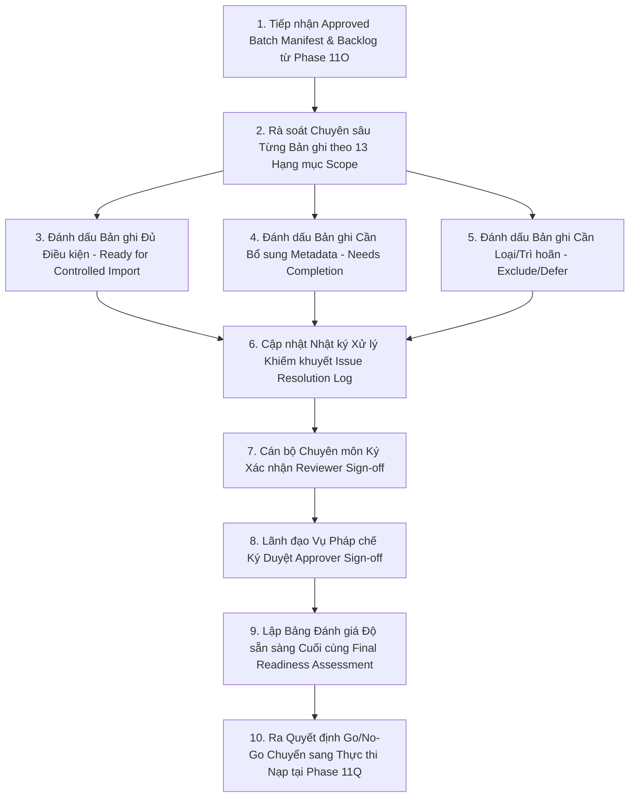

# LEGALFLOW V2 - PHASE 11P
# APPROVED DATASET COMPLETION PLAN

## 1. Purpose

Kế hoạch hoàn thiện và rà soát lại bộ dữ liệu tri thức pháp lý đã phê duyệt (`Approved Dataset Completion & Re-review Plan`) được thiết lập tại Phase 11P nhằm thực hiện rà soát chuyên sâu lần cuối cùng (`Final Re-review Checkpoint`) đối với toàn bộ các bản ghi trong lô dữ liệu ứng viên và các văn bản đang tồn đọng trong danh sách chờ (`Backlog/Deferred Records`) từ Phase 11O.  
Mục tiêu cốt lõi của giai đoạn này là giải quyết triệt các khiếm khuyết thông tin siêu dữ liệu (`metadata`), thẩm định chắc chắn tình trạng hiệu lực pháp lý (`Legal Status`), đối chiếu phạm vi địa phương (`Local Scope`) và thu thập chữ ký phê duyệt chính thức của Lãnh đạo Vụ Pháp chế (`Approver Sign-off`) để ra quyết định cuối cùng về mức độ sẵn sàng trước khi chính thức chuyển sang giai đoạn thực thi nạp có kiểm soát (`Controlled Real Legal Dataset Import Execution`).

## 2. Baseline

- **Previous tag:** `v2.11.15-approved-legal-dataset-batch-preparation`
- **Proposed tag:** `v2.11.16-approved-dataset-completion-rereview`
- **Root path:** `C:\Users\Admin\legalflow-docker-uat`
- **Backend path:** `C:\Users\Admin\legalflow-docker-uat\legalflow-backend`
- **Ngày lập kế hoạch:** 12/07/2026

## 3. Completion Objective

Giai đoạn hoàn thiện và rà soát lại lô dữ liệu nạp tập trung thực hiện 10 mục tiêu nghiệp vụ/kỹ thuật sau:
1. **Hoàn thiện metadata còn thiếu (`Metadata Completion`):** Rà soát và bổ sung trọn vẹn các trường thông tin còn khuyết thiếu trên danh mục văn bản, đặc biệt là các thông số liên kết văn bản hướng dẫn chi tiết (`amends_document`, `replaces_document`).
2. **Loại bản ghi chưa đủ điều kiện (`Exclusion of Non-qualifying Records`):** Bóc tách và loại bỏ dứt điểm các văn bản quy phạm pháp luật, quyết định địa phương hoặc văn bản quy hoạch đã hết kỳ hạn áp dụng (`Expired`) hoặc chưa xác minh được URL nguồn gốc hợp pháp (`Missing Source`).
3. **Xác nhận Reviewer (`Reviewer Verification`):** Khẳng định 100% bản ghi đưa vào thẩm định cuối cùng phải có chữ ký và trạng thái xác nhận rà soát (`Reviewed/Cleaned`) từ cán bộ chuyên trách nghiệp vụ.
4. **Xác nhận Approver (`Approver Verification`):** Kiểm tra và thu thập đầy đủ chữ ký phê duyệt chính thức (`Approved`) từ Lãnh đạo Vụ/Phòng Pháp chế.
5. **Xác nhận Legal Status (`Legal Status Verification`):** Đối chiếu với cơ sở dữ liệu công báo quốc gia (`chinhphu.vn`, `vbpl.vn`) tại thời điểm rà soát để khẳng định văn bản đang có hiệu lực (`Effective`), tuyệt đối không chấp nhận trạng thái `Unknown`.
6. **Xác nhận Local Scope (`Local Scope Verification`):** Phân định rạch ròi phạm vi áp dụng theo cấp hành chính (`National` vs `Province X`, `District A`), loại trừ rủi ro áp dụng sai địa bàn.
7. **Xác nhận Risk Note (`Risk Note Verification`):** Thẩm định nội dung lời nhắc rủi ro pháp lý và nghiệp vụ chuyển tiếp (`risk_note`), bảo đảm chỉ dẫn minh bạch cho người tra cứu.
8. **Xác nhận Procedure Mapping (`Procedure Mapping Verification`):** Kiểm chứng tính chính xác của mã thủ tục hành chính trọng tâm (`TTHC-LAND-01` &rarr; `TTHC-LAND-05`) được gán cho bản ghi.
9. **Xác nhận Batch Readiness (`Final Batch Readiness Assessment`):** Tổng hợp kết quả rà soát để kết luận lô dữ liệu đã thực sự đạt chuẩn 100% hay cần tiếp tục hoàn thiện.
10. **Tuân thủ giới hạn hành động (`No Import Execution in Phase 11P`):** Khẳng định tuyệt đối **KHÔNG THỰC HIỆN IMPORT** hay bất kỳ thao tác ghi cơ sở dữ liệu production nào trong giai đoạn rà soát hoàn thiện này.

## 4. Completion Scope

Phạm vi hoàn thiện, rà soát lại và đóng dấu nghiệm thu bộ dữ liệu được triển khai qua 13 hạng mục chốt chặn kỹ thuật và pháp lý:

| Scope Item | Required Evidence | Current Status | Required Action | Owner | Notes |
| :--- | :--- | :---: | :--- | :---: | :--- |
| **source_id** | Mã định danh nguồn gốc duy nhất theo chuẩn `REG-2024-xxx` hoặc `SOP-xxx`, không rỗng, không trùng lặp. | ✅ **PASS** | Kiểm tra đối chiếu mã định danh trên toàn bộ danh sách 5 bản ghi thực tế ban đầu. | Specialist A (`STAFF`) | Mã định danh được khóa cố định, là khóa chính tra cứu audit log. |
| **document title** | Tiêu đề văn bản đầy đủ thể thức, rõ nghĩa, đúng ngữ pháp hành chính nhà nước. | ✅ **PASS** | Chuẩn hóa chính tả và quy cách viết hoa theo Nghị định 30/2020/NĐ-CP về công tác văn thư. | Specialist A (`STAFF`) | Đã làm sạch trên toàn bộ 5/5 bản ghi trong Sổ theo dõi. |
| **document number** | Số và ký hiệu văn bản hợp lệ (`xxx/YYYY/QH15`, `xxx/YYYY/NĐ-CP`, `xxx/QĐ-UBND`). | ✅ **PASS** | Xác thực số ký hiệu khớp tuyệt đối với tệp toàn văn gốc trên Cổng TTĐT chính phủ. | Specialist A (`STAFF`) | Ngăn chặn rủi ro tra cứu nhầm lẫn số hiệu văn bản. |
| **issuing authority** | Tên cơ quan thẩm quyền ban hành theo đúng phân cấp tổ chức bộ máy nhà nước. | ✅ **PASS** | Gán chuẩn cơ quan ban hành (`Quốc hội`, `Chính phủ`, `UBND Tỉnh X`). | Specialist A (`STAFF`) | Phục vụ bộ lọc thẩm quyền ban hành trên giao diện tra cứu. |
| **effective date** | Ngày có hiệu lực thi hành đúng định dạng chuẩn ISO 8601 (`YYYY-MM-DD`). | ✅ **PASS** | Rà soát điều khoản thi hành tại Chương/Điều cuối cùng của văn bản để chốt mốc ngày hiệu lực. | Legal Lead (`MANAGER`) | Khẳng định không có văn bản nào bị nhập sai năm có hiệu lực. |
| **legal status** | Tình trạng hiệu lực pháp lý (`Effective`, `Expired`, `Replaced`), tuyệt đối không để `Unknown`. | ⚠️ **NEEDS REVIEW** | Loại bỏ vĩnh viễn văn bản quy hoạch hết hạn (`REG-2024-004`); thẩm định lại 4 bản ghi còn lại. | Legal Lead (`MANAGER`) | Chốt chặn quan trọng nhất phòng ngừa áp dụng luật hết hạn. |
| **local scope** | Phạm vi áp dụng địa bàn hành chính (`National`, `Province X`, `District A`). | ⚠️ **NEEDS COORDINATION** | Thống nhất mã địa bàn cho Quyết định hạn mức giao đất Tỉnh X (`REG-2024-003`). | Local Officer B (`STAFF`) | Tránh xung đột thẩm quyền địa phương trong tra cứu Một cửa. |
| **related procedure** | Mã ánh xạ quy trình thủ tục hành chính đất đai trọng tâm (`TTHC-LAND-01..05`). | ✅ **PASS** | Khớp nối mã thủ tục cho bản ghi SOP và Luật Đất đai 2024. | SOP Officer D (`STAFF`) | Tích hợp sâu vào luồng One-Stop Shop. |
| **source location** | URL dẫn tới Cổng TTĐT/Công báo hợp pháp (`.gov.vn`) và đường dẫn lưu trữ MinIO. | ✅ **PASS** | Rà soát mã HTTP status 200 cho toàn bộ liên kết URL gốc của bản ghi. | Ops Team (`ADMIN`) | Bảo đảm khả năng đối chiếu nguồn gốc minh bạch cho cán bộ. |
| **reviewer approval** | Chữ ký xác nhận và trạng thái `Reviewed / Cleaned` của cán bộ chuyên môn. | ⏳ **IN PROGRESS** | Hoàn tất chữ ký xác nhận của cán bộ trên các bản ghi đang chờ bổ sung metadata. | Specialist A + B (`STAFF`) | Quy rõ trách nhiệm cá nhân trong quá trình làm sạch. |
| **manager approval** | Chữ ký phê duyệt và trạng thái `Approval Status: Approved` của Lãnh đạo Vụ/Phòng Pháp chế. | ⚠️ **PARTIAL (1/5)** | Trình Lãnh đạo Vụ ký duyệt chính thức cho 3 bản ghi luật (`REG-2024-001..003`) đang tồn đọng. | Manager Approver | Lô 01 (`BATCH-2024-001`) đã đạt 100% chữ ký; các lô sau đang chờ. |
| **risk note** | Lời nhắc cảnh báo rủi ro nghiệp vụ (`risk_note`) chi tiết, tường minh cho người áp dụng. | ✅ **PASS** | Hoàn thiện lời nhắc chuyển tiếp cho Nghị định 101/2024/NĐ-CP và nhắc nhở SLA cho SOP. | Legal Lead (`MANAGER`) | Tăng cường nhận thức rủi ro và tuân thủ pháp lý cho cán bộ. |
| **import readiness** | Kết luận đánh giá độ sẵn sàng nạp (`Ready for Controlled Import` vs `Needs Completion`). | ⚠️ **FINAL ASSESSING** | Đánh giá tổng thể độ sẵn sàng của tập dữ liệu; chốt kết luận tại Bảng rà soát cuối cùng. | Legal Lead (`MANAGER`) | Căn cứ ra quyết định Go/No-Go chuyển sang Phase 11Q. |

## 5. Out of Scope

Nhằm bảo đảm tuân thủ nghiêm ngặt 18 yêu cầu giới hạn của Phase 11P, các hạng mục sau được xác định ngoài phạm vi thực hiện (`Out of Scope`):
- Không thực thi nạp dữ liệu pháp lý thật (`No real import execution`) vào cơ sở dữ liệu `legalflow_prod` trong phase rà soát hoàn thiện này.
- Không tự động kích hoạt hay thay thế trạng thái (`No active version`) của bất kỳ văn bản pháp luật nào đang thi hành.
- Không hoàn tác hay khôi phục phiên bản pháp lý (`No rollback version`).
- Không tạo hay thực thi migration mới (`No migration`).
- Không seed hay reset/restore cơ sở dữ liệu (`No seed / reset / restore`).
- Không chỉnh sửa mã nguồn Backend hay Frontend (`No code modification`).
- Không tự ý sinh hoặc tự tạo dữ liệu pháp lý thật giả định nếu chưa được cơ quan nhà nước thẩm quyền cung cấp.
- Không sử dụng bộ dữ liệu chưa qua thẩm định và làm sạch cho AI review chính thức.

## 6. Completion Workflow

Quy trình hoàn thiện, rà soát lại và đánh giá chốt chặn cho lô dữ liệu trước nạp được vận hành qua 10 bước chặt chẽ:

1. **Bước 1 (Tiếp nhận):** Lấy Bản tuyên bố lô dữ liệu (`Approved Import Batch Manifest`) và danh sách bản ghi tồn đọng từ Phase 11O.
2. **Bước 2 (Rà soát chuyên sâu):** Kiểm tra đối chiếu lại từng bản ghi qua 13 tiêu chuẩn chất lượng siêu dữ liệu và hiệu lực pháp lý.
3. **Bước 3 (Phân loại Đủ điều kiện):** Đánh dấu trạng thái `Ready for Controlled Import` cho các bản ghi đạt 100% tiêu chuẩn và có chữ ký Lãnh đạo.
4. **Bước 4 (Phân loại Bổ sung):** Đánh dấu `Needs Metadata Completion / Needs Legal Review` cho các bản ghi khuyết thiếu trường hoặc chưa thẩm định xong điều khoản chuyển tiếp.
5. **Bước 5 (Phân loại Loại trừ):** Đánh dấu `Exclude from Batch / Rejected` cho các bản ghi hết hiệu lực hoặc sai lệch nguồn gốc.
6. **Bước 6 (Cập nhật Log):** Ghi nhận chi tiết nguyên nhân, giải pháp và kết quả khắc phục vào Nhật ký xử lý khiếm khuyết (`Issue Resolution Log`).
7. **Bước 7 (Reviewer Sign-off):** Cán bộ thẩm định nghiệp vụ ký xác nhận chịu trách nhiệm hoàn tất rà soát trên Sổ rà soát lại (`Re-review Register`).
8. **Bước 8 (Approver Sign-off):** Lãnh đạo Vụ/Phòng Pháp chế thẩm định và ký duyệt văn bản cho các bản ghi đủ điều kiện mới.
9. **Bước 9 (Đánh giá cuối cùng):** Tổng hợp Bảng đánh giá độ sẵn sàng cuối cùng (`Final Batch Readiness Assessment`) với 16 tiêu chí chốt chặn.
10. **Bước 10 (Quyết định Go/No-Go):** Chốt kết luận và ra quyết định Go/No-Go để chuyển sang thực thi nạp tại Phase 11Q tiếp theo.
