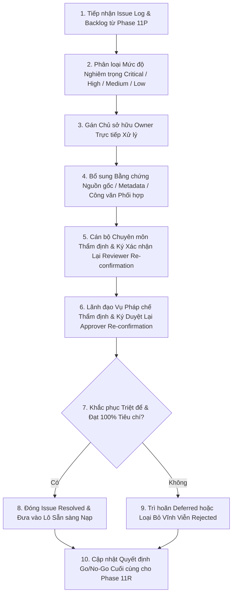

# LEGALFLOW V2 - PHASE 11Q
# DATASET ISSUE RESOLUTION PLAN

## 1. Purpose

Kế hoạch xử lý khiếm khuyết và theo dõi phê duyệt bộ dữ liệu tri thức pháp lý (`Dataset Issue Resolution & Approval Follow-up Plan`) được thiết lập tại Phase 11Q nhằm tổ chức theo dõi, giải quyết triệt để các bất cập metadata, khuyết thiếu bằng chứng nguồn công báo và đóng lại các khoảng trống phê duyệt (`Approval Gaps`) còn tồn đọng từ Phase 11P.  
Mục tiêu tối thượng của kế hoạch là thiết lập một quy trình xử lý khép kín (`Closed-loop Issue Governance`), bảo đảm mọi bản ghi ứng viên được chuyển sang giai đoạn thực thi nạp có kiểm soát (`Controlled Real Legal Dataset Import Execution`) đều đã được xử lý sạch 100% khiếm khuyết mức `Critical` và `High`, đầy đủ chữ ký rà soát chuyên môn (`Reviewer`) và phê duyệt thẩm quyền (`Approver`).

## 2. Baseline

- **Previous tag:** `v2.11.16-approved-dataset-completion-rereview`
- **Proposed tag:** `v2.11.17-dataset-issue-resolution-approval-followup`
- **Root path:** `C:\Users\Admin\legalflow-docker-uat`
- **Backend path:** `C:\Users\Admin\legalflow-docker-uat\legalflow-backend`
- **Ngày lập kế hoạch:** 12/07/2026

## 3. Resolution Objective

Phase 11Q tập trung thực hiện 11 mục tiêu kỹ thuật và pháp lý trọng tâm sau:
1. **Xử lý bản ghi thiếu metadata (`Metadata Gap Resolution`):** Rà soát và điền đầy đủ các trường thông tin còn trống, đặc biệt là các liên kết tham chiếu văn bản (`amends_document`, `replaces_document`).
2. **Bổ sung nguồn (`Source Verification & Supplementation`):** Xác thực và bổ sung URL công báo chính thức hợp pháp (`chinhphu.vn`, `congbao.chinhphu.vn`, `.gov.vn`) kèm minh chứng tệp toàn văn MinIO.
3. **Xác nhận hiệu lực (`Legal Status Confirmation`):** Kiểm tra đối chiếu với cơ sở dữ liệu pháp luật quốc gia tại thời điểm xử lý để chốt chắc chắn tình trạng `Effective`, tuyệt đối loại bỏ các bản ghi `Unknown` hay `Expired`.
4. **Xác nhận sửa đổi/bổ sung/thay thế (`Amendment / Replacement Link Confirmation`):** Thẩm định chính xác chuỗi lịch sử văn bản quy phạm, khớp nối chính xác văn bản cũ bị bãi bỏ ngầm hoặc sửa đổi.
5. **Xác nhận Local Scope (`Local Scope Confirmation`):** Chuẩn hóa mã địa bàn hành chính áp dụng (`National` hoặc `Province X`, `District A`), loại trừ sự chồng chéo hoặc mập mờ ranh giới áp dụng.
6. **Xác nhận Related Procedure (`Procedure Mapping Confirmation`):** Thẩm định và gắn mã ánh xạ thủ tục đất đai trọng tâm (`TTHC-LAND-01` &rarr; `TTHC-LAND-05`) cho 100% bản ghi.
7. **Bổ sung Risk Note (`Risk Note Supplementation`):** Hoàn thiện lời nhắc cảnh báo rủi ro nghiệp vụ (`risk_note`) với nội dung hướng dẫn điều khoản chuyển tiếp và định mức thời gian xử lý SLA.
8. **Hoàn tất Reviewer Approval (`Reviewer Sign-off Completion`):** Thu thập đủ 100% chữ ký xác nhận chịu trách nhiệm rà soát kỹ thuật (`Reviewed / Cleaned`) từ Cán bộ chuyên trách.
9. **Hoàn tất Manager/Approver Approval (`Approver Sign-off Completion`):** Tổ chức họp thẩm định và thu thập chữ ký ký duyệt chính thức (`Approved`) từ Lãnh đạo Vụ/Phòng Pháp chế.
10. **Phân loại bản ghi đủ điều kiện và chưa đủ điều kiện (`Record Eligibility Categorization`):** Phân định rạch ròi giữa bản ghi sẵn sàng nạp (`Ready for Controlled Import`), bản ghi tiếp tục chờ bổ sung (`Deferred`) và bản ghi bị loại vĩnh viễn (`Rejected`).
11. **Tuân thủ giới hạn hành động (`No Import Execution in Phase 11Q`):** Khẳng định tuyệt đối **KHÔNG THỰC HIỆN IMPORT** hay bất kỳ thao tác ghi cơ sở dữ liệu production nào trong giai đoạn xử lý khiếm khuyết này.

## 4. Issue Resolution Workflow

Quy trình xử lý khiếm khuyết, giải quyết khoảng trống phê duyệt và chốt chặng độ sẵn sàng trước nạp được vận hành qua 10 bước nghiêm ngặt:

1. **Bước 1 (Tiếp nhận):** Lấy danh sách khiếm khuyết từ Nhật ký xử lý lỗi (`Dataset Issue Resolution Log`) Phase 11P.
2. **Bước 2 (Phân loại):** Phân chia rõ ràng theo cấp độ nghiêm trọng `Critical`, `High`, `Medium`, `Low`.
3. **Bước 3 (Gán Owner):** Phân công cụ thể cán bộ chịu trách nhiệm xử lý từng lỗi (`Specialist A`, `Local Officer B`, `Manager Approver`).
4. **Bước 4 (Bổ sung Bằng chứng):** Thu thập và điền thêm các trường metadata bị khuyết, URL nguồn công báo và công văn phối hợp địa phương.
5. **Bước 5 (Reviewer Re-confirmation):** Cán bộ thẩm định nghiệp vụ kiểm tra minh chứng mới bổ sung và ký xác nhận rà soát lại (`Reviewed / Cleaned`).
6. **Bước 6 (Approver Re-confirmation):** Lãnh đạo Vụ/Phòng Pháp chế họp xem xét và ký phiếu phê duyệt (`Approved`) cho các bản ghi đã khắc phục xong.
7. **Bước 7 (Đóng Issue):** Chốt đóng khiếm khuyết (`Resolved`) cho các bản ghi đã đáp ứng đủ điều kiện và có chữ ký đầy đủ.
8. **Bước 8 (Loại/Trì hoãn):** Duy trì trạng thái hoãn (`Deferred`) cho bản ghi chưa đủ chữ ký hoặc bóc tách loại bỏ (`Rejected`) cho bản ghi hết hạn.
9. **Bước 9 (Cập nhật Quyết định):** Lập Bảng quyết định lại độ sẵn sàng nạp (`Import Readiness Re-decision`).
10. **Bước 10 (Chuyển Phase):** Chỉ mở khóa chuyển sang thực thi nạp có kiểm soát khi toàn bộ lỗi `Critical` và `High` trên lô nạp ứng viên đã được giải quyết triệt để.

## 5. Stop Conditions

Nhằm thiết lập bức tường lửa bảo vệ tối thượng cho hệ thống, Lãnh đạo dự án và Hội đồng Quản trị Kỹ thuật quy định **10 Điều kiện Dừng Khẩn cấp (`Stop Conditions`)**. Cán bộ vận hành (`Technical Operator`) và `ADMIN` **BẮT BUỘC PHẢI DỪNG NGAY LẬP TỨC (`STOP IMMEDIATELY`)** mọi nỗ lực chuyển sang phase import thật nếu phát hiện bất kỳ một trong 10 vi phạm sau:
1. **Còn tồn tại lỗi Critical chưa xử lý (`Unresolved Critical Issue`):** Bản ghi bị gán nhãn `Critical` (như văn bản quy hoạch hết thời kỳ hoặc mâu thuẫn thẩm quyền ban hành) chưa được loại bỏ khỏi tệp import.
2. **Còn tồn tại lỗi High chưa xử lý (`Unresolved High Issue`):** Bản ghi có lỗi mức `High` (như thiếu chữ ký Lãnh đạo Vụ hoặc trùng lặp số ký hiệu) vẫn đang ở trạng thái `Open` hoặc `In Review`.
3. **Bản ghi thiếu nguồn hoặc nguồn không xác thực (`Missing / Unverified Source URL`):** Bất kỳ dòng dữ liệu nào để trống URL nguồn hoặc dẫn link không thuộc Cổng TTĐT chính thống của cơ quan hành chính nhà nước (`.gov.vn`).
4. **Tình trạng hiệu lực Unknown (`Unknown Legal Status Presence`):** Tồn tại văn bản có trường `legal_status` để `Unknown`, `Unverified` hoặc chưa được đối chiếu với công báo mới nhất.
5. **Chưa có chữ ký Reviewer (`Missing Reviewer Approval`):** Bản ghi chưa được cán bộ nghiệp vụ ký xác nhận thẩm định `Reviewed / Cleaned`.
6. **Chưa có chữ ký Approver (`Missing Manager / Approver Approval`):** Bản ghi hoặc lô dữ liệu chưa có chữ ký phê duyệt `Approved` từ Lãnh đạo Vụ/Phòng Pháp chế.
7. **Trùng lặp dữ liệu chưa xử lý (`Unresolved Duplicate Records`):** API kiểm tra `dry-run` cảnh báo có bản ghi trùng lặp số ký hiệu hoặc nội dung với DB hiện hữu mà chưa được bóc tách.
8. **Phạm vi áp dụng địa phương chưa rõ ràng (`Ambiguous Local Scope`):** Quyết định hoặc SOP của địa phương nhưng trường `local_applicability` bị để trống hoặc không thống nhất được mã địa bàn hành chính.
9. **Thiếu lời nhắc rủi ro nghiệp vụ (`Missing Risk Note`):** Bản ghi không có nội dung tại trường `risk_note`, không cung cấp được hướng dẫn SLA hay lưu ý chuyển tiếp pháp lý cho cán bộ Một cửa.
10. **Kịch bản sao lưu và khôi phục chưa rõ ràng (`Ambiguous Backup / Rollback Plan`):** Chưa chuẩn bị sẵn lệnh `pg_dump` tạo tệp `.sql` sao lưu DB hoặc thiếu kịch bản phục hồi khẩn cấp (`DR Playbook`) trước giờ nạp.
