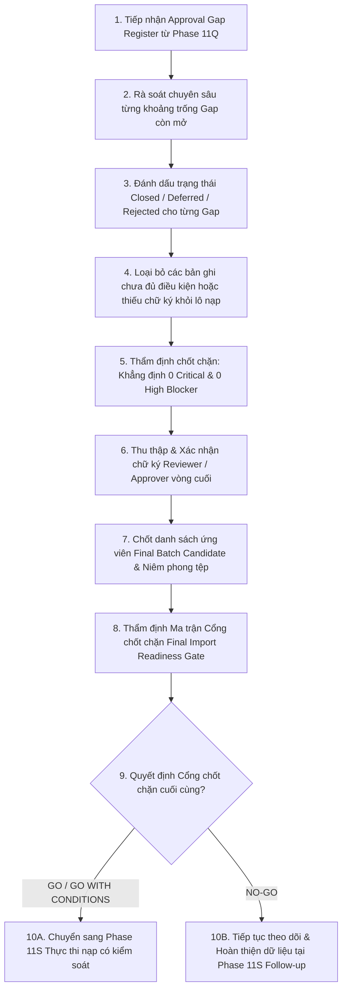

# LEGALFLOW V2 - PHASE 11R
# DATASET APPROVAL FOLLOW-UP ROUND 2 PLAN

## 1. Purpose

Kế hoạch rà soát, theo dõi và phê duyệt bộ dữ liệu tri thức pháp lý vòng 2 (`Dataset Approval Follow-up Round 2 Plan`) được thiết lập tại Phase 11R như một trạm kiểm định chốt chặn cuối cùng trước khi chuyển sang giai đoạn thực thi nạp dữ liệu thật có kiểm soát (`Controlled Real Legal Dataset Import Execution`).  
Mục tiêu cốt lõi của kế hoạch vòng 2 là rà soát triệt để tiến độ đóng các khoảng trống phê duyệt (`Gap Closure Tracking`) còn tồn đọng từ Phase 11Q, thẩm định lại tính toàn vẹn thông tin siêu dữ liệu (`metadata`), xác thực nguồn gốc công báo, đối chiếu chữ ký của Cán bộ nghiệp vụ (`Reviewer`) và Lãnh đạo Vụ Pháp chế (`Approver`), đồng thời ra quyết định chốt chặn cuối cùng (`Final Import Readiness Gate: GO / NO-GO`) trước thời điểm nạp vào cơ sở dữ liệu production.

## 2. Baseline

- **Previous tag:** `v2.11.17-dataset-issue-resolution-approval-followup`
- **Proposed tag:** `v2.11.18-dataset-approval-followup-round2-final-import-gate`
- **Root path:** `C:\Users\Admin\legalflow-docker-uat`
- **Backend path:** `C:\Users\Admin\legalflow-docker-uat\legalflow-backend`
- **Ngày lập kế hoạch:** 12/07/2026

## 3. Round 2 Objective

Phase 11R xác lập 8 mục tiêu kiểm định và phê duyệt tối hậu sau:
1. **Đóng các issue/gap còn lại (`Remaining Issue / Gap Closure`):** Theo dõi sát sao tiến độ giải quyết và đóng chốt (`Closed / Resolved`) các khoảng trống phê duyệt thuộc Sổ theo dõi `GAP-2024-01..05`.
2. **Xác nhận metadata hoàn chỉnh (`Complete Metadata Verification`):** Thẩm định lần cuối bảo đảm 100% bản ghi ứng viên không còn trường thông tin bắt buộc nào bị trống hay sai lệch định dạng (`amends_document`, `replaces_document`, `procedure_code`).
3. **Xác nhận nguồn và hiệu lực (`Source & Legal Status Verification`):** Khẳng định 100% URL dẫn về Cổng TTĐT/Công báo hợp pháp của chính phủ (`.gov.vn`) và tình trạng hiệu lực là `Effective`, loại trừ hoàn toàn các bản ghi `Expired` hay `Unknown`.
4. **Xác nhận Reviewer/Approver (`Reviewer & Approver Sign-off Verification`):** Đối chiếu chữ ký chịu trách nhiệm kỹ thuật (`Reviewed`) từ Cán bộ chuyên trách và chữ ký đồng ý nạp (`Approved`) từ Lãnh đạo Vụ/Phòng Pháp chế.
5. **Xác nhận Risk Note (`Risk Note Verification`):** Kiểm tra nội dung lời nhắc rủi ro nghiệp vụ (`risk_note`), bảo đảm hướng dẫn rõ ràng điều khoản chuyển tiếp và định mức thời gian xử lý SLA cho cán bộ Một cửa.
6. **Xác nhận Batch cuối (`Final Locked Batch Verification`):** Kiểm chứng tính niêm phong toàn vẹn của tệp dữ liệu ứng viên cuối cùng (`Locked Batch Manifest`), bảo đảm không ai được thay đổi nội dung tệp trước giờ nạp.
7. **Quyết định GO/NO-GO trước import (`Final Import Readiness Gate Decision`):** Đánh giá tổng hợp trên ma trận cổng chốt chặn để ra tuyên bố chính thức: `GO TO CONTROLLED REAL IMPORT`, `GO WITH CONDITIONS` hoặc `NO-GO`.
8. **Tuân thủ giới hạn hành động (`No Import Execution in Phase 11R`):** Khẳng định tuyệt đối **KHÔNG THỰC HIỆN IMPORT** hay bất kỳ lệnh ghi cơ sở dữ liệu production nào trong phase rà soát thẩm định vòng 2 này.

## 4. Round 2 Workflow

Quy trình rà soát, đóng khoảng trống thẩm quyền và kiểm định cổng chốt chặn chặng cuối vòng 2 được vận hành qua 10 bước khép kín:

1. **Bước 1 (Tiếp nhận):** Lấy Sổ theo dõi khoảng trống (`Approval Gap Register`) từ Phase 11Q.
2. **Bước 2 (Rà soát chuyên sâu):** Kiểm tra lại từng khoảng trống còn mở (`GAP-2024-01..03`), đánh giá tiến độ bổ sung minh chứng và chữ ký.
3. **Bước 3 (Đánh dấu trạng thái):** Cập nhật trạng thái đóng (`Closed`), hoãn (`Deferred`) hoặc từ chối (`Rejected`) cho từng khoảng trống.
4. **Bước 4 (Bóc tách Lô nạp):** Loại bỏ hoàn toàn các bản ghi chưa đạt tiêu chuẩn hay thiếu chữ ký Lãnh đạo ra khỏi tệp manifest lô nạp ứng viên.
5. **Bước 5 (Kiểm định Blocker):** Thẩm định chốt chặn khẳng định lô dữ liệu ứng viên không còn bất kỳ lỗi `Critical` hay `High` nào.
6. **Bước 6 (Thu thập Chữ ký):** Thu thập và xác nhận chữ ký đồng thuận vòng cuối của Cán bộ rà soát (`Reviewer`) và Lãnh đạo Vụ (`Approver`).
7. **Bước 7 (Chốt & Niêm phong):** Chốt danh sách bản ghi ứng viên cho Lô cuối cùng (`Final Batch Candidate`) và niêm phong mã băm tệp (`MD5/SHA256`).
8. **Bước 8 (Thẩm định Cổng):** Đối chiếu 17 tiêu chí trên Ma trận Cổng độ sẵn sàng nạp (`Final Import Readiness Gate`).
9. **Bước 9 (Ra quyết định):** Chính thức ban hành quyết định chốt chặn chặng cuối (`GO TO CONTROLLED REAL IMPORT`, `GO WITH CONDITIONS` hoặc `NO-GO`).
10. **Bước 10 (Định hướng chuyển tiếp):** Nếu đạt điều kiện (`GO / GO WITH CONDITIONS`), chuyển sang Phase 11S để thực thi nạp vào DB production kèm tường lửa 4 lớp; nếu chưa đạt (`NO-GO`), tiếp tục gia hạn theo dõi bổ sung tại Phase 11S.

## 5. Stop Conditions

Nhằm bảo vệ sự tinh khôi tuyệt đối cho cơ sở dữ liệu `legalflow_prod`, Lãnh đạo dự án và Hội đồng Quản trị Kỹ thuật thiết lập **10 Điều kiện Dừng Khẩn cấp (`Stop Conditions`)**. Cán bộ kỹ thuật (`Technical Operator`) và `ADMIN` **BẮT BUỘC PHẢI DỪNG NGAY LẬP TỨC (`STOP IMMEDIATELY`)** mọi nỗ lực chuyển sang phase import thật nếu phát hiện dù chỉ một trong 10 vi phạm sau:
1. **Còn tồn tại lỗi Critical (`Critical Issue Presence`):** Tệp lô nạp có bản ghi bị gán nhãn `Critical` (văn bản hết hiệu lực hoặc sai lệch căn cứ pháp lý) chưa được loại trừ.
2. **Còn lỗi High chưa xử lý (`Unresolved High Issue`):** Lô nạp còn bản ghi vi phạm lỗi `High` (thiếu chữ ký Lãnh đạo Vụ, trùng lặp số ký hiệu) đang ở trạng thái `Open` hoặc `In Review`.
3. **Bản ghi thiếu nguồn (`Missing / Unverified Source URL`):** Bất kỳ bản ghi nào để trống URL hoặc dẫn về tên miền không phải Cổng TTĐT chính thống của cơ quan hành chính nhà nước (`.gov.vn`).
4. **Tình trạng hiệu lực Unknown (`Unknown Legal Status Presence`):** Tồn tại văn bản có trường `legal_status` bị để `Unknown`, `Unverified` hoặc chưa được kiểm tra công báo mới nhất.
5. **Thiếu chữ ký Reviewer hoặc Approver (`Missing Reviewer / Approver Sign-off`):** Bản ghi chưa có chữ ký xác nhận của Cán bộ nghiệp vụ (`Reviewer`) hoặc chưa có phiếu đồng ý nạp `Approved` của Lãnh đạo Vụ (`Approver`).
6. **Trùng lặp dữ liệu chưa xử lý (`Unresolved Duplicate Presence`):** Kết quả đối chiếu mô phỏng `Validate CSV - Dry Run` phát hiện có dòng trùng lặp số ký hiệu hoặc nội dung với DB production mà chưa được bóc tách.
7. **Phạm vi áp dụng địa bàn chưa rõ (`Ambiguous Local Scope`):** Bản ghi thuộc cấp địa phương nhưng để trống trường `local_applicability` hoặc chưa thống nhất được ranh giới thẩm quyền Một cửa.
8. **Kịch bản sao lưu DB chưa sẵn sàng (`Missing Backup Plan`):** Hệ thống chưa chuẩn bị sẵn kịch bản chạy lệnh `pg_dump` tạo tệp `.sql` lưu trữ an toàn trước thời điểm bấm nút thực thi nạp.
9. **Kịch bản khôi phục chưa rõ ràng (`Ambiguous Rollback Plan`):** Chưa có kịch bản phục hồi khẩn cấp (`DR Playbook`) hoặc đội ngũ trực vận hành chưa sẵn sàng khôi phục DB về trạng thái cũ trong 5 phút.
10. **Chưa tách riêng phê duyệt kích hoạt phiên bản (`Unseparated Active Version Approval`):** Kịch bản nạp có dấu hiệu gộp chung việc nạp dữ liệu với việc tự động kích hoạt phiên bản pháp luật (`noAutoActive: false` hoặc thiếu quy trình họp duyệt Active riêng).
