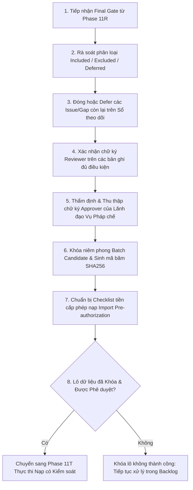

# LEGALFLOW V2 - PHASE 11S
# FINAL BATCH LOCK PLAN

## 1. Purpose

Kế hoạch khóa lô dữ liệu chốt chặn cuối cùng (`Final Batch Lock Plan`) được thiết lập tại Phase 11S nhằm thực thi bước đóng băng kỹ thuật và pháp lý đối với danh mục các bản ghi đủ điều kiện trước khi chuyển sang giai đoạn thực thi nạp dữ liệu thật có kiểm soát (`Controlled Real Legal Dataset Import Execution`).  
Mục tiêu cốt lõi của kế hoạch là niêm phong mã băm (`Locking & Hashing`) tệp lô dữ liệu ứng viên cuối cùng (`Final Batch Candidate`), xác nhận phân định rạch ròi danh sách bản ghi được đưa vào (`Included`), bản ghi bị loại trừ (`Excluded`) và bản ghi được hoãn sang đợt sau (`Deferred`), đồng thời hoàn tất thẩm định rủi ro và các điều kiện tiền cấp phép nạp (`Pre-authorization Checklist`).

## 2. Baseline

- **Previous tag:** `v2.11.18-dataset-approval-followup-round2-final-import-gate`
- **Proposed tag:** `v2.11.19-dataset-approval-followup-round3-final-batch-lock`
- **Root path:** `C:\Users\Admin\legalflow-docker-uat`
- **Backend path:** `C:\Users\Admin\legalflow-docker-uat\legalflow-backend`
- **Ngày lập kế hoạch:** 12/07/2026

## 3. Final Batch Lock Objective

Phase 11S tập trung thực thi 8 mục tiêu kỹ thuật và pháp lý tối hậu sau:
1. **Chốt danh sách bản ghi cuối (`Lock Final Included Records`):** Niêm phong danh sách chính thức các bản ghi đạt chuẩn tinh khôi 100% metadata, có đầy đủ chữ ký rà soát chuyên môn (`Reviewer`) và Lãnh đạo Vụ (`Approver`).
2. **Loại bản ghi chưa đủ điều kiện (`Exclude Non-eligible Records`):** Bóc tách và loại trừ vĩnh viễn (`Excluded / Rejected`) khỏi tệp manifest những bản ghi bị bãi bỏ ngầm hoặc quy hoạch hết thời kỳ áp dụng.
3. **Defer bản ghi chưa rõ (`Defer Pending / Ambiguous Records`):** Chuyển sang danh sách hoãn nạp (`Deferred to Later Batch`) các văn bản luật trung ương và địa phương đang chờ bổ sung công văn phối hợp hoặc chữ ký thẩm định bổ sung.
4. **Xác nhận Reviewer/Approver (`Verify Electronic Sign-offs`):** Đối chiếu và xác thực phiếu ký điện tử đồng thuận của Cán bộ chuyên trách và Lãnh đạo Vụ Pháp chế.
5. **Xác nhận không còn Critical/High blocker (`Confirm Zero Blockers`):** Khẳng định lô dữ liệu đã khóa (`Locked Batch`) hoàn toàn không tồn tại khiếm khuyết hay rủi ro mức `Critical` và `High`.
6. **Xác nhận Backup/Rollback plan (`Verify Disaster Recovery Safeguards`):** Kiểm chứng tính sẵn sàng trực chiến của lệnh `pg_dump` tạo tệp `.sql` sao lưu DB và kịch bản khôi phục khẩn cấp (`DR Playbook`) trong 5 phút.
7. **Xác nhận Import không đồng nghĩa Active version (`Confirm Separation of Duties`):** Quán triệt nguyên tắc tách biệt hành động: việc thực thi nạp (`Import Execution`) chỉ lưu trữ dữ liệu với cờ `noAutoActive: true`; tuyệt đối không đồng nghĩa với việc kích hoạt hay thay thế phiên bản pháp luật đang thi hành (`ACTIVE`).
8. **Tuân thủ giới hạn hành động (`No Import Execution in Phase 11S`):** Khẳng định tuyệt đối **KHÔNG THỰC HIỆN IMPORT** hay bất kỳ lệnh ghi cơ sở dữ liệu production nào trong phase khóa lô dữ liệu này.

## 4. Final Batch Lock Workflow

Quy trình khóa lô dữ liệu chốt chặn vòng 3 và cấp phép tiền thực thi nạp được vận hành qua 8 bước khép kín:

1. **Bước 1 (Tiếp nhận):** Lấy kết quả thẩm định cổng từ Phase 11R (`Final Import Readiness Gate`).
2. **Bước 2 (Phân loại rạch ròi):** Chia danh mục 5 văn bản gốc thành 3 nhóm rạch ròi: `Included` (đủ điều kiện), `Excluded` (bị loại trừ) và `Deferred` (dời đợt sau).
3. **Bước 3 (Đóng/Defer Issue):** Chốt đóng (`Closed`) các khoảng trống đã xong và dời (`Deferred`) các khoảng trống đang rà soát.
4. **Bước 4 (Xác nhận Reviewer):** Kiểm tra chữ ký và phiếu thẩm định kỹ thuật nghiệp vụ `Reviewed / Cleaned`.
5. **Bước 5 (Xác nhận Approver):** Kiểm tra chữ ký phê duyệt đồng ý nạp `Approval Status: Approved` từ Lãnh đạo Vụ Pháp chế.
6. **Bước 6 (Khóa Batch Candidate):** Sinh mã băm SHA256 và niêm phong cấu trúc tệp dữ liệu ứng viên (`Locked Batch Manifest`).
7. **Bước 7 (Checklist Tiền cấp phép):** Hoàn thiện Bảng kiểm tra tiền cấp phép nạp (`Import Pre-authorization Checklist`).
8. **Bước 8 (Chuyển Phase):** Chỉ mở khóa chuyển sang thực thi nạp có kiểm soát tại Phase 11T đối với những lô dữ liệu đã được khóa niêm phong và phê duyệt hợp pháp 100%.

## 5. Stop Conditions

Nhằm thiết lập rào chắn bảo vệ tối thượng cho hệ thống, Lãnh đạo dự án và Hội đồng Quản trị Kỹ thuật quy định **9 Điều kiện Dừng Khẩn cấp (`Stop Conditions`)**. Cán bộ vận hành (`Technical Operator`) và `ADMIN` **BẮT BUỘC PHẢI DỪNG NGAY LẬP TỨC (`STOP IMMEDIATELY`)** mọi thao tác chuyển sang phase import thật nếu phát hiện bất kỳ một trong 9 vi phạm sau:
1. **Final batch chưa locked (`Unlocked Batch Manifest`):** Tệp dữ liệu đầu vào chưa được niêm phong mã băm SHA256 hoặc phát hiện có sự chỉnh sửa nội dung sau thời điểm khóa.
2. **Bản ghi thiếu nguồn (`Missing / Unverified Source URL`):** Bất kỳ dòng dữ liệu nào trong lô bị khuyết URL nguồn hoặc dẫn về tên miền không phải Cổng TTĐT chính thống của cơ quan nhà nước (`.gov.vn`).
3. **Legal status unknown (`Unknown / Expired Legal Status Presence`):** Tồn tại bản ghi có trường `legal_status` bị để `Unknown`, `Unverified` hoặc đã hết hiệu lực thi hành (`Expired`).
4. **Thiếu chữ ký Reviewer (`Missing Reviewer Sign-off`):** Bản ghi chưa được Cán bộ nghiệp vụ chuyên trách thẩm định và ký xác nhận `Reviewed / Cleaned`.
5. **Thiếu chữ ký Approver (`Missing Manager / Approver Sign-off`):** Lô dữ liệu hoặc bản ghi chưa được Lãnh đạo Vụ Pháp chế ký xác nhận phiếu phê duyệt `Approved`.
6. **Critical/High issue chưa xử lý (`Unresolved Critical / High Issue Presence`):** Sổ theo dõi rủi ro hoặc Sổ khiếm khuyết ghi nhận còn lỗi mức `Critical` hay `High` đang mở trên lô ứng viên.
7. **Rollback plan chưa rõ (`Ambiguous Rollback Plan`):** Chưa chuẩn bị sẵn Kịch bản phục hồi khẩn cấp (`DR Playbook`) hoặc đội ngũ trực vận hành chưa sẵn sàng khôi phục DB trong 5 phút.
8. **Backup plan chưa rõ (`Missing Backup Plan`):** Chưa kiểm chứng hoặc chưa thiết lập sẵn kịch bản chạy lệnh `pg_dump` tạo tệp `.sql` lưu trữ an toàn trước giờ bấm nút nạp.
9. **Active version approval chưa tách riêng (`Unseparated Active Version Approval`):** Kịch bản nạp có dấu hiệu tự động kích hoạt phiên bản (`noAutoActive: false`) hoặc thiếu quy trình họp duyệt Active riêng biệt tại UI.
