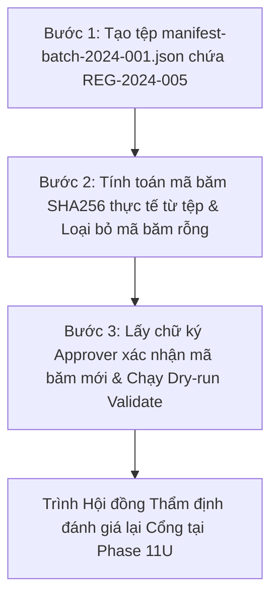

# LEGALFLOW V2 - PHASE 11T
# EVIDENCE CORRECTION BACKLOG

## 1. Purpose

Tài liệu này là Danh sách Tồn đọng Khắc phục Bằng chứng (`Evidence Correction Backlog`) được thiết lập tại Phase 11T ngay sau khi Cổng kiểm định bằng chứng ban hành phán quyết `NO-GO - EVIDENCE INSUFFICIENT`.  
Sổ tồn đọng theo dõi cụ thể 7 hạng mục khiếm khuyết vật lý thực tế (`Physical Evidence Gaps`) cần được bổ sung, chuẩn hóa và niêm phong triệt để, đóng vai trò làm kim chỉ nam hành động cho Cán bộ chuyên môn và Quản trị viên kỹ thuật trong Phase tiếp theo (`Phase 11U: Pilot Batch Evidence Completion`).

## 2. Evidence Correction Backlog Table

*(Tuân thủ nguyên tắc không tự điền tên thật nếu chưa được cung cấp chính thức, hệ thống sử dụng các chức danh chuẩn hóa và mã vai trò nghiệp vụ hợp lệ):*

| Backlog ID | Missing Evidence | Required Action | Owner | Priority | Status | Notes |
| :--- | :--- | :--- | :--- | :---: | :---: | :--- |
| **`EVID-2024-01`** | `manifest-batch-2024-001.json` (hoặc CSV/JSON batch file thật) | Tạo mới và đính kèm tệp manifest định dạng JSON/CSV chính thức cho Lô 01 (`BATCH-2024-001`), chứa đầy đủ 29 cột thông tin siêu dữ liệu chuẩn hóa của bản ghi SOP `REG-2024-005` vào thư mục `docs/` hoặc `data/`. | Specialist A (`STAFF`) | **Critical** | `Open` | Tiền đề vật lý số 1: buộc phải có tệp manifest thực tế trên ổ đĩa mới có thể tính toán mã băm hợp lệ. |
| **`EVID-2024-02`** | `manifest-batch-2024-001.json` Physical Verification | Chạy lệnh xác minh thực tế sự tồn tại của tệp manifest (`Get-ChildItem`), kiểm chứng cấu trúc JSON hợp lệ và đối chiếu không khuyết thông tin trên 29 cột. | Technical Operator (`ADMIN`) | **Critical** | `Open` | Bảo đảm cấu trúc tệp dữ liệu không lỗi cú pháp JSON và không sót trường bắt buộc. |
| **`EVID-2024-03`** | Actual SHA256 Hash from Physical File | Tính toán mã băm SHA256 thực tế từ tệp `manifest-batch-2024-001.json` vừa sinh ra bằng công cụ chuẩn (`sha256sum` hoặc `Get-FileHash`), thay thế hoàn toàn chuỗi mã băm rỗng `e3b0c...`. | Technical Operator (`ADMIN`) | **Critical** | `Open` | Ghi nhận chính xác chuỗi SHA256 thực tế (thường là một chuỗi băm mới 64 ký tự hex hợp lệ) vào báo cáo khóa lô. |
| **`EVID-2024-04`** | Empty-file Hash Elimination | Rà soát toàn bộ tài liệu và hệ thống để triệt tiêu hoàn toàn việc tham chiếu hay sử dụng mã băm `e3b0c44298fc1c149afbf4c8996fb92427ae41e4649b934ca495991b7852b855` (mã băm tệp rỗng). | Specialist A (`STAFF`) | **High** | `Open` | Ngăn chặn rủi ro niêm phong hoặc xác nhận nhầm trên một tệp rỗng 0 bytes. |
| **`EVID-2024-05`** | Hash-linked Approval Evidence | Thu thập chữ ký điện tử phê duyệt bổ sung từ Cán bộ rà soát (`SOP Officer D`) và Lãnh đạo Vụ (`Manager Approver`), xác nhận đồng ý nghiệm thu và nạp pilot đối với **đúng mã băm SHA256 thực tế mới tính toán**. | Manager Approver (`MANAGER`) | **High** | `Open` | Gắn kết chặt chẽ trách nhiệm pháp lý của Lãnh đạo Vụ vào chính tệp manifest thực tế đã được băm. |
| **`EVID-2024-06`** | Physical Batch File Lock & Sealing | Cập nhật lại Sổ ghi nhận Lô dữ liệu đã khóa (`Locked Batch Register`), khóa quyền chỉnh sửa tệp `manifest-batch-2024-001.json` và niêm phong mã băm SHA256 mới. | Technical Operator (`ADMIN`) | **High** | `Open` | Đảm bảo tính bất khả xâm phạm của tệp dữ liệu sau khi được Lãnh đạo ký duyệt mã băm. |
| **`EVID-2024-07`** | Dry-run Validation Before Import | Thực thi lệnh quét `dry-run` hoặc gọi API `validate` trên tệp `manifest-batch-2024-001.json` thực tế, ghi nhận biên bản kiểm tra đạt `100% Valid`, `0 Critical`, `0 High`, `0 Duplicate`. | Specialist A (`STAFF`) | **High** | `Open` | Kiểm chứng độ chín muồi và độ sạch thực tế của tệp dữ liệu trước khi trình Hội đồng phán quyết lại. |

## 3. Backlog Execution Strategy

Để bảo đảm tiến độ khắc phục thần tốc và an toàn tuyệt đối, Sổ tồn đọng quy định chiến lược thực thi 3 bước tuần tự tại **Phase 11U**:

- **Bước 1 (Vật lý hóa Manifest):** Cán bộ chuẩn hóa tạo tệp `manifest-batch-2024-001.json` chuẩn chỉnh với bản ghi `REG-2024-005`.
- **Bước 2 (Tính toán & Niêm phong Băm):** Quản trị viên chạy lệnh tính SHA256 thật, loại bỏ mã băm rỗng `e3b0c...` và niêm phong tệp.
- **Bước 3 (Thẩm định & Dry-run):** Lãnh đạo Vụ Pháp chế ký duyệt trên mã băm mới, đồng thời chạy API validate khẳng định tệp đạt chuẩn 100%.

## 4. Gate Re-evaluation Condition

> [!IMPORTANT]
> **ĐIỀU KIỆN TÁI THẨM ĐỊNH CỔNG NẠP PILOT (RE-EVALUATION GATE CONDITION):**  
> Hội đồng Quản trị Kỹ thuật chỉ mở phiên họp tái thẩm định Cổng quyết định nạp Pilot (`Pilot Import Gate Re-evaluation`) tại **Phase 11U** khi và chỉ khi 100% các hạng mục tồn đọng `EVID-2024-01..07` trên bảng backlog được xử lý hoàn tất và chuyển trạng thái sang `Closed / Verified`.  
> Mọi nỗ lực thúc ép chuyển sang thực thi nạp (`Phase 11V/Phase 11T Execution`) khi Sổ tồn đọng này vẫn còn hạng mục ở trạng thái `Open` đều bị coi là vi phạm kỷ luật vận hành và sẽ bị tường lửa hệ thống chặn đứng tuyệt đối.
