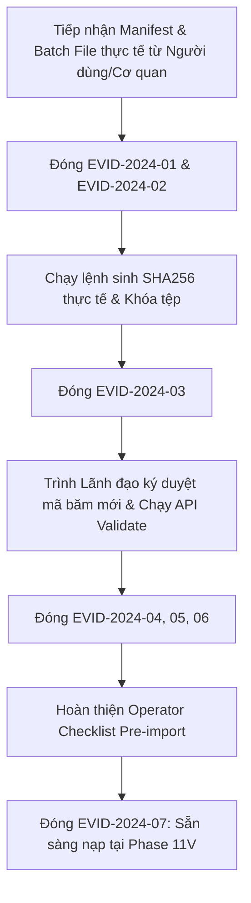

# LEGALFLOW V2 - PHASE 11U
# EVIDENCE COMPLETION BACKLOG

## 1. Purpose

Tài liệu này là Danh sách Tồn đọng Hoàn thiện Bằng chứng Lô Pilot (`Evidence Completion Backlog`) được lập tại Phase 11U nhằm hệ thống hóa và theo dõi chặt chẽ tiến độ giải quyết 7 hạng mục chứng cứ thực tế còn khuyết hoặc cần bổ sung đối với Lô mẫu số 01 (`BATCH-2024-001`).  
Sổ tồn đọng làm rõ trách nhiệm, mức độ ưu tiên và đặc biệt quy định trạng thái chốt chặn nạp (`Blocks Import: Yes`), khẳng định bất kỳ hạng mục nào trong 7 tiêu chí dưới đây chưa chuyển sang trạng thái hoàn thành (`Closed / Verified`) thì hệ thống sẽ tự động khóa cứng lệnh nạp, bảo đảm không có bất kỳ thao tác nạp chui hay nạp thiếu bằng chứng nào lọt vào cơ sở dữ liệu production.

## 2. Evidence Completion Backlog Table

*(Tuân thủ nguyên tắc không tự điền tên thật nếu chưa được cung cấp chính thức, hệ thống sử dụng các chức danh chuẩn hóa và mã vai trò nghiệp vụ hợp lệ):*

| Backlog ID | Missing Evidence | Required Action | Owner | Priority | Status | Blocks Import: Yes / No | Notes |
| :--- | :--- | :--- | :--- | :---: | :---: | :---: | :--- |
| **`EVID-2024-01`** | **missing real batch file** | Tiếp nhận tệp lô dữ liệu đầu vào thực tế (`BATCH-2024-001.csv` hoặc `.json`) chứa đầy đủ nội dung 29 cột chuẩn hóa của bản ghi SOP `REG-2024-005` từ người dùng hoặc cơ quan quản lý và đặt vào thư mục `docs/` hoặc `data/`. | Specialist A (`STAFF`) | **Critical** | `Open` | **Yes** | Tiền đề vật lý số 1: buộc phải có tệp lô dữ liệu thực tế trên ổ đĩa mới có nguyên liệu để nạp. |
| **`EVID-2024-02`** | **missing manifest file** | Tiếp nhận hoặc cấu trúc tệp cấu hình chính thức `manifest-batch-2024-001.json` quy định thông số lô (`totalRecords: 1`), cấu trúc định dạng JSON hợp lệ và khóa chỉ đọc. | Specialist A (`STAFF`) | **Critical** | `Open` | **Yes** | AI chỉ hỗ trợ hướng dẫn cấu trúc; tuyệt đối không tự tạo tệp manifest giả lập khi chưa có nguồn thật. |
| **`EVID-2024-03`** | **missing real SHA256** | Chạy lệnh băm thực tế (`Get-FileHash` hoặc `sha256sum`) trên chính tệp `manifest-batch-2024-001.json` vừa tiếp nhận để sinh chuỗi SHA256 64 ký tự hex hợp lệ; triệt tiêu hoàn toàn mã băm rỗng `e3b0c...`. | Technical Operator (`ADMIN`) | **Critical** | `Open` | **Yes** | Ngăn chặn rủi ro niêm phong và ký duyệt nhầm trên một tệp rỗng 0 bytes hoặc tệp bị biến đổi. |
| **`EVID-2024-04`** | **missing approval evidence** | Thu thập chữ ký xác nhận bằng văn bản hoặc chữ ký số hợp pháp từ Cán bộ rà soát (`SOP Officer D`) và Lãnh đạo Vụ (`Manager Approver`), khẳng định đồng ý nghiệm thu trên **đúng mã băm SHA256 thực tế mới tính toán**. | Manager Approver (`MANAGER`) | **High** | `Open` | **Yes** | Gắn kết chặt chẽ trách nhiệm pháp lý cao nhất của Lãnh đạo Vụ vào chính tệp manifest thực tế đã được băm. |
| **`EVID-2024-05`** | **missing source evidence** | Đính kèm các liên kết rà soát nguồn chính thức (`sotnmt.tinhx.gov.vn`) và chỉ mục tệp PDF toàn văn trên MinIO vào ngay bên trong tệp siêu dữ liệu manifest của Lô 01. | SOP Officer D (`STAFF`) | **High** | `Open` | **Yes** | Bảo đảm khả năng truy xuất nguồn gốc nhanh chóng từ API Backend và Frontend UI. |
| **`EVID-2024-06`** | **missing validation result** | Thực thi lệnh quét kiểm tra thử `dry-run` hoặc gọi API `POST /import/validate` trên tệp `manifest-batch-2024-001.json` thực tế, ghi nhận kết quả đạt `100% Valid`, `0 Critical Errors`, `0 Duplicate Warnings`. | Specialist A (`STAFF`) | **High** | `Open` | **Yes** | Kiểm chứng độ chín muồi và độ sạch siêu dữ liệu của tệp thực tế trước khi bấm nút nạp vào DB. |
| **`EVID-2024-07`** | **missing final operator checklist** | Hoàn thiện biên bản rà soát trước nạp của Cán bộ vận hành (`Operator Pre-import Checklist`), xác nhận sẵn sàng kịch bản sao lưu `pg_dump`, cấu hình `Reason`, `Confirmation Text` và cờ `noAutoActive: true`. | Technical Operator (`ADMIN`) | **High** | `Open` | **Yes** | Bảo đảm toàn bộ tường lửa kỹ thuật 4 lớp đã ở trạng thái trực chiến trước giờ G. |

## 3. Backlog Blocker Summary & Execution Strategy

Như được phản ánh trên bảng Sổ tồn đọng, **100% (7 / 7) các hạng mục khuyết bằng chứng hiện tại đều có cờ chốt chặn nạp là `Blocks Import: Yes`**.  
Điều này có nghĩa là mọi nỗ lực thực thi nạp dữ liệu tại thời điểm này (`Phase 11U`) đều là hành vi trái quy định và bị hệ thống cấm tuyệt đối (`Import Execution Strictly Prohibited`).

### Chiến lược thực thi tiếp nhận và đóng tồn đọng (`Intake & Closure Strategy`):

## 4. Exit Criteria for Phase 11U & Gate to Phase 11V

> [!IMPORTANT]
> **ĐIỀU KIỆN HOÀN TẤT PHASE 11U VÀ THĂNG CẤP SANG PHASE 11V (`EXIT CRITERIA & GATE TO PHASE 11V`):**  
> Phase 11U chỉ được coi là hoàn tất nhiệm vụ và cho phép chuyển trạng thái sang **`Phase 11V: Controlled Pilot Import Execution Readiness`** khi toàn bộ 7 hạng mục tồn đọng `EVID-2024-01..07` trên bảng Sổ tồn đọng được người dùng/cơ quan hành chính nhà nước cung cấp đầy đủ và chuyển trạng thái thành công sang `Closed / Verified` (`Blocks Import: No`).  
> Trong trường hợp người dùng cần thời gian thu thập và chuẩn bị tệp dữ liệu, hệ thống duy trì ở trạng thái chờ tiếp nhận tại **`Phase 11V: User-provided Pilot Batch Artifact Intake`**, bảo toàn nguyên trạng và an toàn tuyệt đối 100% cho cơ sở dữ liệu `legalflow_prod`.
