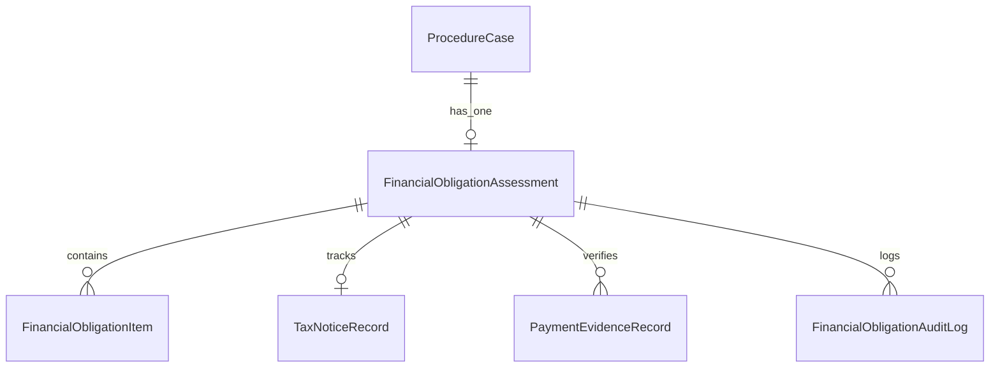

# LEGALFLOW V2 - PHASE 12A
# FINANCIAL OBLIGATION DATA MODEL DRAFT

## 1. Purpose

Tài liệu này phác thảo Kiến trúc Mô hình Dữ liệu Dự kiến (`Draft Data Model Specification`) phục vụ cho Module "Hỗ trợ nghĩa vụ tài chính" trong hệ thống LegalFlow V2.  
> [!IMPORTANT]
> **CAM KẾT AN TOÀN TUYỆT ĐỐI (`ZERO SCHEMA MODIFICATION`):**  
> Đây là tài liệu thiết kế khái niệm và chuẩn bị cấu trúc nghiệp vụ (`Draft specification only`). Trong Phase 12A, hệ thống **TUYỆT ĐỐI KHÔNG CHỈNH SỬA TỆP `schema.prisma`**, **KHÔNG TẠO MIGRATION** (`No Prisma Migration`), **KHÔNG CHẠY `prisma db push/seed`** và không can thiệp vào cấu trúc cơ sở dữ liệu production hiện hữu. Các thực thể dưới đây sẽ chỉ được xem xét lập trình thực tế tại Phase 12C sau khi thông qua Kế hoạch API tại Phase 12B.

---

## 2. Proposed Entities (Conceptual Schema Specification)

Mô hình dữ liệu của Module được cấu trúc thành 5 thực thể chính kết nối chặt chẽ với Hồ sơ thủ tục hành chính đất đai (`ProcedureCase`):

### 1. `FinancialObligationAssessment` *(Thực thể trung tâm Đánh giá Nghĩa vụ tài chính)*
Lưu trữ toàn bộ trạng thái tổng thể, số tiền dự kiến, số tiền chính thức và thẻ kiểm soát an toàn của hồ sơ.

| Field Name | Type | Constraints / Attributes | Description |
| :--- | :--- | :--- | :--- |
| `id` | `UUID` | `@id @default(uuid())` | Khóa chính duy nhất định danh phiên đánh giá nghĩa vụ tài chính. |
| `caseId` | `UUID` | `@unique @relation(ProcedureCase)` | Khóa ngoại liên kết 1-1 với hồ sơ thủ tục đất đai đang thụ lý. |
| `procedureType` | `String` | `@db.VarChar(50)` | Nhóm thủ tục nghiệp vụ (`FIRST_TIME_ISSUANCE`, `LAND_USE_CHANGE`...). |
| `assessmentStatus` | `String` | `@db.VarChar(50)` | Trạng thái hiện tại trong 13 mức (`Not Started`, `Estimated`, `Completed`...). |
| `assessmentMode` | `String` | `@db.VarChar(30)` | Chế độ rà soát (`Manual`, `AI Assisted`, `Imported Tax Notice`). |
| `estimatedTotalAmount` | `Decimal` | `@db.Decimal(18, 2) @default(0)` | Tổng số tiền dự kiến do AI/Hệ thống tính tham khảo (`VNĐ`). |
| `officialTotalAmount` | `Decimal?` | `@db.Decimal(18, 2)` | Tổng số tiền chính thức phải nộp ghi nhận từ Thông báo của Cơ quan Thuế. |
| `currency` | `String` | `@default("VND") @db.VarChar(10)` | Đơn vị tiền tệ. |
| `isEstimate` | `Boolean` | `@default(true)` | Cờ chỉ định: `true` = Chỉ là con số dự kiến; `false` = Đã có số chính thức. |
| `taxNoticeStatus` | `String` | `@db.VarChar(50) @default("None")` | Trạng thái theo dõi Thông báo thuế (`Awaiting`, `Received`, `Verified`). |
| `paymentStatus` | `String` | `@db.VarChar(50) @default("Pending")` | Trạng thái theo dõi nộp tiền (`Pending`, `Partial`, `Paid Full`, `Verified`). |
| `officerReviewStatus` | `String` | `@db.VarChar(50) @default("Unverified")` | Trạng thái thẩm định của Cán bộ thụ lý (`Unverified`, `Officer Verified`). |
| `managerReviewStatus` | `String` | `@db.VarChar(50) @default("Not Required")` | Trạng thái phê chuẩn của Lãnh đạo (`Not Required`, `Pending`, `Manager Verified`). |
| `riskLevel` | `String` | `@db.VarChar(20) @default("Low")` | Mức độ rủi ro pháp lý (`Low`, `Medium`, `High`, `Critical`). |
| `warningText` | `String?` | `@db.Text` | Nội dung thẻ cảnh báo rủi ro (thiếu mốc thời gian, chênh lệch số tiền...). |
| `createdById` | `UUID` | `@relation(User)` | Cán bộ khởi tạo tab nghĩa vụ tài chính. |
| `reviewedById` | `UUID?` | `@relation(User)` | Cán bộ thụ lý thực hiện xác nhận đối chiếu chứng từ (`STAFF`). |
| `approvedById` | `UUID?` | `@relation(User)` | Lãnh đạo thực hiện phê chuẩn chốt hồ sơ (`MANAGER`). |
| `createdAt` | `DateTime` | `@default(now())` | Thời điểm tạo bản ghi. |
| `updatedAt` | `DateTime` | `@updatedAt` | Thời điểm cập nhật cuối cùng. |

### 2. `FinancialObligationItem` *(Thực thể Khoản mục Nghĩa vụ tài chính Chi tiết)*
Lưu trữ từng khoản mục phải nộp chi tiết (Tiền sử dụng đất, Trước bạ, Phí thẩm định...).

| Field Name | Type | Constraints / Attributes | Description |
| :--- | :--- | :--- | :--- |
| `id` | `UUID` | `@id @default(uuid())` | Khóa chính khoản mục nghĩa vụ tài chính. |
| `assessmentId` | `UUID` | `@relation(FinancialObligationAssessment)` | Khóa ngoại liên kết về Phiên đánh giá tổng thể. |
| `itemType` | `String` | `@db.VarChar(50)` | Mã loại khoản mục (`LAND_USE_FEE`, `REGISTRATION_FEE`, `APPRAISAL_FEE`...). |
| `itemLabel` | `String` | `@db.VarChar(255)` | Tên hiển thị nghiệp vụ (Ví dụ: "Tiền sử dụng đất chênh lệch khi chuyển ONT"). |
| `estimatedAmount` | `Decimal` | `@db.Decimal(18, 2) @default(0)` | Số tiền dự kiến của khoản mục do AI tính toán tham khảo (`VNĐ`). |
| `officialAmount` | `Decimal?` | `@db.Decimal(18, 2)` | Số tiền chính thức phải nộp của khoản mục lấy từ Thông báo thuế. |
| `calculationBasis` | `String?` | `@db.Text` | Công thức / thông số chiết tính (Ví dụ: `150m2 * 12.000.000 VNĐ * K=1.2 * 50%`). |
| `legalBasis` | `String?` | `@db.Text` | Căn cứ pháp lý áp dụng (Ví dụ: `Điều 108 Luật Đất đai 2024; Nghị định 103/2024/NĐ-CP`). |
| `dataSource` | `String` | `@db.VarChar(50)` | Nguồn gốc dữ liệu (`System Price Table`, `AI Estimation`, `Tax Authority Notice`). |
| `confidenceLevel` | `Float` | `@default(1.0)` | Độ tin cậy của con số chiết tính AI (`0.0` đến `1.0`). |
| `isOfficial` | `Boolean` | `@default(false)` | Cờ xác nhận con số lấy từ nguồn chính thức (`true`) hay dự kiến (`false`). |
| `notes` | `String?` | `@db.Text` | Ghi chú bổ sung của cán bộ về khoản mục. |

### 3. `TaxNoticeRecord` *(Thực thể Theo dõi Thông báo Thuế chính thức)*
Lưu trữ thông tin và tệp đính kèm Thông báo nộp tiền do Cơ quan Thuế phát hành.

| Field Name | Type | Constraints / Attributes | Description |
| :--- | :--- | :--- | :--- |
| `id` | `UUID` | `@id @default(uuid())` | Khóa chính bản ghi Thông báo thuế. |
| `assessmentId` | `UUID` | `@unique @relation(FinancialObligationAssessment)` | Khóa ngoại liên kết 1-1 về Phiên đánh giá nghĩa vụ tài chính. |
| `noticeNumber` | `String` | `@db.VarChar(100)` | Số hiệu văn bản Thông báo nộp tiền (Ví dụ: `123/TB-CCT`). |
| `issuingAuthority` | `String` | `@db.VarChar(255)` | Tên cơ quan thuế ban hành (Ví dụ: `Chi cục Thuế Khu vực X`). |
| `issueDate` | `DateTime` | `@db.Date` | Ngày ban hành ghi trên Thông báo thuế. |
| `receivedDate` | `DateTime` | `@db.Date` | Ngày Một cửa / Cán bộ tiếp nhận Thông báo từ Cơ quan Thuế. |
| `totalAmount` | `Decimal` | `@db.Decimal(18, 2)` | Tổng số tiền chính thức yêu cầu nộp trên Thông báo thuế (`VNĐ`). |
| `fileAttachmentId` | `String` | `@db.VarChar(255)` | ID tệp PDF toàn văn Thông báo thuế lưu trữ trên MinIO Storage. |
| `verifiedById` | `UUID?` | `@relation(User)` | Cán bộ thụ lý đã thẩm tra tính hợp lệ của tệp Thông báo thuế. |
| `verifiedAt` | `DateTime?` | | Thời điểm cán bộ bấm xác nhận thẩm tra. |
| `notes` | `String?` | `@db.Text` | Ghi chú đối chiếu thông báo thuế. |

### 4. `PaymentEvidenceRecord` *(Thực thể Theo dõi Chứng từ Nộp tiền)*
Lưu trữ danh sách biên lai, giấy nộp tiền vào ngân sách nhà nước của công dân.

| Field Name | Type | Constraints / Attributes | Description |
| :--- | :--- | :--- | :--- |
| `id` | `UUID` | `@id @default(uuid())` | Khóa chính bản ghi Chứng từ nộp tiền. |
| `assessmentId` | `UUID` | `@relation(FinancialObligationAssessment)` | Khóa ngoại liên kết về Phiên đánh giá nghĩa vụ tài chính. |
| `paymentDate` | `DateTime` | `@db.Date` | Ngày nộp tiền thực tế ghi trên chứng từ/biên lai. |
| `amountPaid` | `Decimal` | `@db.Decimal(18, 2)` | Số tiền thực tế công dân đã nộp (`VNĐ`). |
| `payerName` | `String` | `@db.VarChar(255)` | Tên người nộp tiền ghi trên biên lai (đối chiếu với `landOwnerName`). |
| `receiptNumber` | `String` | `@db.VarChar(100)` | Số hiệu biên lai / Giấy nộp tiền (Ví dụ: `Giấy nộp tiền số 456/KBNN`). |
| `treasuryOrBank` | `String` | `@db.VarChar(255)` | Tên Kho bạc Nhà nước hoặc Ngân hàng thương mại thụ hưởng/thu hộ. |
| `fileAttachmentId` | `String` | `@db.VarChar(255)` | ID tệp hình ảnh/PDF bản scan chứng từ nộp tiền lưu trên MinIO Storage. |
| `verifiedById` | `UUID?` | `@relation(User)` | Cán bộ đã thẩm tra, đối chiếu chứng từ gốc hợp lệ (`Officer Verified`). |
| `verifiedAt` | `DateTime?` | | Thời điểm cán bộ chốt xác nhận chứng từ nộp tiền. |
| `notes` | `String?` | `@db.Text` | Ghi chú đối chiếu biên lai (nếu nộp nhiều lần hoặc có nộp thừa/thiếu). |

### 5. `FinancialObligationAuditLog` *(Thực thể Sổ Nhật ký Kiểm toán Bất biến)*
Lưu log toàn bộ vòng đời tác động vào module nghĩa vụ tài chính.

| Field Name | Type | Constraints / Attributes | Description |
| :--- | :--- | :--- | :--- |
| `id` | `UUID` | `@id @default(uuid())` | Khóa chính bản ghi log kiểm toán. |
| `assessmentId` | `UUID` | `@relation(FinancialObligationAssessment)` | Khóa ngoại liên kết phiên đánh giá nghĩa vụ tài chính. |
| `actorId` | `UUID` | `@relation(User)` | ID người dùng hoặc ID Hệ thống thực hiện thao tác. |
| `action` | `String` | `@db.VarChar(100)` | Mã hành động (`ai_suggestion_generated`, `officer_verified`, `tax_notice_uploaded`...). |
| `beforeValue` | `String?` | `@db.Text` | Trạng thái hoặc giá trị trước khi thay đổi (JSON snapshot). |
| `afterValue` | `String?` | `@db.Text` | Trạng thái hoặc giá trị sau khi thay đổi (JSON snapshot). |
| `reason` | `String?` | `@db.Text` | Lý do thay đổi hoặc ghi chú nghiệp vụ. |
| `createdAt` | `DateTime` | `@default(now())` | Thời điểm chính xác xảy ra sự kiện kiểm toán. |

---

## 3. Important Design Rules

Để kiến trúc dữ liệu trên tuân thủ nghiêm ngặt 19 rào chắn an toàn của hệ thống LegalFlow V2, 5 nguyên tắc thiết kế bất khả xâm phạm (`Absolute Architectural Design Rules`) được thiết lập:

1. **`estimatedAmount` tuyệt đối không bằng `officialAmount` (`Absolute Value Segregation Rule`):**  
   Trường `estimatedAmount` và `estimatedTotalAmount` được thiết kế chỉ chứa con số chiết tính tham khảo của AI/Hệ thống. Hệ thống **TUYỆT ĐỐI CẤM** việc tự động sao chép (`auto-copy`) hoặc gán `officialAmount = estimatedAmount` trong bất kỳ luồng xử lý tự động nào.
2. **`officialAmount` chỉ được nhập từ Thông báo / Chứng từ chính thức (`Strict Official Source Rule`):**  
   Trường `officialAmount` và `officialTotalAmount` chỉ có thể được cập nhật giá trị khi và chỉ khi Cán bộ (`STAFF`) hoặc Lãnh đạo (`MANAGER`) thực hiện thao tác nhập liệu thủ công đồng thời với việc tải lên tệp đính kèm Thông báo thuế (`TaxNoticeRecord`) hoặc Chứng từ hợp lệ (`PaymentEvidenceRecord`).
3. **AI chỉ được tạo Suggestion (`AI Suggestion Constraint`):**  
   Khi AI thực hiện tính toán, hệ thống chỉ cho phép tạo hoặc cập nhật các bản ghi `FinancialObligationItem` với cờ `isOfficial = false`, `dataSource = "AI Estimation"`, và `assessmentStatus = "Estimated"`. AI bị chặn truy cập ghi lên các trường `officialAmount`, `verifiedById`, và `approvedById`.
4. **`Completed` bắt buộc phải có `Officer Verification` (`Mandatory Officer Verification Gate`):**  
   Trạng thái `assessmentStatus` tuyệt đối không thể chuyển thành `Completed` nếu cờ `officerReviewStatus != "Officer Verified"` và cờ `isEstimate == true`. Cán bộ thụ lý con người là chốt chặn pháp lý bắt buộc phải xác nhận.
5. **`Manager Verification` bắt buộc đối với ca Rủi ro cao (`High-Risk Manager Sign-off Gate`):**  
   Đối với các hồ sơ có biến trường `riskLevel IN ("High", "Critical")`, hoặc có xin miễn/giảm (`exemptionType != None`), hệ thống tự động khóa trạng thái hoàn thành và bắt buộc phải có chữ ký xác nhận `managerReviewStatus = "Manager Verified"` từ Lãnh đạo (`MANAGER`).
