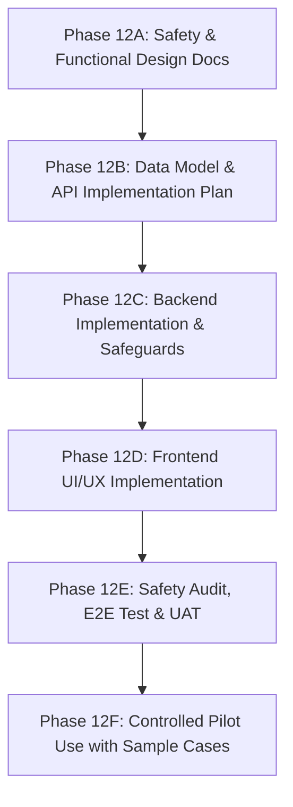

# LEGALFLOW V2 - PHASE 12A
# FINANCIAL OBLIGATION SUPPORT MODULE DESIGN PLAN

## 1. Purpose

Thiết kế module hỗ trợ nghĩa vụ tài chính (`Financial Obligation Support Module`) cho hồ sơ thủ tục hành chính đất đai. Tài liệu này xác lập khung kiến trúc nghiệp vụ, mục tiêu hỗ trợ, giới hạn an toàn tuyệt đối và lộ trình phát triển module, bảo đảm cung cấp công cụ trợ lý đắc lực cho cán bộ thụ lý hồ sơ đất đai mà vẫn giữ vững nguyên tắc không thay thế thẩm quyền của cơ quan thuế hay cán bộ nhà nước.

## 2. Baseline

- **Previous tag:** `v2.11.21-pilot-batch-evidence-completion`
- **Proposed tag:** `v2.12.0-financial-obligation-support-design`
- **Root path:** `C:\Users\Admin\legalflow-docker-uat`
- **Backend path:** `C:\Users\Admin\legalflow-docker-uat\legalflow-backend`
- **Ngày thiết kế:** 12/07/2026

## 3. Module Objective

Module “Hỗ trợ nghĩa vụ tài chính” được thiết kế nhằm phục vụ các mục tiêu nghiệp vụ cốt lõi sau (`Core Module Objectives`):
1. **Hỗ trợ cán bộ rà soát nghĩa vụ tài chính (`Officer Review Support`):** Cung cấp giao diện trực quan giúp cán bộ chuyên môn kiểm tra nhanh chóng tình trạng nghĩa vụ tài chính phát sinh theo từng loại thủ tục đất đai.
2. **Xác định thông tin đầu vào còn thiếu (`Missing Input Identification`):** Tự động rà soát hồ sơ và hiển thị checklist các thông tin còn thiếu (như nguồn gốc đất, thời điểm sử dụng đất, mục đích sử dụng, diện tích, thông tin chủ sử dụng) cần bổ sung để xác định nghĩa vụ tài chính.
3. **Phân loại khoản nghĩa vụ có thể phát sinh (`Obligation Classification`):** Phân tích nghiệp vụ hồ sơ để đưa ra gợi ý các khoản phải nộp tiềm năng (tiền sử dụng đất, tiền thuê đất, thuế thu nhập cá nhân từ chuyển nhượng BĐS, lệ phí trước bạ, phí thẩm định hồ sơ, lệ phí cấp GCN).
4. **Hỗ trợ tính dự kiến nhưng không kết luận chính thức (`Estimated Calculation Support`):** Hỗ trợ ước tính số tiền dự kiến mang tính chất tham khảo dựa trên bảng giá đất và quy định hiện hành, tuyệt đối không kết luận chính thức thay cơ quan thuế.
5. **Theo dõi thông báo thuế (`Tax Notice Tracking`):** Quản lý trạng thái tiếp nhận, số hiệu, ngày phát hành và tệp đính kèm của thông báo nộp tiền chính thức do Cơ quan Thuế ban hành.
6. **Theo dõi chứng từ nộp tiền (`Payment Evidence Tracking`):** Ghi nhận trạng thái nộp tiền, số chứng từ, ngày nộp, kho bạc/ngân hàng thụ hưởng và chứng từ nộp tiền thực tế của người sử dụng đất.
7. **Cảnh báo rủi ro (`Risk Warning generation`):** Tự động phát hiện và cảnh báo các rủi ro pháp lý như hồ sơ thiếu thông tin nguồn gốc, diện tích vượt hạn mức, chưa có xác nhận miễn/giảm hợp lệ hoặc sai lệch giữa số tiền thông báo và chứng từ nộp.
8. **Lưu vết kiểm tra (`Comprehensive Audit Trail`):** Ghi log bất biến toàn bộ các thao tác gợi ý của AI, chỉnh sửa của cán bộ, xác nhận của lãnh đạo và việc tải lên thông báo thuế/chứng từ nộp tiền.

## 4. Out of Scope

Toàn bộ các hành vi sau đây nằm ngoài phạm vi chức năng của module và bị cấm tuyệt đối (`Strictly Out of Scope & Prohibited Actions`):
- **Không thay thế cơ quan thuế (`No Replacement of Tax Authority`):** Hệ thống không có thẩm quyền ban hành hay thay thế kết luận, quyết định của Cơ quan Thuế.
- **Không phát hành thông báo nộp tiền (`No Tax Notice Issuance`):** Không tự động tạo hay in ra "Thông báo nộp tiền nghĩa vụ tài chính chính thức" gửi cho công dân.
- **Không kết luận số tiền chính thức (`No Official Amount Determination`):** Các con số do AI/Hệ thống tính toán chỉ có giá trị `Estimated` (Dự kiến); số tiền chính thức (`Official Amount`) bắt buộc phải được lấy từ Thông báo của Cơ quan Thuế.
- **Không tự miễn/giảm (`No Automatic Tax Exemption/Reduction`):** Hệ thống không tự ý quyết định miễn, giảm hay ghi nợ tiền sử dụng đất/thuế khi chưa có quyết định phê duyệt hợp pháp của cơ quan có thẩm quyền.
- **Không tự đánh dấu hoàn thành nghĩa vụ (`No Auto-completion of Obligations`):** Hệ thống cấm AI hoặc tự động hóa chuyển trạng thái hồ sơ sang "Đã hoàn thành nghĩa vụ tài chính" nếu chưa có sự đối chiếu chứng từ thực tế và xác nhận (`Officer Verification`) của cán bộ.
- **Không tự active legal version (`No Auto-activation of Legal Versions`):** Không tác động hay tự động kích hoạt các phiên bản văn bản pháp luật quy định giá đất/thuế.
- **Không tự gửi thông báo cho công dân (`No Direct Citizen Messaging`):** Không tự ý gửi email, SMS, hay tin nhắn Zalo về số tiền phải nộp hoặc kết quả nghĩa vụ tài chính trực tiếp cho công dân khi chưa qua luồng xét duyệt chính thức.

## 5. Safety Banner

Bắt buộc mọi giao diện hiển thị, tài liệu xuất báo cáo và tab nghiệp vụ của Module "Hỗ trợ nghĩa vụ tài chính" phải niêm yết rõ ràng Banner cảnh báo an toàn sau ở vị trí cao nhất:

> [!CAUTION]
> **KẾT QUẢ HỖ TRỢ NGHĨA VỤ TÀI CHÍNH CHỈ LÀ DỰ KIẾN. CÁN BỘ PHẢI KIỂM TRA HỒ SƠ, CĂN CỨ PHÁP LÝ, BẢNG GIÁ ĐẤT, THÔNG BÁO CỦA CƠ QUAN THUẾ VÀ CHỨNG TỪ THỰC TẾ TRƯỚC KHI SỬ DỤNG. HỆ THỐNG KHÔNG THAY THẾ CƠ QUAN THUẾ.**

## 6. Recommended Phasing

Lộ trình phát triển và triển khai Module "Hỗ trợ nghĩa vụ tài chính" được chia thành 6 giai đoạn kiểm soát chặt chẽ (`Recommended Phasing`):

- **Phase 12A (Hiện tại):** Thiết kế an toàn nghiệp vụ, tài liệu yêu cầu, quy trình làm việc, mô hình dữ liệu dự kiến và đặc tả UI/UX (`Documentation only, Zero code modification`).
- **Phase 12B:** Chuẩn bị kế hoạch chi tiết triển khai mô hình dữ liệu (`Prisma Schema`) và hợp đồng API (`API Contracts`).
- **Phase 12C:** Lập trình Backend (NestJS), thiết lập các DTO, Service, Controller và các rào chắn kỹ thuật (`Blocking Interceptors & Guardrails`).
- **Phase 12D:** Xây dựng giao diện Frontend (React/Vite), tích hợp Tab “Nghĩa vụ tài chính”, Safety Banner và các bảng theo dõi chứng từ.
- **Phase 12E:** Kiểm định an toàn toàn diện (`Safety Audit`), chạy kịch bản kiểm thử tự động E2E và nghiệm thu người dùng (`UAT`).
- **Phase 12F:** Đưa module vào thí nghiệm chạy rà soát có kiểm soát (`Controlled Pilot Use`) trên các hồ sơ mẫu để đánh giá thực tế trước khi áp dụng đại trà.
