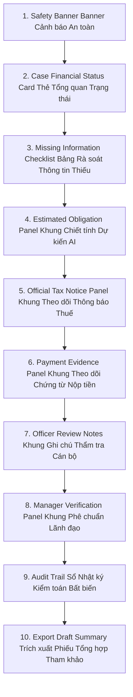

# LEGALFLOW V2 - PHASE 12A
# FINANCIAL OBLIGATION UI/UX SPEC

## 1. Purpose

Tài liệu Đặc tả Giao diện và Trải nghiệm Người dùng (`UI/UX Specification`) này xác lập cấu trúc bố cục, danh mục các bảng biểu hiển thị, quy tắc tương tác nút bấm và các trạng thái rỗng (`Empty States`) cho tab “Nghĩa vụ tài chính” trong hệ thống LegalFlow V2.  
Mục tiêu thiết kế là tạo ra một không gian làm việc trực quan, khoa học giúp cán bộ thụ lý dễ dàng đối chiếu dữ liệu, nắm bắt nhanh các cảnh báo rủi ro pháp lý và quản lý chứng từ nộp thuế mà không bị nhầm lẫn giữa con số dự kiến do AI gợi ý và số tiền chính thức do Cơ quan Thuế ban hành.

---

## 2. UI Placement

Tab “Nghĩa vụ tài chính” (`Financial Obligation Tab`) được thiết kế tích hợp linh hoạt tại 3 vị trí chiến lược trên giao diện người dùng (`UI Placement Options`):
1. **Trong màn hình Chi tiết Hồ sơ Thủ tục Hành chính (`Procedure Case Detail view`):** Đặt cạnh các tab `Hồ sơ đính kèm`, `Lịch sử luân chuyển`, `Kiểm tra pháp lý` -> giúp cán bộ thụ lý theo dõi trực tiếp nghĩa vụ tài chính gắn liền với quy trình giải quyết TTHC.
2. **Trong màn hình Chi tiết Hồ sơ Đất đai (`Land Profile Detail view`):** Đặt trong hồ sơ thửa đất để tra cứu lịch sử thực hiện nghĩa vụ tài chính của thửa đất qua các thời kỳ biến động.
3. **Tab/Khung làm việc độc lập (`Dedicated Financial Obligation Management Dashboard`):** Dành riêng cho Cán bộ Một cửa và Cán bộ chuyên quản nghĩa vụ tài chính để lọc và rà soát hàng loạt các hồ sơ đang chờ thông báo thuế hoặc chờ chứng từ nộp tiền.

---

## 4. Main UI Sections (10 Structural Panels)

Bố cục tổng thể của tab “Nghĩa vụ tài chính” được chia thành 10 phân vùng chức năng rõ rệt:

1. **Safety Banner (`Banner Cảnh báo An toàn`):** Khung hiển thị màu đỏ/cam nổi bật ngay trên cùng, cố định (`Sticky Header`) niêm yết 4 cụm từ cảnh báo bắt buộc: `DỰ KIẾN - CHƯA PHẢI SỐ TIỀN CHÍNH THỨC`, khẳng định AI không thay thế Cơ quan Thuế.
2. **Case Financial Status Card (`Thẻ Tổng quan Trạng thái`):** Hiển thị nhanh các thông số cốt lõi: Trạng thái hiện tại (`assessmentStatus` - Ví dụ: `Waiting for Payment Evidence`), Mức độ rủi ro (`Risk Level`: `Low` / `High`), và Tổng số tiền chính thức phải nộp (`Official Total`).
3. **Missing Information Checklist (`Bảng Rà soát Thông tin Thiếu`):** Hiển thị danh sách 12 nhóm trường dữ liệu đầu vào. Các trường còn rỗng hoặc chưa xác minh sẽ có icon `⚠️ Missing` và nút `[Bổ sung ngay]` nối trực tiếp tới trường nhập liệu hồ sơ.
4. **Estimated Obligation Panel (`Khung Chiết tính Dự kiến AI`):** Bảng chi tiết các khoản mục do AI/Hệ thống tính toán tham khảo (Tiền sử dụng đất, Trước bạ...). Mọi khoản mục ở đây đều có nền màu vàng nhạt và nhãn: `DỰ KIẾN - CHƯA PHẢI SỐ TIỀN CHÍNH THỨC`. Có nút trích dẫn hiển thị Điều khoản Luật Đất đai áp dụng.
5. **Official Tax Notice Panel (`Khung Theo dõi Thông báo Thuế chính thức`):** Khu vực quản lý Thông báo thuế của Cơ quan Thuế. Hiển thị Số hiệu thông báo, Ngày ban hành, Cơ quan ban hành, Số tiền chính thức (`Official Amount` - in đậm nền xanh lá), và liên kết xem nhanh tệp PDF đính kèm.
6. **Payment Evidence Panel (`Khung Theo dõi Chứng từ Nộp tiền`):** Khu vực quản lý biên lai, giấy nộp tiền vào Kho bạc/Ngân hàng của công dân. Hiển thị Số biên lai, Ngày nộp, Số tiền thực nộp, Người nộp và tệp ảnh scan chứng từ.
7. **Officer Review Notes (`Khung Ghi chú Thẩm tra của Cán bộ`):** Khung văn bản cho phép Cán bộ (`STAFF`) nhập ý kiến rà soát căn cứ pháp lý, xác nhận khớp đúng chứng từ và ghi lại các vướng mắc nghiệp vụ.
8. **Manager Verification Panel (`Khung Phê chuẩn của Lãnh đạo`):** Khu vực hiển thị kết quả kiểm tra chốt chặn của Lãnh đạo Phòng (`MANAGER`), kèm nút bấm phê duyệt (`Mark Manager Verified`) hoặc trả lại hồ sơ yêu cầu bổ sung.
9. **Audit Trail (`Sổ Nhật ký Kiểm toán Bất biến`):** Bảng lịch sử theo dòng thời gian (`Timeline View`) ghi nhận chi tiết từng sự kiện: ai bấm nút chạy dự kiến, ai chỉnh sửa thông tin, ai tải lên chứng từ và thời gian chính xác tới từng giây.
10. **Export Draft Financial Summary (`Trích xuất Phiếu Tổng hợp Tham khảo`):** Khung tính năng cho phép xuất ra tệp PDF hoặc Excel phiếu tổng hợp chi phí dự kiến để rà soát nội bộ (tệp xuất ra tự động đóng dấu chìm `DRAFT - ESTIMATE ONLY`).

---

## 4. Button Rules (Allowed vs. Forbidden Action Controls)

Để ngăn chặn các thao tác nhầm lẫn hay lạm quyền, ma trận nút bấm trên UI được phân chia thành 2 nhóm tuyệt đối (`Button Matrix`):

### Nhóm Nút bấm Được phép (`Allowed Action Buttons`):
- `Generate Draft Assessment` *(Chạy chiết tính dự kiến AI):* Kích hoạt hệ thống quét checklist và sinh bảng tính dự kiến (`Estimated`). Chỉ sáng lên khi có đủ thông tin thửa đất cơ bản.
- `Save Officer Notes` *(Lưu ghi chú rà soát):* Lưu lại ý kiến thẩm tra chuyên môn của cán bộ vào Sổ kiểm toán.
- `Upload Tax Notice` *(Tải lên Thông báo thuế):* Mở hộp thoại nhập Số hiệu thông báo, Số tiền chính thức và chọn file PDF đính kèm từ Cơ quan Thuế.
- `Upload Payment Evidence` *(Tải lên Chứng từ nộp tiền):* Mở hộp thoại nhập Số biên lai, Số tiền nộp và chọn file ảnh/PDF chứng từ kho bạc.
- `Mark Officer Verified` *(Cán bộ xác nhận chứng từ):* Nút chốt thẩm tra của Cán bộ thụ lý, xác nhận số tiền nộp khớp đúng thông báo thuế.
- `Submit for Manager Review` *(Trình Lãnh đạo kiểm tra):* Chuyển hồ sơ sang luồng chờ Lãnh đạo phê duyệt đối với ca có rủi ro cao hoặc miễn giảm.
- `Mark Completed` *(Hoàn tất nghĩa vụ tài chính):* Nút nghiệm thu cuối cùng. Chỉ sáng lên (`Enabled`) khi 100% các rào chắn an toàn (`Blocking Rules`) đạt `PASS`.
- `Export Draft Summary` *(Xuất phiếu tham khảo):* Trích xuất tệp PDF/Excel bảng tổng hợp dự kiến có đóng dấu chìm `DRAFT`.

### Nhóm Nút bấm Bị CẤM / Chặn Tuyệt đối (`Strictly Forbidden / Blocked Buttons`):
- 🛑 **KHÔNG CÓ NÚT `Issue Tax Notice` (`Không phát hành thông báo nộp tiền`):** Giao diện cấm tuyệt đối tính năng in hay phát hành thông báo yêu cầu nộp tiền chính thức cho công dân.
- 🛑 **KHÔNG CÓ NÚT `Auto Complete` (`Không tự động chốt hoàn thành`):** Cấm mọi nút bấm hay luồng chạy ngầm tự động chuyển trạng thái sang `Completed` khi không có sự kiểm tra, bấm nút xác nhận của Cán bộ (`STAFF`).
- 🛑 **KHÔNG CÓ NÚT `Auto Send to Citizen` (`Không tự gửi SMS/Zalo/Email`):** Cấm nút bấm tự động gửi kết quả chiết tính dự kiến hay số tiền nộp thuế trực tiếp qua tin nhắn cho người dân.
- 🛑 **KHÔNG CÓ NÚT `AI Confirm Official Amount` (`Không để AI tự chốt số tiền chính thức`):** Cấm AI tự gán hay tự xác nhận con số dự kiến thành con số chính thức (`officialAmount`).

---

## 5. Empty States (Trạng thái Rỗng chuẩn hóa)

Giao diện quy định 5 trạng thái rỗng (`Empty States`) với thông điệp hướng dẫn rõ ràng, tránh gây bối rối cho cán bộ:

1. **Chưa có dữ liệu nghĩa vụ tài chính (`Not Started State`):**  
   - *Biểu tượng:* `📋`  
   - *Thông điệp:* *"Hồ sơ chưa thực hiện rà soát nghĩa vụ tài chính. Nhấn [Chạy chiết tính dự kiến AI] để hệ thống kiểm tra thông tin thửa đất và gợi ý checklist."*
2. **Thiếu thông tin thửa đất (`Missing Mandatory Inputs State`):**  
   - *Biểu tượng:* `⚠️`  
   - *Thông điệp:* *"Chưa thể chiết tính nghĩa vụ tài chính do hồ sơ còn thiếu [Nguồn gốc sử dụng đất / Thời điểm sử dụng đất]. Vui lòng bổ sung thông tin tại tab Hồ sơ đất đai trước khi tiếp tục."*
3. **Chưa có Thông báo thuế (`Waiting for Tax Notice State`):**  
   - *Biểu tượng:* `⏳`  
   - *Thông điệp:* *"Hồ sơ đang chờ Cơ quan Thuế ban hành Thông báo nộp tiền chính thức. Khi tiếp nhận văn bản từ Cơ quan Thuế, nhấn [Tải lên Thông báo thuế] để cập nhật số tiền phải nộp."*
4. **Chưa có Chứng từ nộp tiền (`Waiting for Payment Evidence State`):**  
   - *Biểu tượng:* `💳`  
   - *Thông điệp:* *"Đã có Thông báo thuế (Số tiền: [X] VNĐ). Đang chờ công dân nộp tiền vào Ngân sách Nhà nước. Nhấn [Tải lên Chứng từ nộp tiền] khi tiếp nhận biên lai từ công dân."*
5. **Hồ sơ không thuộc diện phát sinh nghĩa vụ tài chính (`Not Applicable State`):**  
   - *Biểu tượng:* `✅`  
   - *Thông điệp:* *"Thủ tục [Đính chính thông tin GCN / Đăng ký biến động không tăng diện tích] thuộc diện không phát sinh tiền sử dụng đất/thuế. Cán bộ thụ lý đã xác nhận miễn trừ kiểm tra nghĩa vụ tài chính."*

---

## 6. Warning Labels (Quy chuẩn Nhãn Cảnh báo Hiển thị)

Để bảo đảm tính minh bạch tuyệt đối và nhắc nhở thường trực cán bộ thụ lý, mọi khoản mục tiền bạc hiển thị trong vùng chiết tính dự kiến (`Estimated Obligation Panel`) phải tuân thủ quy tắc hiển thị nhãn cảnh báo:

> **Quy định màu sắc và cấu trúc nhãn (`Warning Label Styling`):**  
> - Nhãn hiển thị bên cạnh con số `Estimated Amount` phải có viền màu cam (`#D97706`), nền vàng nhạt (`#FEF3C7`), chữ màu cam đậm (`#92400E`) với nội dung nguyên văn:  
>   `⚠️ DỰ KIẾN - CHƯA PHẢI SỐ TIỀN CHÍNH THỨC`  
> - Khi con chuột trỏ vào nhãn (`Tooltip hover`), hệ thống hiển thị giải thích chi tiết:  
>   *"Con số này do AI chiết tính tham khảo dựa trên Bảng giá đất Tỉnh và Luật Đất đai 2024. Cán bộ phải kiểm tra đối chiếu và chỉ sử dụng số tiền chính thức từ Thông báo của Cơ quan Thuế."*
