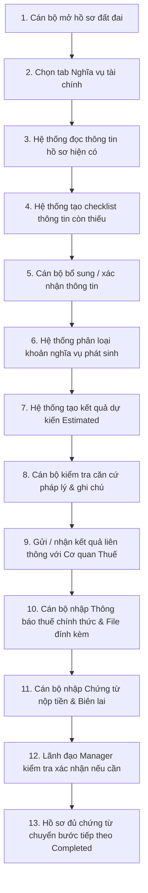

# LEGALFLOW V2 - PHASE 12A
# FINANCIAL OBLIGATION SUPPORT WORKFLOW

## 1. Purpose

Tài liệu này xác lập Quy trình Nghiệp vụ (`Workflow`) và Mô hình Trạng thái (`State Model`) cho module Hỗ trợ nghĩa vụ tài chính trong hệ thống LegalFlow V2.  
Quy trình được thiết kế 13 bước tuần tự rõ ràng, kết nối luồng công việc từ khi thụ lý hồ sơ tại Một cửa/Văn phòng Đăng ký đất đai, qua bước rà soát dự kiến bởi AI và cán bộ, luồng liên thông xác định nghĩa vụ thuế với Cơ quan Thuế, cho đến bước kiểm tra chứng từ nộp tiền và chốt nghiệm thu hồ sơ. Tài liệu cũng định nghĩa các rào chắn kỹ thuật (`Blocking Rules`) và nhật ký kiểm toán (`Audit Trail`) nhằm bảo đảm mọi thao tác đều được giám sát chặt chẽ.

## 2. Proposed Workflow (13-Step Operational Flow)

Quy trình hỗ trợ nghĩa vụ tài chính cho 1 hồ sơ đất đai diễn ra qua 13 bước nghiệp vụ tuần tự:

- **Bước 1:** Cán bộ thụ lý (`STAFF`) mở chi tiết hồ sơ thủ tục hành chính đất đai trên hệ thống.
- **Bước 2:** Cán bộ nhấp chọn tab “Nghĩa vụ tài chính” (`Financial Obligation Tab`).
- **Bước 3:** Hệ thống tự động đọc và quét thông tin hiện có trên hồ sơ (`owner`, `parcel`, `area`, `landOrigin`, `procedureType`).
- **Bước 4:** Hệ thống rà soát đối chiếu với 12 nhóm dữ liệu chuẩn và tạo Bảng rà soát thông tin còn thiếu (`Missing Information Checklist`).
- **Bước 5:** Cán bộ cập nhật, bổ sung hoặc xác nhận các trường thông tin còn khuyết (như mốc thời gian sử dụng đất hoặc hạn mức).
- **Bước 6:** Khi dữ liệu đầu vào cơ bản đã có, hệ thống phân loại khoản nghĩa vụ có thể phát sinh (`Possible Obligations`) theo đúng loại thủ tục.
- **Bước 7:** Hệ thống/AI chạy chiết tính tham khảo dựa trên Bảng giá đất và cấu hình, tạo Phiếu tổng hợp số tiền dự kiến (`Estimated Obligation Summary`) hiển thị kèm 4 cụm từ cảnh báo pháp lý bắt buộc.
- **Bước 8:** Cán bộ chuyên môn kiểm tra căn cứ pháp lý được AI trích dẫn, đối chiếu hồ sơ gốc và nhập ghi chú rà soát (`Officer Review Notes`).
- **Bước 9:** Cán bộ thực hiện quy trình lập phiếu chuyển thông tin địa chính sang Cơ quan Thuế theo luồng phối hợp liên thông thực tế (ngoài hệ thống hoặc qua cổng liên thông).
- **Bước 10:** Khi Cơ quan Thuế ban hành Thông báo nộp tiền chính thức, Cán bộ nhập số hiệu thông báo, ngày ban hành, số tiền chính thức (`Official Amount`) và tải lên tệp PDF Thông báo thuế (`Upload Tax Notice`).
- **Bước 11:** Sau khi công dân thực hiện nộp tiền, Cán bộ tiếp nhận và nhập số chứng từ, ngày nộp, số tiền đã nộp và tải lên tệp chứng từ nộp tiền (`Upload Payment Evidence`). Cán bộ bấm xác nhận kiểm tra (`Mark Officer Verified`).
- **Bước 12:** Đối với hồ sơ có rủi ro cao, có chuyển mục đích hoặc có miễn/giảm/ghi nợ, Lãnh đạo Phòng (`MANAGER`) kiểm tra đối chiếu tệp đính kèm và bấm phê chuẩn (`Mark Manager Verified`).
- **Bước 13:** Hệ thống kiểm chứng trọn vẹn chứng từ và thông báo thuế, chuyển trạng thái tab Nghĩa vụ tài chính sang `Completed`, cho phép hồ sơ tiếp tục chuyển sang bước in GCN / trình ký.

---

## 3. State Model

Module định nghĩa Mô hình Trạng thái 13 mức (`State Model`) để quản lý vòng đời xử lý nghĩa vụ tài chính của từng hồ sơ:

| State Name | Description | Transition Condition |
| :--- | :--- | :--- |
| **1. `Not Started`** | Tab nghĩa vụ tài chính chưa được khởi tạo hay rà soát. | Trạng thái mặc định khi mới mở hồ sơ. |
| **2. `Missing Information`** | Hệ thống quét phát hiện còn thiếu các trường dữ liệu đầu vào bắt buộc (`landOrigin`, `area`...). | Chuyển sang khi cán bộ mở tab nhưng checklist có mục rỗng. |
| **3. `Ready for Officer Review`** | Dữ liệu đầu vào đã đầy đủ 100%, sẵn sàng cho cán bộ thẩm định và chạy chiết tính dự kiến. | Chuyển sang sau khi cán bộ nhập/lưu đủ thông tin đầu vào. |
| **4. `Estimated`** | Phiếu tổng hợp số tiền dự kiến đã được AI/Hệ thống sinh ra kèm nhãn cảnh báo. | Chuyển sang khi nút `Generate Draft Assessment` được kích hoạt. |
| **5. `Waiting for Tax Notice`** | Hồ sơ đã hoàn tất rà soát nội bộ, đã chuyển thông tin sang Cơ quan Thuế và đang chờ Thông báo nộp tiền chính thức. | Chuyển sang khi cán bộ chốt phiếu chuyển thông tin thuế. |
| **6. `Tax Notice Received`** | Thông báo nộp tiền chính thức của Cơ quan Thuế đã được cán bộ nhập liệu và tải tệp đính kèm lên hệ thống. | Chuyển sang sau khi thực thi nút `Upload Tax Notice`. |
| **7. `Waiting for Payment Evidence`** | Thông báo thuế đã có; hệ thống đang chờ công dân đi nộp tiền và nộp lại biên lai/chứng từ nộp tiền. | Chuyển sang ngay sau khi trạng thái `Tax Notice Received` được chốt. |
| **8. `Payment Evidence Uploaded`** | Cán bộ đã tải lên tệp chứng từ nộp tiền/biên lai của công dân và nhập số tiền thực nộp. | Chuyển sang sau khi thực thi nút `Upload Payment Evidence`. |
| **9. `Officer Verified`** | Cán bộ thụ lý đã kiểm tra, đối chiếu khớp đúng giữa số tiền trên Thông báo thuế và Chứng từ nộp tiền thực tế. | Chuyển sang khi cán bộ bấm nút `Mark Officer Verified`. |
| **10. `Manager Verified`** | Lãnh đạo (`MANAGER`) đã rà soát lại hồ sơ và phê chuẩn xác nhận tính hợp lệ của chứng từ/quy trình. | Chuyển sang khi Lãnh đạo bấm nút `Mark Manager Verified` (Bắt buộc với case rủi ro/miễn giảm). |
| **11. `Completed`** | Nghĩa vụ tài chính đã hoàn tất đầy đủ và hợp lệ 100%; hồ sơ đủ điều kiện chuyển bước tiếp theo trong quy trình đất đai. | Chuyển sang khi thỏa mãn toàn bộ các rào chắn an toàn (`Blocking Rules`). |
| **12. `Blocked`** | Hồ sơ bị khóa/chặn do phát hiện bất thường, sai lệch chứng từ, tranh chấp hoặc có tranh chấp về số tiền nộp thuế. | Chuyển sang tự động hoặc bởi cán bộ/lãnh đạo khi phát hiện rủi ro nghiêm trọng. |
| **13. `Not Applicable`** | Hồ sơ thuộc diện không phát sinh nghĩa vụ tài chính (Ví dụ: đính chính lỗi đánh máy GCN hoặc biến động không phí). | Chuyển sang khi cán bộ chọn chế độ miễn trừ nghiệp vụ hợp lệ có xác nhận. |

---

## 4. Blocking Rules

Để bảo đảm tuyệt đối không có bất kỳ hồ sơ nào lọt qua khâu kiểm soát khi chưa đủ chứng từ hợp pháp, Module quy định **6 Rào chắn Khóa chuyển trạng thái (`Absolute Blocking Rules`)**.  
Hệ thống **TUYỆT ĐỐI CẤM** chuyển trạng thái tab sang `Completed` (và cấm chuyển bước hồ sơ thủ tục đất đai) nếu vi phạm bất kỳ điều kiện nào sau đây:

1. **Chưa có Thông báo thuế chính thức (`Missing Official Tax Notice Block`):** Nếu hồ sơ thuộc loại thủ tục có phát sinh nghĩa vụ tài chính theo quy định (`Procedure Type 1, 2, 4`), cấm hoàn thành nếu `taxNoticeStatus != Tax Notice Received` và thiếu `taxNoticeFileId`.
2. **Chưa có Chứng từ nộp tiền (`Missing Payment Evidence Block`):** Cấm hoàn thành nếu chưa tải lên tệp chứng từ nộp tiền (`paymentReceiptFileId == null`) và số tiền đã nộp (`amountPaid`) nhỏ hơn số tiền phải nộp chính thức trên Thông báo thuế (trừ trường hợp được miễn/giảm hợp lệ).
3. **Chứng từ chưa được Cán bộ xác nhận (`Unverified Evidence Block`):** Cấm hoàn thành nếu trạng thái `officerReviewStatus` chưa đạt `Officer Verified` (Cán bộ thụ lý chưa đích thân đối chiếu chứng từ gốc).
4. **Còn thiếu thông tin quan trọng (`Missing Mandatory Inputs Block`):** Cấm hoàn thành nếu `Missing Information Checklist` vẫn còn trường dữ liệu bắt buộc ở trạng thái `Missing` hoặc `Unverified`.
5. **Còn tranh chấp hoặc rủi ro pháp lý (`Active Risk / Dispute Block`):** Cấm hoàn thành nếu `riskLevel == High` hoặc thẻ cảnh báo (`Warning Text`) ghi nhận có sai lệch số tiền/tranh chấp nguồn gốc mà chưa có ghi chú xử lý hợp lệ của Lãnh đạo.
6. **Chỉ có kết quả AI dự kiến (`AI-Only Estimate Block`):** Cấm tuyệt đối việc sử dụng con số `Estimated Amount` do AI gợi ý làm căn cứ hoàn thành hồ sơ (`isEstimate == true -> Completed IS BLOCKED`). Hồ sơ chỉ được hoàn thành khi có con số `Official Amount` từ Cơ quan Thuế.

---

## 5. Audit Trail

Mọi thao tác, thay đổi dữ liệu và chuyển trạng thái bên trong Module "Hỗ trợ nghĩa vụ tài chính" đều bắt buộc phải được ghi nhận vào Sổ Nhật ký Kiểm toán Bất biến (`FinancialObligationAuditLog`).  
Danh mục 9 sự kiện kiểm toán bắt buộc (`Audited Events List`):

| Event Action Code | Trigger Condition | Logged Information |
| :--- | :--- | :--- |
| **`ai_suggestion_generated`** | Khi AI/Hệ thống sinh kết quả chiết tính dự kiến và checklist. | `actorId: System/User`, `procedureType`, `estimatedTotalAmount`, `riskLevel`. |
| **`officer_edited`** | Khi Cán bộ chỉnh sửa, bổ sung thông tin thửa đất, nguồn gốc hoặc các khoản mục. | `actorId: STAFF`, `beforeValue`, `afterValue`, `editedFields`. |
| **`officer_confirmed`** | Khi Cán bộ bấm xác nhận thông tin đầu vào đã đầy đủ (`Ready for Review`). | `actorId: STAFF`, `confirmationTimestamp`, `checklistSnapshot`. |
| **`tax_notice_uploaded`** | Khi Cán bộ tải lên Thông báo thuế chính thức và nhập số tiền. | `actorId: STAFF`, `noticeNumber`, `issuingAuthority`, `officialTotalAmount`, `fileAttachmentId`. |
| **`payment_evidence_uploaded`** | Khi Cán bộ tải lên Chứng từ nộp tiền/Biên lai và nhập số tiền nộp. | `actorId: STAFF`, `receiptNumber`, `paymentDate`, `amountPaid`, `fileAttachmentId`. |
| **`officer_verified`** | Khi Cán bộ bấm `Mark Officer Verified` xác nhận khớp đúng chứng từ. | `actorId: STAFF`, `verificationTimestamp`, `reviewNotes`. |
| **`manager_verified`** | Khi Lãnh đạo bấm `Mark Manager Verified` phê chuẩn hồ sơ. | `actorId: MANAGER`, `verificationTimestamp`, `managerNotes`, `approvedExemption`. |
| **`status_changed`** | Khi trạng thái của `FinancialObligationAssessment` thay đổi giữa 13 mức. | `actorId`, `beforeStatus`, `afterStatus`, `transitionReason`. |
| **`export_generated`** | Khi Cán bộ trích xuất/tải về Phiếu tổng hợp dự kiến nghĩa vụ tài chính. | `actorId`, `exportFormat`, `includedWarnings: true`, `exportTimestamp`. |
