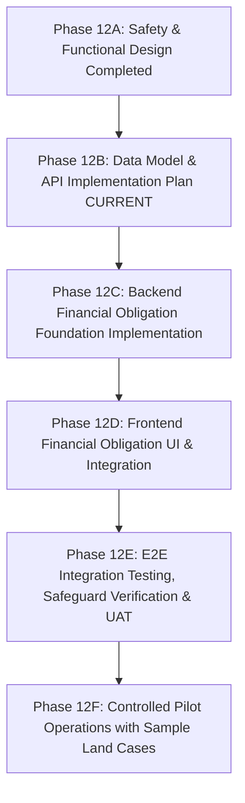

# LEGALFLOW V2 - PHASE 12B
# FINANCIAL OBLIGATION DATA MODEL & API PLAN

## 1. Purpose

Tài liệu này xác lập Kế hoạch Tổng thể Triển khai Mô hình Dữ liệu và Hợp đồng Giao tiếp API (`Data Model & API Implementation Plan`) cho Module Hỗ trợ nghĩa vụ tài chính (`Financial Obligation Support Module`) trong hệ thống LegalFlow V2. Kế hoạch đóng vai trò là bản đặc tả kỹ thuật chi tiết (`Technical Blueprint`) chuẩn bị cho giai đoạn lập trình Backend tại Phase 12C, bảo đảm các thực thể dữ liệu, luồng kiểm tra dữ liệu (`Validation Rules`), ma trận phân quyền (`RBAC`) và rào chắn chặn chốt (`Blocking Safeguards`) được định hình chính xác theo đúng kiến trúc an toàn đã phê duyệt tại Phase 12A.

## 2. Baseline

- **Previous tag:** `v2.12.0-financial-obligation-support-design`
- **Proposed tag:** `v2.12.1-financial-obligation-data-model-api-plan`
- **Root path:** `C:\Users\Admin\legalflow-docker-uat`
- **Backend path:** `C:\Users\Admin\legalflow-docker-uat\legalflow-backend`
- **Ngày lập kế hoạch:** 12/07/2026

## 3. Implementation Objective

Mục tiêu của Phase 12B là chuẩn bị đầy đủ và đồng bộ 6 bộ tài liệu đặc tả kỹ thuật nền tảng (`Technical Specification Architecture`) trước khi viết bất kỳ dòng mã nguồn hay thay đổi cơ sở dữ liệu nào:
1. **Chuẩn bị Schema Draft (`Prisma Schema Preparation`):** Thiết kế chi tiết các thực thể (`FinancialObligationAssessment`, `FinancialObligationItem`, `TaxNoticeRecord`, `PaymentEvidenceRecord`, `FinancialObligationAuditLog`), các kiểu dữ liệu liệt kê (`Enums`), chỉ mục (`Indexes`) và đánh giá tác động di trú (`Migration Impact Analysis`).
2. **Chuẩn bị API Contract (`REST API Endpoints Specification`):** Đặc tả chi tiết 12 REST endpoint cho các thao tác tra cứu, tạo dự kiến, quản lý khoản mục, tải lên thông báo thuế/chứng từ nộp tiền và phê duyệt.
3. **Chuẩn bị RBAC (`Role-Based Access Control Matrix`):** Phân định chi tiết quyền hạn truy cập API cho 4 vai trò nội bộ (`STAFF`, `MANAGER`, `ADMIN`, `AI System`), thiết lập rào chắn kỹ thuật ngăn chặn lạm quyền.
4. **Chuẩn bị Audit Trail (`System Audit Architecture`):** Thiết lập cấu trúc ghi nhận log kiểm toán bất biến cho 9 hành động nghiệp vụ nhạy cảm gắn liền với tiền sử dụng đất/thuế.
5. **Chuẩn bị Validation (`DTO Validation & Guardrails Specification`):** Quy định chặt chẽ các luật kiểm tra tính hợp lệ dữ liệu đầu vào (`Class-Validator DTOs`), bảo đảm tuyệt đối sự phân lập giữa số tiền dự kiến (`estimatedAmount`) và số tiền chính thức (`officialAmount`).
6. **Chuẩn bị Test Plan (`Comprehensive Verification & UAT Plan`):** Xây dựng bộ kịch bản kiểm thử tự động Backend, Frontend và 6 mẫu hồ sơ nghiệm thu thực tế (`UAT Samples`).

> [!IMPORTANT]
> **CAM KẾT KHÔNG LẬP TRÌNH TRONG PHASE 12B (`ZERO CODE ENFORCEMENT`):**  
> Toàn bộ Phase 12B chỉ tập trung lập kế hoạch và viết đặc tả kỹ thuật trong `docs/`. Hệ thống **TUYỆT ĐỐI KHÔNG SỬA BACKEND CODE (`nest-api`)**, **KHÔNG SỬA FRONTEND CODE (`vite-ui`)**, **KHÔNG SỬA PRISMA SCHEMA (`schema.prisma`)**, **KHÔNG TẠO MIGRATION**, **KHÔNG THAY ĐỔI `.env`** và **KHÔNG SEED/RESET DB**.

## 4. Core Safety Principle

Bắt buộc mọi thiết kế API, mô hình dữ liệu và kiểm thử trong Phase 12B phải tuân thủ triệt để Nguyên tắc An toàn Cốt lõi sau đây (`Core Safety Principle`):

> [!CAUTION]
> **`Financial obligation support output is advisory/estimated only unless verified by officer based on official tax notice and payment evidence.`**  
> *(Kết quả hỗ trợ nghĩa vụ tài chính chỉ có giá trị tham khảo/dự kiến, trừ khi được Cán bộ thụ lý đích thân đối chiếu xác nhận dựa trên Thông báo nộp tiền chính thức của Cơ quan Thuế và Chứng từ nộp tiền thực tế).*

## 5. Implementation Phasing

Lộ trình triển khai kỹ thuật toàn diện cho Module Hỗ trợ nghĩa vụ tài chính từ khâu quy hoạch đến vận hành thí điểm thực tế (`Implementation Phasing Roadmap`):

- **Phase 12A (`v2.12.0 - Completed`):** Thiết kế kiến trúc nghiệp vụ, yêu cầu chức năng, quy trình 13 bước, bảng phân quyền và bố cục giao diện UI/UX.
- **Phase 12B (`v2.12.1 - Hiện tại`):** Đặc tả chi tiết Kế hoạch triển khai Mô hình dữ liệu (`Prisma Schema Draft`), Hợp đồng API (`REST Contracts`), Phân quyền (`RBAC`), Kiểm toán (`Audit Log`) và Kịch bản kiểm thử (`Test Plan`).
- **Phase 12C:** Lập trình Backend chính thức (`nest-api`), cập nhật tệp `schema.prisma`, sinh migration mới, thiết lập các DTO, Interceptor cảnh báo, Controller và Service giải quyết nghiệp vụ.
- **Phase 12D:** Lập trình Frontend UI/UX (`vite-ui`), tích hợp Tab “Nghĩa vụ tài chính”, Safety Banner cố định, các bảng đối chiếu chứng từ và luồng tương tác với Backend API.
- **Phase 12E:** Thực thi trọn vẹn bộ kiểm thử tự động E2E, chạy kịch bản nghiệm thu kiểm chứng rào chắn an toàn (`Blocking Safeguard Verification`) và UAT với Lãnh đạo nghiệp vụ.
- **Phase 12F:** Đưa module vào vận hành thí nghiệm có kiểm soát (`Controlled Pilot`) trên các mẫu hồ sơ đất đai chọn lọc, đánh giá mức độ chính xác của gợi ý AI và trải nghiệm rà soát của Cán bộ.
