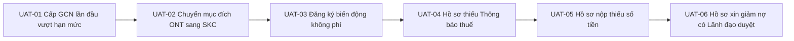

# LEGALFLOW V2 - PHASE 12B
# FINANCIAL OBLIGATION TEST PLAN

## 1. Purpose

Tài liệu Kế hoạch Kiểm thử (`Verification & Test Plan`) này xác lập khung kịch bản kiểm định tự động và kiểm thử chấp nhận người dùng (`UAT`) cho Module "Hỗ trợ nghĩa vụ tài chính" chuẩn bị cho Phase 12E.  
Mục tiêu là kiểm chứng tính đúng đắn của các rào chắn an toàn (`Guardrail Verification`), bảo đảm không có bất kỳ kẽ hở nào cho phép AI kết luận thay cơ quan thuế hay cho phép hồ sơ lọt qua bước hoàn thành khi chưa có chứng từ nộp tiền hợp pháp.

---

## 2. Backend Test Scope (12 Automated Integration Test Cases)

Bộ kiểm thử tự động Backend (`Jest / Supertest API Suite`) được cấu trúc thành 12 kịch bản kiểm chứng bắt buộc (`Backend Test Matrix`):

| Test Case ID | Scenario Name | Target Endpoint | Expected Result / Assertion |
| :--- | :--- | :--- | :--- |
| **`BE-TC-01`** | Khởi tạo phiên rà soát nghĩa vụ tài chính mới cho hồ sơ cấp GCN lần đầu. | `POST /procedure-cases/:caseId/financial-obligations` | `201 Created`; Trả về `assessmentStatus = MISSING_INFORMATION` hoặc `READY_FOR_REVIEW`. |
| **`BE-TC-02`** | Gọi AI chạy chiết tính dự kiến khi đủ thông tin thửa đất. | `POST /financial-obligations/:id/generate-draft` | `201 Created`; Trả về `isEstimate = true`, `estimatedTotalAmount > 0`, kèm theo mảng `safetyWarnings` 3 cụm từ chuẩn. |
| **`BE-TC-03`** | Kiểm chứng cảnh báo pháp lý bắt buộc trong mọi response dự kiến. | `GET /procedure-cases/:caseId/financial-obligations` | Assert `response.body.data.isEstimate == true` -> `response.body.safetyWarnings` phải chứa exaclty `DỰ KIẾN - CHƯA PHẢI SỐ TIỀN CHÍNH THỨC`. |
| **`BE-TC-04`** | Ngăn chặn AI tự ý ghi vào số tiền chính thức (`officialTotalAmount`). | `POST /financial-obligations/:id/generate-draft` với payload giả mạo `isOfficial: true` | `422 Unprocessable Entity` hoặc tự động loại bỏ cờ `isOfficial = true` (`Sanitization checks`). |
| **`BE-TC-05`** | Cán bộ tải lên Thông báo thuế kèm file PDF đính kèm hợp lệ. | `POST /financial-obligations/:id/tax-notices` | `201 Created`; Cập nhật `officialTotalAmount = payload.totalAmount`, đổi `isEstimate = false`, chuyển trạng thái `TAX_NOTICE_RECEIVED`. |
| **`BE-TC-06`** | Cán bộ tải lên Chứng từ nộp tiền vào Kho bạc/Ngân hàng. | `POST /financial-obligations/:id/payment-evidence` | `201 Created`; Cập nhật `paymentStatus = PAID_FULL`, chuyển trạng thái `PAYMENT_UPLOADED`. |
| **`BE-TC-07`** | **Khóa `Completed` khi CHƯA có Thông báo thuế (`Missing Tax Notice Block`).** | `POST /financial-obligations/:id/mark-completed` (khi `taxNotice == null`) | `422 Unprocessable Entity`; Error code: `COMPLETE_BLOCKED_NO_TAX_NOTICE`. |
| **`BE-TC-08`** | **Khóa `Completed` khi CHƯA có Chứng từ nộp tiền (`Missing Payment Block`).** | `POST /financial-obligations/:id/mark-completed` (khi `paymentEvidences == []`) | `422 Unprocessable Entity`; Error code: `COMPLETE_BLOCKED_NO_PAYMENT`. |
| **`BE-TC-09`** | **Khóa `Completed` khi Cán bộ CHƯA bấm xác nhận (`Unverified Evidence Block`).** | `POST /financial-obligations/:id/mark-completed` (khi `officerReviewStatus == UNVERIFIED`) | `422 Unprocessable Entity`; Error code: `COMPLETE_BLOCKED_UNVERIFIED`. |
| **`BE-TC-10`** | Kiểm chứng rào chắn Lãnh đạo (`MANAGER Verify`) đối với ca rủi ro cao (`HIGH RISK`). | `POST /financial-obligations/:id/mark-completed` (khi `riskLevel == HIGH` & `managerReviewStatus != MANAGER_VERIFIED`) | `422 Unprocessable Entity`; Yêu cầu bắt buộc phải có chữ ký phê chuẩn từ Lãnh đạo. |
| **`BE-TC-11`** | Kiểm chứng tự động sinh bản ghi Nhật ký kiểm toán (`Audit Log Assertion`). | `GET /financial-obligations/:id/audit-logs` sau mỗi thao tác ở trên | Assert số lượng log tăng lên, chứa đúng `actorId`, `action` (`tax_notice_uploaded`, `officer_verified`...). |
| **`BE-TC-12`** | Kiểm chứng ma trận phân quyền RBAC (`Permission Denial`). | Gọi `POST /officer-verify` bằng JWT của `ADMIN` hoặc `CITIZEN` | `403 Forbidden`; Error code: `RBAC_PERMISSION_DENIED`. |

---

## 3. Frontend Test Scope (9 UI/UX Automated Test Cases)

Bộ kiểm thử giao diện Frontend (`Playwright / Cypress Suite`) kiểm tra trải nghiệm người dùng và việc niêm yết đầy đủ các cảnh báo pháp lý:

| Test Case ID | UI Component / View | Test Action & Verification |
| :--- | :--- | :--- |
| **`FE-TC-01`** | **Safety Banner Visibility** | Mở tab "Nghĩa vụ tài chính" -> Assert Banner đỏ/cam trên cùng hiển thị nguyên văn: `KẾT QUẢ HỖ TRỢ NGHĨA VỤ TÀI CHÍNH CHỈ LÀ DỰ KIẾN. CÁN BỘ PHẢI KIỂM TRA HỒ SƠ... HỆ THỐNG KHÔNG THAY THẾ CƠ QUAN THUẾ.` |
| **`FE-TC-02`** | **Empty State Display** | Khi hồ sơ mới chưa chạy rà soát -> Assert hiển thị biểu tượng `📋` và thông điệp hướng dẫn *"Hồ sơ chưa thực hiện rà soát nghĩa vụ tài chính..."* |
| **`FE-TC-03`** | **Missing Information Checklist** | Khi hồ sơ thiếu thông tin nguồn gốc đất -> Assert checklist hiển thị icon `⚠️ Missing` đỏ và nút `[Bổ sung ngay]` nhấp nháy dẫn về tab chi tiết đất. |
| **`FE-TC-04`** | **Estimated Panel Warning Badge** | Khi `isEstimate == true` -> Assert tất cả khoản mục đều hiển thị nền vàng và nhãn cảnh báo viền cam: `⚠️ DỰ KIẾN - CHƯA PHẢI SỐ TIỀN CHÍNH THỨC`. |
| **`FE-TC-05`** | **Official Tax Notice Panel** | Sau khi tải lên thông báo thuế -> Assert số tiền chính thức hiển thị chữ in đậm nền xanh lá (`Official Amount`), có link bấm xem nhanh file PDF. |
| **`FE-TC-06`** | **Payment Evidence Panel** | Sau khi tải lên chứng từ -> Assert bảng danh sách biên lai hiển thị số tiền đã nộp khớp với thông báo, kèm nút xác nhận của Cán bộ. |
| **`FE-TC-07`** | **Completed Button Disabled State** | Khi hồ sơ chỉ có số dự kiến AI hoặc chưa đủ chứng từ -> Assert nút `[Hoàn tất nghĩa vụ tài chính]` ở trạng thái vô hiệu hóa (`Disabled/Greyed out`), hover hiển thị lý do chặn. |
| **`FE-TC-08`** | **Audit Trail Timeline View** | Kiểm tra khu vực nhật ký kiểm toán -> Assert hiển thị danh sách timeline rõ ràng các sự kiện `AI gợi ý`, `Cán bộ tải chứng từ`, `Cán bộ xác nhận` kèm thời gian chính xác. |
| **`FE-TC-09`** | **Export Summary Draft Watermark** | Nhấn nút `[Xuất phiếu tham khảo]` -> Assert tệp PDF tải về có dòng chữ đóng dấu chìm lớn ở giữa trang: `DRAFT - ESTIMATE ONLY - KHÔNG PHẢI THÔNG BÁO NỘP TIỀN`. |

---

## 4. UAT Test Scope (6 Sample Land Procedure Cases)

Kế hoạch kiểm thử nghiệm thu người dùng (`User Acceptance Testing - UAT`) được thiết kế trên 6 hồ sơ mẫu điển hình trong thực tiễn thụ lý đất đai tại địa phương:

1. **`UAT-01` (Cấp GCN lần đầu có phát sinh tiền sử dụng đất vượt hạn mức):** Hồ sơ thửa đất ở 350m2, hạn mức công nhận 200m2. Kiểm chứng AI gợi ý chiết tính 150m2 vượt hạn mức (`Estimated`), Cán bộ nhập Thông báo thuế chính thức (`45.000.000 VNĐ`) và tải biên lai nộp tiền Kho bạc hợp lệ -> Hoàn tất thành công.
2. **`UAT-02` (Chuyển mục đích sử dụng đất từ đất trồng cây lâu năm sang đất ở):** Hồ sơ chuyển 100m2 CLN sang ONT. Kiểm chứng AI chiết tính chênh lệch giá đất, kiểm chứng việc tiếp nhận phiếu chuyển thông tin thuế và rà soát của Cán bộ thụ lý.
3. **`UAT-03` (Hồ sơ đăng ký biến động đổi tên/đính chính không phát sinh nghĩa vụ):** Kiểm chứng chế độ `NOT_APPLICABLE`, Cán bộ xác nhận miễn trừ nghiệp vụ tài chính và hệ thống cho phép hoàn tất mà không cần đòi hỏi biên lai thuế.
4. **`UAT-04` (Kiểm chứng Rào chắn Chặn - Hồ sơ thiếu Thông báo thuế):** Hồ sơ Cấp GCN có số dự kiến AI (`isEstimate = true`) nhưng chưa nhận được văn bản từ Cơ quan Thuế. Kiểm chứng hệ thống CHẶN ĐỨNG nút hoàn thành, thông báo lỗi rõ ràng cho Cán bộ.
5. **`UAT-05` (Kiểm chứng Rào chắn Chặn - Hồ sơ nộp thiếu số tiền/chứng từ sai):** Hồ sơ có Thông báo thuế `50.000.000 VNĐ`, nhưng biên lai nộp tiền chỉ ghi `20.000.000 VNĐ`. Kiểm chứng hệ thống phát hiện `DISCREPANCY`, chặn hoàn thành và yêu cầu bổ sung chứng từ.
6. **`UAT-06` (Hồ sơ đối tượng chính sách xin miễn/giảm tiền sử dụng đất):** Hồ sơ gia đình thương binh xin giảm 50% tiền sử dụng đất. Kiểm chứng cờ rủi ro `HIGH RISK`, Cán bộ nhập Quyết định miễn giảm hợp lệ và Lãnh đạo (`MANAGER`) đích thân vào kiểm tra và bấm phê chuẩn `Manager Verify` -> Hoàn tất thành công.

---

## 5. Acceptance Criteria (6 Tiêu chí Nghiệm thu Tối thượng)

Module "Hỗ trợ nghĩa vụ tài chính" chỉ được coi là đạt yêu cầu nghiệm thu và đủ điều kiện triển khai pilot trên môi trường UAT khi đáp ứng trọn vẹn 6 tiêu chí tối thượng (`Final Acceptance Criteria`):
1. **Khẳng định tính Trợ lý AI (`Zero AI Authority Criteria`):** Không có bất kỳ trường hợp nào AI tự động kết luận số tiền chính thức (`officialAmount`) hay tự động chốt hoàn thành (`Completed`) mà không có sự tác động xác nhận của con người.
2. **Khẳng định thẩm quyền Cơ quan Thuế (`Tax Authority Supremacy Criteria`):** Không có bất kỳ giao diện hay chức năng nào cho phép hệ thống in hoặc ban hành "Thông báo nộp tiền chính thức" thay cho Chi cục Thuế / Cơ quan Thuế.
3. **Hiệu lực Rào chắn Chặn chốt (`Absolute Blocking Efficacy Criteria`):** 100% các hồ sơ thuộc diện phát sinh nghĩa vụ bị chặn chuyển bước nếu thiếu tệp Thông báo thuế (`TaxNoticeRecord`) hoặc tệp Chứng từ nộp tiền (`PaymentEvidenceRecord`).
4. **Chuẩn hóa Hiển thị Cảnh báo (`Mandatory Warning Display Criteria`):** 100% các phiếu tính toán dự kiến hiển thị trên UI và xuất ra file PDF đều có nhãn cảnh báo bắt buộc `DỰ KIẾN` và `KHÔNG THAY THẾ CƠ QUAN THUẾ`.
5. **Toàn vẹn Nhật ký Kiểm toán (`100% Audit Traceability Criteria`):** Mọi sự kiện chỉnh sửa, tải chứng từ và xác nhận đều được ghi lại trong Sổ kiểm toán bất biến với đầy đủ mốc thời gian và định danh tài khoản.
6. **Tuân thủ Phân quyền rạch ròi (`Strict RBAC Enforcement Criteria`):** Cán bộ thụ lý (`STAFF`) không thể tự phê chuẩn ca rủi ro cao thay Lãnh đạo (`MANAGER`), và Quản trị viên (`ADMIN`) không thể tự ý thay đổi số tiền phải nộp của công dân.
