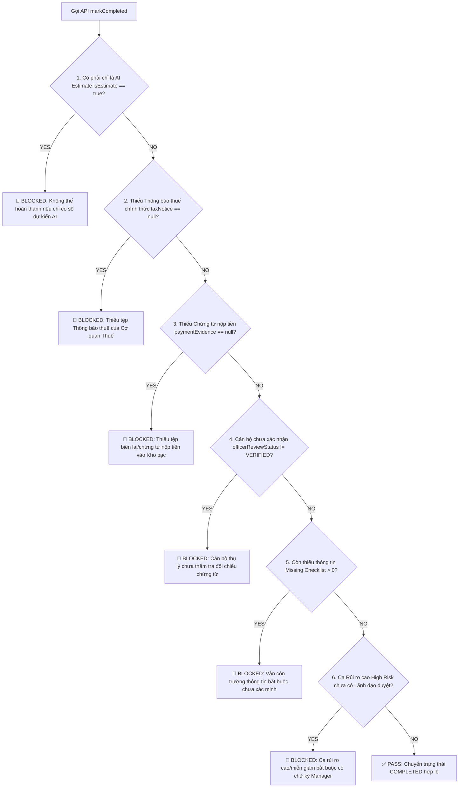

# LEGALFLOW V2 - PHASE 12B
# RBAC, AUDIT & SAFETY SPEC

## 1. Purpose

Tài liệu này xác lập các rào chắn kiểm soát an toàn kỹ thuật (`Safety Safeguards`), ma trận phân quyền dựa trên vai trò (`RBAC Matrix`), giới hạn tuyệt đối của Trợ lý AI (`AI System Restrictions`) và cấu trúc Nhật ký kiểm toán bất biến (`Audit Trail Specification`) cho Module "Hỗ trợ nghĩa vụ tài chính" chuẩn bị cho Phase 12C.  
Mục tiêu tối thượng là bảo đảm mọi thao tác nghiệp vụ liên quan đến tiền sử dụng đất, thuế và phí đều nằm dưới sự kiểm soát, thẩm định và xác nhận cuối cùng của con người (Cán bộ & Lãnh đạo), tuân thủ nghiêm ngặt 19 rào chắn an toàn của hệ thống LegalFlow V2.

---

## 2. Role Matrix (Ma trận Phân quyền Kiểm soát Tác vụ)

Ma trận phân quyền quy định rõ quyền hạn thực thi (`Allowed` vs `Blocked`) đối với 10 tác vụ cốt lõi của module trên 4 vai trò nội bộ:

| Action / Task | `STAFF` *(Cán bộ thụ lý)* | `MANAGER` *(Lãnh đạo Phòng)* | `ADMIN` *(Quản trị viên)* | `AI System` *(Trợ lý AI)* | Notes / Guardrails |
| :--- | :---: | :---: | :---: | :---: | :--- |
| **1. View Assessment (`Xem chi tiết rà soát`)** | ✅ **Allow** | ✅ **Allow** | ✅ **Allow** | ✅ **Allow** | AI được đọc để rà soát thiếu thông tin và gợi ý checklist. |
| **2. Create Draft Assessment (`Chạy chiết tính dự kiến`)** | ✅ **Allow** | ✅ **Allow** | ❌ Block | ✅ **Allow** | AI và Cán bộ được chạy chiết tính tạo `estimatedAmount` (kèm nhãn `DỰ KIẾN`). |
| **3. Edit Estimated Item (`Sửa khoản mục dự kiến`)** | ✅ **Allow** | ✅ **Allow** | ❌ Block | ❌ Block | Chỉ con người (`STAFF/MANAGER`) mới được sửa tay các thông số tính toán khoản mục. |
| **4. Upload Tax Notice (`Tải lên Thông báo thuế`)** | ✅ **Allow** | ✅ **Allow** | ❌ Block | 🛑 **FORBIDDEN** | Bắt buộc phải có `fileAttachmentId` từ MinIO; AI bị cấm tuyệt đối nhập hay sửa số tiền thuế chính thức. |
| **5. Upload Payment Evidence (`Tải chứng từ nộp tiền`)** | ✅ **Allow** | ✅ **Allow** | ❌ Block | 🛑 **FORBIDDEN** | Bắt buộc phải có số biên lai, ngân hàng và tệp đính kèm do công dân nộp lại. |
| **6. Officer Verify (`Cán bộ thẩm tra xác nhận`)** | ✅ **Allow** | ❌ Block | ❌ Block | 🛑 **FORBIDDEN** | Quyền hạn và trách nhiệm thẩm định đối chiếu chứng từ gốc thuộc riêng về `STAFF`. |
| **7. Manager Verify (`Lãnh đạo phê chuẩn`)** | ❌ Block | ✅ **Allow** | ❌ Block | 🛑 **FORBIDDEN** | Chốt chặn kiểm tra cao nhất dành riêng cho `MANAGER` đối với hồ sơ rủi ro/miễn giảm. |
| **8. Mark Completed (`Hoàn tất nghĩa vụ tài chính`)** | ✅ **Allow** | ✅ **Allow** | ❌ Block | 🛑 **FORBIDDEN** | Cán bộ/Lãnh đạo bấm nút hoàn tất sau khi hệ thống rà soát qua 6 rào chắn (`Blocking Rules`). |
| **9. Export Summary (`Xuất phiếu tổng hợp tham khảo`)** | ✅ **Allow** | ✅ **Allow** | ✅ **Allow** | ❌ Block | Tệp xuất ra tự động đóng dấu chìm `DRAFT - ESTIMATE ONLY`. |
| **10. View Audit Logs (`Tra cứu nhật ký kiểm toán`)** | ✅ **Allow** | ✅ **Allow** | ✅ **Allow** | ❌ Block | Bảo đảm tính minh bạch trong thanh tra, kiểm tra. |

---

## 3. AI System Restrictions (7 Giới hạn Tuyệt đối của Trợ lý AI)

Để ngăn chặn viễn cảnh AI vượt thẩm quyền hay đưa ra phán quyết pháp lý sai lệch, 7 rào chắn cấm tuyệt đối đối với `AI System` được thiết lập cứng tại Backend (`AI Prohibited Actions Guard`):

1. 🛑 **Cấm tạo `officialAmount` (`No Official Amount Creation`):** AI không được phép ghi, sửa hoặc tự động gán bất kỳ con số nào vào trường `officialAmount` của bảng `FinancialObligationItem`.
2. 🛑 **Cấm tạo `officialTotalAmount` (`No Official Total Creation`):** AI bị chặn hoàn toàn truy cập ghi lên trường `officialTotalAmount` của bảng `FinancialObligationAssessment`.
3. 🛑 **Cấm phát hành thông báo thuế (`No Tax Notice Issuance`):** AI không được phép sinh ra, ký duyệt hay tự động phát hành bất kỳ văn bản nào có tiêu đề hay tính chất pháp lý là "Thông báo nộp tiền nghĩa vụ tài chính".
4. 🛑 **Cấm đánh dấu `Completed` (`No Auto-Completion`):** AI không được phép chuyển trạng thái `assessmentStatus` sang `COMPLETED` dưới bất kỳ hình thức tự động hóa (`auto-trigger` hay `cron job`) nào.
5. 🛑 **Cấm xác nhận đã nộp tiền (`No Auto Payment Verification`):** AI không được phép tự ý thay đổi cờ `paymentStatus = PAID_FULL` hoặc gán `verifiedById` mà không có hành vi tải chứng từ thực tế của cán bộ.
6. 🛑 **Cấm tự ý miễn/giảm (`No Automatic Tax Exemption`):** AI không được tự ý quyết định áp dụng chế độ miễn hay giảm tiền sử dụng đất cho hồ sơ khi chưa có Quyết định miễn giảm hợp lệ do Lãnh đạo phê duyệt.
7. 🛑 **Cấm gửi thông báo cho công dân (`No Direct Citizen Messaging`):** AI không được phép tự kết nối hay gọi API gửi email, tin nhắn SMS hay Zalo thông báo về số tiền dự kiến hay yêu cầu nộp tiền trực tiếp cho công dân.

---

## 4. Audit Events (9 Sự kiện Kiểm toán Bắt buộc)

Sổ nhật ký kiểm toán bất biến (`FinancialObligationAuditLog`) ghi lại toàn bộ dấu vết luân chuyển dữ liệu với đầy đủ thông tin bối cảnh (`Context Payload`):

| Event Code | Trigger Action | Actor Type | Required Payload Snapshot | Notes |
| :--- | :--- | :--- | :--- | :--- |
| **`ai_suggestion_generated`** | AI/Hệ thống sinh kết quả chiết tính dự kiến. | `System` | `{"estimatedTotalAmount": 45000000, "itemCount": 2, "riskLevel": "MEDIUM", "applyK": true}` | Ghi nhận mốc thời gian AI gợi ý chiết tính ban đầu. |
| **`officer_edited`** | Cán bộ sửa đổi thông tin thửa đất hoặc khoản mục dự kiến. | `STAFF` | `{"itemId": "...", "beforeAmount": 45000000, "afterAmount": 48000000, "reason": "Cập nhật lại vị trí 2 theo bảng giá mới"}` | Ghi vết mọi sự thay đổi con số do cán bộ can thiệp. |
| **`officer_confirmed`** | Cán bộ xác nhận checklist đầu vào đã đủ (`Ready for Review`). | `STAFF` | `{"verifiedInputsCount": 12, "missingInputsCount": 0}` | Khẳng định hồ sơ đủ điều kiện tính toán và chuyển thuế. |
| **`tax_notice_uploaded`** | Cán bộ tải lên Thông báo thuế chính thức. | `STAFF` | `{"noticeNumber": "123/TB-CCT", "issuingAuthority": "CCT KV3", "totalAmount": 48500000, "fileId": "minio://tb-123.pdf"}` | Mốc chốt số tiền chính thức hợp pháp của hồ sơ. |
| **`payment_evidence_uploaded`** | Cán bộ tải lên Giấy nộp tiền/Biên lai của công dân. | `STAFF` | `{"receiptNumber": "GNT-009988", "amountPaid": 48500000, "treasury": "KBNN Đồng Nai", "fileId": "minio://gnt.pdf"}` | Ghi nhận bằng chứng thanh toán nghĩa vụ vào NSNN. |
| **`officer_verified`** | Cán bộ bấm xác nhận khớp đúng chứng từ gốc. | `STAFF` | `{"verifiedTaxNoticeId": "...", "verifiedPaymentId": "...", "notes": "Khớp đúng 100%"}` | Chữ ký thẩm tra trách nhiệm cá nhân của cán bộ thụ lý. |
| **`manager_verified`** | Lãnh đạo phê duyệt ca rủi ro cao hoặc có miễn giảm. | `MANAGER` | `{"riskLevel": "HIGH", "exemptionApproved": true, "managerNotes": "Đồng ý chuyển bước"}` | Chốt chặn kiểm soát của Lãnh đạo Phòng. |
| **`completed`** | Hồ sơ vượt qua 6 rào chắn an toàn và hoàn tất nghiệp vụ. | `STAFF/MANAGER` | `{"finalStatus": "COMPLETED", "officialTotalAmount": 48500000, "totalPaid": 48500000}` | Mốc hoàn thành chính thức nghĩa vụ tài chính đất đai. |
| **`export_generated`** | Cán bộ trích xuất/tải về bảng tổng hợp dự kiến. | `STAFF/MANAGER/ADMIN`| `{"format": "PDF", "watermark": "DRAFT - ESTIMATE ONLY", "exportedAt": "..."}` | Kiểm soát lưu thông tài liệu nháp ra bên ngoài hệ thống. |

---

## 5. Completion Blocking Rules (6 Rào chắn Khóa Hoàn thành Nghiệm ngặt)

Lớp dịch vụ Backend (`FinancialObligationService.markCompleted()`) được lập trình kiểm tra tuần tự 6 rào chắn chặn chốt (`Blocking Rules Chain`). Nếu phát hiện bất kỳ vi phạm nào, hệ thống từ chối chuyển trạng thái sang `COMPLETED` và ném ra ngoại lệ:

