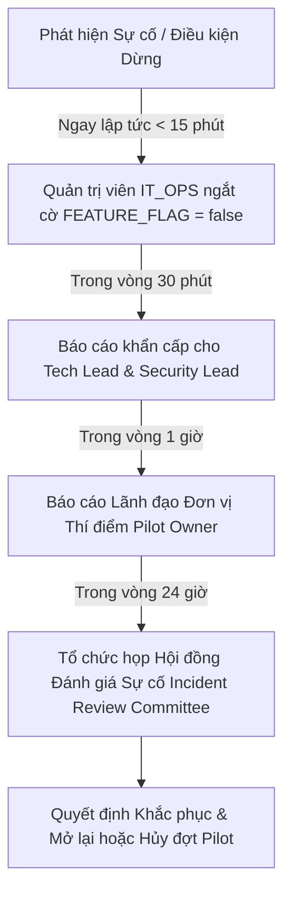

# Tiêu Chí Giám Sát, Điều Kiện Dừng Khẩn Cấp & Quy Trình Leo Thang (Monitoring, Stop and Escalation Criteria) Phân Hệ Nghĩa Vụ Tài Chính - Giai Đoạn 12N
## Phase 12N: Monitoring, Stop and Escalation Criteria

> [!CAUTION]
> **TÚYÊN BỐ AN TOÀN VẬN HÀNH (`OPERATIONAL SAFETY DISCLAIMER`):**
> Tài liệu này quy định tiêu chuẩn giám sát kỹ thuật, phân loại sự cố và các điều kiện bắt buộc phải **DỪNG NGAY LẬP TỨC (`IMMEDIATE STOP CONDITIONS`)** đối với đợt thí điểm có kiểm soát phân hệ Nghĩa vụ tài chính. Bất kỳ cán bộ hay quản trị viên nào khi phát hiện một trong 08 điều kiện dừng khẩn cấp đều có quyền và nghĩa vụ kích hoạt lệnh dừng, vô hiệu hóa phân hệ (`Disable Feature Flag`) và báo cáo ngay cho người có thẩm quyền mà không cần chờ đợi phê duyệt trước.

---

## 1. Các Chỉ Số Giám Sát Vận Hành (`Monitoring Indicators`)
Trong suốt thời gian diễn ra đợt thí điểm 30 ngày, Quản trị viên (`IT_OPS`) và Cán bộ Thẩm định phải rà soát liên tục các nhóm chỉ số kỹ thuật và nghiệp vụ sau:
1. **Chỉ số Sức khỏe Hạ tầng (`Infrastructure Health Indicators`):**
   - Trạng thái hoạt động 4/4 container Docker (`postgres`, `minio`, `legalflow-backend`, `legalflow-frontend`) duy trì `PASS`.
   - Tỷ lệ sử dụng bộ nhớ RAM và CPU trên máy chủ UAT (ngưỡng cảnh báo nếu CPU > 85%, RAM > 90%).
   - Tình trạng kết nối mạng local và cổng dịch vụ (`TCP 3000, 5173, 5432, 9000`).
2. **Chỉ số Tuân thủ Nghiệp vụ (`Business Compliance Indicators`):**
   - Số lượng hồ sơ mô phỏng được tiếp nhận, tải lên chứng từ, thẩm định và hoàn thành hàng ngày (`Daily DEMO Case Throughput`).
   - Tỷ lệ hồ sơ có xác nhận của cán bộ (`OFFICER_VERIFIED = true`) trước khi chuyển trạng thái sang `COMPLETED` (bắt buộc đạt 100%).
   - Tỷ lệ hồ sơ ghi nợ thuế hoặc rủi ro cao được phê duyệt kép bởi `APPROVAL_MANAGER` (bắt buộc đạt 100%).
3. **Chỉ số An toàn & Bảo mật (`Security & Privacy Indicators`):**
   - Số lượng cảnh báo truy cập trái phép (`Unauthorized Access Attempts / HTTP 401/403`).
   - Trạng thái tệp sao lưu tự động hằng ngày (`Daily Automated Backup Status` - bắt buộc luôn đạt `status.success`).

---

## 2. Tần Suất Rà Soát Nhật Ký Kiểm Toán (`Audit Review Frequency`)
* **Rà soát hằng ngày (`Daily Audit Review - 17:00 mỗi ngày làm việc`):** Cán bộ Quản trị hệ thống (`IT_OPS`) và Lãnh đạo Đơn vị Thí điểm thực hiện rà soát bảng `financial_obligation_audit_logs` để kiểm tra các hành vi: `VERIFY_PAYMENT_EVIDENCE`, `REQUEST_MANAGER_REVIEW`, `COMPLETE_PROCEDURE`. Xác nhận không có bất kỳ hành vi truy cập nào ngoài phạm vi ủy quyền.
* **Rà soát hằng tuần (`Weekly Technical & Security Review`):** Trưởng Đội ngũ Kỹ thuật (`Tech Lead`) và Quản trị viên Bảo mật (`Security Lead`) đối chiếu nhật ký hệ thống (`Docker Logs`), nhật ký Caddy reverse proxy và kiểm chứng tính toàn vẹn của các tệp sao lưu (`Backup Health Check`).

---

## 3. Phân Loại Mức Độ Sự Cố (`Incident Severity Levels`)

| Mức Độ Sự Cố (`Severity Level`) | Định Nghĩa & Tiêu Chí (`Criteria`) | Thời Gian Phản Hồi (`Target Response Time`) | Hành Động Yêu Cầu (`Required Action`) |
| :---: | :--- | :---: | :--- |
| **`CRITICAL`** *(Nghiêm trọng)* | Vi phạm ranh giới pháp lý (AI hiển thị số chính thức, rò rỉ dữ liệu, phát hành thông báo tự động, hoàn thành khống mà không cần thẩm định, hỏng DB). | **`< 15 phút`** | **Dừng ngay lập tức toàn bộ pilot (`Immediate Stop`).** Vô hiệu hóa phân hệ (`FEATURE_FLAG = false`). Báo cáo Lãnh đạo trong 30 phút. |
| **`HIGH`** *(Cao)* | Container MinIO hoặc Backend crash liên tục; lỗi logic đối chiếu trên một nhóm hồ sơ; mất nhật ký kiểm toán trong ngày. | **`< 1 giờ`** | **Tạm dừng thí điểm (`Temporary Suspension`).** Chuyển sang đối chiếu thủ công 100%. Họp kỹ thuật khẩn cấp. |
| **`MEDIUM`** *(Trung bình)* | Lỗi hiển thị giao diện không ảnh hưởng tính đúng đắn (`ISSUE-UAT-12K-01`); tốc độ tải chứng từ chậm (> 5 giây); lỗi nhẹ trong bản scan. | **`< 4 giờ`** | Ghi nhận vào Backlog cải tiến. Vẫn tiếp tục vận hành thí điểm bình thường. |
| **`LOW`** *(Thấp)* | Lỗi chính tả trong tài liệu hướng dẫn; câu từ trên tooltip chưa tối ưu; yêu cầu cải thiện bố cục giao diện. | **`< 24 giờ`** | Ghi nhận sổ theo dõi để cập nhật trong bản phát hành sau (`Next Release`). |

---

## 4. Các Điều Kiện Bắt Buộc Dừng Ngay Lập Tức (`Immediate Stop Conditions`)
Đợt thí điểm lập tức bị chấm dứt và phân hệ bị vô hiệu hóa toàn diện nếu xảy ra bất kỳ **1 trong 08 điều kiện dừng khẩn cấp** sau đây:
1. **`STOP-01` (Vi phạm ranh giới AI):** AI hoặc hệ thống hiển thị số tiền chiết tính dự kiến như số tiền pháp lý chính thức, hoặc tự động điền giá trị vào trường `officialAmount`.
2. **`STOP-02` (Vi phạm rào chắn hoàn thành):** Hệ thống cho phép hoàn thành hồ sơ thủ tục hành chính (`COMPLETED`) khi thiếu lời xác nhận bắt buộc của Cán bộ thẩm định (`OFFICER_VERIFIED = false`).
3. **`STOP-03` (Vi phạm nhật ký kiểm toán):** Mất, sai lệch, bị thay đổi hoặc không thể truy vết được nhật ký kiểm toán (`financial_obligation_audit_logs`) của các thao tác nghiệp vụ.
4. **`STOP-04` (Truy cập trái phép):** Phát hiện hành vi truy cập trái phép vào môi trường UAT từ bên ngoài qua mạng công cộng, hoặc tài khoản không được ủy quyền thao tác vào luồng Nghĩa vụ tài chính.
5. **`STOP-05` (Rò rỉ dữ liệu):** Rò rỉ thông tin hồ sơ thủ tục hành chính, tệp scan chứng từ hoặc dữ liệu kiểm thử ra môi trường công cộng ngoài máy chủ UAT nội bộ.
6. **`STOP-06` (Ban hành thông báo tự động trái phép):** Phát sinh luồng tự động gửi thông báo thuế, gửi email, SMS hoặc tin nhắn Zalo tự động cho công dân hoặc tổ chức ngoài phạm vi cho phép.
7. **`STOP-07` (Sai lệch dữ liệu hệ thống):** Phát hiện tình trạng sai lệch cấu trúc dữ liệu (`Data Corruption`), mất mát bản ghi chứng từ hoặc xung đột dữ liệu chéo giữa các hồ sơ.
8. **`STOP-08` (Mất khả năng khôi phục):** Hệ thống gặp sự cố mất dữ liệu hoặc lỗi sâu mà không thể thực hiện quy trình khôi phục an toàn (`Safe Rollback`) về điểm nút cơ sở (`Baseline Restore`).

---

## 5. Điều Kiện Tạm Dừng Thí Điểm (`Temporary Suspension Conditions`)
* Phát hiện xung đột cổng hạ tầng (`Port 9000 Conflict`) khiến dịch vụ lưu trữ chứng từ MinIO không thể tiếp nhận tệp tải lên (`HTTP 500 / Connection Refused`).
* Lệnh kiểm tra sức khỏe hạ tầng hằng ngày (`health-check.ps1`) báo `FAIL` trên 1 trong 4 dịch vụ cốt lõi.
* Cán bộ nghiệp vụ báo cáo nghi ngờ có sự sai lệch logic hiển thị giữa thông tin nháp trên hệ thống và tệp chứng từ scan nộp tiền gốc.
* *Khi tạm dừng:* Chuyển sang thực hiện đối chiếu hồ sơ 100% trên giấy theo quy trình thủ tục hành chính truyền thống cho đến khi kỹ thuật viên xác minh và giải tỏa sự cố.

---

## 6. Lộ Trình Báo Cáo & Leo Thang (`Escalation Route`)

* **Bước 1 (Xử lý tại chỗ):** Quản trị viên (`IT_OPS`) hoặc Cán bộ thẩm định lập tức dừng sử dụng, chạy lệnh ngắt cờ tính năng:
  `[Environment]::SetEnvironmentVariable("FEATURE_FLAG_FINANCIAL_OBLIGATIONS_ENABLED", "false", "Machine")` hoặc khởi động lại container Caddy cấm route `/financial-obligations`.
* **Bước 2 (Báo cáo Kỹ thuật):** Gửi thông tin chi tiết sự cố, ảnh chụp màn hình và nhật ký lỗi cho Trưởng Đội ngũ Kỹ thuật (`Tech Lead`) và Chuyên trách Bảo mật (`Security Lead`) trong vòng 15-30 phút.
* **Bước 3 (Báo cáo Điều hành):** Trình báo cáo sơ bộ cho Lãnh đạo Đơn vị Thí điểm (`Pilot Owner`) để ra thông báo tạm ngưng đối chiếu song song trên toàn đơn vị trong vòng 1 giờ.
* **Bước 4 (Phân tích Hội đồng):** Tổ chức phiên họp rà soát nguyên nhân gốc rễ (`Root Cause Analysis - RCA`) trong vòng 24 giờ để đánh giá phạm vi ảnh hưởng và lập kế hoạch khắc phục.

---

## 7. Quy Tắc Bảo Toàn Log & Bằng Chứng (`Evidence Preservation Requirements`)
Ngay khi xảy ra sự cố `CRITICAL` hoặc kích hoạt lệnh dừng khẩn cấp, Quản trị viên phải thực hiện quy trình bảo toàn hiện trường kỹ thuật trước bất kỳ thao tác khởi động lại hay khôi phục nào:
1. **Xuất nhật ký Docker (`Dump Container Logs`):**
   `docker logs legalflow_backend > C:\legalflow-docker-uat\incident_logs\backend_crash.log`
   `docker logs legalflow_minio > C:\legalflow-docker-uat\incident_logs\minio_error.log`
2. **Xuất bảng nhật ký kiểm toán DB (`Dump Audit Table`):** Trích xuất toàn bộ dữ liệu bảng `financial_obligation_audit_logs` ra tệp `.json / .csv` độc lập để phục vụ điều tra.
3. **Chụp nhanh trạng thái hệ thống (`System Snapshot`):** Lưu trữ biên bản `health-check.ps1` và danh sách tiến trình mạng (`netstat -ano`) tại thời điểm xảy ra sự cố.

---

## 8. Kích Hoạt Khôi Phục Đường Cơ Sở (`Rollback Trigger`)
Quy trình khôi phục cơ sở dữ liệu (`Database Restore Rollback`) về điểm nút đường cơ sở (`Baseline Restore - Phase 12N Baseline`) chỉ được kích hoạt khi:
* Sự cố `CRITICAL` làm suy biến hoặc phá hủy cấu trúc bảng dữ liệu (`Database Table Corruption`).
* Phát hiện có tệp lệnh kiểm thử hoặc thao tác nhầm làm tráo đổi hoặc ảnh hưởng đến các hồ sơ thủ tục hành chính thật (`TTHC-2026-*`).
* *Quy trình thực thi:* Quản trị viên (`ADMIN`) thực hiện các bước khôi phục theo cẩm nang `ROLLBACK_DISABLE_AND_INCIDENT_RESPONSE_PLAN.md` (Sử dụng script `scripts/restore-postgres.ps1 -BackupFile backups\legalflow_prod_pre_phase12k_uat_reexecution_20260715-211845.sql`).

---

## 9. Điều Kiện Phê Duyệt Mở Lại Sau Sự Cố (`Restart Approval Requirements`)
Sau khi đã kích hoạt lệnh dừng khẩn cấp hoặc tạm dừng thí điểm, phân hệ **CHỈ ĐƯỢC PHÉP MỞ LẠI (`RESTART / RE-ENABLE`)** khi có đầy đủ các điều kiện tiên quyết sau:
1. Báo cáo phân tích nguyên nhân gốc rễ (`RCA Report`) đã được ban hành và chỉ ra chính xác điểm lỗi kỹ thuật hoặc quy trình.
2. Bản vá lỗi hoặc biện pháp giải tỏa kỹ thuật (`Remediation Patch`) đã được kiểm thử nghiệm thu 100% trên môi trường dev/local.
3. Lệnh kiểm tra sức khỏe hạ tầng (`health-check.ps1`) sau khắc phục đạt `4/4 PASS`.
4. **Văn bản Phê duyệt Mở lại (`Formal Restart Signoff`)** có đủ 03 chữ ký của Lãnh đạo Đơn vị Thí điểm (`Pilot Owner`), Quản trị viên Bảo mật (`Security Lead`) và Trưởng Đội ngũ Kỹ thuật (`Tech Lead`). Cấm mở lại nếu thiếu dù chỉ 1 chữ ký.
