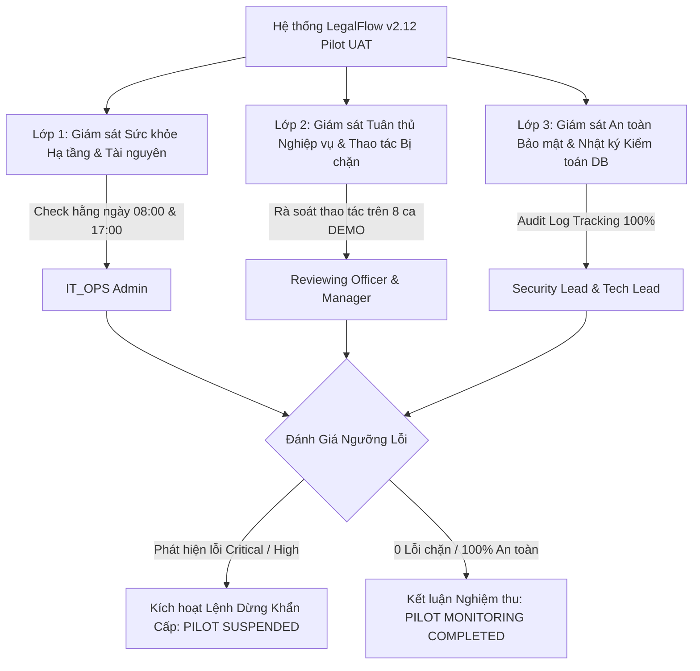

# Kế Hoạch Giám Sát Vận Hành Thí Điểm Có Kiểm Soát (`Controlled Pilot Monitoring & Operation Plan`) Phân Hệ Nghĩa Vụ Tài Chính - Giai Đoạn 12P
## Phase 12P: Controlled Financial Obligation Pilot Monitoring & Operation Plan

> [!CAUTION]
> **TÚYÊN BỐ TUÂN THỦ PHÁP LÝ & BẢO MẬT GIAI ĐOẠN 12P (`ABSOLUTE LEGAL & OPERATIONAL DISCLAIMER`):**
> Tài liệu này thiết lập kế hoạch và quy trình giám sát vận hành thí điểm có kiểm soát (`Pilot Operation & Monitoring Plan`) cho Phân hệ Nghĩa vụ tài chính trên nền tảng LegalFlow v2.12. Tuân thủ tuyệt đối quy tắc vận hành rào chắn: **KHÔNG SỬ DỤNG DỮ LIỆU CÔNG DÂN THẬT (`No Real Citizen Data`)**, **KHÔNG THAY ĐỔI MÃ NGUỒN HOẶC CẤU TRÚC DB (`No Code / Schema / DB Modification`)**, **KHÔNG TỰ Ý TÍNH HOẶC BẢO CHỨNG SỐ TIỀN CHÍNH THỨC (`No Official Amount Computation`)**, và **KHÔNG BAN HÀNH THÔNG BÁO THUẾ (`No Tax Notice Issuance`)**. Kế hoạch này áp dụng giám sát trên bộ 08 hồ sơ mô phỏng (`DEMO-FO-UAT-01..08`) tại máy chủ UAT nội bộ chuyên dụng.

---

## 1. Mục Tiêu & Kế Hoạch Đường Cơ Sở (`Monitoring Objectives & Baseline`)
* **Thẻ Đường Cơ Sở (`Rollback Baseline Tag`):** `v2.12.14-financial-obligation-controlled-pilot-activation`
* **Mã Băm Commit HEAD (`Commit Hash`):** `48b39a9ed72a5a51dfa3ca5877fdb7e55ce9e6be`
* **Mục tiêu cốt lõi:**
  1. Giám sát liên tục (`Continuous Monitoring`) sức khỏe hệ thống, hiệu suất tải chứng từ và độ ổn định của các dịch vụ Docker (`postgres, minio, backend, frontend`).
  2. Rà soát và ghi vết 100% các hành vi thao tác trên bảng nhật ký kiểm toán (`financial_obligation_audit_logs`) để ngăn ngừa truy cập trái phép hoặc vượt quyền.
  3. Kiểm chứng hiệu lực thực tế của các rào chắn nghiệp vụ (`Safety Guardrails`), đặc biệt là việc chặn đứng (`Blocked Actions`) các nỗ lực hoàn thành hồ sơ khi chưa có xác nhận của Cán bộ thẩm định (`OFFICER_VERIFIED = false`).
  4. Thu thập và phản hồi ý kiến chuyên viên (`Operator Feedback`) để tối ưu hóa trải nghiệm người dùng (`UX`) mà không can thiệp vào mã nguồn hiện tại.

---

## 2. Kiến Trúc Giám Sát 03 Lớp (`3-Tier Monitoring Architecture`)

1. **Lớp 1 - Giám sát Sức khỏe Hạ tầng (`Infrastructure Health & Performance Tier`):**
   - Theo dõi trạng thái `UP / HEALTHY` của 4 container thông qua `.\scripts\health-check.ps1`.
   - Giám sát tình trạng cổng dịch vụ (`TCP 3000, 5173, 5432, 9000`) và dung lượng tệp lưu trữ trên MinIO.
2. **Lớp 2 - Giám sát Rào chắn Nghiệp vụ & Thao tác Bị chặn (`Business Guardrails & Blocked Actions Tier`):**
   - Ghi nhận chi tiết mọi trường hợp hệ thống từ chối thao tác (`HTTP 400 Bad Request` hoặc `Disabled Complete Button`).
   - Đối chiếu quy trình kiểm soát kép (`Dual Control`) của `APPROVAL_MANAGER` đối với hồ sơ ghi nợ hoặc rủi ro cao.
3. **Lớp 3 - Giám sát Ranh giới Pháp lý & Audit Log (`Legal Boundary & Audit Tracking Tier`):**
   - Rà soát hằng ngày bảng `financial_obligation_audit_logs`, xác nhận không có bất kỳ hành vi gán số tiền chính thức (`officialAmount != null`) hoặc lập thông báo thuế tự động nào.

---

## 3. Phân Công Trách Nhiệm Đội Ngũ Giám Sát (`Monitoring Responsibilities Matrix`)

| Vai Trò Giám Sát (`Monitoring Role`) | Chức Danh Phụ Trách (`Owner Title`) | Tần Suất Giám Sát (`Frequency`) | Nhiệm Vụ Giám Sát Chủ Chốt (`Key Responsibilities`) |
| :--- | :--- | :---: | :--- |
| **`IT_OPS / SYSADMIN`** | Quản trị viên Hạ tầng UAT | **Hằng ngày (`08:00 & 17:00`)** | Chạy lệnh `health-check.ps1`, kiểm tra tài nguyên RAM/CPU, rà soát nhật ký Caddy proxy và sao lưu DB định kỳ. |
| **`PILOT_UNIT_LEAD`** | Lãnh đạo Đơn vị Thí điểm | **Hằng ngày (`17:00`)** | Kiểm tra tổng hợp tiến độ thụ lý 08 ca mô phỏng, rà soát các trường hợp bị hệ thống từ chối/chặn và ký duyệt báo cáo ngày. |
| **`REVIEWING_OFFICER`** | Cán bộ Thẩm định Chuyên môn | **Liên tục trong ca làm việc** | Đối chiếu Giấy nộp tiền Kho bạc khớp với Thông báo thuế; báo cáo ngay cho Admin nếu gặp lỗi giao diện hoặc chứng từ tải lên bị chậm. |
| **`SECURITY_LEAD`** | Chuyên trách An toàn Bảo mật | **Hằng tuần (`Hoặc đột xuất`)** | Kiểm tra nhật ký truy cập trái phép (`HTTP 401/403`), đối chiếu mã băm SHA-256 của các tệp backup và xác nhận ranh giới mạng (`No Public Tunnel`). |
| **`TECH_LEAD`** | Trưởng Đội ngũ Kỹ thuật | **Hằng ngày (`17:30`)** | Tổng hợp sổ theo dõi sự cố (`Issue Register`), phân loại mức độ lỗi (`Critical/High/Medium/Low`) và duy trì `Git clean tree`. |

---

## 4. Quy Tắc & Ngưỡng Phân Loại Kết Luận Giám Sát (`Monitoring Decision Thresholds`)
Tuân thủ nghiêm ngặt quy tắc chốt chặn của Phase 12P, kết quả giám sát mỗi ca vận hành và toàn đợt thí điểm được phán quyết theo đúng 2 ngưỡng:
1. **NGƯỠNG ĐÌNH CHỈ (`PILOT SUSPENDED`):** Ngay khi phát hiện bất kỳ **01 lỗi `CRITICAL` hoặc `HIGH`**, hoặc kích hoạt 1 trong 08 điều kiện dừng khẩn cấp (`STOP-01 to STOP-08`), toàn bộ đợt pilot lập tức bị đình chỉ (`FEATURE_FLAG_FINANCIAL_OBLIGATIONS_ENABLED = "false"`), kết luận chính thức: **`PILOT SUSPENDED`**.
2. **NGƯỠNG NGHIỆM THU (`PILOT MONITORING COMPLETED`):** Nếu suốt quá trình vận hành giám sát không phát sinh bất kỳ lỗi `CRITICAL/HIGH` nào, các rào chắn hoạt động hiệu quả 100%, không có lỗi chặn nghiệp vụ (`0 Blocking Issues`), kết luận chính thức: **`PILOT MONITORING COMPLETED`**.

---

## 5. Lộ Trình Triển Khai Kế Hoạch Giám Sát (`Monitoring Execution Roadmap`)
* **Bước 1 (Khởi động Ngày làm việc):** Quản trị viên thực hiện danh mục `DAILY_MONITORING_CHECKLIST.md` lúc 08:00 hằng ngày trước khi cán bộ Một cửa đăng nhập.
* **Bước 2 (Ghi vết Vận hành):** Cán bộ thụ lý cập nhật diễn biến hồ sơ và thao tác bị chặn vào `PILOT_OPERATION_LOG.md`.
* **Bước 3 (Phân loại Sự cố):** Tech Lead rà soát và ghi nhận các ý kiến phản hồi (`Operator Feedback`) vào `ISSUE_INCIDENT_REGISTER.md`.
* **Bước 4 (Đánh giá Định kỳ):** Lập Báo cáo Rà soát An toàn Giữa kỳ (`INTERIM_SAFETY_REVIEW.md`) và Báo cáo Nghiệm thu Kết thúc Phase 12P (`COMPLETION_REPORT.md`).
