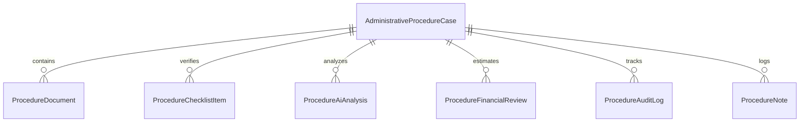
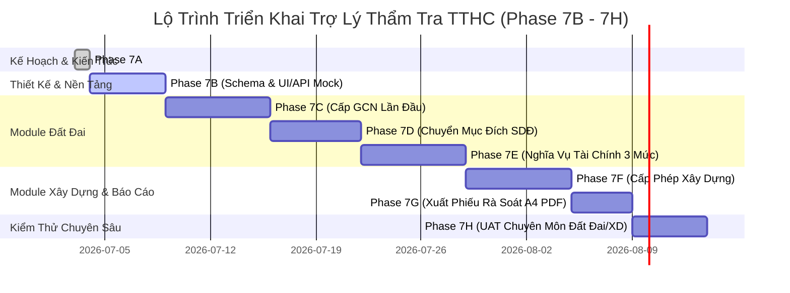

# Kế Hoạch Kỹ Thuật Phase 7A: Trợ Lý Thẩm Tra Hồ Sơ Thủ Tục Hành Chính Lĩnh Vực Đất Đai & Xây Dựng
**(Administrative Procedure AI Analysis Plan – Land & Construction)**

*Tên module đề xuất:* **Trợ lý thẩm tra hồ sơ TTHC (Administrative Procedure AI Assistant)**  
*Phiên bản tài liệu:* v2.5.0-phase7a-plan  
*Ngày lập:* 03/07/2026  
*Trạng thái:* Kế hoạch thiết kế nghiệp vụ & kỹ thuật (Chưa sửa source code, chưa sửa schema, chưa deploy thật)  

---

## 1. Mục Tiêu

Phase 7A đánh dấu bước chuyển mình quan trọng của LegalFlow từ hệ thống hỗ trợ tiếp nhận, xử lý đơn thư khiếu nại/tố cáo (Phase 1–6) sang **Hệ thống AI Trợ lý chuyên môn sâu về Thẩm tra hồ sơ Thủ tục hành chính (TTHC)** trọng điểm thuộc hai lĩnh vực phức tạp nhất: **Đất đai** và **Xây dựng**.

Mục tiêu cụ thể của Phase 7A bao gồm:
1. **Thiết kế kiến trúc tổng thể** cho module Trợ lý thẩm tra hồ sơ TTHC, hỗ trợ cán bộ một cửa và chuyên viên phòng/ban chuyên môn rà soát toàn diện, phân tích, đối chiếu thành phần hồ sơ.
2. **Xây dựng trợ lý chuyên môn sâu:** AI không dừng lại ở tóm tắt hay rà soát chung chung mà đóng vai trò như một chuyên viên trợ lý: nhận diện chính xác thiếu sót tài liệu, phân tích mâu thuẫn thông tin (ranh giới, diện tích, thời điểm sử dụng đất, chỉ giới xây dựng), gợi ý nội dung cần cán bộ kiểm tra thực địa/hồ sơ gốc, và đề xuất căn cứ pháp lý đối chiếu.
3. **Chuẩn hóa quy trình hỗ trợ tính toán nghĩa vụ tài chính:** Thiết kế mô hình 3 mức an toàn để hỗ trợ lập bảng tính dự kiến nghĩa vụ tài chính/tiền sử dụng đất, đảm bảo tuân thủ tuyệt đối quy định pháp luật và không gây rủi ro pháp lý cho cơ quan hành chính.
4. **Lập lộ trình triển khai rõ ràng (Roadmap 7B–7H):** Xác định bước đi tuần tự từ thiết kế schema/mock, phát triển từng module TTHC đất đai, xây dựng, xuất phiếu rà soát cho đến kiểm thử người dùng (UAT chuyên môn).

---

## 2. Phạm Vi Phase 7A

Phase 7A là giai đoạn **Lập kế hoạch thiết kế kiến trúc, nghiệp vụ và an toàn AI**. Phạm vi được giới hạn nghiêm ngặt:
1. **Chỉ lập kế hoạch:** Xây dựng tài liệu kỹ thuật, kiến trúc dữ liệu và luồng nghiệp vụ.
2. **Chưa sửa source code:** Không chỉnh sửa bất kỳ file mã nguồn NestJS hay React/Vite hiện tại.
3. **Chưa sửa database/schema:** Không chỉnh sửa `prisma/schema.prisma`.
4. **Chưa tạo migration:** Không chạy lệnh tạo hay áp dụng migration mới.
5. **Chưa tạo UI mới:** Chỉ đề xuất thiết kế giao diện (wireframe/structure), chưa code component.
6. **Chưa tạo endpoint mới:** Chỉ định nghĩa đặc tả API RESTful, chưa triển khai controller/service.
7. **Chưa tích hợp dữ liệu thật:** Không kết nối với cơ sở dữ liệu địa chính hay xây dựng thực tế.
8. **Chưa tạo RAG/index thật:** Chỉ thiết kế cấu trúc kho tri thức, chưa chạy indexing vector.
9. **Chưa phát hành văn bản:** Hệ thống không có khả năng tự phát hành quyết định, thông báo hay giấy phép.
10. **Chưa ký số:** Không tích hợp chứng thư số hay chữ ký số tự động.
11. **Chưa gửi văn bản/email cho công dân:** Không kết nối cổng dịch vụ công hay gửi thông báo tự động ra ngoài.
12. **Chưa tự động thay đổi trạng thái hồ sơ:** AI không có quyền chuyển trạng thái từ thụ lý sang đủ/không đủ điều kiện.
13. **Chưa triển khai tính toán nghĩa vụ tài chính thật trong code:** Phase 7A chỉ thiết kế nguyên tắc, dữ liệu, công thức, cảnh báo và quy trình kiểm tra 3 mức.

---

## 3. Nguyên Tắc Human-in-the-Loop

Mọi hoạt động của module Trợ lý thẩm tra hồ sơ TTHC phải tuân thủ tuyệt đối **Tuyên ngôn Human-in-the-Loop (Con người là trung tâm quyết định)**:

1. **AI không thay cán bộ chuyên môn:** AI đóng vai trò công cụ hỗ trợ đọc hồ sơ, trích xuất dữ liệu, tổng hợp thông tin, gợi ý rà soát và tạo bản nháp. Cán bộ chuyên môn là người trực tiếp đọc, kiểm tra, thẩm định và chịu trách nhiệm pháp lý cuối cùng về hồ sơ.
2. **AI không kết luận thay cán bộ:** AI tuyệt đối không đưa ra các phán quyết mang tính pháp lý như "Hồ sơ đủ điều kiện cấp GCN", "Hồ sơ đủ điều kiện cấp phép xây dựng" hay "Từ chối hồ sơ". AI chỉ đưa ra các phân tích mang tính khuyến nghị kỹ thuật kèm lý do và căn cứ rủi ro.
3. **AI không tự phê duyệt hay chuyển trạng thái:** Cán bộ xử lý là chủ thể duy nhất có quyền thực hiện thao tác chuyển trạng thái hồ sơ (Ví dụ: Chuyển bổ sung hồ sơ, Trình lãnh đạo, Trả kết quả).
4. **AI không tự phát hành văn bản hay ký số:** Mọi phiếu thẩm tra, bảng tính dự kiến hay thông báo yêu cầu bổ sung do AI tạo ra đều là bản thảo nội bộ.
5. **Nhãn cảnh báo bắt buộc:** Toàn bộ giao diện hiển thị kết quả phân tích AI, phiếu rà soát, bảng tính dự kiến phải in đậm nhãn:
   > **“BẢN GỢI Ý AI – CÁN BỘ PHẢI KIỂM TRA”**
6. **Audit Log toàn diện:** Mọi thao tác của cán bộ (chấp nhận kết quả phân tích AI, chỉnh sửa dữ liệu đầu vào, từ chối gợi ý, áp dụng phiếu rà soát) đều phải được ghi lại trong `ProcedureAuditLog` với đầy đủ thông tin `userId`, `timestamp`, `action`, `oldValue`, `newValue` để phục vụ thanh tra, kiểm tra.

---

## 4. Nguyên Tắc AI Hỗ Trợ Chuyên Môn Sâu

Để vượt qua giới hạn của các công cụ tóm tắt văn bản thông thường, Trợ lý thẩm tra TTHC LegalFlow được thiết kế theo các nguyên tắc chuyên môn sâu:

1. **Hiểu sâu cấu trúc hồ sơ TTHC:** AI được định hướng để nhận biết đặc thù từng loại thủ tục (Đất đai vs Xây dựng), biết phân loại từng loại giấy tờ chuyên ngành (Sổ đỏ cũ, Bản đồ hiện trạng, Hợp đồng chuyển nhượng, Bản vẽ kiến trúc, Thuyết minh PCCC).
2. **Nhận diện thiếu sót & Đối chiếu chéo (Cross-Validation):** AI tự động đối chiếu thông tin giữa các tài liệu trong cùng một hồ sơ. Ví dụ: Đối chiếu họ tên/CCCD giữa Đơn đăng ký và Giấy tờ quyền sử dụng đất; đối chiếu diện tích giữa Bản vẽ đo đạc hiện trạng và Sổ đỏ gốc; đối chiếu số tầng/chiều cao giữa Bản vẽ thiết kế và Giấy phép quy hoạch.
3. **Khuyến nghị có căn cứ & Phân cấp rủi ro:** Mỗi nhận xét hay cảnh báo của AI đều phải gắn liền với mức độ rủi ro (`HIGH`, `MEDIUM`, `LOW`) và trích dẫn điều khoản pháp lý tương ứng. Nếu phát hiện điểm bất thường, AI phải chỉ rõ lý do vì sao cần kiểm tra.
4. **Gợi ý hướng xử lý & Câu hỏi bổ sung nghiệp vụ:** Thay vì nói "Hồ sơ thiếu thông tin", AI tự động soạn thảo danh sách câu hỏi nghiệp vụ hoặc danh mục giấy tờ cụ thể cần yêu cầu công dân/chủ đầu tư làm rõ, giúp cán bộ tiết kiệm thời gian soạn thông báo bổ sung hồ sơ.
5. **Gợi ý nội dung cần thẩm tra thực địa/hồ sơ lưu trữ:** AI chỉ ra chính xác các điểm mờ cần cán bộ kiểm tra thực tế tại hiện trường (như tranh chấp ranh giới, đường đi chung, công trình ngầm) hoặc tra cứu hồ sơ địa chính lưu trữ tại cơ quan.

---

## 5. Phân Tích Nghiệp Vụ Từng Nhóm Thủ Tục

### A. Cấp Giấy chứng nhận quyền sử dụng đất lần đầu (Đăng ký đất đai lần đầu)
- **Thành phần hồ sơ đầu vào:** Đơn đăng ký cấp GCN (Mẫu quy định); Giấy tờ về quyền sử dụng đất (theo Điều 137 Luật Đất đai 2024); Trích lục/Bản đồ địa chính hoặc Bản vẽ đo đạc hiện trạng; Giấy tờ nhân thân/khai sinh/hộ khẩu (chứng minh đối tượng giao đất/miễn giảm); Chứng từ thực hiện nghĩa vụ tài chính liên quan.
- **Thông tin người sử dụng đất:** Cá nhân, hộ gia đình, cộng đồng dân cư hay tổ chức; đối chiếu sự thống nhất về họ tên, số định danh cá nhân (CCCD), địa chỉ thường trú qua các thời kỳ.
- **Thông tin thửa đất:** Số tờ bản đồ, số thửa, địa chỉ thửa đất, diện tích đo đạc thực tế so với giấy tờ cũ.
- **Nguồn gốc sử dụng đất:** Giao đất không đúng thẩm quyền, khai hoang, nhận chuyển nhượng bằng giấy tay, được cha mẹ cho tặng, hoặc tự ý chuyển mục đích từ xưa.
- **Thời điểm sử dụng đất:** Mốc thời gian cực kỳ quan trọng theo Luật Đất đai 2024 (trước 18/12/1980; từ 18/12/1980 đến trước 15/10/1993; từ 15/10/1993 đến trước 01/07/2014; từ 01/07/2014 đến nay) để xác định điều kiện cấp GCN và mức thu tiền sử dụng đất.
- **Hiện trạng sử dụng đất & Tài sản gắn liền với đất:** Loại đất đang sử dụng thực tế (đất ở, đất nông nghiệp); nhà ở, công trình xây dựng trên đất (thời điểm tạo lập công trình).
- **Tranh chấp/khiếu nại & Quy hoạch:** Kiểm tra tình trạng có tranh chấp hay bị kê biên thi hành án hay không; sự phù hợp với Quy hoạch sử dụng đất cấp huyện, Kế hoạch sử dụng đất hàng năm.
- **Nội dung cần cán bộ kiểm tra:** Đối chiếu chữ ký, con dấu trên giấy tờ gốc; kiểm tra thực địa sự phù hợp ranh giới; lấy ý kiến khu dân cư về nguồn gốc và thời điểm sử dụng đất (nếu không có giấy tờ theo Điều 138 Luật Đất đai 2024).
- **Khuyến nghị của AI:** AI tổng hợp bảng đối chiếu, cảnh báo các mốc thời gian nhạy cảm, gợi ý cán bộ xác minh nguồn gốc đất nhưng **tuyệt đối không kết luận thay cán bộ đủ hay không đủ điều kiện cấp GCN**.

---

### B. Chuyển mục đích sử dụng đất
- **Thông tin đầu vào:** Loại đất hiện tại (theo GCN đã cấp); Mục đích xin chuyển (ví dụ: từ đất trồng lúa/đất trồng cây lâu năm sang đất ở); Diện tích xin chuyển mục đích.
- **Thông tin quy hoạch/kế hoạch sử dụng đất:** Kiểm tra sự phù hợp tuyệt đối với Kế hoạch sử dụng đất hàng năm cấp huyện đã được cơ quan có thẩm quyền phê duyệt hoặc Quy hoạch chung/Quy hoạch phân khu đô thị.
- **Căn cứ cho phép chuyển mục đích:** Đối chiếu Điều 116 và Điều 121 Luật Đất đai 2024 về các trường hợp chuyển mục đích phải xin phép cơ quan nhà nước có thẩm quyền.
- **Thành phần hồ sơ:** Đơn xin chuyển mục đích sử dụng đất; Giấy chứng nhận quyền sử dụng đất (Sổ đỏ/Sổ hồng gốc); Bản vẽ trích đo vị trí phần đất xin chuyển mục đích.
- **Cơ quan/bộ phận phối hợp:** Phòng Tài nguyên và Môi trường, Văn phòng Đăng ký đất đai, Chi cục Thuế (để xác định nghĩa vụ tài chính), UBND cấp xã (xác nhận hiện trạng).
- **Rủi ro nghiệp vụ:** Chuyển mục đích trái quy hoạch; vượt hạn mức đất ở giao cho hộ gia đình tại địa phương; chia nhỏ thửa đất trái quy định về diện tích tối thiểu tách thửa.
- **Khuyến nghị của AI:** Phân tích sự khớp nối giữa đơn xin và thông tin thửa đất, chỉ ra các quy định hạn mức tại địa phương cần kiểm tra, gợi ý danh sách câu hỏi làm rõ thực trạng nhưng **không kết luận thay cán bộ được hay không được chuyển mục đích**.

---

### C. Kiểm tra/lập bảng tính dự kiến nghĩa vụ tài chính, tiền sử dụng đất
Đây là nghiệp vụ nhạy cảm, có hệ quả pháp lý và tài chính trực tiếp tới người dân và ngân sách nhà nước. Cần áp dụng cách diễn đạt chuẩn mực:
> **“AI hỗ trợ lập bảng tính dự kiến nghĩa vụ tài chính/tiền sử dụng đất theo dữ liệu đầu vào và căn cứ đã được cấu hình; cán bộ/cơ quan có thẩm quyền kiểm tra, xác nhận trước khi sử dụng.”**

#### Thiết kế chức năng phân làm 3 mức rõ ràng:

* **Mức 1 – Kiểm tra dữ liệu đầu vào:**
  - AI rà soát hồ sơ để bóc tách các thông số đầu vào bắt buộc: Diện tích tính tiền; Loại đất trước khi chuyển; Mục đích sử dụng đất sau khi chuyển; Nguồn gốc sử dụng đất; Thời điểm bắt đầu sử dụng đất; Thông tin trong hoặc ngoài hạn mức đất ở; Thông tin đối tượng được miễn/giảm (người có công, hộ nghèo, vùng đặc biệt khó khăn).
  - AI kiểm tra xem các thông số này đã có sự xác nhận chính thức bằng văn bản của cơ quan chuyên môn (UBND cấp xã, Văn phòng Đăng ký đất đai) hay chưa.
  - **Cảnh báo bắt buộc:** Nếu phát hiện thiếu bảng giá đất, giá đất cụ thể, nguồn gốc đất, thời điểm sử dụng đất, diện tích hợp lệ hoặc dữ liệu pháp lý địa phương, AI **phải dừng tính toán** và trả về thông báo lỗi:
    > **“Chưa đủ dữ liệu để lập bảng tính dự kiến”**

* **Mức 2 – Lập bảng tính dự kiến:**
  - Khi Mức 1 đã đầy đủ dữ liệu, AI áp dụng công thức theo cấu hình pháp luật (Ví dụ: Tiền sử dụng đất = [Giá đất ở x Diện tích] - [Giá đất nông nghiệp x Diện tích] theo Nghị định 103/2024/NĐ-CP).
  - Kết quả hiển thị minh bạch các thành phần: Dữ liệu đầu vào chi tiết; Công thức diễn giải chi tiết từng bước; Nguồn dữ liệu giá đất (trích dẫn Quyết định Bảng giá đất hoặc Quyết định giá đất cụ thể của UBND cấp tỉnh); Các giả định tính toán (nếu có); Kết quả tạm tính dự kiến.
  - Kèm theo danh sách cảnh báo rủi ro và các điểm cần cán bộ thuế/tài nguyên kiểm tra chéo. **Tuyệt đối không phát hành kết quả nghĩa vụ tài chính chính thức.**

* **Mức 3 – Phiếu tính để cán bộ kiểm tra/xác nhận:**
  - Hệ thống xuất "Phiếu rà soát dự kiến nghĩa vụ tài chính" dưới dạng trình bày chuẩn mực cho cán bộ chuyên môn kiểm tra.
  - Tiêu đề phiếu luôn in đậm nhãn cảnh báo: **“BẢN GỢI Ý AI – CÁN BỘ PHẢI KIỂM TRA”**.
  - Phiếu lưu vào hệ thống để cán bộ thẩm tra ghi nhận ý kiến đồng ý hoặc điều chỉnh số liệu. Không tự động gửi cho công dân, không tự động chuyển trạng thái hồ sơ hay phát hành thông báo nộp tiền.

---

### D. Thủ tục hành chính lĩnh vực xây dựng (Cấp Giấy phép xây dựng công trình phổ biến / nhà ở riêng lẻ)
- **Thông tin chủ đầu tư & công trình:** Tên chủ đầu tư, địa chỉ xây dựng, loại công trình, cấp công trình.
- **Giấy tờ quyền sử dụng đất:** Giấy chứng nhận quyền sử dụng đất hợp pháp; kiểm tra diện tích đất ở được phép xây dựng.
- **Bản vẽ thiết kế xây dựng:** Mặt bằng vị trí công trình trên lô đất, mặt bằng các tầng, mặt đứng, mặt cắt chủ yếu, bản vẽ móng và kết cấu chịu lực chính.
- **Đối chiếu Quy hoạch & Chỉ tiêu kiến trúc:**
  - **Quy hoạch phân khu / Quy hoạch chi tiết 1/500 / Thiết kế đô thị:** Kiểm tra chức năng sử dụng đất có được phép xây dựng công trình hay không.
  - **Chỉ giới đường đỏ & Chỉ giới xây dựng:** Kiểm tra khoảng lùi tối thiểu đối với đường giao thông trước mặt theo Quy chuẩn kỹ thuật quốc gia về Quy hoạch xây dựng (QCVN 01:2021/BXD).
  - **Mật độ xây dựng thuần tối đa (%):** Đối chiếu diện tích chiếm đất của công trình so với tổng diện tích lô đất theo hạn mức cho phép.
  - **Tầng cao tối đa & Chiều cao công trình:** Đối chiếu số tầng nổi, tầng hầm, tầng lửng, tum thang và tổng chiều cao công trình (mét) so với quy định khu vực.
- **Điều kiện an toàn đặc thù:** Kiểm tra văn bản thẩm duyệt phòng cháy chữa cháy (PCCC) hoặc quyết định phê duyệt báo cáo đánh giá tác động môi trường (nếu thuộc diện theo luật định).
- **Nội dung cần cán bộ xây dựng kiểm tra:** Thẩm định độ an toàn chịu lực của bản vẽ thiết kế (nếu cần); kiểm tra hiện trạng công trình liền kề để tránh gây sụt lún, nứt vỡ; kiểm tra chỉ giới đường lối thoát nước chung.
- **Khuyến nghị của AI:** Chỉ ra các thông số vượt ngưỡng (ví dụ: "Bản vẽ thể hiện mật độ xây dựng 85%, vượt ngưỡng tối đa cho phép là 75% đối với lô đất 120m2 theo QCVN 01:2021/BXD"), gợi ý yêu cầu điều chỉnh bản vẽ nhưng **không kết luận thay cán bộ được hay không được cấp phép xây dựng**.

---

## 6. Thiết Kế Kiến Trúc Module

### 6.1. Phân Tích: Tách module TTHC khỏi `LegalCase` hay Tái sử dụng?

| Tiêu chí | Phương án 1: Tái sử dụng bảng `LegalCase` hiện có | Phương án 2: Tách module riêng (`AdministrativeProcedureCase`) |
| :--- | :--- | :--- |
| **Bản chất nghiệp vụ** | `LegalCase` được thiết kế phục vụ đơn thư khiếu nại, tố cáo, kiến nghị, phản ánh (có người khiếu nại, người bị khiếu nại, đối tượng tranh chấp). | Hồ sơ TTHC là quy trình giải quyết thủ tục hành chính công (chủ đầu tư/người sử dụng đất nộp hồ sơ xin cấp phép/cấp sổ, không có đối tượng bị khiếu nại). |
| **Cấu trúc dữ liệu chuyên ngành** | Phải nhồi nhét dữ liệu thửa đất, bản vẽ, mật độ xây dựng, bảng giá đất vào trường `metadata JSONB` của `LegalCase`, gây phình to và khó kiểm soát kiểu dữ liệu. | Có mô hình quan hệ rõ ràng cho từng thuộc tính chuyên ngành (thửa đất, công trình, nghĩa vụ tài chính, checklist TTHC). |
| **Lọc & Báo cáo thống kê** | Trộn lẫn giữa đơn thư khiếu nại và hồ sơ TTHC, gây nhầm lẫn trong thống kê báo cáo tiến độ giải quyết đơn thư của đơn vị. | Tách bạch hoàn toàn nghiệp vụ Đơn thư khiếu nại và nghiệp vụ Thẩm tra TTHC một cửa/chuyên môn. |
| **Khả năng mở rộng tương lai** | Khó mở rộng thêm các quy trình thẩm tra chuyên sâu khác (như cấp phép môi trường, đăng ký kinh doanh). | Kiến trúc sạch, rành mạch, dễ dàng thêm các domain TTHC mới mà không ảnh hưởng hệ thống cũ. |

### 6.2. Khuyến Nghị Phương Án Tối Ưu
**Khuyến nghị chọn Phương án 2: Tách module độc lập (`AdministrativeProcedureCase`).**  
Việc tách module giúp hệ thống LegalFlow v2 duy trì kiến trúc chuẩn Modular Monolith, giữ cho nghiệp vụ xử lý đơn thư (`LegalCase`) an toàn, ổn định và cho phép module Trợ lý thẩm tra TTHC phát triển chuyên sâu với schema và API được tối ưu riêng biệt.

---

## 7. Đề Xuất Dữ Liệu & Mô Hình (Data Models)

*(Lưu ý: Phase 7A chỉ đề xuất mô hình dữ liệu lý thuyết để phục vụ lập kế hoạch, chưa chỉnh sửa `schema.prisma` và chưa tạo migration).*



1. **`AdministrativeProcedureCase` (Hồ sơ TTHC chính):**
   - `id`, `caseCode` (Mã hồ sơ TTHC, ví dụ: `TTHC-DD-2026-001`), `procedureType` (Enum: `LAND_FIRST_REGISTRATION`, `LAND_PURPOSE_CHANGE`, `CONSTRUCTION_PERMIT`, etc.), `applicantName`, `applicantIdCard`, `applicantAddress`, `status` (Enum: `SUBMITTED`, `IN_REVIEW`, `SUPPLEMENT_REQUESTED`, `PENDING_APPROVAL`, `COMPLETED`), `assignedToId`, `createdAt`, `updatedAt`.
2. **`ProcedureType` (Danh mục thủ tục hành chính):**
   - `id`, `code`, `name`, `domain` (Enum: `LAND`, `CONSTRUCTION`), `legalReferencesJSON`, `defaultChecklistTemplateJSON`.
3. **`ProcedureDocument` (Tài liệu đính kèm hồ sơ):**
   - `id`, `caseId`, `fileName`, `fileUrl`, `fileSize`, `documentCategory` (Enum: `LAND_USE_RIGHT_CERT`, `ID_CARD`, `SURVEY_MAP`, `CONSTRUCTION_DRAWING`, etc.), `uploadedAt`.
4. **`ProcedureChecklistItem` (Mục kiểm tra thẩm định):**
   - `id`, `caseId`, `itemCode`, `title`, `description`, `category` (Enum: `LEGAL_DOCS`, `TECHNICAL_PARAMS`, `FINANCIAL_INPUTS`, `FIELD_VERIFICATION`), `isMandatory`, `status` (Enum: `PENDING`, `PASSED`, `NEEDS_CLARIFICATION`, `FAILED`), `verifiedByUserId`, `verifiedAt`, `officerNote`.
5. **`ProcedureAiAnalysis` (Kết quả rà soát của AI Trợ lý):**
   - `id`, `caseId`, `modelUsed` (e.g., `gemini-1.5-pro`), `summary`, `detectedProcedureType`, `detectedDocumentsJSON`, `missingDocumentsJSON`, `parcelAnalysisJSON`, `constructionAnalysisJSON`, `riskFlagsJSON`, `recommendationsJSON`, `nextQuestionsJSON`, `officerChecklistJSON`, `confidenceLevel`, `status` (Enum: `SUGGESTED`, `APPROVED_BY_OFFICER`, `REJECTED_BY_OFFICER`), `createdAt`.
6. **`ProcedureFinancialReview` (Phiếu kiểm tra nghĩa vụ tài chính 3 mức):**
   - `id`, `caseId`, `reviewLevel` (`LEVEL_1_INPUT`, `LEVEL_2_CALCULATION`, `LEVEL_3_VERIFIED`), `landArea`, `oldLandType`, `newLandType`, `landOrigin`, `usageStartDate`, `applicablePriceTableRef`, `specificLandPrice`, `adjustmentCoefficient`, `exemptionReductionDetails`, `isDataSufficient` (Boolean), `insufficientDataWarning` (String), `formulaExplanation`, `estimatedTotalAmount`, `officerStatus` (`PENDING`, `CONFIRMED`, `ADJUSTED`), `verifiedByUserId`, `updatedAt`.
7. **`ProcedureAuditLog` (Lịch sử kiểm toán thao tác TTHC):**
   - `id`, `caseId`, `userId`, `action` (e.g., `AI_ANALYSIS_GENERATED`, `OFFICER_APPROVED_AI_RECOMMENDATION`, `OFFICER_UPDATED_FINANCIAL_INPUT`), `oldValueJSON`, `newValueJSON`, `ipAddress`, `timestamp`.
8. **`ProcedureNote` (Ghi chú/Ý kiến xử lý nghiệp vụ):**
   - `id`, `caseId`, `userId`, `noteContent`, `noteType` (`OFFICER_DRAFT`, `FIELD_INSPECTION_NOTE`, `SUPERVISOR_DIRECTIVE`), `createdAt`.

---

## 8. Đề Xuất Giao Diện & API (UI & API Architecture)

### 8.1. Đề Xuất Cấu Trúc Giao Diện (UI Wireframe Concepts)
Module Trợ lý thẩm tra TTHC sẽ được bổ sung vào thanh điều hướng chính dưới menu **"Thẩm tra TTHC (AI Assistant)"**, bao gồm các màn hình chính:

1. **Màn hình Danh sách Hồ sơ TTHC:**
   - Bộ lọc theo lĩnh vực (Đất đai / Xây dựng), loại thủ tục, trạng thái thẩm tra, cán bộ thụ lý.
   - Hiển thị nhanh huy hiệu rà soát AI (Ví dụ: `AI: Có 2 cảnh báo rủi ro cao`, `AI: Chưa đủ dữ liệu tính tiền`).
2. **Màn hình Tiếp nhận / Tạo mới Hồ sơ TTHC:**
   - Nhập thông tin người nộp đơn, chọn loại thủ tục, tải lên các tài liệu đính kèm (PDF/Hình ảnh).
3. **Màn hình Chi tiết Hồ sơ TTHC (Trang làm việc chuyên sâu):**
   Được chia thành 7 Tab làm việc trực quan:
   - **Tab 1: Tổng quan & Tài liệu (Documents):** Xem danh sách file, xem trước tài liệu A4 song song bên màn hình trái.
   - **Tab 2: AI Rà soát & Khuyến nghị (AI Analysis):** Hiển thị bản tóm tắt hồ sơ, đối chiếu thông tin, cảnh báo rủi ro pháp lý, gợi ý hướng xử lý và danh sách câu hỏi cần làm rõ. Luôn hiển thị banner cảnh báo: **“BẢN GỢI Ý AI – CÁN BỘ PHẢI KIỂM TRA”**. Có nút hành động: `[Chấp nhận gợi ý AI]` / `[Từ chối/Yêu cầu AI rà soát lại]`.
   - **Tab 3: Checklist Thẩm tra (Checklist):** Danh sách các tiêu chí kiểm tra bắt buộc (Tài liệu pháp lý, Thông số kỹ thuật, Hiện trường). Cán bộ tích chọn xác nhận `Đạt` / `Cần làm rõ`.
   - **Tab 4: Nghĩa vụ tài chính (Financial Review):** Giao diện làm việc theo 3 mức (Mức 1: Bảng dữ liệu đầu vào; Mức 2: Bảng tính dự kiến với công thức chi tiết; Mức 3: Nút xác nhận của cán bộ). Nếu thiếu thông số, hiển thị khung đỏ: *“Chưa đủ dữ liệu để lập bảng tính dự kiến”*.
   - **Tab 5: Ghi chú & Lịch sử xử lý (Notes & Trajectory):** Nơi cán bộ trao đổi nội bộ, ghi chú kết quả kiểm tra hiện trường.
   - **Tab 6: Audit Log (Nhật ký kiểm toán):** Hiển thị chi tiết từng thao tác can thiệp hay duyệt AI của cán bộ theo mốc thời gian.
   - **Tab 7: Xem & In Phiếu rà soát (Print Preview):** Xem trước Phiếu thẩm tra TTHC chuẩn trang A4 trên trình duyệt để in hoặc lưu PDF thảo luận nghiệp vụ.

### 8.2. Đề Xuất Danh Sách API Endpoints (RESTful specification)

```text
POST   /api/v1/procedures/cases                     -> Tạo mới hồ sơ TTHC
GET    /api/v1/procedures/cases                     -> Lấy danh sách hồ sơ (kèm phân trang, lọc)
GET    /api/v1/procedures/cases/:id                 -> Lấy chi tiết toàn bộ hồ sơ TTHC
POST   /api/v1/procedures/cases/:id/documents       -> Upload tài liệu đính kèm TTHC

POST   /api/v1/procedures/cases/:id/ai/analyze      -> Kích hoạt AI rà soát toàn diện hồ sơ
POST   /api/v1/procedures/cases/:id/ai/financial    -> Kích hoạt AI kiểm tra dữ liệu & lập bảng tính dự kiến
POST   /api/v1/procedures/cases/:id/ai/checklist    -> Kích hoạt AI gợi ý checklist thẩm tra chuyên ngành

PUT    /api/v1/procedures/cases/:id/ai/review       -> Cán bộ ghi nhận chấp nhận/từ chối kết quả rà soát AI
PUT    /api/v1/procedures/cases/:id/financial       -> Cán bộ cập nhật/xác nhận phiếu tính nghĩa vụ tài chính
PUT    /api/v1/procedures/cases/:id/checklist/:itemId -> Cán bộ thẩm định tiêu chí trong checklist

GET    /api/v1/procedures/cases/:id/audit-logs      -> Lấy nhật ký audit log của hồ sơ
```

---

## 9. Đề Xuất AI Prompt & Output Schema (JSON Có Kiểm Soát)

Để đảm bảo AI trả về kết quả cấu trúc nghiêm ngặt, chính xác 100% theo định dạng máy có thể đọc (machine-readable) để render lên giao diện React, hệ thống sử dụng cấu trúc **Structured JSON Output Schema** kèm System Prompt kiểm soát an toàn.

### 9.1. Chuẩn Output JSON Schema

```json
{
  "$schema": "http://json-schema.org/draft-07/schema#",
  "title": "ProcedureAiAnalysisOutput",
  "type": "object",
  "required": [
    "summary",
    "procedureType",
    "detectedDocuments",
    "missingOrNeedCheckDocuments",
    "landParcelInfo",
    "constructionInfo",
    "financialInputReview",
    "financialDraftCalculation",
    "legalBasisToCheck",
    "riskFlags",
    "recommendations",
    "recommendedNextQuestions",
    "officerChecklist",
    "disclaimer",
    "confidenceLevel"
  ],
  "properties": {
    "summary": { "type": "string" },
    "procedureType": { "type": "string" },
    "detectedDocuments": {
      "type": "array",
      "items": {
        "type": "object",
        "properties": {
          "docName": { "type": "string" },
          "category": { "type": "string" },
          "status": { "type": "string", "enum": ["VALID", "EXPIRED", "UNCLEAR"] }
        }
      }
    },
    "missingOrNeedCheckDocuments": {
      "type": "array",
      "items": { "type": "string" }
    },
    "landParcelInfo": {
      "type": "object",
      "properties": {
        "mapSheetNumber": { "type": "string" },
        "parcelNumber": { "type": "string" },
        "areaSqMeters": { "type": "number" },
        "currentLandType": { "type": "string" },
        "proposedLandType": { "type": "string" },
        "landOrigin": { "type": "string" },
        "usageStartDate": { "type": "string" }
      }
    },
    "constructionInfo": {
      "type": "object",
      "properties": {
        "projectType": { "type": "string" },
        "buildingDensityPercent": { "type": "number" },
        "numberOfFloors": { "type": "integer" },
        "totalHeightMeters": { "type": "number" },
        "setbackMeters": { "type": "number" }
      }
    },
    "financialInputReview": {
      "type": "object",
      "required": ["isDataSufficient", "insufficientDataWarning", "checkedInputs"],
      "properties": {
        "isDataSufficient": { "type": "boolean" },
        "insufficientDataWarning": { "type": "string" },
        "checkedInputs": {
          "type": "array",
          "items": {
            "type": "object",
            "properties": {
              "paramName": { "type": "string" },
              "paramValue": { "type": "string" },
              "isVerifiedByAuthority": { "type": "boolean" }
            }
          }
        }
      }
    },
    "financialDraftCalculation": {
      "type": "object",
      "properties": {
        "canCalculate": { "type": "boolean" },
        "formula": { "type": "string" },
        "appliedPriceTableSource": { "type": "string" },
        "assumptions": { "type": "array", "items": { "type": "string" } },
        "estimatedAmountVND": { "type": "number" },
        "officerVerificationRequiredText": { "type": "string" }
      }
    },
    "legalBasisToCheck": {
      "type": "array",
      "items": {
        "type": "object",
        "properties": {
          "lawDoc": { "type": "string" },
          "article": { "type": "string" },
          "content": { "type": "string" }
        }
      }
    },
    "riskFlags": {
      "type": "array",
      "items": {
        "type": "object",
        "properties": {
          "riskLevel": { "type": "string", "enum": ["HIGH", "MEDIUM", "LOW"] },
          "issue": { "type": "string" },
          "reasonToVerify": { "type": "string" }
        }
      }
    },
    "recommendations": {
      "type": "array",
      "items": { "type": "string" }
    },
    "recommendedNextQuestions": {
      "type": "array",
      "items": { "type": "string" }
    },
    "officerChecklist": {
      "type": "array",
      "items": {
        "type": "object",
        "properties": {
          "itemCode": { "type": "string" },
          "title": { "type": "string" },
          "category": { "type": "string" },
          "reason": { "type": "string" }
        }
      }
    },
    "disclaimer": { "type": "string" },
    "confidenceLevel": { "type": "number", "minimum": 0, "maximum": 1 }
  }
}
```

### 9.2. System Prompt Kiểm Soát An Toàn AI
Mỗi yêu cầu gửi tới Gemini API trong module này bắt buộc đi kèm System Instructions tuân thủ các quy tắc sắt:
- **Quy tắc 1:** Tuân thủ tuyệt đối tuyên ngôn: *“AI hỗ trợ rà soát toàn diện hồ sơ thủ tục hành chính nhưng không thay cán bộ chuyên môn và không tự kết luận hồ sơ đủ hay không đủ điều kiện.”*
- **Quy tắc 2:** Luôn gán giá trị của `disclaimer` bằng chuỗi chính xác:  
  **`"BẢN GỢI Ý AI – CÁN BỘ PHẢI KIỂM TRA"`**
- **Quy tắc 3 (Quy tắc nghĩa vụ tài chính):** Trong trường `financialDraftCalculation.officerVerificationRequiredText`, luôn diễn đạt theo chuẩn ngữ pháp:  
  **`"AI hỗ trợ lập bảng tính dự kiến nghĩa vụ tài chính/tiền sử dụng đất theo dữ liệu đầu vào và căn cứ đã được cấu hình; cán bộ/cơ quan có thẩm quyền kiểm tra, xác nhận trước khi sử dụng."`**  
  Tuyệt đối không dùng cụm từ *"AI tự tính tiền sử dụng đất chính thức"*.
- **Quy tắc 4 (Quy tắc cảnh báo thiếu dữ liệu):** Trong `financialInputReview`, nếu bất kỳ thông số nào (bảng giá đất, giá đất cụ thể, nguồn gốc đất, thời điểm sử dụng đất hoặc diện tích hợp lệ) bị thiếu hoặc không rõ ràng, phải đặt `isDataSufficient = false` và gán `insufficientDataWarning` bằng chuỗi chính xác:  
  **`"Chưa đủ dữ liệu để lập bảng tính dự kiến"`**
- **Quy tắc 5 (Quy tắc kho tri thức pháp lý):** Không được tự bịa đặt số điều khoản luật (Hallucination). Nếu không tìm thấy căn cứ chính xác trong kho tri thức được cung cấp, ghi rõ vào `legalBasisToCheck`:  
  **`"Cần cán bộ bổ sung/kiểm tra căn cứ"`**

---

## 10. Kho Tri Thức & Căn Cứ Pháp Lý (Knowledge Base Architecture)

Để Trợ lý AI có thể phân tích chính xác, hệ thống cần được cấu hình một kho tri thức văn bản pháp luật chuyên ngành (Legal Procedure Knowledge Base) được quản lý có hệ thống.

### 10.1. Danh Sách Văn Bản Pháp Luật Tối Thiểu Cần Đưa Vào Kho Tri Thức
1. **Lĩnh vực Đất đai:**
   - **Luật Đất đai năm 2024** (Luật số 31/2024/QH15).
   - **Nghị định 101/2024/NĐ-CP:** Quy định về điều tra cơ bản đất đai; đăng ký, cấp Giấy chứng nhận quyền sử dụng đất, quyền sở hữu tài sản gắn liền với đất và hệ thống thông tin đất đai.
   - **Nghị định 102/2024/NĐ-CP:** Quy định chi tiết thi hành một số điều của Luật Đất đai.
   - **Nghị định 103/2024/NĐ-CP:** Quy định về tiền sử dụng đất, tiền thuê đất.
   - Các văn bản sửa đổi, bổ sung, hướng dẫn thi hành mới nhất.
   - **Quyết định công bố thủ tục hành chính lĩnh vực đất đai** thuộc phạm vi chức năng quản lý của Bộ Tài nguyên và Môi trường.
2. **Lĩnh vực Xây dựng:**
   - **Luật Xây dựng hiện hành** (Luật số 50/2014/QH13 đã được sửa đổi, bổ sung bởi Luật số 62/2020/QH14).
   - Các Nghị định về quản lý dự án đầu tư xây dựng, quản lý chất lượng và cấp giấy phép xây dựng hiện hành.
   - **Quy chuẩn kỹ thuật quốc gia về Quy hoạch xây dựng (QCVN 01:2021/BXD)**.
   - **Quyết định công bố thủ tục hành chính lĩnh vực hoạt động xây dựng** thuộc phạm vi chức năng quản lý của Bộ Xây dựng.
3. **Quy định đặc thù của Địa phương (Local Regulations):**
   - Bộ quy trình nội bộ giải quyết thủ tục hành chính lĩnh vực đất đai, xây dựng của UBND cấp tỉnh/thành phố nơi áp dụng.
   - **Bảng giá đất / Quyết định ban hành bảng giá đất** của địa phương.
   - Quyết định ban hành **Hệ số điều chỉnh giá đất (Hệ số K)** hàng năm của địa phương.
   - Bản đồ Quy hoạch sử dụng đất thời kỳ 2021–2030, Kế hoạch sử dụng đất hàng năm cấp huyện.
   - Quy hoạch phân khu, chỉ giới xây dựng đặc thù tại các khu vực đô thị địa phương.

### 10.2. Cấu Trúc Thư Mục Kho Tri Thức Đề Xuất
Hệ thống lưu trữ và định danh các tập tin tri thức pháp lý (dưới dạng Markdown hoặc JSON chuẩn hóa) theo cấu trúc thư mục quy chuẩn:

```text
docs/
└── procedure-knowledge/
    ├── dat-dai/
    │   ├── luat-dat-dai-2024.md
    │   ├── nghi-dinh-101-2024-nd-cp-cap-gcn.md
    │   ├── nghi-dinh-102-2024-nd-cp-chi-tiet-thi-hanh.md
    │   └── tthc-bo-tnmt-cong-bo.md
    ├── xay-dung/
    │   ├── luat-xay-dung-hien-hanh.md
    │   ├── qcvn-01-2021-bxd-quy-hoach.md
    │   └── tthc-bo-xay-dung-cong-bo.md
    ├── financial-obligations/
    │   ├── nghi-dinh-103-2024-nd-cp-tien-su-dung-dat.md
    │   └── cong-thuc-tinh-nghia-vu-tai-chinh-mau.md
    └── local/
        ├── bang-gia-dat-tinh-mau-2026.md
        ├── he-so-dieu-chinh-k-2026.md
        └── quy-trinh-noi-bo-tthc-mot-cua.md
```

---

## 11. Phân Tích Rủi Ro Pháp Lý & Nghiệp Vụ (Risk Analysis & Mitigation)

| Nhóm Rủi Ro | Mô Tả Rủi Ro | Biện Pháp Kiểm Soát & Phòng Ngừa (Mitigation Strategies) |
| :--- | :--- | :--- |
| **Rủi ro Pháp lý** | Người dân hoặc cơ quan nhầm lẫn rằng kết quả phân tích của AI là quyết định hành chính chính thức có giá trị pháp lý. | Gắn nhãn **“BẢN GỢI Ý AI – CÁN BỘ PHẢI KIỂM TRA”** ở mọi màn hình, phiếu in. Chặn hoàn toàn tính năng tự phát hành văn bản, tự chuyển trạng thái hoặc gửi cho công dân. |
| **Rủi ro Nghĩa vụ tài chính** | Tính sai tiền sử dụng đất do AI tự phán đoán sai giá đất hoặc sai mốc thời gian, dẫn đến thất thu ngân sách hoặc khiếu kiện. | Thi hành kỷ luật mô hình 3 mức. Dừng ngay ở Mức 1 trả về cảnh báo *“Chưa đủ dữ liệu để lập bảng tính dự kiến”* nếu thiếu thông số. Cán bộ thẩm quyền bắt buộc ký xác nhận phiếu tính trước khi sử dụng. |
| **Rủi ro Ảo giác (Hallucination)** | AI trích dẫn sai số điều khoản, nội dung nghị định hoặc tự bịa ra công thức tính tiền không có thật. | Giới hạn AI chỉ tra cứu trong thư mục `docs/procedure-knowledge/`. Yêu cầu AI trả về cụm từ *“Cần cán bộ bổ sung/kiểm tra căn cứ”* khi gặp trường hợp pháp lý mới ngoài kho tri thức. |
| **Rủi ro Bảo mật thông tin** | Lộ lọt thông tin cá nhân (CCCD, địa chỉ nhà, tài sản đất đai) của người nộp hồ sơ khi gửi dữ liệu sang AI Provider. | Bật chế độ `AI_ANONYMIZE_DATA=true` (ẩn danh hóa thông tin định danh cá nhân thành token trước khi gọi Gemini API) theo đúng chuẩn đã thiết lập ở Phase 1. |
| **Rủi ro Trách nhiệm công vụ** | Cán bộ ỷ lại vào AI, ấn nút "Duyệt" mà không đọc, dẫn đến sai sót nghiệp vụ khi thẩm định hồ sơ thực tế. | Ghi lại `ProcedureAuditLog` lưu rõ ID cán bộ duyệt từng chỉ mục checklist. Buộc cán bộ nhập nhận xét chuyên môn hoặc xác nhận bằng thao tác chủ động (Human-in-the-Loop). |

---

## 12. Lộ Trình Triển Khai Chi Tiết (Roadmap Phase 7B – 7H)

Việc mở rộng module Trợ lý thẩm tra TTHC được chia thành 7 giai đoạn kế tiếp được kiểm soát chặt chẽ:



- **Phase 7B: Thiết kế Schema, UI & API Mock (Chưa kết nối AI sâu):**
  Tạo migration bổ sung các bảng `AdministrativeProcedureCase`, `ProcedureChecklistItem`, `ProcedureAiAnalysis`. Xây dựng khung giao diện React và endpoints NestJS mock dữ liệu mẫu.
- **Phase 7C: Module Thẩm tra Cấp GCN quyền sử dụng đất lần đầu:**
  Tích hợp kho tri thức Luật Đất đai 2024 & Nghị định 101/2024/NĐ-CP. Xây dựng AI prompt phân tích nguồn gốc, thời điểm sử dụng đất và tự động gợi ý checklist thẩm tra địa chính.
- **Phase 7D: Module Thẩm tra Chuyển mục đích sử dụng đất:**
  Xây dựng AI prompt đối chiếu sự phù hợp quy hoạch/kế hoạch sử dụng đất cấp huyện, nhận diện rủi ro chia tách thửa trái phép và gợi ý câu hỏi yêu cầu người dân bổ sung hồ sơ.
- **Phase 7E: Module Kiểm tra & Lập bảng tính dự kiến nghĩa vụ tài chính / tiền sử dụng đất:**
  Triển khai hoàn chỉnh luồng 3 mức (Input Review $\rightarrow$ Draft Calculation $\rightarrow$ Officer Verification Sheet). Thực thi tự động các câu cảnh báo khắt khe về dữ liệu và căn cứ pháp lý.
- **Phase 7F: Module Thẩm tra TTHC lĩnh vực Xây dựng (Cấp phép xây dựng):**
  Tích hợp Luật Xây dựng & QCVN 01:2021/BXD. Xây dựng AI trích xuất thông số bản vẽ thiết kế (mật độ xây dựng, tầng cao, khoảng lùi) và đối chiếu với chỉ tiêu quy hoạch kiến trúc.
- **Phase 7G: Xuất Phiếu rà soát chuyên môn Word/PDF:**
  Xây dựng chức năng xuất báo cáo thẩm tra trang A4 trên trình duyệt (Browser Print Preview / Docx Generator) kèm nhãn hiển thị rõ ràng phục vụ lưu trữ hồ sơ giấy.
- **Phase 7H: UAT Chuyên môn sâu với Cán bộ Đất đai, Xây dựng & Bộ phận Một cửa:**
  Tổ chức kiểm thử nghiệp vụ thực tế với bộ hồ sơ tình huống khó (edge cases), lấy ý kiến đánh giá từ các chuyên viên quản lý đất đai và xây dựng để tinh chỉnh độ chính xác của AI.

---

## 13. Checklist Kiểm Tra An Toàn Trước Khi Code (Pre-Implementation Safety Checklist)

Trước khi bước vào giai đoạn viết mã nguồn (Phase 7B), đội ngũ kỹ thuật phải đánh giá và xác nhận 100% các tiêu chí sau:

- [ ] **1. Xác nhận độc lập module:** Đã thống nhất sử dụng model `AdministrativeProcedureCase` tách biệt hoàn toàn với `LegalCase` để bảo vệ an toàn cho hệ thống xử lý đơn thư hiện hữu.
- [ ] **2. Tuyên ngôn Human-in-the-Loop:** Đã quán triệt nguyên tắc AI không kết luận thay cán bộ và không tự chuyển trạng thái trong toàn bộ thiết kế nghiệp vụ.
- [ ] **3. Nhãn hiển thị bắt buộc:** Đã thiết kế các component UI đảm bảo huy hiệu **“BẢN GỢI Ý AI – CÁN BỘ PHẢI KIỂM TRA”** luôn hiển thị nổi bật trên màn hình và phiếu in.
- [ ] **4. Cách diễn đạt nghĩa vụ tài chính:** Đã khóa cứng cụm từ chuẩn mực về lập bảng tính dự kiến trong cả Backend Prompt và Frontend Display, loại bỏ hoàn toàn từ ngữ tự tính chính thức.
- [ ] **5. Cảnh báo thiếu dữ liệu:** Đã thiết kế luồng Mức 1 tự động trả về cảnh báo **“Chưa đủ dữ liệu để lập bảng tính dự kiến”** khi thiếu bất kỳ trường thông số quan trọng nào.
- [ ] **6. Cảnh báo thiếu căn cứ:** Đã cấu hình prompt buộc AI trả về **“Cần cán bộ bổ sung/kiểm tra căn cứ”** thay vì tự suy diễn pháp luật.
- [ ] **7. Vô hiệu hóa tác vụ tự động rủi ro:** Đã xác nhận không code các tác vụ background tự động gửi email cho công dân, ký số hay phát hành văn bản.
- [ ] **8. Ghi log kiểm toán đầy đủ:** Đã thiết kế bảng `ProcedureAuditLog` để ghi nhận toàn bộ lịch sử can thiệp chuyên môn của cán bộ.
- [ ] **9. Ẩn danh hóa dữ liệu cá nhân:** Đã tích hợp hàm anonymize dữ liệu trước khi chuyển payload qua AI Provider.
- [ ] **10. Chuẩn hóa kho tri thức:** Đã khởi tạo cấu trúc thư mục `docs/procedure-knowledge/` sẵn sàng chứa các văn bản pháp luật ngành đất đai và xây dựng.

---

## 14. Kết Luận Khuyến Nghị

1. **Về phương hướng nghiệp vụ:** Bản kế hoạch Phase 7A đã hoàn thành việc định hình một trợ lý AI chuyên môn sâu, thiết thực, phù hợp với nhu cầu khắt khe của cán bộ thụ lý hồ sơ TTHC hai ngành Đất đai và Xây dựng.
2. **Về phương án kỹ thuật:** Khuyến nghị chuyển tiếp ngay sang **Phase 7B (Thiết kế Schema & UI/API Mock)** trên cơ sở tách riêng module `AdministrativeProcedureCase`.
3. **Về an toàn pháp lý:** Việc tuân thủ tuyệt đối mô hình 3 mức tính toán nghĩa vụ tài chính và hệ thống nhãn cảnh báo Human-in-the-Loop đảm bảo LegalFlow mở rộng tính năng vượt bậc nhưng vẫn giữ vững an toàn công vụ tuyệt đối.
