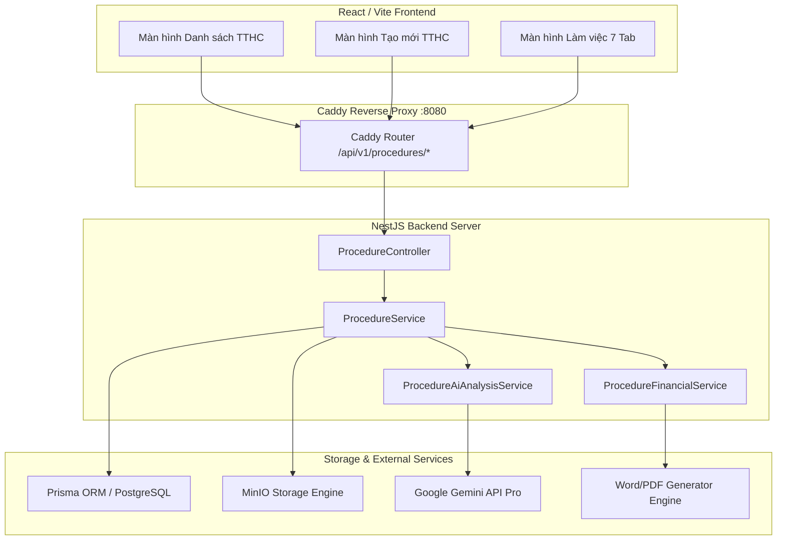
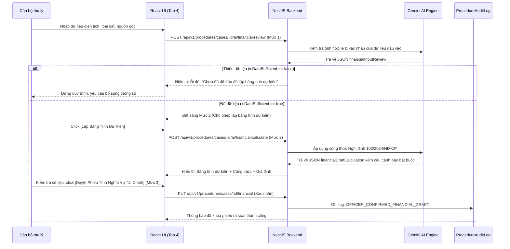

# Thiết Kế Chi Tiết Module Trợ Lý Thẩm Tra Hồ Sơ TTHC (Phase 7B)
**(Procedure Module Schema, UI & API Mock Design – Land & Construction)**

*Tên module:* **Trợ lý thẩm tra hồ sơ TTHC (Administrative Procedure AI Assistant)**  
*Phiên bản tài liệu:* v2.5.1-phase7b-design  
*Ngày lập:* 03/07/2026  
*Trạng thái:* Thiết kế đặc tả kỹ thuật (Chưa sửa source code, chưa sửa `schema.prisma`, chưa tạo migration)  

---

## 1. Mục Tiêu Phase 7B

Tiếp nối sự thành công của Phase 7A (Lập kế hoạch kiến trúc & nghiệp vụ), **Phase 7B** đóng vai trò là giai đoạn **Thiết kế kỹ thuật chi tiết (Technical Specification & Mock Design)** cho module Trợ lý thẩm tra hồ sơ TTHC trong lĩnh vực Đất đai và Xây dựng.

Mục tiêu cụ thể của Phase 7B bao gồm:
1. **Chuẩn hóa đặc tả mô hình dữ liệu (Data Schema Specification):** Định nghĩa chi tiết cấu trúc 8 bảng dữ liệu cốt lõi phục vụ module TTHC, xác định kiểu dữ liệu, các ràng buộc (constraints) và quan hệ giữa các thực thể làm cơ sở chuẩn cho Phase 7C (tạo migration).
2. **Quyết định kiến trúc tái sử dụng (Architectural Reuse Analysis):** Phân tích rành mạch việc nên tách bảng riêng hay tái sử dụng các bảng hiện có của hệ thống (`CaseNote`, `AiAuditLog`, `User`, MinIO, Docx/PDF Engine) để tối ưu hóa hiệu năng và tránh dư thừa.
3. **Thiết kế giao diện người dùng mẫu (UI Mock Design):** Phác thảo wireframe và chi tiết cấu trúc màn hình làm việc của cán bộ một cửa và chuyên viên thẩm tra (Danh sách hồ sơ, Tạo mới hồ sơ, Trang làm việc 7 Tab chuyên sâu).
4. **Định nghĩa giao thức giao tiếp (RESTful API Mock Specification):** Đặc tả chi tiết 13 endpoints API kèm payload Request/Response chuẩn JSON phục vụ giao tiếp giữa Frontend React và Backend NestJS.
5. **Chuẩn hóa 8 bộ AI Output Schemas:** Thiết kế các JSON Schema khắt khe kiểm soát đầu ra của AI cho từng nghiệp vụ (Tóm tắt, Kiểm tra thành phần, Khuyến nghị chuyên môn, Nghĩa vụ tài chính, Cấp phép xây dựng, Cấp GCN lần đầu, Chuyển mục đích sử dụng đất).

---

## 2. Phạm Vi Và Giới Hạn

Phase 7B tập trung thiết kế bản thiết kế kỹ thuật (Blueprint). Các giới hạn nghiêm ngặt được thi hành:
1. **Chỉ tạo tài liệu kỹ thuật:** Mọi đặc tả nằm trong tài liệu Markdown này.
2. **Chưa sửa source code:** Không viết code NestJS controller, service hay React component thật.
3. **Chưa sửa `schema.prisma`:** File cấu hình Prisma giữ nguyên trạng 100%.
4. **Chưa tạo migration:** Không sinh ra tập tin SQL migration hay alter database table.
5. **Chưa tạo UI thật:** Không tạo file `.tsx` mới hay kết nối router.
6. **Chưa tạo endpoint thật:** Không đăng ký route vào NestJS app.
7. **Chưa tích hợp AI thật:** Chưa gọi SDK Gemini Pro cho module TTHC.
8. **Chưa tạo RAG/index thật:** Chưa vector hóa các file trong `docs/procedure-knowledge/`.
9. **Chưa phát hành văn bản:** Hệ thống thiết kế không có tính năng tự động đóng dấu hay phát hành văn bản hành chính.
10. **Chưa tính toán thật trong code:** Chỉ đặc tả cấu trúc JSON của bảng tính dự kiến nghĩa vụ tài chính.

---

## 3. Nguyên Tắc An Toàn Kế Thừa Phase 7A

Toàn bộ bản thiết kế Phase 7B tuân thủ tuyệt đối các nguyên tắc cốt lõi đã được phê duyệt tại Phase 7A:

1. **AI hỗ trợ rà soát toàn diện & Trợ lý chuyên môn:** AI đóng vai trò như một chuyên viên phụ tá, đọc kỹ hồ sơ, phân tích số liệu (ranh giới, diện tích, khoảng lùi, tầng cao) và đối chiếu với quy phạm pháp luật để hỗ trợ cán bộ.
2. **AI không kết luận thay cán bộ:** Mọi output AI trả về đều mang tính chất khuyến nghị kỹ thuật kèm rủi ro, không được phép xuất hiện từ khóa "Phê duyệt" hay "Đủ điều kiện cấp sổ/cấp phép".
3. **AI không tự chuyển trạng thái hồ sơ:** Trạng thái hồ sơ (`SUBMITTED`, `IN_REVIEW`, `COMPLETED`) chỉ được cập nhật bởi hành động click chuột hoặc ký duyệt của cán bộ có thẩm quyền.
4. **AI không tự phát hành văn bản:** Mọi bản thảo phiếu rà soát đều là tài liệu làm việc nội bộ.
5. **Nhãn cảnh báo hiển thị bắt buộc:** Trong toàn bộ thiết kế UI và API payload trả về, luôn xuất hiện nhãn:
   > **“BẢN GỢI Ý AI – CÁN BỘ PHẢI KIỂM TRA”**
6. **Cách diễn đạt nghĩa vụ tài chính chuẩn mực:** Nghiêm cấm dùng từ *"AI tự tính tiền sử dụng đất chính thức"*. Mọi thông báo hay trường mô tả phải ghi rõ:
   > **“AI hỗ trợ lập bảng tính dự kiến nghĩa vụ tài chính/tiền sử dụng đất theo dữ liệu đầu vào và căn cứ đã được cấu hình; cán bộ/cơ quan có thẩm quyền kiểm tra, xác nhận trước khi sử dụng.”**

---

## 4. Kiến Trúc Module Đề Xuất

Kiến trúc module Trợ lý thẩm tra TTHC được thiết kế theo mô hình **Domain-Driven Design (DDD)** tích hợp trong kiến trúc Modular Monolith hiện tại của LegalFlow v2:



---

## 5. Thiết Kế Dữ Liệu / Model Đề Xuất

Dưới đây là đặc tả chi tiết 8 thực thể dữ liệu (Entities) chuyên ngành cho module TTHC:

### 5.1. `AdministrativeProcedureCase` (Hồ sơ TTHC chính)
| Trường (Field) | Kiểu dữ liệu (Type) | Ràng buộc (Constraints) | Mô tả nghiệp vụ |
| :--- | :--- | :--- | :--- |
| `id` | `String` | `@id @default(uuid())` | Khóa chính UUID v4 |
| `caseCode` | `String` | `@unique` | Mã hồ sơ TTHC (Ví dụ: `TTHC-DD-2026-00012`) |
| `procedureTypeId` | `String` | `@relation(ProcedureType)` | FK trỏ đến danh mục thủ tục |
| `domain` | `ProcedureDomain` | `Enum: LAND, CONSTRUCTION` | Lĩnh vực thủ tục hành chính |
| `applicantName` | `String` | `NOT NULL` | Họ tên cá nhân/tổ chức nộp hồ sơ |
| `applicantIdCard` | `String?` | `Nullable` | Số CCCD/Mã số thuế tổ chức |
| `applicantAddress` | `String?` | `Nullable` | Địa chỉ liên hệ/thuờng trú |
| `applicantPhone` | `String?` | `Nullable` | Số điện thoại liên hệ |
| `parcelSummaryJSON` | `Json?` | `Nullable` | Tóm tắt thửa đất (Tờ bản đồ, số thửa, diện tích) |
| `constructionSummaryJSON`| `Json?` | `Nullable` | Tóm tắt công trình (Quy mô, số tầng, vị trí) |
| `status` | `ProcedureStatus` | `Enum: SUBMITTED, IN_REVIEW, SUPPLEMENT_REQUIRED, PENDING_APPROVAL, COMPLETED, REJECTED` | Trạng thái thụ lý nghiệp vụ |
| `assignedToId` | `String` | `@relation(User)` | FK trỏ đến cán bộ thụ lý hồ sơ |
| `submissionSource` | `String` | `Default: "ONE_STOP"` | Nguồn nộp (Một cửa trực tiếp, Cổng DVC) |
| `receivedAt` | `DateTime` | `NOT NULL` | Ngày giờ tiếp nhận hồ sơ |
| `deadlineAt` | `DateTime?` | `Nullable` | Hạn xử lý hồ sơ theo luật định |
| `generalNote` | `String?` | `Nullable` | Ghi chú tóm tắt của bộ phận tiếp nhận |
| `createdAt` | `DateTime` | `@default(now())` | Thời điểm tạo bản ghi |
| `updatedAt` | `DateTime` | `@updatedAt` | Thời điểm cập nhật cuối cùng |

---

### 5.2. `ProcedureType` (Danh mục thủ tục hành chính)
| Trường (Field) | Kiểu dữ liệu (Type) | Ràng buộc | Mô tả nghiệp vụ |
| :--- | :--- | :--- | :--- |
| `id` | `String` | `@id @default(uuid())` | Khóa chính UUID |
| `code` | `String` | `@unique` | Mã thủ tục quy chuẩn (e.g., `LAND_FIRST_GCN`) |
| `name` | `String` | `NOT NULL` | Tên thủ tục hành chính đầy đủ |
| `domain` | `ProcedureDomain` | `Enum: LAND, CONSTRUCTION` | Lĩnh vực |
| `subGroup` | `String` | `NOT NULL` | Nhóm thủ tục (Cấp GCN lần đầu / Chuyển mục đích / Cấp phép XD) |
| `standardDurationDays` | `Int` | `Default: 15` | Thời hạn giải quyết chuẩn (ngày làm việc) |
| `coordinatingAgencies` | `String[]` | `Array of Strings` | Các cơ quan phối hợp (Chi cục Thuế, VP Đăng ký) |
| `legalReferencesJSON` | `Json` | `NOT NULL` | Danh sách văn bản pháp luật căn cứ |
| `requiredDocumentsJSON`| `Json` | `NOT NULL` | Danh mục giấy tờ quy chuẩn bắt buộc |
| `defaultChecklistJSON` | `Json` | `NOT NULL` | Template checklist tiêu chí thẩm tra mẫu |

---

### 5.3. `ProcedureDocument` (Tài liệu đính kèm hồ sơ)
| Trường (Field) | Kiểu dữ liệu (Type) | Ràng buộc | Mô tả nghiệp vụ |
| :--- | :--- | :--- | :--- |
| `id` | `String` | `@id @default(uuid())` | Khóa chính UUID |
| `caseId` | `String` | `@relation(AdministrativeProcedureCase)` | FK trỏ tới hồ sơ TTHC |
| `documentCategory` | `String` | `NOT NULL` | Phân loại (Sổ đỏ cũ, Bản vẽ thiết kế, Đơn xin) |
| `fileName` | `String` | `NOT NULL` | Tên gốc của tập tin tải lên |
| `storagePath` | `String` | `NOT NULL` | Đường dẫn lưu trữ MinIO object key |
| `fileSize` | `Int` | `NOT NULL` | Kích thước file (bytes) |
| `ocrStatus` | `String` | `Enum: PENDING, PROCESSED, FAILED` | Trạng thái trích xuất văn bản OCR |
| `extractedText` | `String?` | `Text (Long)` | Nội dung chữ trích xuất được từ tài liệu |
| `verificationStatus` | `String` | `Enum: VALID, MISSING, NEEDS_VERIFICATION` | Trạng thái kiểm tra hồ sơ của cán bộ |
| `officerNote` | `String?` | `Nullable` | Ghi chú ý kiến thẩm định tài liệu này |
| `uploadedAt` | `DateTime` | `@default(now())` | Thời điểm tải lên |

---

### 5.4. `ProcedureChecklistItem` (Tiêu chí kiểm tra thẩm định)
| Trường (Field) | Kiểu dữ liệu (Type) | Ràng buộc | Mô tả nghiệp vụ |
| :--- | :--- | :--- | :--- |
| `id` | `String` | `@id @default(uuid())` | Khóa chính UUID |
| `caseId` | `String` | `@relation(AdministrativeProcedureCase)` | FK trỏ tới hồ sơ TTHC |
| `itemGroup` | `String` | `Enum: LEGAL_DOCS, TECHNICAL_PARAMS, FINANCIAL, FIELD_INSPECTION` | Nhóm kiểm tra |
| `itemCode` | `String` | `NOT NULL` | Mã tiêu chí kiểm tra (e.g., `CHK_LAND_ORIGIN`) |
| `content` | `String` | `NOT NULL` | Nội dung câu hỏi/tiêu chí thẩm tra |
| `priority` | `String` | `Enum: HIGH, MEDIUM, LOW` | Mức độ quan trọng của tiêu chí |
| `isAiSuggested` | `Boolean` | `Default: false` | Cờ đánh dấu tiêu chí do AI tự động phát hiện |
| `status` | `String` | `Enum: PENDING, PASSED, NEEDS_CLARIFICATION, FAILED` | Kết quả rà soát |
| `completedByUserId`| `String?` | `@relation(User)?` | Cán bộ tích chọn xác nhận |
| `completedAt` | `DateTime?`| `Nullable` | Thời điểm hoàn thành đánh giá |
| `officerComment` | `String?` | `Nullable` | Ý kiến chi tiết của cán bộ về tiêu chí |

---

### 5.5. `ProcedureAiAnalysis` (Kết quả rà soát của AI Trợ lý)
| Trường (Field) | Kiểu dữ liệu (Type) | Ràng buộc | Mô tả nghiệp vụ |
| :--- | :--- | :--- | :--- |
| `id` | `String` | `@id @default(uuid())` | Khóa chính UUID |
| `caseId` | `String` | `@relation(AdministrativeProcedureCase)` | FK trỏ tới hồ sơ TTHC |
| `analysisType` | `String` | `Enum: SUMMARY, DOC_COMPLETENESS, RECOMMENDATION, FINANCIAL_INPUT, PERMIT_REVIEW` | Loại phân tích |
| `inputSnapshotJSON`| `Json` | `NOT NULL` | Dữ liệu đầu vào tại thời điểm chạy AI |
| `outputJSON` | `Json` | `NOT NULL` | Toàn bộ payload JSON theo chuẩn Schema |
| `mandatoryLabel` | `String` | `Default: "BẢN GỢI Ý AI – CÁN BỘ PHẢI KIỂM TRA"` | Nhãn hiển thị an toàn bắt buộc |
| `confidenceScore`| `Float` | `Between 0.0 and 1.0` | Độ tin cậy do mô hình đánh giá |
| `officerStatus` | `String` | `Enum: PENDING, ACCEPTED, REJECTED, MODIFIED` | Quyết định xử lý của cán bộ đối với bản gợi ý |
| `reviewedByUserId`| `String?` | `@relation(User)?` | ID cán bộ thực hiện thao tác duyệt/từ chối |
| `reviewedAt` | `DateTime?`| `Nullable` | Thời điểm cán bộ thao tác |
| `auditLogId` | `String?` | `Nullable` | FK liên kết tới dòng nhật ký kiểm toán |
| `createdAt` | `DateTime` | `@default(now())` | Thời điểm AI sinh bản phân tích |

---

### 5.6. `ProcedureFinancialReview` (Phiếu kiểm tra nghĩa vụ tài chính 3 mức)
| Trường (Field) | Kiểu dữ liệu (Type) | Ràng buộc | Mô tả nghiệp vụ |
| :--- | :--- | :--- | :--- |
| `id` | `String` | `@id @default(uuid())` | Khóa chính UUID |
| `caseId` | `String` | `@relation(AdministrativeProcedureCase)` | FK trỏ tới hồ sơ TTHC |
| `reviewLevel` | `String` | `Enum: LEVEL_1_INPUT, LEVEL_2_CALCULATION, LEVEL_3_VERIFIED` | Mức kiểm tra hiện tại |
| `taxableAreaSqM` | `Float?` | `Nullable` | Diện tích tính tiền sử dụng đất ($m^2$) |
| `oldLandType` | `String?` | `Nullable` | Loại đất trước khi chuyển (Ví dụ: `LUC`, `CLN`) |
| `newLandType` | `String?` | `Nullable` | Loại đất sau khi chuyển (Ví dụ: `ODT`, `ONT`) |
| `landOrigin` | `String?` | `Nullable` | Nguồn gốc đất (Nhận chuyển nhượng, Giao đất...) |
| `usageStartDate` | `DateTime?`| `Nullable` | Thời điểm bắt đầu sử dụng đất thực tế |
| `priceTableRef` | `String?` | `Nullable` | Căn cứ bảng giá đất UBND cấp tỉnh áp dụng |
| `specificPriceVND`| `Float?` | `Nullable` | Giá đất cụ thể ($VNĐ/m^2$) nếu thuộc diện |
| `adjustmentK` | `Float?` | `Default: 1.0` | Hệ số điều chỉnh giá đất K địa phương |
| `exemptionReductionJSON` | `Json?` | `Nullable` | Chi tiết đối tượng được miễn, giảm tiền SDĐ |
| `isDataSufficient`| `Boolean` | `Default: false` | Cờ xác nhận đủ dữ liệu lập bảng tính dự kiến |
| `missingDataWarning`| `String?` | `Nullable` | Chuỗi cảnh báo khi thiếu thông số |
| `formulaExplanation`| `String?` | `Text (Long)` | Diễn giải công thức tính toán từng bước |
| `estimatedAmountVND`| `Float?` | `Nullable` | Kết quả dự kiến (VNĐ) - *Không phải kết quả chính thức* |
| `officerVerificationStatus` | `String` | `Enum: PENDING, CONFIRMED_BY_OFFICER, ADJUSTED_BY_OFFICER` | Trạng thái xác nhận của cán bộ thẩm quyền |
| `updatedAt` | `DateTime` | `@updatedAt` | Cập nhật lần cuối |

---

### 5.7. `ProcedureNote` (Ghi chú / Bản thảo chuyên môn)
| Trường (Field) | Kiểu dữ liệu (Type) | Ràng buộc | Mô tả nghiệp vụ |
| :--- | :--- | :--- | :--- |
| `id` | `String` | `@id @default(uuid())` | Khóa chính UUID |
| `caseId` | `String` | `@relation(AdministrativeProcedureCase)` | FK trỏ tới hồ sơ TTHC |
| `authorId` | `String` | `@relation(User)` | FK trỏ tới cán bộ tạo ghi chú |
| `noteType` | `String` | `Enum: INTERNAL_COMMENT, AI_REVIEW_SHEET, FIELD_INSPECTION` | Phân loại ghi chú |
| `title` | `String` | `NOT NULL` | Tiêu đề ghi chú/bản thảo phiếu rà soát |
| `content` | `String` | `Text (Long)` | Nội dung chi tiết |
| `attachmentUrls` | `String[]` | `Array of Strings` | Danh sách link file đính kèm kèm theo ghi chú |
| `createdAt` | `DateTime` | `@default(now())` | Thời điểm tạo |
| `updatedAt` | `DateTime` | `@updatedAt` | Thời điểm cập nhật |

---

### 5.8. `ProcedureAuditLog` (Nhật ký kiểm toán thẩm tra TTHC)
| Trường (Field) | Kiểu dữ liệu (Type) | Ràng buộc | Mô tả nghiệp vụ |
| :--- | :--- | :--- | :--- |
| `id` | `String` | `@id @default(uuid())` | Khóa chính UUID |
| `caseId` | `String` | `@relation(AdministrativeProcedureCase)` | FK liên kết hồ sơ TTHC |
| `actorUserId` | `String` | `@relation(User)` | Cán bộ thực hiện hành động |
| `actionCode` | `String` | `NOT NULL` | Mã thao tác (e.g., `APPROVE_AI_RECOMMENDATION`) |
| `oldValueJSON` | `Json?` | `Nullable` | Dữ liệu/trạng thái trước khi can thiệp |
| `newValueJSON` | `Json?` | `Nullable` | Dữ liệu/trạng thái sau khi thay đổi |
| `ipAddress` | `String?` | `Nullable` | Địa chỉ IP máy trạm của cán bộ |
| `userAgent` | `String?` | `Nullable` | Thông tin trình duyệt/thiết bị |
| `timestamp` | `DateTime` | `@default(now())` | Thời điểm chính xác xảy ra hành động |

---

## 6. Phân Tích Tái Sử Dụng Bảng / Cơ Chế Hiện Có

Để giữ cho kiến trúc hệ thống gọn gàng, hiệu quả, tránh phình to cơ sở dữ liệu không cần thiết, dưới đây là phân tích kỹ thuật 5 câu hỏi kiến trúc trọng tâm:

### 6.1. Có nên dùng bảng riêng `ProcedureAuditLog` hay tái sử dụng `AiAuditLog` hiện tại?
- **Phân tích:** Bảng `AiAuditLog` hiện tại được thiết kế chuyên biệt để theo dõi việc tạo bản nháp văn bản khiếu nại tố cáo từ AI (lưu prompt, model, token used, latency). Trong khi đó, nhật ký kiểm toán TTHC cần theo dõi hành vi nghiệp vụ của con người (cán bộ chấp nhận/từ chối gợi ý AI, thay đổi số liệu diện tích đất, xác nhận phiếu tính nghĩa vụ tài chính).
- **Quyết định:** **Tạo bảng riêng `ProcedureAuditLog`.** Việc này đảm bảo tính độc lập về kiểm toán pháp lý nghiệp vụ TTHC, giúp tra cứu nhanh chóng lịch sử thao tác của cán bộ mà không bị xáo trộn với log kỹ thuật AI của module đơn thư.

### 6.2. Có nên dùng bảng riêng `ProcedureNote` hay tái sử dụng `CaseNote` hiện tại?
- **Phân tích:** `CaseNote` hiện có khóa ngoại `caseId` trỏ trực tiếp đến bảng `LegalCase` (Đơn thư khiếu nại). Nếu dùng chung `CaseNote`, khóa ngoại sẽ phải chuyển thành polymorphic (trỏ cả `LegalCase` lẫn `AdministrativeProcedureCase`), làm mất tính toàn vẹn khóa ngoại (Foreign Key Integrity) trong PostgreSQL.
- **Quyết định:** **Tạo bảng riêng `ProcedureNote`.** Giữ cho quan hệ khóa ngoại `ProcedureNote.caseId -> AdministrativeProcedureCase.id` chặt chẽ 100%, đồng thời cho phép lưu trữ chuyên sâu các thuộc tính như phiếu rà soát biên bản kiểm tra hiện trường.

### 6.3. Có nên dùng chung hệ thống User / Role hiện tại?
- **Phân tích:** Bảng `User` hiện tại đã có cơ chế phân quyền RBAC (`Role`: `ADMIN`, `MANAGER`, `SPECIALIST`, `ONE_STOP_OFFICER`), băm mật khẩu bcrypt và JWT authentication hoàn chỉnh. Cán bộ một cửa hay chuyên viên quản lý đất đai/xây dựng đều là người dùng trong cùng một cơ quan hành chính.
- **Quyết định:** **Tái sử dụng 100% bảng `User` và hệ thống Auth hiện tại.** Cán bộ thụ lý TTHC chỉ cần sử dụng tài khoản hiện có (với role `SPECIALIST` hoặc `ONE_STOP_OFFICER`) để đăng nhập và xử lý hồ sơ.

### 6.4. Có nên dùng MinIO hiện tại để lưu tài liệu hồ sơ TTHC?
- **Phân tích:** MinIO hiện tại trong `docker-compose.infra.yml` đang hoạt động cực kỳ ổn định trên cổng `9000`, có bucket `legalflow-docs` hỗ trợ S3-compatible API.
- **Quyết định:** **Tái sử dụng 100% MinIO Storage.** Các tài liệu TTHC sẽ được lưu vào prefix riêng trong bucket, ví dụ: `procedures/{caseCode}/{documentCategory}/{filename}.pdf`.

### 6.5. Có nên dùng cơ chế Word / PDF hiện tại cho Phiếu rà soát sau này?
- **Phân tích:** Hệ thống đã xây dựng thành công module xuất Word (`docx`) qua thư viện template và xem trước/in PDF chuẩn A4 trên trình duyệt (Browser Print Preview - Phase 5D) mà không cần phụ thuộc thư viện nặng như Puppeteer hay LibreOffice.
- **Quyết định:** **Tái sử dụng 100% cơ chế Word / PDF hiện tại.** Phiếu thẩm tra TTHC và Bảng tính dự kiến nghĩa vụ tài chính sẽ render trực tiếp thành trang HTML A4 mượt mà trên trình duyệt để cán bộ bấm "Xem & In PDF" hoặc xuất file `.docx` theo biểu mẫu quy định.

---

## 7. Thiết Kế UI Mock (Giao Diện Mẫu)

Dưới đây là đặc tả wireframe chi tiết cho các màn hình làm việc của module Trợ lý thẩm tra TTHC:

### 7.1. Màn hình Danh sách Hồ sơ TTHC
```text
+----------------------------------------------------------------------------------------------------------+
|  [LegalFlow AI v2.5]   Đơn thư   |   THẨM TRA TTHC (AI ASSISTANT)   |   Kho tri thức   |   Admin         |
+----------------------------------------------------------------------------------------------------------+
|  Lọc Lĩnh Vực: [ Tất cả / Đất đai / Xây dựng (v) ]    Lọc Thủ Tục: [ Tất cả các loại thủ tục (v) ]     |
|  Trạng Thái:   [ Tất cả / Đang thụ lý / Cần bổ sung (v) ]   Tìm kiếm: [ Nhập mã hồ sơ, họ tên...   ] [Q]|
+----------------------------------------------------------------------------------------------------------+
|  MÃ HỒ SƠ        LĨNH VỰC    LOẠI THỦ TỤC              NGƯỜI NỘP       TRẠNG THÁI     AI RÀ SOÁT         |
|----------------------------------------------------------------------------------------------------------|
|  TTHC-DD-26-001  Đất đai     Cấp GCN quyền SDĐ lần đầu Nguyễn Văn A    IN_REVIEW      [AI: 2 Rủi ro cao] |
|  TTHC-DD-26-002  Đất đai     Chuyển mục đích SDĐ       Trần Thị B      SUPPLEMENT     [AI: Thiếu sổ gốc] |
|  TTHC-XD-26-003  Xây dựng    Cấp phép xây dựng nhà ở   Lê Văn C        IN_REVIEW      [AI: Đạt 100%]     |
+----------------------------------------------------------------------------------------------------------+
```

### 7.2. Màn hình Tạo mới Hồ sơ TTHC
```text
+----------------------------------------------------------------------------------------------------------+
|  TẠO MỚI HỒ SƠ THỦ TỤC HÀNH CHÍNH                                              [Hủy bỏ] [Tạo & Tiếp nhận]|
+----------------------------------------------------------------------------------------------------------+
|  1. THÔNG TIN CHUNG:                                                                                     |
|     Lĩnh vực: [ Đất đai (v) ]       Loại thủ tục: [ Cấp Giấy chứng nhận quyền sử dụng đất lần đầu (v) ]  |
|                                                                                                          |
|  2. THÔNG TIN NGƯỜI NỘP HỒ SƠ:                                                                           |
|     Họ và tên: [ Nguyễn Văn A                    ]   Số CCCD/MST: [ 001085000123               ]         |
|     Địa chỉ:   [ Xã Lộc An, Huyện Long Thành     ]   Điện thoại:  [ 0909123456                 ]         |
|                                                                                                          |
|  3. THÔNG TIN THỬA ĐẤT / CÔNG TRÌNH TÓM TẮT:                                                             |
|     Số tờ bản đồ: [ 15 ]   Số thửa: [ 102 ]   Diện tích: [ 250.5 ] m2    Loại đất hiện trạng: [ CLN ]    |
|                                                                                                          |
|  4. TẢI LÊN TÀI LIỆU ĐÍNH KÈM (Chưa cần OCR ngay):                                                       |
|     + [Đơn đăng ký GCN.pdf] (2.1 MB) - Loại: Đơn đăng ký        [Xóa]                                    |
|     + [Giấy tay mua bán 1992.pdf] (4.5 MB) - Loại: Giấy tờ quyền SDĐ [Xóa]                               |
|     [+ Chọn file tải lên...]                                                                             |
+----------------------------------------------------------------------------------------------------------+
```

### 7.3. Màn hình Chi tiết Hồ sơ TTHC (Trang làm việc 7 Tab chuyên sâu)
```text
+----------------------------------------------------------------------------------------------------------+
|  HỒ SƠ: TTHC-DD-26-001 | Người nộp: Nguyễn Văn A | Thủ tục: Cấp GCN lần đầu | Trạng thái: ĐANG THỤ LÝ   |
+----------------------------------------------------------------------------------------------------------+
| [Tổng quan] | [Tài liệu (2)] | [* AI Rà soát] | [Checklist (8/10)] | [Nghĩa vụ tài chính] | [Ghi chú] |
+----------------------------------------------------------------------------------------------------------+
```

### 7.4. Chi tiết Tab "AI Rà soát" (AI Analysis Tab)
```text
+----------------------------------------------------------------------------------------------------------+
|  BẢNG ĐIỀU KHIỂN TRỢ LÝ AI:                                                                              |
|  [✨ AI Tóm tắt hồ sơ]    [🔍 AI Kiểm tra thành phần]    [⚖️ AI Khuyến nghị chuyên môn]                   |
+----------------------------------------------------------------------------------------------------------+
|  +----------------------------------------------------------------------------------------------------+  |
|  | [!] BẢN GỢI Ý AI – CÁN BỘ PHẢI KIỂM TRA (Độ tin cậy mô hình: 92%)                                   |  |
|  +----------------------------------------------------------------------------------------------------+  |
|                                                                                                          |
|  1. TÓM TẮT HỒ SƠ:                                                                                       |
|     Hồ sơ xin cấp GCN lần đầu đối với thửa đất số 102, tờ bản đồ 15, diện tích 250.5m2 tại xã Lộc An.    |
|     Nguồn gốc: Nhận chuyển nhượng bằng giấy tay lập năm 1992, sử dụng ổn định từ trước 15/10/1993.       |
|                                                                                                          |
|  2. CẢNH BÁO RỦI RO NGHIỆP VỤ (RISK FLAGS):                                                              |
|     [RỦI RO CAO] Giấy mua bán viết tay lập tháng 05/1992 chưa có xác nhận của UBND xã thời điểm đó.      |
|     -> Lý do cần kiểm tra: Cần xác minh thời điểm sử dụng đất thực tế theo Điều 138 Luật Đất đai 2024.   |
|                                                                                                          |
|  3. KHUYẾN NGHỊ CHUYÊN MÔN CỦA TRỢ LÝ:                                                                   |
|     - Đề nghị bộ phận địa chính lấy ý kiến khu dân cư về nguồn gốc và thời điểm tạo lập nhà ở.           |
|     - Đối chiếu ranh giới hiện trạng không có tranh chấp với các hộ liền kề.                             |
|                                                                                                          |
|  4. GỢI Ý CÂU HỎI YÊU CẦU CÔNG DÂN BỔ SUNG:                                                              |
|     - "Đề nghị cung cấp biên lai nộp thuế đất nông nghiệp các năm từ 1993 đến 2014 (nếu có)."            |
|                                                                                                          |
|  [HÀNH ĐỘNG CỦA CÁN BỘ]:  (o) Chấp nhận khuyến nghị AI    ( ) Từ chối/Yêu cầu rà soát lại                |
|  Ghi chú ý kiến thẩm định của cán bộ: [ Đồng ý hướng kiểm tra, đã tạo phiếu lấy ý kiến KDC...       ]    |
|  [LƯU Ý KIẾN THẨM ĐỊNH VÀO AUDIT LOG]                                                                    |
+----------------------------------------------------------------------------------------------------------+
```

### 7.5. Chi tiết Tab "Nghĩa vụ tài chính dự kiến" (Financial Review Tab)
```text
+----------------------------------------------------------------------------------------------------------+
|  THẨM TRA NGHĨA VỤ TÀI CHÍNH / TIỀN SỬ DỤNG ĐẤT (3 MỨC AN TOÀN)                                          |
+----------------------------------------------------------------------------------------------------------+
|  MỨC 1: KIỂM TRA DỮ LIỆU ĐẦU VÀO:                                                                        |
|  - Diện tích tính tiền: [ 250.5 ] m2    - Loại đất trước chuyển: [ CLN ]   - Loại đất sau: [ ODT ]       |
|  - Nguồn gốc sử dụng:   [ Chuyển nhượng giấy tay ]   - Thời điểm sử dụng đất: [ Trước 15/10/1993 (v) ]   |
|  - Bảng giá đất áp dụng:[ QĐ số 56/2024/QĐ-UBND tỉnh ] - Hệ số điều chỉnh K:  [ 1.15 ]                   |
|  - Trạng thái xác nhận của cơ quan chuyên môn: [ ĐÃ CÓ VĂN BẢN XÁC NHẬN CỦA UBND XÃ ]                    |
|  [KÍCH HOẠT AI KIỂM TRA DỮ LIỆU ĐẦU VÀO]                                                                 |
+----------------------------------------------------------------------------------------------------------+
|  MỨC 2: BẢNG TÍNH DỰ KIẾN (DRAFT CALCULATION):                                                           |
|  +----------------------------------------------------------------------------------------------------+  |
|  | [!] BẢN GỢI Ý AI – CÁN BỘ PHẢI KIỂM TRA                                                             |  |
|  | AI hỗ trợ lập bảng tính dự kiến nghĩa vụ tài chính/tiền sử dụng đất theo dữ liệu đầu vào và căn cứ  |  |
|  | đã được cấu hình; cán bộ/cơ quan có thẩm quyền kiểm tra, xác nhận trước khi sử dụng.              |  |
|  +----------------------------------------------------------------------------------------------------+  |
|  * Công thức áp dụng: Tiền SDĐ = (Giá đất ở x Hệ số K - Giá đất nông nghiệp) x 50% x Diện tích          |  |
|  * Căn cứ pháp lý: Điểm a Khoản 1 Điều 8 Nghị định 103/2024/NĐ-CP                                         |  |
|  * Giả định tính toán: Diện tích 250.5m2 nằm trong hạn mức giao đất ở của địa phương (300m2).             |  |
|  * KẾT QUẢ DỰ KIẾN TẠM TÍNH: 345,690,000 VNĐ (Không phát hành kết quả chính thức cho công dân)           |  |
+----------------------------------------------------------------------------------------------------------+
|  MỨC 3: PHIẾU TÍNH ĐỂ CÁN BỘ KIỂM TRA / XÁC NHẬN:                                                        |
|  Ý kiến thẩm định của cán bộ Thuế/Tài nguyên:                                                            |
|  [ Đồng ý số liệu tính toán dự kiến, đủ điều kiện chuyển thông tin sang Chi cục Thuế              ]      |
|  [🖨️ Xem & In Phiếu Rà Soát A4]             [XÁC NHẬN PHIẾU TÍNH & GHI AUDIT LOG]                       |
+----------------------------------------------------------------------------------------------------------+
```
*(Trường hợp thiếu thông số như chưa chọn Thời điểm sử dụng đất, vùng Mức 2 sẽ ẩn kết quả tiền và hiện khung đỏ khắt khe: **`[CẢNH BÁO: Chưa đủ dữ liệu để lập bảng tính dự kiến]`**).*

---

## 8. Thiết Kế API Mock (Endpoints Specification)

Dưới đây là đặc tả 13 endpoints API mock cho module TTHC, định nghĩa rõ ràng đường dẫn, phương thức, payload request và response mẫu:

### 8.1. Nhóm API Quản lý Hồ sơ & Tài liệu TTHC

#### 1. Tạo mới hồ sơ TTHC
- **Endpoint:** `POST /api/v1/procedures/cases`
- **Request Mock:**
  ```json
  {
    "procedureTypeCode": "LAND_FIRST_GCN",
    "applicantName": "Nguyễn Văn A",
    "applicantIdCard": "001085000123",
    "applicantPhone": "0909123456",
    "parcelSummaryJSON": {
      "mapSheet": "15",
      "parcelNumber": "102",
      "area": 250.5,
      "landType": "CLN"
    }
  }
  ```
- **Response Mock (201 Created):**
  ```json
  {
    "success": true,
    "data": {
      "id": "c8a1e2f3-1111-4444-8888-abcdef123456",
      "caseCode": "TTHC-DD-2026-00012",
      "status": "SUBMITTED",
      "createdAt": "2026-07-03T10:00:00Z"
    }
  }
  ```

#### 2. Lấy danh sách hồ sơ TTHC
- **Endpoint:** `GET /api/v1/procedures/cases?domain=LAND&status=IN_REVIEW&page=1&limit=10`
- **Response Mock (200 OK):**
  ```json
  {
    "success": true,
    "total": 1,
    "data": [
      {
        "id": "c8a1e2f3-1111-4444-8888-abcdef123456",
        "caseCode": "TTHC-DD-2026-00012",
        "applicantName": "Nguyễn Văn A",
        "procedureName": "Cấp GCN quyền sử dụng đất lần đầu",
        "status": "IN_REVIEW",
        "hasAiWarning": true
      }
    ]
  }
  ```

#### 3. Lấy chi tiết hồ sơ TTHC
- **Endpoint:** `GET /api/v1/procedures/cases/c8a1e2f3-1111-4444-8888-abcdef123456`
- **Response Mock (200 OK):** Trả về toàn bộ dữ liệu hồ sơ kèm danh sách `documents`, `checklists`, `aiAnalyses`, `financialReviews`.

#### 4. Thêm tài liệu đính kèm hồ sơ
- **Endpoint:** `POST /api/v1/procedures/cases/:id/documents` (Multipart form-data)
- **Response Mock (201 Created):** Trả về metadata file đã lưu trong MinIO.

---

### 8.2. Nhóm API AI Trợ lý thẩm tra

#### 5. Tạo checklist thẩm tra mẫu
- **Endpoint:** `POST /api/v1/procedures/cases/:id/checklists/init`
- **Response Mock (201 Created):** Tự động sinh ra 10 tiêu chí kiểm tra chuẩn theo quy trình địa phương vào bảng `ProcedureChecklistItem`.

#### 6. AI Tóm tắt hồ sơ TTHC
- **Endpoint:** `POST /api/v1/procedures/cases/:id/ai/summary`
- **Response Mock (200 OK):**
  ```json
  {
    "success": true,
    "data": {
      "summary": "Hồ sơ xin cấp GCN lần đầu thửa đất 102 tờ bản đồ 15, diện tích 250.5m2.",
      "disclaimer": "BẢN GỢI Ý AI – CÁN BỘ PHẢI KIỂM TRA",
      "confidenceLevel": 0.95
    }
  }
  ```

#### 7. AI Kiểm tra thành phần hồ sơ TTHC
- **Endpoint:** `POST /api/v1/procedures/cases/:id/ai/completeness`
- **Response Mock (200 OK):** Trả về danh sách giấy tờ hợp lệ và danh sách giấy tờ còn thiếu hoặc cần xác minh lại.

#### 8. AI Tạo khuyến nghị chuyên môn sâu
- **Endpoint:** `POST /api/v1/procedures/cases/:id/ai/recommendation`
- **Response Mock (200 OK):** Trả về các cảnh báo rủi ro (`riskFlags`), gợi ý hướng kiểm tra thực địa và danh sách câu hỏi cần bổ sung.

#### 9. AI Kiểm tra dữ liệu đầu vào nghĩa vụ tài chính (Mức 1)
- **Endpoint:** `POST /api/v1/procedures/cases/:id/ai/financial-review`
- **Response Mock (200 OK):** Trả về đánh giá `isDataSufficient` và danh sách các thông số đã/chưa được cơ quan chuyên môn xác nhận.

#### 10. AI Lập bảng tính dự kiến nghĩa vụ tài chính (Mức 2)
- **Endpoint:** `POST /api/v1/procedures/cases/:id/ai/financial-calculate`
- **Request Mock:**
  ```json
  {
    "landArea": 250.5,
    "oldLandType": "CLN",
    "newLandType": "ODT",
    "usageStartDate": "1992-05-10",
    "specificPriceVND": 3000000,
    "adjustmentK": 1.15
  }
  ```
- **Response Mock (200 OK):**
  ```json
  {
    "success": true,
    "data": {
      "disclaimer": "BẢN GỢI Ý AI – CÁN BỘ PHẢI KIỂM TRA",
      "officerVerificationRequiredText": "AI hỗ trợ lập bảng tính dự kiến nghĩa vụ tài chính/tiền sử dụng đất theo dữ liệu đầu vào và căn cứ đã được cấu hình; cán bộ/cơ quan có thẩm quyền kiểm tra, xác nhận trước khi sử dụng.",
      "canCalculate": true,
      "formulaExplanation": "Tiền SDĐ = (3,000,000 x 1.15 - 500,000) x 50% x 250.5",
      "estimatedAmountVND": 369487500,
      "missingDataWarning": null
    }
  }
  ```
  *(Nếu gửi Request thiếu `usageStartDate`, Response lập tức trả về `canCalculate: false`, `estimatedAmountVND: null` và `missingDataWarning: "Chưa đủ dữ liệu để lập bảng tính dự kiến"`).*

---

### 8.3. Nhóm API Human-in-the-Loop & Audit Log

#### 11. Cán bộ ghi nhận / duyệt kết quả AI
- **Endpoint:** `PUT /api/v1/procedures/cases/:id/ai/review/:analysisId`
- **Request Mock:**
  ```json
  {
    "officerStatus": "ACCEPTED",
    "officerComment": "Đã kiểm tra đối chiếu sổ gốc, nhất trí với phân tích rủi ro của AI."
  }
  ```
- **Response Mock (200 OK):** Cập nhật trạng thái bản phân tích và tự động ghi vào `ProcedureAuditLog`.

#### 12. Tạo ghi chú / Bản thảo phiếu rà soát
- **Endpoint:** `POST /api/v1/procedures/cases/:id/notes`
- **Request Mock:**
  ```json
  {
    "noteType": "AI_REVIEW_SHEET",
    "title": "Phiếu rà soát chuyên môn lần 1",
    "content": "Nội dung phiếu rà soát đã được cán bộ kiểm chứng..."
  }
  ```

#### 13. Xem nhật ký kiểm toán TTHC (Audit Logs)
- **Endpoint:** `GET /api/v1/procedures/cases/:id/audit-logs`
- **Response Mock (200 OK):** Trả về mảng các sự kiện kiểm toán theo thứ tự thời gian giảm dần.

---

## 9. AI Output Schema Mẫu (JSON Schemas)

Dưới đây là thiết kế JSON Schema mẫu cho 8 loại phân tích AI chuyên sâu trong module TTHC:

### 1. `procedureSummaryAnalysis` (Tóm tắt hồ sơ TTHC)
```json
{
  "$schema": "http://json-schema.org/draft-07/schema#",
  "type": "object",
  "required": ["disclaimer", "confidenceLevel", "summaryText", "applicantInfo", "subjectInfo", "requiresOfficerVerification"],
  "properties": {
    "disclaimer": { "type": "string", "const": "BẢN GỢI Ý AI – CÁN BỘ PHẢI KIỂM TRA" },
    "confidenceLevel": { "type": "number" },
    "summaryText": { "type": "string" },
    "applicantInfo": { "type": "string" },
    "subjectInfo": { "type": "string" },
    "requiresOfficerVerification": { "type": "boolean", "const": true }
  }
}
```

### 2. `documentCompletenessReview` (Kiểm tra tính đầy đủ của tài liệu)
```json
{
  "$schema": "http://json-schema.org/draft-07/schema#",
  "type": "object",
  "required": ["disclaimer", "confidenceLevel", "isComplete", "missingDocuments", "validDocuments", "recommendations"],
  "properties": {
    "disclaimer": { "type": "string", "const": "BẢN GỢI Ý AI – CÁN BỘ PHẢI KIỂM TRA" },
    "confidenceLevel": { "type": "number" },
    "isComplete": { "type": "boolean" },
    "missingDocuments": { "type": "array", "items": { "type": "string" } },
    "validDocuments": { "type": "array", "items": { "type": "string" } },
    "recommendations": { "type": "array", "items": { "type": "string" } }
  }
}
```

### 3. `professionalRecommendation` (Khuyến nghị chuyên môn sâu)
```json
{
  "$schema": "http://json-schema.org/draft-07/schema#",
  "type": "object",
  "required": ["disclaimer", "confidenceLevel", "riskFlags", "recommendations", "legalBasisToCheck", "nextQuestions"],
  "properties": {
    "disclaimer": { "type": "string", "const": "BẢN GỢI Ý AI – CÁN BỘ PHẢI KIỂM TRA" },
    "confidenceLevel": { "type": "number" },
    "riskFlags": {
      "type": "array",
      "items": {
        "type": "object",
        "properties": {
          "level": { "type": "string", "enum": ["HIGH", "MEDIUM", "LOW"] },
          "description": { "type": "string" },
          "actionRequired": { "type": "string" }
        }
      }
    },
    "recommendations": { "type": "array", "items": { "type": "string" } },
    "legalBasisToCheck": { "type": "array", "items": { "type": "string" } },
    "nextQuestions": { "type": "array", "items": { "type": "string" } }
  }
}
```

### 4. `financialInputReview` (Kiểm tra dữ liệu đầu vào nghĩa vụ tài chính)
```json
{
  "$schema": "http://json-schema.org/draft-07/schema#",
  "type": "object",
  "required": ["disclaimer", "confidenceLevel", "isDataSufficient", "missingDataWarning", "missingData"],
  "properties": {
    "disclaimer": { "type": "string", "const": "BẢN GỢI Ý AI – CÁN BỘ PHẢI KIỂM TRA" },
    "confidenceLevel": { "type": "number" },
    "isDataSufficient": { "type": "boolean" },
    "missingDataWarning": { "type": "string", "enum": ["Chưa đủ dữ liệu để lập bảng tính dự kiến", null] },
    "missingData": { "type": "array", "items": { "type": "string" } }
  }
}
```

### 5. `financialDraftCalculation` (Lập bảng tính dự kiến tiền sử dụng đất)
```json
{
  "$schema": "http://json-schema.org/draft-07/schema#",
  "type": "object",
  "required": ["disclaimer", "officerVerificationRequiredText", "canCalculate", "formulaExplanation", "estimatedAmountVND", "missingDataWarning"],
  "properties": {
    "disclaimer": { "type": "string", "const": "BẢN GỢI Ý AI – CÁN BỘ PHẢI KIỂM TRA" },
    "officerVerificationRequiredText": {
      "type": "string",
      "const": "AI hỗ trợ lập bảng tính dự kiến nghĩa vụ tài chính/tiền sử dụng đất theo dữ liệu đầu vào và căn cứ đã được cấu hình; cán bộ/cơ quan có thẩm quyền kiểm tra, xác nhận trước khi sử dụng."
    },
    "canCalculate": { "type": "boolean" },
    "formulaExplanation": { "type": "string" },
    "estimatedAmountVND": { "type": "number", "nullable": true },
    "missingDataWarning": { "type": "string", "nullable": true }
  }
}
```

### 6. `constructionPermitReview` (Thẩm tra Cấp phép xây dựng)
```json
{
  "$schema": "http://json-schema.org/draft-07/schema#",
  "type": "object",
  "required": ["disclaimer", "confidenceLevel", "densityCompliance", "heightCompliance", "setbackCompliance", "riskFlags", "recommendations"],
  "properties": {
    "disclaimer": { "type": "string", "const": "BẢN GỢI Ý AI – CÁN BỘ PHẢI KIỂM TRA" },
    "confidenceLevel": { "type": "number" },
    "densityCompliance": { "type": "string", "enum": ["PASSED", "VIOLATED", "NEEDS_VERIFICATION"] },
    "heightCompliance": { "type": "string", "enum": ["PASSED", "VIOLATED", "NEEDS_VERIFICATION"] },
    "setbackCompliance": { "type": "string", "enum": ["PASSED", "VIOLATED", "NEEDS_VERIFICATION"] },
    "riskFlags": { "type": "array", "items": { "type": "string" } },
    "recommendations": { "type": "array", "items": { "type": "string" } }
  }
}
```

### 7. `landFirstCertificateReview` (Thẩm tra Cấp GCN lần đầu)
```json
{
  "$schema": "http://json-schema.org/draft-07/schema#",
  "type": "object",
  "required": ["disclaimer", "confidenceLevel", "originAnalysis", "usagePeriodClassification", "disputeStatus", "recommendations"],
  "properties": {
    "disclaimer": { "type": "string", "const": "BẢN GỢI Ý AI – CÁN BỘ PHẢI KIỂM TRA" },
    "confidenceLevel": { "type": "number" },
    "originAnalysis": { "type": "string" },
    "usagePeriodClassification": { "type": "string" },
    "disputeStatus": { "type": "string", "enum": ["NO_DISPUTE", "HAS_DISPUTE", "UNCLEAR"] },
    "recommendations": { "type": "array", "items": { "type": "string" } }
  }
}
```

### 8. `landUsePurposeChangeReview` (Thẩm tra Chuyển mục đích SDĐ)
```json
{
  "$schema": "http://json-schema.org/draft-07/schema#",
  "type": "object",
  "required": ["disclaimer", "confidenceLevel", "planCompliance", "areaThresholdReview", "riskFlags", "nextQuestions"],
  "properties": {
    "disclaimer": { "type": "string", "const": "BẢN GỢI Ý AI – CÁN BỘ PHẢI KIỂM TRA" },
    "confidenceLevel": { "type": "number" },
    "planCompliance": { "type": "string", "enum": ["COMPLIANT", "NON_COMPLIANT", "NEEDS_CHECK"] },
    "areaThresholdReview": { "type": "string" },
    "riskFlags": { "type": "array", "items": { "type": "string" } },
    "nextQuestions": { "type": "array", "items": { "type": "string" } }
  }
}
```

---

## 10. Thiết Kế Nghĩa Vụ Tài Chính Dự Kiến (Financial Review Flow)

Nghiệp vụ tính toán tiền sử dụng đất trong module Trợ lý TTHC được thiết kế theo **Luồng thẩm tra 3 mức nghiêm ngặt**:



---

## 11. Audit Log Và Human-in-the-Loop

Để thực thi triệt để nguyên tắc Human-in-the-Loop, hệ thống thiết lập cơ chế **Nhật ký kiểm toán kép (Dual Audit Logging)**:
1. **Kiểm toán thao tác con người (`ProcedureAuditLog`):** Mỗi khi cán bộ bấm nút "Chấp nhận" hay "Từ chối" bản phân tích AI, chỉnh sửa dữ liệu đầu vào hoặc xác nhận phiếu tính tiền sử dụng đất, hệ thống lập tức lưu lại một bản ghi không thể tẩy xóa gồm: ID cán bộ, thời gian, IP máy trạm, dữ liệu cũ (`oldValue`) và dữ liệu mới (`newValue`).
2. **Cam kết trách nhiệm công vụ:** Việc cán bộ ấn nút chấp nhận kết quả AI đồng nghĩa với việc cán bộ đã đọc, thẩm định chuyên môn và chính thức biến bản gợi ý AI thành ý kiến tham mưu nghiệp vụ của cá nhân cán bộ đó trước khi trình lãnh đạo phê duyệt.

---

## 12. Rủi Ro Kỹ Thuật / Nghiệp Vụ

| Rủi ro kỹ thuật / nghiệp vụ | Tác động | Biện pháp phòng ngừa trong thiết kế Phase 7B |
| :--- | :--- | :--- |
| **JSON Output Parsing Failure** | AI trả về JSON sai định dạng khiến Frontend React bị crash khi render. | Định nghĩa cấu trúc `required` khắt khe trong JSON Schema. Dùng NestJS DTO class-validator và fallback handler để bắt lỗi trước khi trả về UI. |
| **Nghẽn tải DB do JSONB quá lớn** | Lưu toàn bộ lịch sử JSON output của AI vào bảng có thể làm phình to database. | Tách bản phân tích ra bảng riêng (`ProcedureAiAnalysis`), chỉ query payload JSON chi tiết khi người dùng mở trang chi tiết hồ sơ TTHC. |
| **Xung đột CORS với cổng 8080** | Request từ trình duyệt bị từ chối khi gọi API mock. | Đã hoàn thành cấu hình cho phép origin `8080` tại Phase 6F (`legalflow-backend/src/main.ts`). |
| **Người dùng nhầm lẫn Phiếu dự kiến là Thông báo nộp tiền** | Người dân mang bản in dự kiến đi nộp tiền tại kho bạc gây tranh cãi pháp lý. | Thiết kế CSS watermark chìm trên toàn trang in: **"PHIẾU RÀ SOÁT NỘI BỘ – KHÔNG CÓ GIÁ TRỊ NỘP TIỀN"**. |

---

## 13. Checklist Trước Khi Chuyển Sang Code Phase 7C

Trước khi chính thức bắt tay vào viết mã nguồn và tạo migration tại Phase 7C, đội ngũ kỹ thuật phải đánh giá hoàn tất các mục sau:

- [ ] **1. Hoàn tất duyệt kiến trúc schema:** Thống nhất 100% cấu trúc 8 bảng dữ liệu mới (`AdministrativeProcedureCase`, `ProcedureType`, `ProcedureDocument`, etc.) với Database Administrator.
- [ ] **2. Kiểm tra xung đột foreign key:** Đảm bảo quan hệ `assignedToId -> User.id` không gây lỗi kẹt bản ghi khi xóa user.
- [ ] **3. Duyệt bộ JSON Schema chuẩn:** Đã kiểm thử tính hợp lệ của 8 JSON Schemas trên bộ công cụ validator.
- [ ] **4. Xác nhận câu văn bắt buộc:** Kiểm tra lại toàn bộ file thiết kế đảm bảo câu *“AI hỗ trợ lập bảng tính dự kiến...”* xuất hiện chính xác từng từ.
- [ ] **5. Xác nhận không can thiệp code cũ:** Kiểm tra git status đảm bảo không có file mã nguồn NestJS hay React nào bị sửa đổi trái phép trong Phase 7B.

---

## 14. Khuyến Nghị Thứ Tự Triển Khai (Phase 7C Onward)

Để quá trình chuyển từ Thiết kế (7B) sang Triển khai thực tế diễn ra an toàn, khuyến nghị thứ tự thực hiện theo 4 bước tuần tự:

1. **Bước 1 (Database Migration - Đầu Phase 7C):** Viết file `schema.prisma` bổ sung 8 model mới, chạy lệnh `npx prisma migrate dev --name init_procedure_module` trên môi trường dev local để tạo bảng.
2. **Bước 2 (Backend Service & API Mock - Giữa Phase 7C):** Triển khai các NestJS Controller và Service trả về dữ liệu tĩnh (mock payload theo đúng tài liệu Phase 7B) để Frontend có thể ghép nối giao diện ngay lập tức.
3. **Bước 3 (Frontend UI Building - Cuối Phase 7C):** Xây dựng các component React cho 7 Tab làm việc của trang chi tiết TTHC, gắn nhãn cảnh báo AI màu vàng/đỏ nổi bật theo wireframe.
4. **Bước 4 (AI Gemini Integration - Phase 7D & 7E):** Tích hợp SDK Gemini Pro thực tế, nạp kho tri thức pháp luật (`docs/procedure-knowledge/`) vào prompt builder để AI thực hiện rà soát sâu hồ sơ TTHC đất đai và xây dựng thật.
