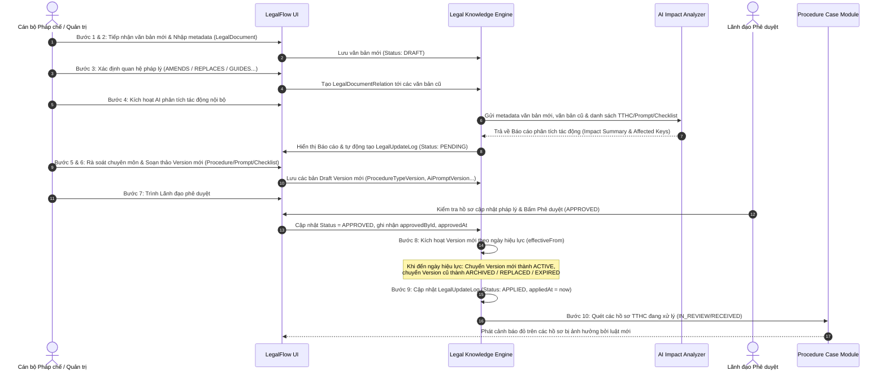
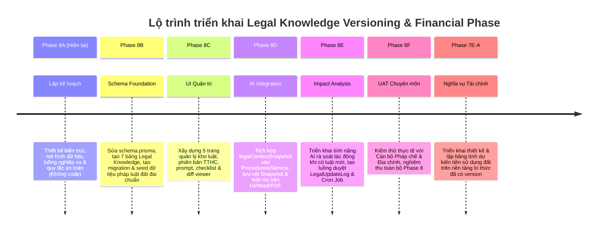

# Phase 8A Plan – Legal Knowledge Versioning & Update Control
**(Quản lý phiên bản căn cứ pháp lý, thủ tục hành chính, prompt AI và checklist nghiệp vụ)**

*Tên module:* **Hệ thống Kiểm soát & Quản lý Phiên bản Tri thức Pháp lý (Legal Knowledge Versioning & Update Control)**  
*Mốc phát hành kế hoạch:* `v2.7.0-phase8a-plan`  
*Ngày lập:* 04/07/2026  
*Trạng thái:* Kế hoạch thiết kế kiến trúc và kỹ thuật chi tiết (Chưa sửa source code, chưa sửa schema, chưa migration, chưa deploy)

---

## 1. Bối cảnh và vấn đề

Hệ thống LegalFlow đã đạt được các bước tiến quan trọng trong việc hỗ trợ cán bộ thụ lý hồ sơ thủ tục hành chính (TTHC):
1. Đã triển khai chức năng AI rà soát chuyên sâu hồ sơ **Cấp Giấy chứng nhận quyền sử dụng đất lần đầu** (Phase 7C-B).
2. Đã triển khai chức năng AI rà soát chuyên sâu hồ sơ **Chuyển mục đích sử dụng đất** (Phase 7D-A).
3. Đã xây dựng cơ chế xuất **Phiếu rà soát nội bộ Word/PDF** tách biệt template cho hai luồng nghiệp vụ trên (Phase 7C-C và Phase 7D-B).

Tuy nhiên, trong môi trường quản lý hành chính nhà nước thực tế, hệ thống đang phải đối mặt với một thách thức nền tảng mang tính sống còn: **Sự biến động và tính kế thừa của pháp luật**:
- **Hệ thống văn bản quy phạm pháp luật không ngừng thay đổi:** Các lĩnh vực quản lý nhà nước trọng yếu như Đất đai (Luật Đất đai 2024, Nghị định 101/2024/NĐ-CP, Nghị định 102/2024/NĐ-CP...), Xây dựng, Tiếp công dân, Khiếu nại, Tố cáo, Phòng chống tham nhũng thường xuyên được sửa đổi, bổ sung hoặc thay thế.
- **Thủ tục hành chính được ban hành và công bố lại:** Các Quyết định công bố bộ TTHC mới của Chủ tịch UBND tỉnh/thành phố hoặc Bộ Tài nguyên và Môi trường liên tục điều chỉnh thành phần hồ sơ, thời gian giải quyết, trình tự bước thực hiện và cơ quan thụ lý.
- **Chính sách nghĩa vụ tài chính và bảng giá đất biến động:** Bảng giá đất, hệ số điều chỉnh giá đất (hệ số K), tỷ lệ phần trăm tiền sử dụng đất, các chính sách miễn giảm hoặc quy định về tiền thuê đất thay đổi theo từng năm hoặc từng giai đoạn quy hoạch.
- **Nguy cơ lỗi thời trầm trọng của hệ thống AI (AI Obsolescence Risk):** Hiện tại, cấu trúc nghiệp vụ, chỉ dẫn pháp lý và danh sách kiểm tra đang được định nghĩa trong mã nguồn hoặc các cấu hình seed tĩnh. Nếu không có cơ chế quản lý phiên bản (versioning) và kiểm soát cập nhật (update control), các prompt AI, checklist thẩm tra và phiếu rà soát Word/PDF sẽ nhanh chóng bị lỗi thời, dẫn chiếu sai văn bản đã hết hiệu lực.
- **Yêu cầu an toàn tiên quyết trước Phase 7E:** Trước khi triển khai các tính năng phức tạp và nhạy cảm như hỗ trợ tính toán dự kiến nghĩa vụ tài chính / tiền sử dụng đất (Phase 7E), LegalFlow **bắt buộc phải có một cơ chế quản lý căn cứ pháp lý có phiên bản** để bảo đảm mọi công thức, bảng giá và tỷ lệ áp dụng đều có căn cứ hợp pháp, chính xác theo thời điểm nộp hồ sơ.

**Kết luận:** Phase 8A được thiết kế để giải quyết triệt để bài toán này, đóng vai trò là "bộ não lập pháp" giúp LegalFlow luôn đồng bộ với thực tế pháp lý, ngăn chặn rủi ro AI tự ý coi kiến thức trong prompt là pháp luật hiện hành bất biến.

---

## 2. Nguyên tắc kiến trúc

Toàn bộ thiết kế và kiến trúc của Phase 8A được xây dựng dựa trên **7 Nguyên tắc Bất khả xâm phạm**:

### 1. Code không phải là luật (Code is NOT the Law)
Mã nguồn ứng dụng (NestJS, React, TypeScript) tuyệt đối không được dùng để lưu trữ hay hardcode các quy định pháp luật, thành phần hồ sơ hay công thức tính toán tài chính. Mã nguồn chỉ cung cấp "động cơ" (engine) để thực thi các quy tắc được định nghĩa trong Kho tri thức pháp lý.

### 2. Prompt không phải là luật (Prompt is NOT the Law)
Prompt hướng dẫn LLM (System Prompt, Task Instruction) không được hardcode các khẳng định pháp lý tuyệt đối hay các văn bản pháp luật tĩnh. Prompt phải là một khuôn mẫu động (dynamic template) nhận đầu vào là các bản chụp căn cứ pháp lý (legal context snapshot) được tiêm vào tại thời điểm chạy.

### 3. AI không tự nhớ luật (AI Must NOT Rely on Parametric Memory)
Tuyệt đối không cho phép AI dựa vào trí nhớ tham số (parametric memory/knowledge) được huấn luyện sẵn của LLM để suy luận luật hay dẫn chiếu điều khoản. LLM phải hoạt động như một công cụ suy luận thuần túy dựa trên payload tri thức pháp lý được hệ thống cung cấp (RAG / Knowledge Snapshot).

### 4. Tri thức pháp lý phải được kiểm soát chặt chẽ (Managed Legal Knowledge Base)
Luật và quy định hành chính phải nằm trong một kho tri thức có cấu trúc, có phiên bản (version), ngày có hiệu lực (`effectiveFrom`), ngày hết hiệu lực (`effectiveTo`), trạng thái hiệu lực rõ ràng (`status`) và **bắt buộc phải có dấu vết người phê duyệt chuyên môn (`approvedById`)**.

### 5. Nguyên tắc Áp dụng theo thời gian & Chọn lọc (Active / Selected Version Enforcement)
Khi thực hiện rà soát một hồ sơ TTHC, AI chỉ được phép sử dụng bộ căn cứ pháp lý đang có hiệu lực (Active) tại thời điểm tiếp nhận hồ sơ, hoặc bộ phiên bản cụ thể được cán bộ thẩm tra chỉ định áp dụng (dành cho các trường hợp chuyển tiếp hoặc hồi tố theo quy định).

### 6. Minh bạch tuyệt đối trong kết quả (Transparent Legal Attribution)
Mọi kết quả phân tích AI, checklist gợi ý và Phiếu rà soát xuất ra (Word/PDF) đều **bắt buộc phải ghi rõ mã phiên bản căn cứ pháp lý đã sử dụng (`legalKnowledgeVersion`) và ngày cập nhật kho tri thức**. Cán bộ và lãnh đạo phải nhìn thấy ngay văn bản nào đã làm cơ sở cho gợi ý của AI.

### 7. Cảnh báo an toàn chủ động (Proactive Safety Warning)
Khi kho tri thức pháp lý chưa được cập nhật, đang có văn bản chờ rà soát, hoặc quá 30 ngày chưa được xác nhận định kỳ, hệ thống và AI phải tự động phát đi cảnh báo rủi ro nổi bật, yêu cầu cán bộ thụ lý kiểm tra, đối chiếu trực tiếp với các văn bản quy phạm pháp luật hiện hành trên Cơ sở dữ liệu quốc gia về pháp luật.

---

## 3. Thiết kế dữ liệu đề xuất

*(Lưu ý: Dưới đây là thiết kế kiến trúc mô hình quan hệ dữ liệu đề xuất cho Phase 8A. Trong phase này chỉ thực hiện thiết kế trên tài liệu, **chưa tạo schema trong `prisma/schema.prisma` và chưa tạo migration**).*

### A. `LegalDocument` (Văn bản quy phạm pháp luật / Căn cứ pháp lý)
Lưu trữ thông tin metadata gốc của các văn bản pháp luật, quyết định TTHC, quy trình nội bộ, bảng giá đất.
```prisma
model LegalDocument {
  id               String   @id @default(uuid())
  documentCode     String   @unique // Số hiệu văn bản (vd: "102/2024/NĐ-CP", "03/2024/L-CTN")
  documentTitle    String   // Tên/Trích yếu văn bản
  documentType     LegalDocumentType // LAW, DECREE, CIRCULAR, DECISION, INTERNAL_PROCESS, LAND_PRICE_TABLE, OTHER
  issuingAuthority String   // Cơ quan ban hành (Chính phủ, Bộ TN&MT, UBND Tỉnh...)
  issuedDate       DateTime // Ngày ban hành
  effectiveFrom    DateTime // Ngày có hiệu lực
  effectiveTo      DateTime? // Ngày hết hiệu lực (null nếu đang hiệu lực)
  status           LegalDocumentStatus @default(DRAFT) // DRAFT, ACTIVE, AMENDED, EXPIRED, REPLACED, ARCHIVED
  sourceUrl        String?  // Đường dẫn CSDL Quốc gia về pháp luật
  fileObjectKey    String?  // MinIO key chứa file toàn văn PDF/Word
  summary          String?  // Tóm tắt nội dung trọng tâm
  notes            String?  // Ghi chú áp dụng
  createdById      String   // ID người tạo
  approvedById     String?  // ID lãnh đạo/cán bộ pháp chế duyệt
  approvedAt       DateTime?// Thời điểm duyệt
  createdAt        DateTime @default(now())
  updatedAt        DateTime @updatedAt

  // Relations
  relationsOutgoing LegalDocumentRelation[] @relation("SourceDocument")
  relationsIncoming LegalDocumentRelation[] @relation("TargetDocument")
  promptVersions    AiPromptVersion[]
  checklistVersions ChecklistVersion[]
  procedureVersions ProcedureTypeVersion[]
}

enum LegalDocumentType {
  LAW              // Luật
  DECREE           // Nghị định
  CIRCULAR         // Thông tư
  DECISION         // Quyết định
  INTERNAL_PROCESS // Quy trình nội bộ
  LAND_PRICE_TABLE // Bảng giá đất / Hệ số K
  OTHER            // Văn bản khác
}

enum LegalDocumentStatus {
  DRAFT    // Dự thảo / Chờ duyệt
  ACTIVE   // Đang có hiệu lực
  AMENDED  // Bị sửa đổi, bổ sung một phần
  EXPIRED  // Hết hiệu lực tự nhiên / Hết hạn
  REPLACED // Bị thay thế toàn bộ
  ARCHIVED // Lưu trữ lịch sử
}
```

### B. `LegalDocumentRelation` (Quan hệ giữa các văn bản pháp lý)
Quản lý cây gia phá, lịch sử sửa đổi, thay thế, hướng dẫn hoặc bãi bỏ giữa các văn bản.
```prisma
model LegalDocumentRelation {
  id                String   @id @default(uuid())
  documentId        String   // Văn bản chủ thể (vd: Nghị định 102/2024/NĐ-CP)
  relatedDocumentId String   // Văn bản liên quan (vd: Luật Đất đai 2024 hoặc Nghị định 43/2014/NĐ-CP)
  relationType      LegalRelationType // AMENDS, REPLACES, GUIDES, ANNULS, REFERENCES, IMPLEMENTS
  description       String?  // Mô tả chi tiết (vd: "Thay thế toàn bộ Nghị định 43/2014/NĐ-CP")
  effectiveFrom     DateTime // Ngày mối quan hệ bắt đầu có hiệu lực
  createdAt         DateTime @default(now())

  // Relations
  document        LegalDocument @relation("SourceDocument", fields: [documentId], references: [id], onDelete: Cascade)
  relatedDocument LegalDocument @relation("TargetDocument", fields: [relatedDocumentId], references: [id], onDelete: Cascade)

  @@unique([documentId, relatedDocumentId, relationType])
}

enum LegalRelationType {
  AMENDS     // Sửa đổi, bổ sung
  REPLACES   // Thay thế
  GUIDES     // Hướng dẫn thi hành
  ANNULS     // Bãi bỏ / Hủy bỏ
  REFERENCES // Dẫn chiếu / Căn cứ
  IMPLEMENTS // Quy định chi tiết
}
```

### C. `ProcedureTypeVersion` (Phiên bản cấu hình Thủ tục hành chính)
Lưu trữ cấu hình từng phiên bản của một loại TTHC theo các quyết định công bố mới.
```prisma
model ProcedureTypeVersion {
  id                 String   @id @default(uuid())
  procedureTypeId    String   // FK tới ProcedureType hiện tại
  version            String   // Mã phiên bản (vd: "v2024.1", "v2026.2")
  effectiveFrom      DateTime // Ngày áp dụng phiên bản TTHC này
  effectiveTo        DateTime?// Ngày hết hạn áp dụng
  status             WorkflowVersionStatus @default(DRAFT)
  procedureName      String   // Tên thủ tục tại thời điểm công bố
  procedureCode      String   // Mã thủ tục (LAND_FIRST_CERTIFICATE, LAND_USE_PURPOSE_CHANGE...)
  field              String   // Lĩnh vực (Đất đai, Xây dựng...)
  group              String   // Nhóm thủ tục
  requiredDocuments  Json     // Cấu trúc JSON danh sách giấy tờ bắt buộc & tùy chọn
  processingTimeDays Int      // Thời gian giải quyết quy định (ngày làm việc)
  receivingAgency    String   // Cơ quan tiếp nhận (Bộ phận Một cửa UBND Tỉnh/Huyện)
  resolvingAgency    String   // Cơ quan giải quyết (Phòng TN&MT, UBND Huyện, VPĐKĐĐ)
  workflowSteps      Json     // Cấu trúc JSON các bước xử lý nội bộ
  legalBasisDocumentIds String[] // Mảng ID các LegalDocument làm căn cứ
  approvedById       String?
  approvedAt         DateTime?
  createdAt          DateTime @default(now())
  updatedAt          DateTime @updatedAt
}

enum WorkflowVersionStatus {
  DRAFT     // Đang soạn thảo / Rà soát
  REVIEWING // Chờ thẩm định pháp chế
  APPROVED  // Đã phê duyệt (chờ đến ngày hiệu lực)
  ACTIVE    // Đang hiệu lực sử dụng chính thức
  ARCHIVED  // Đã lưu trữ (phiên bản cũ)
  EXPIRED   // Hết hiệu lực
  REPLACED  // Đã bị thay thế bởi version mới
}
```

### D. `AiPromptVersion` (Phiên bản Prompt AI rà soát)
Quản lý phiên bản các mẫu System Prompt, Task Instruction và Output Schema của AI.
```prisma
model AiPromptVersion {
  id                String   @id @default(uuid())
  promptKey         String   // Mã định danh prompt (vd: "LAND_FIRST_CERTIFICATE_REVIEW_PROMPT")
  version           String   // Phiên bản (vd: "v2.5", "v2024.08")
  procedureTypeCode String   // Mã loại TTHC liên quan
  procedureGroup    String?  // Nhóm TTHC
  analysisType      String   // LAND_FIRST_CERTIFICATE_REVIEW, LAND_USE_PURPOSE_CHANGE_REVIEW...
  systemPrompt      String   // Nội dung System Prompt chuẩn bị tiêm Legal Snapshot
  outputSchema      Json     // Cấu trúc JSON Schema bắt buộc LLM phải tuân thủ
  legalDocumentIds  String[] // Mảng ID các LegalDocument cấu thành kiến thức prompt
  effectiveFrom     DateTime // Ngày bắt đầu áp dụng prompt này
  effectiveTo       DateTime?// Ngày dừng áp dụng
  status            WorkflowVersionStatus @default(DRAFT)
  approvedById      String?
  approvedAt        DateTime?
  createdAt         DateTime @default(now())
  updatedAt         DateTime @updatedAt

  @@unique([promptKey, version])
}
```

### E. `ChecklistVersion` (Phiên bản Checklist nghiệp vụ)
Quản lý các danh sách kiểm tra (checklist items) chuẩn hóa theo từng thời kỳ pháp lý.
```prisma
model ChecklistVersion {
  id                String   @id @default(uuid())
  checklistKey      String   // Mã định danh checklist (vd: "CHK_LAND_FIRST_CERTIFICATE")
  version           String   // Phiên bản (vd: "v1.0", "v2.0")
  procedureTypeCode String   // Mã loại TTHC
  procedureGroup    String?  // Nhóm TTHC
  checklistItems    Json     // Mảng JSON các mục kiểm tra (category, name, legalRef, isMandatory)
  legalDocumentIds  String[] // Mảng ID văn bản pháp lý làm căn cứ
  effectiveFrom     DateTime
  effectiveTo       DateTime?
  status            WorkflowVersionStatus @default(DRAFT)
  approvedById      String?
  approvedAt        DateTime?
  createdAt         DateTime @default(now())
  updatedAt         DateTime @updatedAt

  @@unique([checklistKey, version])
}
```

### F. `LegalUpdateLog` (Nhật ký Cập nhật Pháp lý & Phân tích tác động)
Ghi nhận mọi biến động pháp luật và dấu vết rà soát tác động lên toàn bộ hệ thống.
```prisma
model LegalUpdateLog {
  id                    String   @id @default(uuid())
  updateTitle           String   // Tiêu đề cập nhật (vd: "Cập nhật Nghị định 102/2024/NĐ-CP thay thế NĐ 43")
  sourceDocumentId      String   // ID văn bản mới ban hành gây ra biến động
  affectedDocumentIds   String[] // Mảng ID các văn bản cũ bị ảnh hưởng (sửa đổi/bãi bỏ)
  affectedProcedureTypes String[] // Mảng mã TTHC bị tác động
  affectedPromptKeys    String[] // Mảng mã prompt AI cần rà soát lại
  affectedChecklistKeys String[] // Mảng mã checklist cần điều chỉnh
  impactSummary         String   // Tóm tắt phân tích tác động từ AI/Pháp chế
  reviewStatus          LegalReviewStatus @default(PENDING)
  reviewedById          String?  // Cán bộ pháp chế/chuyên môn rà soát
  reviewedAt            DateTime?
  appliedAt             DateTime?// Thời điểm áp dụng chính thức vào hệ thống
  notes                 String?  // Ý kiến chỉ đạo/thẩm định
  createdAt             DateTime @default(now())
}

enum LegalReviewStatus {
  PENDING   // Chờ rà soát tác động
  REVIEWING // Đang đánh giá chuyên môn
  APPROVED  // Đã thông qua phương án cập nhật
  REJECTED  // Từ chối áp dụng (không liên quan/sai thông tin)
  APPLIED   // Đã hoàn tất áp dụng version mới vào hệ thống
}
```

### G. `ProcedureAiAnalysisLegalSnapshot` (Bản chụp dấu vết pháp lý tại thời điểm rà soát)
Lưu "bản chụp bất biến" (immutable snapshot) chứng minh AI và cán bộ đã dùng luật nào tại giây phút bấm nút rà soát hồ sơ.
```prisma
model ProcedureAiAnalysisLegalSnapshot {
  id                     String   @id @default(uuid())
  procedureAiAnalysisId  String   @unique // FK tới ProcedureAiAnalysis
  legalDocumentIds       String[] // Mảng ID văn bản pháp lý active lúc rà soát
  promptVersionId        String   // ID phiên bản prompt đã chạy
  checklistVersionId     String   // ID phiên bản checklist đã áp dụng
  procedureTypeVersionId String   // ID phiên bản TTHC đã áp dụng
  knowledgeBaseVersion   String   // Tag tổng thể kho tri thức (vd: "KB-2026.07.01")
  snapshotJson           Json     // Toàn văn nội dung căn cứ pháp lý đã gửi vào LLM prompt
  createdAt              DateTime @default(now())
}
```

---

## 4. Luồng cập nhật khi pháp luật thay đổi

Khi cơ quan nhà nước có thẩm quyền ban hành một văn bản quy phạm pháp luật mới (Luật, Nghị định, Thông tư) hoặc Quyết định công bố TTHC mới, hệ thống thực hiện luồng quy trình kiểm soát 10 bước khép kín:



### Chi tiết 10 bước thực hiện:
1. **Bước 1: Tiếp nhận văn bản mới:** Cán bộ pháp chế hoặc quản trị viên hệ thống tiếp nhận văn bản mới từ CSDL Quốc gia về pháp luật hoặc cổng thông tin của bộ/ngành/địa phương.
2. **Bước 2: Nhập metadata văn bản:** Nhập các thông tin số hiệu (`documentCode`), tên văn bản, cơ quan ban hành, ngày ban hành, ngày có hiệu lực vào bảng `LegalDocument` với trạng thái ban đầu là `DRAFT`.
3. **Bước 3: Xác định quan hệ pháp lý:** Thiết lập mối quan hệ trong `LegalDocumentRelation`: xác định văn bản mới này sửa đổi, bổ sung (`AMENDS`), thay thế (`REPLACES`), hướng dẫn (`GUIDES`) hay bãi bỏ (`ANNULS`) văn bản nào đang có trong hệ thống.
4. **Bước 4: Chạy AI phân tích tác động nội bộ (AI Impact Analysis):** Kích hoạt tính năng trợ lý AI rà soát kho tri thức. AI sẽ đọc tóm tắt văn bản mới, đối chiếu với danh sách TTHC, prompt AI và checklist hiện có, sau đó chỉ ra chính xác: *Văn bản này làm ảnh hưởng tới TTHC nào? Prompt rà soát đất đai nào cần sửa? Checklist điều khoản nào bị bãi bỏ?*
5. **Bước 5: Cán bộ pháp chế/chuyên môn rà soát:** Cán bộ chuyên môn kiểm tra báo cáo tác động do AI đề xuất, thẩm định tính chính xác và quyết định phương án điều chỉnh nghiệp vụ.
6. **Bước 6: Tạo version mới cho thủ tục/prompt/checklist:** Dựa trên kết quả rà soát, cán bộ tạo bản thảo (`DRAFT`) phiên bản mới cho `ProcedureTypeVersion`, `AiPromptVersion` và `ChecklistVersion` tương ứng, cập nhật lại trường `legalDocumentIds` trỏ tới văn bản mới.
7. **Bước 7: Lãnh đạo phê duyệt version mới:** Hồ sơ rà soát và các phiên bản dự thảo được trình lên Lãnh đạo cơ quan/bộ phận. Lãnh đạo xem xét và thực hiện phê duyệt (`APPROVED`), hệ thống ghi nhận chữ ký/ID người duyệt (`approvedById`).
8. **Bước 8: Kích hoạt version mới theo ngày hiệu lực:** Hệ thống kiểm tra trường `effectiveFrom`. Khi thời gian thực tế chạm mốc hiệu lực của văn bản mới, hệ thống tự động chuyển trạng thái version mới thành `ACTIVE`, đồng thời chuyển trạng thái version cũ thành `ARCHIVED` (hoặc `REPLACED`/`EXPIRED`).
9. **Bước 9: Ghi `LegalUpdateLog`:** Bản ghi nhật ký cập nhật pháp lý được chuyển sang trạng thái `APPLIED`, hoàn tất chu trình kiểm soát thay đổi.
10. **Bước 10: Cảnh báo hồ sơ đang xử lý:** Hệ thống tự động quét các hồ sơ TTHC đang ở trạng thái thụ lý (`RECEIVED`, `IN_REVIEW`) thuộc mã TTHC bị ảnh hưởng. Hiển thị banner cảnh báo đỏ trên trang chi tiết hồ sơ: *"⚠️ Chú ý: Căn cứ pháp lý của thủ tục này vừa có sự thay đổi (Nghị định XYZ có hiệu lực từ ngày...). Cán bộ cần rà soát lại căn cứ áp dụng."*

---

## 5. Trạng thái workflow & Phân quyền chuyển đổi

Hệ thống quản lý phiên bản tuân thủ vòng đời 7 trạng thái chuẩn hóa, bảo đảm sự phân định trách nhiệm rõ ràng giữa người soạn thảo, người thẩm định và người phê duyệt:

| Trạng thái (`Status`) | Ý nghĩa nghiệp vụ | Ai có quyền chuyển sang trạng thái này? | Điều kiện ràng buộc / Ghi chú |
| :--- | :--- | :--- | :--- |
| **`DRAFT`** | Bản thảo khởi tạo / Đang soạn thảo sửa đổi. | **Cán bộ Pháp chế**, **Quản trị viên** (Admin). | Mới nhập liệu hoặc đang trong quá trình chỉnh sửa, chưa có giá trị áp dụng. |
| **`REVIEWING`** | Đang trình thẩm định, chờ đánh giá chuyên môn sâu. | **Cán bộ Pháp chế** (gửi trình); **Cán bộ Thẩm định** (tiếp nhận). | AI đã chạy xong phân tích tác động, các trường thông tin bắt buộc đã được điền đầy đủ. |
| **`APPROVED`** | Đã được phê duyệt chính thức, chờ đến ngày có hiệu lực. | **Lãnh đạo cơ quan / Lãnh đạo bộ phận phụ trách**. | Bắt buộc ghi nhận `approvedById` và `approvedAt`. Chưa áp dụng nếu chưa đến ngày `effectiveFrom`. |
| **`ACTIVE`** | **Đang có hiệu lực thi hành.** Là phiên bản duy nhất được AI và hệ thống áp dụng. | **Hệ thống tự động** (khi đến ngày `effectiveFrom` của bản `APPROVED`); hoặc **Lãnh đạo** (kích hoạt thủ công khi cần gấp). | Tại một thời điểm, chỉ có **duy nhất 01 version ACTIVE** cho mỗi mã thủ tục / prompt / checklist. |
| **`ARCHIVED`** | Lưu trữ lịch sử. Phiên bản cũ đã bị thay thế hoặc hết hạn áp dụng. | **Hệ thống tự động** (khi version mới chuyển sang `ACTIVE`); hoặc **Quản trị viên**. | Chỉ có giá trị tham khảo lịch sử, tra cứu lại các hồ sơ cũ đã giải quyết trong quá khứ. |
| **`EXPIRED`** | Hết hiệu lực tự nhiên (theo ngày `effectiveTo` hoặc theo quy định của pháp luật). | **Hệ thống tự động** (khi thời gian thực chạm mốc `effectiveTo`); hoặc **Cán bộ Pháp chế**. | Văn bản pháp lý hoặc cấu hình thủ tục không còn giá trị pháp lý thi hành. |
| **`REPLACED`** | Bị thay thế toàn bộ bởi một văn bản / phiên bản mới. | **Hệ thống tự động** (khi có `LegalDocumentRelation` loại `REPLACES` được kích hoạt). | Văn bản cũ bị bãi bỏ/thay thế hoàn toàn, tự động ngắt khỏi các prompt AI đang active. |

---

## 6. Ảnh hưởng tới các module hiện có

Việc triển khai kiến trúc Phase 8A tác động sâu rộng đến 9 thành phần và module hiện có của LegalFlow, mang lại tính chuẩn xác pháp lý cao nhất:

1. **AI rà soát cấp GCN lần đầu (Phase 7C-B):**
   - *Trước 8A:* Prompt AI rà soát cấp GCN được xây dựng dựa trên logic định nghĩa trong `ProcedureAiPromptBuilder`.
   - *Sau 8A:* `ProcedureAiPromptBuilder` sẽ không tự định nghĩa cấu trúc tĩnh mà sẽ fetch cấu hình từ `AiPromptVersion` đang `ACTIVE` (mã `LAND_FIRST_CERTIFICATE_REVIEW_PROMPT`). Hệ thống tự động tiêm danh sách văn bản pháp lý active (Luật Đất đai 2024, NĐ 101/2024...) vào payload gửi cho LLM.
2. **AI rà soát chuyển mục đích sử dụng đất (Phase 7D-A):**
   - *Sau 8A:* Tương tự luồng GCN lần đầu, AI rà soát chuyển mục đích sẽ sử dụng `AiPromptVersion` mã `LAND_USE_PURPOSE_CHANGE_REVIEW_PROMPT` đang active. Khi Nghị định 102/2024/NĐ-CP hoặc quy định chuyển mục đích của địa phương có sửa đổi, chỉ cần cập nhật kho tri thức, AI lập tức tuân thủ chuẩn mới.
3. **Phiếu Word/PDF cấp GCN lần đầu (Phase 7C-C):**
   - *Sau 8A:* Khi xuất phiếu Word `.docx` hoặc xem trước PDF, hàm `buildLandFirstCertificateReviewDocx` và modal preview sẽ đọc thông tin từ `ProcedureAiAnalysisLegalSnapshot`. Trên phiếu in ra sẽ hiển thị thêm một mục bắt buộc: **"Căn cứ pháp lý áp dụng (Phiên bản kho tri thức: KB-xxxx, cập nhật ngày...)"**.
4. **Phiếu Word/PDF chuyển mục đích (Phase 7D-B):**
   - *Sau 8A:* Phiếu rà soát chuyển mục đích cũng hiển thị đầy đủ dấu vết phiên bản pháp lý đã dùng. Nếu kho căn cứ pháp lý tại thời điểm xuất phiếu đang có cảnh báo chưa rà soát định kỳ, phiếu in ra sẽ tự động chèn thêm dòng chữ in đậm màu đỏ: *"Lưu ý: Kho căn cứ pháp lý đang trong giai đoạn rà soát cập nhật, cán bộ thụ lý cần đối chiếu văn bản gốc."*
5. **Checklist AI & Checklist nghiệp vụ hồ sơ:**
   - *Sau 8A:* Tab "Checklist thẩm tra" trong trang chi tiết hồ sơ không lấy dữ liệu từ seed cứng nữa mà load từ `ChecklistVersion` đang active. Khi luật mới thay đổi yêu cầu thành phần hồ sơ, bảng checklist của cán bộ tự động cập nhật theo version mới nhất.
6. **`ProcedureType` seed hiện có:**
   - *Sau 8A:* Bảng `ProcedureType` hiện tại sẽ đóng vai trò là danh mục gốc (Master Record). Toàn bộ các thuộc tính chi tiết hay thay đổi như `processingTimeDays`, `requiredDocuments`, `workflowSteps` sẽ được đồng bộ từ `ProcedureTypeVersion` đang `ACTIVE`.
7. **`ProcedureAiAnalysis` hiện có:**
   - *Sau 8A:* Mối quan hệ 1-1 với `ProcedureAiAnalysisLegalSnapshot` được thiết lập. Các bản phân tích AI đã chạy trong quá khứ (ở Phase 7C, 7D) khi truy vấn lại sẽ hiển thị nguyên vẹn "bản chụp" căn cứ pháp lý tại thời điểm năm 2026, bảo đảm tính bất biến của lịch sử giải quyết TTHC.
8. **`LegalCase` (Module Đơn thư khiếu nại/tố cáo cũ - Phase 1–6):**
   - *Sau 8A:* Kho tri thức `LegalDocument` được thiết kế dùng chung. Các chuyên mục khiếu nại, tố cáo, tranh chấp đất đai trong module `LegalCase` cũng có thể tra cứu và dẫn chiếu các văn bản pháp luật từ bảng `LegalDocument` này, tạo sự thống nhất toàn hệ thống.
9. **Module Nghĩa vụ tài chính / Tiền sử dụng đất (Phase 7E sau này):**
   - *Sau 8A:* Đây là sự chuẩn bị nền tảng hoàn hảo cho Phase 7E. Toàn bộ bảng giá đất, hệ số K, tỷ lệ thu tiền sử dụng đất, công thức tính toán dự kiến sẽ được quản lý như các đối tượng `LegalDocument` (loại `LAND_PRICE_TABLE`) hoặc cấu hình có version. Không có bất kỳ con số tài chính nhạy cảm nào bị hardcode trong source code.

---

## 7. Cách hiển thị trên UI

Để cán bộ và lãnh đạo dễ dàng kiểm soát kho tri thức, Phase 8A đề xuất bổ sung một phân hệ giao diện quản trị mới bên trong khối **"Quản trị Hệ thống & Pháp chế"**:

### 1. Trang "Kho căn cứ pháp lý" (`/admin/legal-knowledge/documents`)
- Hiển thị danh sách bảng các văn bản pháp luật, quyết định TTHC, bảng giá đất.
- Bộ lọc thông minh theo: Lĩnh vực, Loại văn bản (`LAW`, `DECREE`...), Trạng thái (`ACTIVE`, `DRAFT`, `EXPIRED`), Cơ quan ban hành.
- Có nhãn màu sắc rõ ràng (Badge màu xanh cho `ACTIVE`, màu xám cho `ARCHIVED`, màu vàng cho `DRAFT`, màu đỏ cho `EXPIRED`).
- Nút "Thêm văn bản mới", "Thiết lập quan hệ sửa đổi/thay thế", và xem "Cây gia phá văn bản" (Document Lineage Tree).

### 2. Trang "Phiên bản thủ tục hành chính" (`/admin/legal-knowledge/procedures`)
- Quản lý lịch sử các phiên bản của từng loại TTHC (vd: Cấp GCN lần đầu v2024.1, v2026.2).
- Giao diện so sánh sự khác biệt giữa 2 phiên bản (Diff Viewer): làm nổi bật các giấy tờ bổ sung mới, thời gian giải quyết thay đổi hoặc bước workflow điều chỉnh.

### 3. Trang "Phiên bản Prompt AI" (`/admin/legal-knowledge/prompts`)
- Dành riêng cho cán bộ pháp chế và kỹ sư prompt. Hiển thị danh sách các Prompt Key (`LAND_FIRST_CERTIFICATE_REVIEW_PROMPT`...).
- Cho phép chỉnh sửa System Prompt, cấu hình JSON Schema đầu ra, gắn kết danh sách văn bản pháp lý làm căn cứ (`legalDocumentIds`).
- Có nút **"Chạy thử nghiệm Prompt (Prompt Playground)"** để test với một hồ sơ mẫu trước khi trình duyệt `ACTIVE`.

### 4. Trang "Checklist Version" (`/admin/legal-knowledge/checklists`)
- Quản lý các bộ tiêu chí thẩm tra hồ sơ theo từng giai đoạn.
- Cho phép thêm, sửa, xóa các item kiểm tra, đánh dấu tiêu chí bắt buộc (`isMandatory`) và gắn chỉ dẫn điều khoản pháp lý tương ứng.

### 5. Trang "Nhật ký cập nhật pháp lý" (`/admin/legal-knowledge/update-logs`)
- Bảng theo dõi toàn bộ các đợt cập nhật pháp luật (`LegalUpdateLog`).
- Hiển thị cột: Văn bản mới ban hành, Danh sách TTHC/Prompt bị ảnh hưởng, Trạng thái rà soát (`PENDING`, `REVIEWING`, `APPLIED`), Người rà soát.
- Nút **"🤖 Xem AI Phân tích Tác động"**: Mở modal báo cáo chi tiết của AI về những điểm mâu thuẫn hoặc cần điều chỉnh trong hệ thống.

### 6. Banner cảnh báo an toàn toàn hệ thống (System-wide Safety Banner)
- Nếu kho tri thức pháp lý có văn bản trọng yếu đã hết hiệu lực nhưng chưa có bản thay thế, hoặc **quá 30 ngày chưa được cán bộ pháp chế rà soát xác nhận định kỳ**, hệ thống hiển thị banner cảnh báo màu cam/vàng trên toàn bộ các trang xử lý hồ sơ TTHC:
  > **⚠️ CẢNH BÁO KHO TRI THỨC PHÁP LÝ:** Kho căn cứ pháp lý đã 35 ngày chưa được rà soát định kỳ (Lần xác nhận gần nhất: 30/05/2026). Khi sử dụng Trợ lý AI, cán bộ thụ lý có trách nhiệm tự kiểm tra, đối chiếu hiệu lực của các văn bản pháp luật hiện hành trên CSDL Quốc gia về pháp luật.

### 7. Hiển thị trong trang Kết quả AI rà soát hồ sơ (`ProcedureCaseDetail.tsx` -> Tab AI rà soát)
Trong thẻ thẻ kết quả AI rà soát, ngay dưới tiêu đề "Tóm tắt phân tích từ Trợ lý AI", bổ sung một Khối thông tin căn cứ pháp lý (Legal Attribution Box) với bố cục rõ ràng:
- 🏷️ **Phiên bản Kho tri thức:** `KB-2026.07.01` *(Cập nhật ngày 01/07/2026)*
- 📜 **Prompt Version:** `v2.5 (Active)` | **Checklist Version:** `v2.0 (Active)`
- ⚖️ **Danh sách căn cứ pháp lý áp dụng cho hồ sơ này:**
  - *Luật Đất đai số 31/2024/QH15 (Hiệu lực: 01/08/2024 - Trạng thái: Đang hiệu lực)*
  - *Nghị định 101/2024/NĐ-CP của Chính phủ (Hiệu lực: 01/08/2024 - Trạng thái: Đang hiệu lực)*
  - *Quyết định số 123/QĐ-UBND ngày 15/01/2026 về bộ TTHC đất đai (Trạng thái: Đang hiệu lực)*
- 🚨 **Cảnh báo trách nhiệm thẩm tra:** *"Cán bộ thụ lý chịu trách nhiệm kiểm tra tính hiệu lực thực tế của các văn bản trên tại thời điểm giải quyết hồ sơ."*

---

## 8. Cách tích hợp với AI

Để bảo đảm tuân thủ nguyên tắc "Prompt không phải là luật" và "AI không tự nhớ luật", cơ chế tích hợp giữa Engine Quản lý phiên bản và Trợ lý AI được thiết kế như sau:

### 1. Loại bỏ hoàn toàn việc Hardcode trong Prompt
- Trong file `ProcedureAiPromptBuilder` và trong database `AiPromptVersion`, tuyệt đối không sử dụng các câu khẳng định tĩnh như: *"Theo Luật Đất đai mới nhất..."*, *"Căn cứ Điều 138 là chắc chắn đúng..."*.
- Thay vào đó, System Prompt sử dụng biến động:
  ```markdown
  Bạn là Trợ lý AI thẩm tra hồ sơ thủ tục hành chính đất đai.
  DƯỚI ĐÂY LÀ BẢN CHỤP CĂN CỨ PHÁP LÝ ĐANG CÓ HIỆU LỰC (LEGAL CONTEXT SNAPSHOT) MÀ BẠN BẮT BUỘC PHẢI TUÂN THỦ:
  {{legalContextSnapshot}}
  
  TUYỆT ĐỐI KHÔNG sử dụng kiến thức pháp luật ngoài danh sách trên. Nếu một vấn đề pháp lý không được đề cập trong bản chụp trên, bạn phải ghi rõ: "Không có căn cứ trong kho tri thức hiện hành, yêu cầu cán bộ kiểm tra quy định pháp luật liên quan".
  ```

### 2. Tiêm Bản chụp Căn cứ Pháp lý (`legalContextSnapshot`)
- Khi người dùng bấm nút "AI rà soát" (Cấp GCN lần đầu hoặc Chuyển mục đích), `ProcedureAiService` sẽ thực hiện truy vấn trước:
  1. Lấy `AiPromptVersion` đang `ACTIVE`.
  2. Lấy danh sách `LegalDocument` đang `ACTIVE` được liên kết với prompt đó.
  3. Đóng gói toàn bộ tiêu đề, số hiệu, ngày hiệu lực và tóm tắt điều khoản của các văn bản này thành chuỗi JSON/Markdown `legalContextSnapshot`.
  4. Tiêm `legalContextSnapshot` vào System Prompt trước khi gửi tới API LLM (Gemini / Claude).
  5. Đồng thời, lưu toàn bộ gói dữ liệu này vào bảng `ProcedureAiAnalysisLegalSnapshot` để lưu vết vĩnh viễn.

### 3. Chuẩn hóa Output Schema từ AI
JSON Schema đầu ra của AI rà soát được bắt buộc bổ sung 4 trường thông tin kiểm soát pháp lý:
```json
{
  "legalKnowledgeVersion": "KB-2026.07.01",
  "promptVersion": "v2.5",
  "legalBasisToCheck": [
    {
      "documentCode": "101/2024/NĐ-CP",
      "articleRef": "Điều 18, Điều 21",
      "applicabilityReason": "Quy định điều kiện cấp GCN cho đất không giấy tờ trước năm 2014",
      "isDocumentActiveInKb": true
    }
  ],
  "requiresOfficerLegalVerification": true,
  "legalWarningMessage": "Hồ sơ có thời điểm sử dụng đất năm 1992, cần cán bộ đối chiếu kỹ quy định chuyển tiếp tại Điều 256 Luật Đất đai 2024."
}
```

### 4. Xử lý khi Thiếu Kho tri thức Active
- Nếu tại thời điểm gọi AI, hệ thống phát hiện không có `AiPromptVersion` nào ở trạng thái `ACTIVE`, hoặc toàn bộ văn bản trong `legalDocumentIds` đều đã `EXPIRED` / `ARCHIVED`, `ProcedureAiService` sẽ **từ chối gọi LLM** và ném lỗi `BadRequestException` rõ ràng:
  > *"Không thể thực hiện AI rà soát: Kho căn cứ pháp lý cho thủ tục này chưa được kích hoạt hoặc đã hết hiệu lực. Vui lòng liên hệ Cán bộ Pháp chế để phê duyệt phiên bản tri thức mới."*

### 5. AI Không có quyền Tự cập nhật Luật
- LLM không có quyền ghi (write access) vào các bảng `LegalDocument`, `ProcedureTypeVersion` hay `AiPromptVersion`.
- AI chỉ đóng vai trò là "chuyên viên phân tích đề xuất" trong bước tạo `LegalUpdateLog`. Việc chuyển trạng thái sang `ACTIVE` bắt buộc phải có chữ ký/phê duyệt của con người (`approvedById`).

---

## 9. Cách tích hợp với Word/PDF

Phiếu rà soát nội bộ xuất ra dưới dạng Word (`.docx`) và xem trước/in PDF (`window.print()`) là tài liệu chứng cứ làm việc trong hồ sơ lưu trữ hành chính. Do đó, việc tích hợp thông tin phiên bản pháp lý tuân thủ các chỉ đạo sau:

### 1. Ghi nhận Phiên bản & Ngày cập nhật rõ ràng trên Phiếu
- Tại **Phần II: TÓM TẮT PHÂN TÍCH TỪ TRỢ LÝ AI** (hoặc Phần I Thông tin chung) trên cả Phiếu rà soát Cấp GCN lần đầu và Chuyển mục đích sử dụng đất, bổ sung trường thông tin bắt buộc:
  - **Phiên bản kho tri thức pháp lý áp dụng:** `KB-2026.07.01` *(Ngày cập nhật kho: 01/07/2026)*
  - **Phiên bản Prompt AI:** `v2.5` | **Phiên bản Checklist:** `v2.0`

### 2. Liệt kê Danh sách Căn cứ Pháp lý dưới dạng "Gợi ý kiểm tra"
- Tại **Phần X: KHUYẾN NGHỊ CHUYÊN MÔN & CĂN CỨ PHÁP LÝ**, danh sách văn bản pháp luật không được ghi như một kết luận áp dụng mang tính định đoạt hợp pháp, mà phải ghi dưới tiêu đề an toàn:
  > **CÁC CĂN CỨ PHÁP LÝ GỢI Ý CẦN CÁN BỘ THỤ LÝ KIỂM TRA, ĐỐI CHIẾU:**  
  > 1. *Luật Đất đai số 31/2024/QH15 (Đang có hiệu lực trong hệ thống tại thời điểm rà soát) – Cần đối chiếu Điều 138, Điều 139.*  
  > 2. *Nghị định số 101/2024/NĐ-CP ngày 29/07/2024 của Chính phủ – Cần đối chiếu quy trình tại Điều 21.*  
  > *(Lưu ý: Danh sách trên do Trợ lý AI gợi ý dựa trên kho tri thức nội bộ. Cán bộ thụ lý chịu trách nhiệm kiểm tra hiệu lực văn bản hiện hành trên CSDL Quốc gia về pháp luật trước khi trình ký).*

### 3. Cảnh báo nổi bật nếu Kho pháp lý Quá hạn hoặc Đang rà soát
- Khi xuất phiếu Word hoặc mở preview PDF, hệ thống kiểm tra trạng thái kho tri thức. Nếu phát hiện kho tri thức có cảnh báo quá hạn (>30 ngày chưa rà soát) hoặc có văn bản liên quan đang ở trạng thái `REVIEWING` trong `LegalUpdateLog`, ngay bên dưới Box Cảnh báo Human-in-the-Loop đầu trang sẽ chèn thêm một khối cảnh báo bổ sung viền kép:
  > **⚠️ CẢNH BÁO BỔ SUNG VỀ CĂN CỨ PHÁP LÝ:**  
  > *Kho căn cứ pháp lý áp dụng cho phiếu rà soát này hiện đang trong giai đoạn rà soát cập nhật theo quy định mới (hoặc quá hạn xác nhận định kỳ). Các dẫn chiếu điều khoản trong phiếu này có nguy cơ chưa phản ánh hết các thay đổi pháp luật mới nhất. Cán bộ thẩm tra bắt buộc phải đối chiếu trực tiếp với văn bản quy phạm pháp luật gốc.*

---

## 10. Cách tích hợp với nghĩa vụ tài chính Phase 7E

Phase 7E (Thiết kế bảng tính dự kiến nghĩa vụ tài chính / tiền sử dụng đất) là module có độ rủi ro pháp lý và nhạy cảm tài chính cao nhất. Phase 8A thiết kế sẵn bộ khung kiến trúc để kiểm soát hoàn toàn module này:

### 1. Công thức tính toán phải có Version (`FinancialFormulaVersion`)
- Tuyệt đối không hardcode công thức tính tiền sử dụng đất, tiền thuê đất hay lệ phí trước bạ trong code TypeScript/NestJS.
- Công thức tính toán được định nghĩa trong cấu hình JSON thuộc một model mở rộng của kho tri thức (hoặc nằm trong `ProcedureTypeVersion.financialRules`), có mã phiên bản, ngày hiệu lực và trạng thái `ACTIVE`/`ARCHIVED`.
- *Ví dụ:* Công thức thu tiền sử dụng đất đối với đất giao không đúng thẩm quyền trước 01/07/2014 theo Luật Đất đai 2024 (thu 40%, 50% hay 100% tiền sử dụng đất) phải được lưu như một rule có version được lãnh đạo phê duyệt.

### 2. Bảng giá đất & Hệ số điều chỉnh phải có Thời gian hiệu lực
- Bảng giá đất của UBND tỉnh/thành phố và Hệ số điều chỉnh giá đất (Hệ số K) hàng năm được lưu trữ trong bảng `LegalDocument` với loại `documentType = LAND_PRICE_TABLE`.
- Bắt buộc có trường `effectiveFrom` (vd: từ 01/01/2026) và `effectiveTo` (vd: đến 31/12/2026). Khi qua ngày 31/12, bảng giá cũ tự động chuyển sang `EXPIRED`, hệ thống sẽ chặn không cho lập bảng tính dự kiến mới nếu chưa có Bảng giá đất mới được duyệt `ACTIVE`.

### 3. Chính sách miễn giảm phải có Version
- Các đối tượng được miễn, giảm tiền sử dụng đất (người có công với cách mạng, hộ nghèo, đồng bào dân tộc thiểu số...) và mức giảm (giảm 50%, miễn 100%) được quản lý bằng danh mục cấu hình pháp lý có version. Khi chính sách của Chính phủ thay đổi, chỉ cần cập nhật danh mục trong kho tri thức.

### 4. Ghi rõ Căn cứ, Công thức và Bảng giá trên Bảng tính dự kiến
- Khi AI hoặc hệ thống hỗ trợ lập "Bảng tính dự kiến nghĩa vụ tài chính" (trong Phase 7E), kết quả đầu ra không chỉ hiển thị các con số mà **bắt buộc phải hiển thị khối giải trình căn cứ**:
  - *Áp dụng Bảng giá đất theo Quyết định số xx/2025/QĐ-UBND ngày... (Phiên bản: v2026.1 - Đang hiệu lực).*
  - *Áp dụng Hệ số K = 1.2 theo Quyết định số yy/2026/QĐ-UBND.*
  - *Áp dụng công thức tính theo Điều xyz Nghị định 103/2024/NĐ-CP về tiền sử dụng đất.*

### 5. Yêu cầu Cán bộ & Cơ quan Thuế xác nhận (Human-in-the-Loop Tài chính)
- Hệ thống luôn gắn disclaimer chữ đỏ: *"BẢN TÍNH DỰ KIẾN TỪ HỆ THỐNG – KHÔNG PHẢI THÔNG BÁO NỘP TIỀN CHÍNH THỨC"*.
- Cán bộ địa chính phải rà soát, kiểm tra từng thông số và bấm nút "Xác nhận số liệu dự kiến" trước khi in phiếu chuyển sang Cơ quan Thuế để phát hành Thông báo nộp tiền sử dụng đất chính thức theo thẩm quyền pháp luật.

---

## 11. Phân quyền (Role-Based Access Control - RBAC)

Để bảo đảm tính an toàn, bảo mật và tính chính danh trong quản lý tri thức pháp lý, Phase 8A định nghĩa ma trận phân quyền rõ ràng cho 5 nhóm chủ thể trong hệ thống:

| Nhóm chủ thể | Quyền xem / Tra cứu (`Read`) | Quyền Soạn thảo / Sửa đổi (`Write / Draft`) | Quyền Thẩm định (`Review`) | Quyền Phê duyệt / Kích hoạt (`Approve / Activate`) | Quyền Lưu trữ / Xóa (`Archive / Delete`) |
| :--- | :---: | :---: | :---: | :---: | :---: |
| **1. Quản trị viên hệ thống (`SYSTEM_ADMIN`)** | Toàn bộ (Active, Draft, Archived, Expired) | ✅ Tạo/Sửa metadata văn bản, cấu hình TTHC | ❌ Không thẩm định chuyên môn | ❌ Không phê duyệt luật | ✅ Archive / Xóa bản nháp |
| **2. Cán bộ Pháp chế / Chuyên môn (`LEGAL_OFFICER`)** | Toàn bộ (Active, Draft, Archived, Expired) | ✅ Soạn thảo Draft Version (Prompt, Checklist, TTHC) | ✅ Rà soát tác động (`REVIEWING`), đề xuất phương án | ❌ Không phê duyệt chính thức | ✅ Đề xuất Archive |
| **3. Lãnh đạo Phê duyệt (`LEGAL_APPROVER` / `DEPARTMENT_LEADER`)** | Toàn bộ | ❌ Không soạn thảo trực tiếp | ✅ Thẩm định ý kiến pháp chế | **✅ PHÊ DUYỆT (`APPROVED` / `ACTIVE`)** | **✅ Quyết định Archive / Bãi bỏ** |
| **4. Cán bộ Thụ lý Một cửa / Địa chính (`CASE_OFFICER`)** | **Chỉ xem phiên bản `ACTIVE`** (và lịch sử hồ sơ cũ) | ❌ Không có quyền tạo/sửa luật | ❌ Không | ❌ Không | ❌ Không |
| **5. Trợ lý AI (`AI_SERVICE_ACCOUNT`)** | **Chỉ đọc dữ liệu `ACTIVE`** (và bản chụp Snapshot cũ) | ❌ Tuyệt đối KHÔNG có quyền ghi vào kho luật | ✅ Chạy phân tích tác động tạo Draft `LegalUpdateLog` | ❌ Tuyệt đối KHÔNG | ❌ Tuyệt đối KHÔNG |

---

## 12. Audit log (Nhật ký kiểm toán hệ thống)

Mọi thao tác tác động đến kho tri thức pháp lý và phiên bản TTHC đều được theo dõi và ghi nhận vào nhật ký kiểm toán quản trị (`AdminAuditLog` hoặc `ProcedureAuditLog`), bảo đảm tính chống chối bỏ (non-repudiation) và phục vụ thanh tra, kiểm tra hành chính:

1. **`CREATE_LEGAL_DOCUMENT`:** Ghi nhận khi cán bộ tạo mới một bản thảo văn bản pháp lý (`LegalDocument`), lưu rõ `userId`, thời gian và số hiệu văn bản.
2. **`UPDATE_LEGAL_DOCUMENT`:** Ghi nhận khi sửa đổi thông tin metadata, tóm tắt hoặc đính kèm file toàn văn của văn bản pháp lý.
3. **`SET_LEGAL_RELATION`:** Ghi nhận khi thiết lập hoặc thay đổi mối quan hệ sửa đổi/thay thế/bãi bỏ giữa các văn bản (`LegalDocumentRelation`).
4. **`CREATE_PROMPT_VERSION`:** Ghi nhận khi tạo một bản thảo phiên bản mới cho AI Prompt (`AiPromptVersion`) hoặc Checklist (`ChecklistVersion`).
5. **`APPROVE_LEGAL_VERSION`:** Ghi nhận khi Lãnh đạo bấm nút Phê duyệt (`APPROVED`) một phiên bản thủ tục, prompt hay checklist. Lưu lại chữ ký số (nếu có), ID lãnh đạo và payload phiên bản được duyệt.
6. **`ACTIVATE_LEGAL_VERSION`:** Ghi nhận thời điểm hệ thống hoặc lãnh đạo chính thức chuyển trạng thái phiên bản sang `ACTIVE`.
7. **`ARCHIVE_LEGAL_VERSION`:** Ghi nhận khi phiên bản cũ bị thay thế và chuyển sang trạng thái lưu trữ lịch sử (`ARCHIVED` / `EXPIRED`).
8. **`RUN_LEGAL_IMPACT_ANALYSIS`:** Ghi nhận việc kích hoạt AI chạy phân tích tác động nội bộ khi có văn bản mới, lưu lại báo cáo tóm tắt tác động.
9. **`APPLY_LEGAL_UPDATE_LOG`:** Ghi nhận việc hoàn tất chu trình rà soát và đóng bản ghi nhật ký cập nhật pháp lý (`LegalUpdateLog` -> `APPLIED`).

---

## 13. Rủi ro cần kiểm soát & Biện pháp giảm thiểu

Quản lý phiên bản tri thức pháp lý là một bài toán phức tạp. Dưới đây là bảng nhận diện 9 rủi ro trọng yếu và các biện pháp kiểm soát kỹ thuật/nghiệp vụ tương ứng:

| # | Rủi ro tiềm ẩn | Mức độ | Biện pháp kiểm soát & Giảm thiểu trong Phase 8A |
| :-: | :--- | :---: | :--- |
| **1** | **Nhập sai metadata văn bản** (Sai số hiệu, sai ngày hiệu lực, sai cơ quan ban hành). | Cao | - Cơ chế xác thực ràng buộc form (Validation Schema).<br/>- Yêu cầu đính kèm file gốc (PDF scan/Word) từ CSDL Quốc gia về pháp luật để đối chiếu.<br/>- Bắt buộc qua bước thẩm định của Cán bộ Pháp chế trước khi trình duyệt. |
| **2** | **Quên cập nhật khi có văn bản pháp luật mới ban hành.** | Rất Cao | - Tích hợp cơ chế theo dõi định kỳ: Hệ thống hiển thị **Banner cảnh báo đỏ** nếu kho tri thức quá 30 ngày chưa có xác nhận rà soát của cán bộ pháp chế.<br/>- Định kỳ phát thông báo nhắc nhở rà soát văn bản hàng tháng/quý cho bộ phận quản trị. |
| **3** | **AI hoặc hệ thống tiếp tục sử dụng Prompt cũ đã lỗi thời.** | Cao | - Cơ chế **Active Version Enforcement**: Trong service gọi AI, viết hardcode logic luôn query `AiPromptVersion` có `status = ACTIVE`.<br/>- Chặn API từ chối phục vụ nếu không tìm thấy bản active hoặc bản active đã hết hạn `effectiveTo`. |
| **4** | **Cán bộ tiếp tục sử dụng Checklist thẩm tra cũ.** | Trung bình | - Khi load chi tiết hồ sơ TTHC, hệ thống tự động kiểm tra mã version của checklist. Nếu phát hiện version mới hơn đang active, tự động hiển thị nút: *"🔄 Có phiên bản checklist mới (v2.0), bấm để cập nhật vào hồ sơ này"*. |
| **5** | **Văn bản pháp luật hết hiệu lực nhưng trạng thái vẫn là `ACTIVE`.** | Cao | - Chạy **Cron Job ngầm mỗi ngày lúc 00:00**: Quét toàn bộ bảng `LegalDocument` và `ProcedureTypeVersion`. Nếu phát hiện `effectiveTo < now()`, tự động chuyển trạng thái sang `EXPIRED` / `ARCHIVED` và ghi log hệ thống. |
| **6** | **Công thức tính nghĩa vụ tài chính lỗi thời gây thất thoát ngân sách hoặc sai tiền dân.** | Rất Cao | - Tách biệt hoàn toàn rule tài chính thành cấu hình có version.<br/>- Bắt buộc Lãnh đạo phê duyệt kép (Dual-Approval) đối với mọi thay đổi về Bảng giá đất hoặc Hệ số K.<br/>- Ghi rõ disclaimer và yêu cầu xác nhận thủ công của cán bộ địa chính trước khi chuyển Thuế. |
| **7** | **AI Hallucination (Bịa đặt) căn cứ pháp lý không có trong kho tri thức.** | Rất Cao | - Trong System Prompt, thiết lập chỉ dẫn ràng buộc nghiêm ngặt: *"Chỉ dẫn chiếu điều khoản có trong `legalContextSnapshot`. Nếu không có, phải trả lời: Không có quy định trong kho tri thức"*.<br/>- Thiết lập tham số `temperature = 0.1` (mức sáng tạo cực thấp) cho các tác vụ rà soát pháp lý. |
| **8** | **Thiếu Lãnh đạo hoặc Cán bộ chuyên môn phê duyệt (Dữ liệu bị tắc nghẽn ở DRAFT/REVIEWING).** | Trung bình | - Dashboard quản trị hiển thị widget "Hồ sơ cập nhật pháp lý chờ duyệt" nổi bật.<br/>- Gửi email/thông báo nội bộ nhắc nhở Lãnh đạo nếu bản ghi `LegalUpdateLog` ở trạng thái `REVIEWING` quá 03 ngày làm việc. |
| **9** | **Dữ liệu version quá phức tạp, gia tăng tải DB và làm chậm hệ thống.** | Trung bình | - Sử dụng cơ chế đánh chỉ mục (Index) tối ưu trên các trường `status`, `effectiveFrom`, `procedureCode` và `promptKey` trong PostgreSQL.<br/>- Tích hợp bộ nhớ đệm (Redis Cache / In-memory Cache) cho các phiên bản `ACTIVE` vì dữ liệu này đọc liên tục nhưng rất ít khi sửa đổi. |

---

## 14. Roadmap đề xuất sau Phase 8A

Lộ trình triển khai thực tế từ Kế hoạch 8A đến khi hoàn thiện hệ sinh thái quản lý tri thức và tiến tới tính toán nghĩa vụ tài chính được chia thành 6 giai đoạn tuần tự:



1. **Phase 8B – Schema Foundation & Master Seeding:**
   - Thực hiện cập nhật `schema.prisma` với 7 model đã thiết kế ở Mục 3.
   - Chạy migration tạo bảng trong PostgreSQL.
   - Xây dựng bộ seed chuẩn (`seed-legal-knowledge.ts`): nạp dữ liệu Luật Đất đai 2024, Nghị định 101/2024, Nghị định 102/2024 và các prompt/checklist của Phase 7C, 7D dưới dạng Version `v1.0 (ACTIVE)`.
2. **Phase 8C – UI Quản trị Kho tri thức & Phiên bản TTHC:**
   - Xây dựng các trang quản trị giao diện React/Vite cho Cán bộ Pháp chế và Admin (`/admin/legal-knowledge/*`).
   - Tích hợp công cụ xem khác biệt phiên bản (Diff Viewer) và Prompt Playground.
3. **Phase 8D – AI Integration & Legal Snapshot Tracking:**
   - Nâng cấp `ProcedureAiService`: tự động fetch `AiPromptVersion` active và tiêm `legalContextSnapshot`.
   - Lưu vết vào `ProcedureAiAnalysisLegalSnapshot`.
   - Cập nhật hiển thị phiên bản pháp lý trên Tab AI rà soát và Phiếu xuất Word/PDF (Phase 7C-C, 7D-B).
4. **Phase 8E – Legal Update Impact Analysis & Automation:**
   - Triển khai luồng 10 bước cập nhật luật.
   - Xây dựng tính năng AI phân tích tác động nội bộ (`LegalUpdateLog`).
   - Tích hợp Cron Job ngầm tự động chuyển trạng thái `ACTIVE` / `EXPIRED` theo ngày hiệu lực và hiển thị Banner cảnh báo toàn hệ thống.
5. **Phase 8F – UAT Chuyên môn & Nghiệm thu Phase 8:**
   - Tổ chức đào tạo và kiểm thử chấp nhận người dùng (UAT) với các cán bộ pháp chế, chuyên viên địa chính và bộ phận một cửa.
   - Kiểm thử các kịch bản mô phỏng khi có Nghị định mới ban hành hoặc Bảng giá đất thay đổi.
6. **Chuyển sang Phase 7E-A – Thiết kế Bảng tính dự kiến Nghĩa vụ Tài chính:**
   - Sau khi nền tảng tri thức pháp lý đã an toàn, vững chắc và có versioning, chính thức khởi động Phase 7E để hỗ trợ tính toán dự kiến tiền sử dụng đất, tiền thuê đất và lệ phí trước bạ.

---

## 15. Checklist trước khi code Phase 8B

Trước khi chính thức bước vào giai đoạn viết mã nguồn và chỉnh sửa cơ sở dữ liệu ở **Phase 8B**, kỹ sư triển khai và kiến trúc sư hệ thống **bắt buộc phải rà soát và xác nhận hoàn tất 8 tiêu chí kiểm tra (Pre-coding Checklist)** sau đây:

- [ ] **1. Xác định chính xác các Model bắt buộc trong giai đoạn đầu:**
  - Xác nhận Phase 8B sẽ tạo đủ 7 model: `LegalDocument`, `LegalDocumentRelation`, `ProcedureTypeVersion`, `AiPromptVersion`, `ChecklistVersion`, `LegalUpdateLog`, `ProcedureAiAnalysisLegalSnapshot`. Không bỏ sót model nào để tránh phải migration bổ sung liên tục.
- [ ] **2. Chuẩn hóa bộ Enum và Trạng thái (Status Mapping):**
  - Kiểm tra lại sự thống nhất của các Enum (`LegalDocumentType`, `LegalDocumentStatus`, `WorkflowVersionStatus`, `LegalRelationType`, `LegalReviewStatus`). Đảm bảo không xung đột tên với các Enum đã có trong `schema.prisma` hiện tại.
- [ ] **3. Xác định quan hệ ngược (Back-relations) với các model hiện có:**
  - Định nghĩa rõ khóa ngoại và quan hệ giữa `ProcedureTypeVersion` với `ProcedureType` hiện tại.
  - Định nghĩa quan hệ giữa `ProcedureAiAnalysisLegalSnapshot` với `ProcedureAiAnalysis` hiện tại (quan hệ 1-1, `onDelete: Cascade` hay `SetNull`).
- [ ] **4. Đánh giá tác động Migration & Bảo toàn dữ liệu cũ:**
  - Xác nhận lệnh `npx prisma migrate dev --name add_legal_knowledge_versioning` sẽ chỉ tạo thêm bảng và cột mới, **tuyệt đối không làm mất mát hay ảnh hưởng đến dữ liệu** của các bảng TTHC (`AdministrativeProcedureCase`), đơn thư (`LegalCase`) hay user hiện có.
- [ ] **5. Chuẩn bị kịch bản Seed dữ liệu ban đầu (Initial Legal Seed Data):**
  - Chuẩn bị sẵn file dữ liệu JSON hoặc script seed chứa chuẩn xác thông tin của: Luật Đất đai số 31/2024/QH15, Nghị định 101/2024/NĐ-CP, Nghị định 102/2024/NĐ-CP, và các bộ cấu hình TTHC / Prompt / Checklist của thủ tục Cấp GCN lần đầu và Chuyển mục đích sử dụng đất để nạp ngay khi migration xong.
- [ ] **6. Xác định phạm vi UI tối thiểu (MVP UI) cho Phase 8C:**
  - Thống nhất với user/lãnh đạo về các màn hình UI tối thiểu cần làm trước: ưu tiên Màn hình danh sách văn bản pháp lý, Màn hình danh sách prompt version và Khối hiển thị Legal Attribution trên trang chi tiết hồ sơ TTHC.
- [ ] **7. Xây dựng Kịch bản Rollback Cơ sở dữ liệu & Mã nguồn:**
  - Chuẩn bị sẵn lệnh revert migration (`npx prisma migrate resolve` / restore từ file dump backup `.sql`) và lệnh git revert trong trường hợp migration trên môi trường UAT gặp sự cố.
- [ ] **8. Cam kết Triệt tiêu Hardcode (Zero-Hardcoding Pledge):**
  - Toàn bộ nhóm phát triển quán triệt nguyên tắc: Từ Phase 8B trở đi, mọi chuỗi system prompt, mọi danh sách tài liệu yêu cầu TTHC, mọi câu hỏi checklist và mọi quy tắc tài chính đều phải được đọc từ database qua các Service, tuyệt đối không viết chuỗi tĩnh trong các file `.ts` hay `.tsx`.

---
*Tài liệu Kế hoạch Thiết kế Kiến trúc Phase 8A được xây dựng và xác nhận bởi LegalFlow AI Architecture Team.*
