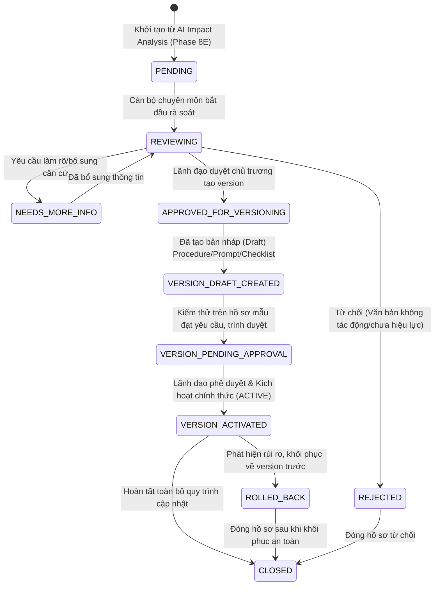
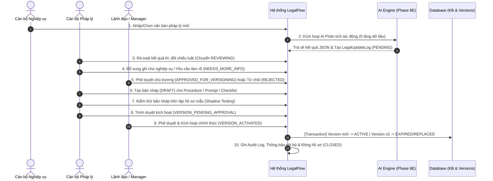
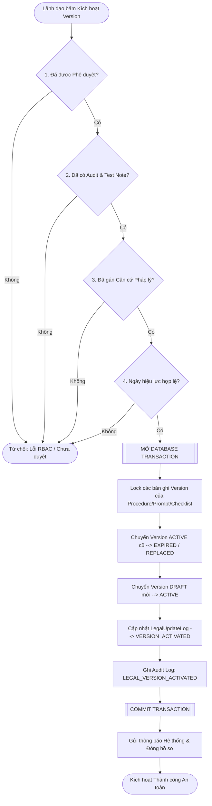

# Phase 8F-A Design – Legal Update Review Workflow

**Dự án:** LegalFlow – Nền tảng Hỗ trợ Nghiệp vụ & Rà soát Pháp lý Đất đai  
**Tài liệu:** Thiết kế Quy trình Rà soát, Phê duyệt và Áp dụng Cập nhật Pháp lý (Phase 8F-A)  
**Phiên bản tài liệu:** v1.0.0 (Design Specification)  
**Ngày lập:** 05/07/2026  
**Trạng thái:** HOÀN THÀNH THIẾT KẾ (DESIGN COMPLETED)

---

## 1. Mục tiêu và Phạm vi

### 1.1. Mục tiêu Thiết kế
Phase 8F-A là bước **thiết kế kiến trúc và quy trình nghiệp vụ thuần túy**, đóng vai trò là cầu nối chiến lược giữa giai đoạn AI phát hiện tác động pháp lý (Phase 8E) và giai đoạn thực thi áp dụng thay đổi vào hệ thống giải quyết thủ tục hành chính (TTHC) trong tương lai (Phase 8F-B/C/D/E).

Mục tiêu cốt lõi của tài liệu này là xây dựng một khung quy trình chuẩn hóa, chặt chẽ, bảo đảm tính minh bạch, tuân thủ kỷ luật hành chính và an toàn pháp lý khi hệ thống tiếp nhận một văn bản pháp luật mới hoặc một sự thay đổi về quy trình nghiệp vụ đất đai.

### 1.2. Phạm vi Thực hiện (Scope & Strict Constraints)
Để bảo đảm tuyệt đối tính ổn định của hệ thống hiện hữu (đã hoàn tất Phase 8E tại mốc `v2.7.8-legal-update-impact-analysis-complete`), Phase 8F-A tuân thủ nghiêm ngặt các giới hạn phạm vi sau:
1. **Chỉ tạo tài liệu thiết kế Markdown:** Toàn bộ kết quả đầu ra được tài liệu hóa tại `docs/LEGALFLOW_V2_PHASE8F_A_LEGAL_UPDATE_REVIEW_WORKFLOW_DESIGN.md`.
2. **Không triển khai source code:** Không chỉnh sửa, bổ sung hay viết mới bất kỳ dòng code logic nào trong backend hoặc frontend.
3. **Không sửa đổi Database Schema:** Không thay đổi file `schema.prisma`, không bổ sung bảng hay trường dữ liệu trong phase này.
4. **Không tạo Database Migration:** Không chạy lệnh tạo hay áp dụng migration cơ sở dữ liệu.
5. **Không thay đổi cấu hình môi trường:** Không chỉnh sửa các file cấu hình như `.env`, `docker-compose.yml`...
6. **Không tạo REST API Endpoint mới:** Không mở rộng controller hay router mới.
7. **Không tạo Giao diện (UI) mới:** Chỉ mô tả thiết kế giao diện tương lai dưới dạng cấu trúc tài liệu.
8. **Không cho phép AI tự áp dụng cập nhật:** AI tuyệt đối không có quyền tự động thay đổi dữ liệu hay kích hoạt phiên bản.
9. **Không tự động kích hoạt phiên bản (No Auto-Activation):** Không thực hiện bất kỳ thao tác chuyển trạng thái nào đối với các phiên bản thủ tục, prompt hay checklist đang hiện hữu.
10. **Không tự động commit/tag thay người dùng:** Đảm bảo quyền kiểm soát phiên bản mã nguồn hoàn toàn thuộc về người dùng (Human-in-the-Loop).

---

## 2. Nguyên tắc Cốt lõi (Core Legal & Technical Principles)

Thiết kế quy trình rà soát và áp dụng cập nhật pháp lý tại Phase 8F-A được xây dựng dựa trên 7 nguyên tắc bất khả xâm phạm của Nền tảng LegalFlow:

1. **AI chỉ đóng vai trò Gợi ý & Trợ lý (AI as Advisor Only):**  
   Trí tuệ nhân tạo (AI) thực hiện rà soát chéo, tổng hợp dữ liệu, đánh giá rủi ro và đề xuất hành động nghiệp vụ. AI **tuyệt đối không** có thẩm quyền ra quyết định pháp lý, không được phép tự động thay đổi kết luận hồ sơ hay tự ý sửa đổi kho căn cứ pháp lý.
2. **Cán bộ chuyên môn Kiểm tra & Xác thực (Human-in-the-Loop Verification):**  
   Mọi kết quả phân tích tác động từ AI phải được cán bộ nghiệp vụ/pháp lý trực tiếp kiểm tra, đối chiếu toàn văn bản quy phạm pháp luật thực tế, xác minh điều khoản hiệu lực và điều khoản chuyển tiếp trước khi đưa vào quy trình phê duyệt.
3. **Lãnh đạo Phê duyệt Bắt buộc (Mandatory Authority Approval):**  
   Chỉ những người có thẩm quyền (Manager/Admin) mới có quyền phê duyệt chủ trương cập nhật, đánh giá kết quả kiểm thử và ra lệnh kích hoạt phiên bản mới.
4. **Bảo vệ Tuyệt đối Phiên bản Đang Hiệu lực (Active Version Protection):**  
   Không một thao tác nào (dù là thủ công hay tự động) được phép làm thay đổi nội dung, cấu trúc hay trạng thái của phiên bản đang `ACTIVE` nếu chưa hoàn tất trọn vẹn quy trình rà soát, kiểm thử trên hồ sơ mẫu và được phê duyệt chính thức.
5. **Tính Kiểm toán Toàn diện (Comprehensive Audit Trail):**  
   Mọi sự kiện diễn ra trong vòng đời cập nhật pháp lý — từ lúc khởi tạo phân tích, thêm ghi chú, từ chối, tạo bản nháp, kiểm thử đến kích hoạt hay rollback — đều phải được ghi vết kiểm toán (Audit Log) với đầy đủ thông tin: Người thực hiện, thời điểm, trạng thái trước/sau và lý do.
6. **Không Xóa Lịch sử Dữ liệu (No History Deletion):**  
   Khi một phiên bản mới được kích hoạt, phiên bản cũ sẽ được chuyển sang trạng thái hết hiệu lực (`EXPIRED`) hoặc bị thay thế (`REPLACED`). Hệ thống **tuyệt đối không xóa bỏ** dữ liệu cũ nhằm bảo đảm tính kế thừa, tính minh bạch và phục vụ công tác thanh tra, kiểm toán đối với các hồ sơ TTHC đã giải quyết trong quá khứ.
7. **Khả năng Khôi phục An toàn (Safe Rollback Capability):**  
   Hệ thống phải được thiết kế sẵn các kịch bản khôi phục khẩn cấp (Rollback) ở cả 3 tầng: Mã nguồn (Source code), Cơ sở dữ liệu (Database backup) và Phiên bản nghiệp vụ (Business version re-activation) để kịp thời ứng phó nếu phát hiện rủi ro khi áp dụng thực tế.

---

## 3. Đề xuất Lifecycle cho `LegalUpdateLog`

Trong Phase 8B, hệ thống đã định nghĩa Enum `LegalUpdateReviewStatus` với 5 trạng thái cơ bản (`PENDING_REVIEW`, `IN_REVIEW`, `APPROVED_FOR_UPDATE`, `REJECTED`, `APPLIED`).

Để phản ánh chính xác và kiểm soát chặt chẽ quy trình rà soát nhiều lớp từ khi AI phát hiện tác động đến khi kiểm thử và kích hoạt an toàn, **Phase 8F-A đề xuất mở rộng và chuẩn hóa vòng đời (Lifecycle) của `LegalUpdateLog` gồm 10 trạng thái nghiệp vụ dưới đây** *(Lưu ý: Đây là thiết kế kiến trúc chuẩn bị cho Phase 8F-B, hiện tại **chưa sửa schema**)*:



### Chi tiết ý nghĩa các trạng thái đề xuất:
1. `PENDING` (Chờ rà soát): Nhật ký phân tích tác động vừa được AI hoặc cán bộ khởi tạo, đang chờ bộ phận chuyên môn tiếp nhận.
2. `REVIEWING` (Đang rà soát): Cán bộ nghiệp vụ/pháp lý đang trực tiếp kiểm tra, đánh giá độ chính xác của gợi ý AI và đối chiếu luật hiện hành.
3. `NEEDS_MORE_INFO` (Cần làm rõ): Hồ sơ cập nhật phức tạp, cần tham vấn ý kiến cấp trên, cơ quan chuyên môn hoặc chờ văn bản hướng dẫn chi tiết hơn.
4. `APPROVED_FOR_VERSIONING` (Đã duyệt chủ trương): Lãnh đạo đồng ý với đánh giá tác động, cho phép bộ phận kỹ thuật/nghiệp vụ tạo phiên bản nháp (`DRAFT`) cho thủ tục, prompt AI hoặc checklist.
5. `REJECTED` (Từ chối cập nhật): Lãnh đạo hoặc cán bộ rà soát xác nhận văn bản mới không làm thay đổi nghiệp vụ TTHC đang quản lý, hoặc văn bản chưa đủ điều kiện áp dụng.
6. `VERSION_DRAFT_CREATED` (Đã tạo bản nháp): Các phiên bản nháp (`DRAFT`) của `ProcedureTypeVersion`, `AiPromptVersion`, hoặc `ChecklistVersion` đã được tạo trong hệ thống để chuẩn bị kiểm thử.
7. `VERSION_PENDING_APPROVAL` (Chờ duyệt kích hoạt): Các bản nháp đã trải qua kiểm thử thực tế trên tập hồ sơ mẫu (Benchmark testing), kết quả rà soát AI đạt chuẩn, trình Lãnh đạo phê duyệt kích hoạt.
8. `VERSION_ACTIVATED` (Đã kích hoạt): Lãnh đạo chính thức phê duyệt lệnh kích hoạt. Phiên bản mới chuyển sang `ACTIVE`, phiên bản cũ tự động chuyển sang `EXPIRED` hoặc `REPLACED`.
9. `ROLLED_BACK` (Đã khôi phục): Trạng thái đặc biệt khi phát hiện phiên bản vừa kích hoạt có lỗi nghiệp vụ nghiêm trọng, hệ thống đã thực hiện khôi phục khẩn cấp về phiên bản trước đó.
10. `CLOSED` (Đóng hồ sơ): Vòng đời cập nhật pháp lý đã hoàn tất trọn vẹn (sau khi kích hoạt thành công, sau khi rollback an toàn hoặc sau khi từ chối).

---

## 4. Quy trình Nghiệp vụ Đề xuất (10 Bước Chuẩn hóa)

Quy trình rà soát, phê duyệt và áp dụng cập nhật pháp lý được chuẩn hóa thành **10 bước tuần tự**, kết hợp chặt chẽ giữa sức mạnh phân tích của AI và sự kiểm soát trách nhiệm của con người:



### Chi tiết từng bước nghiệp vụ:
* **Bước 1: Nhập hoặc chọn văn bản pháp lý cần phân tích**  
  Cán bộ nghiệp vụ chọn một văn bản pháp lý có sẵn trong kho căn cứ (đang ở trạng thái `DRAFT` hoặc `ACTIVE`) hoặc nhập thông tin văn bản quy phạm pháp luật mới ban hành (Luật Đất đai 2024, Nghị định hướng dẫn, Quyết định công bố TTHC địa phương).
* **Bước 2: AI phân tích tác động (Impact Analysis)**  
  Hệ thống kích hoạt AI Engine (đã xây dựng ở Phase 8E), thực hiện quét và đối chiếu chéo 5 tầng dữ liệu: Văn bản liên quan, Thủ tục hành chính, Prompt AI, Checklist nghiệp vụ và Danh sách hồ sơ TTHC đang xử lý (Open Cases). Kết quả được lưu vào `LegalUpdateLog` với trạng thái `PENDING`.
* **Bước 3: Cán bộ chuyên môn rà soát kết quả AI**  
  Cán bộ pháp lý/chuyên môn tiếp nhận hồ sơ nhật ký, kiểm tra kỹ các vùng rủi ro, danh sách thủ tục bị ảnh hưởng do AI gợi ý. Cán bộ đối chiếu với toàn văn điều khoản văn bản luật thực tế. Trạng thái nhật ký chuyển sang `REVIEWING`.
* **Bước 4: Cán bộ bổ sung căn cứ / ghi chú nghiệp vụ**  
  Cán bộ ghi nhận ý kiến chuyên môn vào hệ thống: xác nhận AI gợi ý đúng/sai, chỉ ra điều khoản chuyển tiếp cần lưu ý, hoặc chuyển trạng thái sang `NEEDS_MORE_INFO` nếu cần chờ xin ý kiến sở ban ngành.
* **Bước 5: Lãnh đạo hoặc người được phân quyền duyệt hướng xử lý**  
  Lãnh đạo bộ phận (Manager) xem xét báo cáo tác động của AI và ý kiến rà soát của cán bộ. Lãnh đạo ra quyết định: Phê duyệt chủ trương cập nhật (`APPROVED_FOR_VERSIONING`) hoặc Từ chối cập nhật (`REJECTED` - kèm lý do).
* **Bước 6: Tạo draft version mới nếu cần**  
  Sau khi có chủ trương phê duyệt, cán bộ chuyên môn thực hiện lệnh tạo bản nháp (`DRAFT`). Hệ thống tự động nhân bản (clone) cấu trúc của phiên bản `ACTIVE` hiện tại sang một phiên bản nháp mới (ví dụ: `v1.0` -> `v1.1-draft`) đối với `ProcedureTypeVersion`, `AiPromptVersion` và `ChecklistVersion`. Trạng thái chuyển sang `VERSION_DRAFT_CREATED`.
* **Bước 7: Kiểm thử prompt/checklist/thủ tục mới trên hồ sơ mẫu**  
  Cán bộ thực hiện kiểm thử trong môi trường lập trình giả lập (Sandboxed / Shadow Testing): Chạy thử AI rà soát sử dụng Prompt và Checklist nháp trên các hồ sơ TTHC mẫu (Benchmark cases) để đánh giá tính chính xác, không để xảy ra lỗi suy diễn pháp lý.
* **Bước 8: Phê duyệt kích hoạt version**  
  Khi kết quả kiểm thử đạt 100% yêu cầu nghiệp vụ, cán bộ lập báo cáo kiểm thử và chuyển trạng thái nhật ký sang `VERSION_PENDING_APPROVAL`. Lãnh đạo xem xét kết quả kiểm thử và kiểm tra checklist an toàn.
* **Bước 9: Kích hoạt version mới và đóng version cũ nếu phù hợp**  
  Lãnh đạo thực hiện lệnh **"Kích hoạt Phiên bản"**. Trong một giao dịch cơ sở dữ liệu tuyệt đối an toàn (Database Transaction), hệ thống chuyển phiên bản mới sang `ACTIVE`, đồng thời chuyển phiên bản `ACTIVE` cũ sang `EXPIRED` hoặc `REPLACED`. Trạng thái nhật ký chuyển thành `VERSION_ACTIVATED`.
* **Bước 10: Ghi audit, thông báo nội bộ và lưu snapshot**  
  Hệ thống tự động phát sinh các bản ghi kiểm toán (`ProcedureAuditLog`), gửi thông báo hệ thống đến toàn bộ cán bộ nghiệp vụ về việc áp dụng quy trình/căn cứ pháp lý mới, và chuyển nhật ký cập nhật sang trạng thái `CLOSED`.

---

## 5. Thiết kế RBAC (Role-Based Access Control)

Để bảo đảm tính phân minh về trách nhiệm hành chính và tuân thủ nguyên tắc "Human-in-the-Loop", Phase 8F-A thiết kế mô hình phân quyền nghiệp vụ chuyên sâu với 6 vai trò tiêu chuẩn:

| Vai trò Đề xuất | Tên Nghiệp vụ | Trách nhiệm & Thẩm quyền trong Quy trình Cập nhật Pháp lý |
| :--- | :--- | :--- |
| **`VIEWER`** | Người xem / Khách | • Chỉ được xem danh sách văn bản, phiên bản thủ tục và lịch sử nhật ký rà soát ở chế độ Read-only.<br>• Không có quyền thực hiện bất kỳ thao tác phân tích, ghi chú hay tạo phiên bản nào. |
| **`STAFF`** | Cán bộ Nghiệp vụ | • Được quyền truy cập kho căn cứ, xem lịch sử và **khởi tạo lệnh AI phân tích tác động** (Tạo `LegalUpdateLog` ở trạng thái PENDING).<br>• Không được phép phê duyệt chủ trương hay kích hoạt phiên bản. |
| **`LEGAL_OFFICER`** *(Hoặc STAFF chuyên môn)* | Cán bộ Pháp lý / Chuyên môn | • Chịu trách nhiệm chính trong việc **rà soát kết quả AI**, bổ sung ghi chú nghiệp vụ, yêu cầu làm rõ (`NEEDS_MORE_INFO`).<br>• Thực hiện tạo bản nháp (`DRAFT`), chạy kiểm thử trên hồ sơ mẫu và trình duyệt kích hoạt (`VERSION_PENDING_APPROVAL`). |
| **`MANAGER`** | Lãnh đạo / Trưởng phòng | • Nắm giữ thẩm quyền **phê duyệt chủ trương** (`APPROVED_FOR_VERSIONING`) hoặc từ chối (`REJECTED`).<br>• Phê duyệt kết quả kiểm thử và **ra lệnh kích hoạt chính thức** (`VERSION_ACTIVATED`) hoặc quyết định **Rollback** khẩn cấp khi có rủi ro. |
| **`ADMIN`** | Quản trị viên Hệ thống | • Quản trị cấu hình hệ thống, hỗ trợ kỹ thuật toàn diện.<br>• Có quyền can thiệp kiểm soát quy trình trong các trường hợp sự cố kỹ thuật, thực hiện rollback mã nguồn hoặc phục hồi dữ liệu từ backup. |
| **`SYSTEM`** | Hệ thống Tự động | • Tài khoản nội bộ tiến trình nền (Background Engine). Chịu trách nhiệm ghi log kiểm toán tự động, chụp legal snapshot và gửi thông báo hệ thống. |

### 🔄 Thiết kế Mapping Tạm thời với Hệ thống Hiện tại:
Do hệ thống LegalFlow hiện tại đang triển khai 4 vai trò chuẩn (`ADMIN`, `MANAGER`, `STAFF`, `VIEWER`), tài liệu thiết kế quy tắc ánh xạ (mapping) tạm thời để áp dụng cho Phase 8F-B/C/D như sau:
* **`ADMIN` (Quản trị viên):** Đảm nhận toàn bộ quyền của `ADMIN` và có quyền hỗ trợ Lãnh đạo trong các thao tác quản trị luồng rà soát.
* **`MANAGER` (Lãnh đạo):** Đảm nhận vai trò **Lãnh đạo phê duyệt**, giữ độc quyền thao tác chuyển trạng thái sang `APPROVED_FOR_VERSIONING`, `VERSION_ACTIVATED` và `ROLLED_BACK`.
* **`STAFF` (Cán bộ):** Đảm nhận vai trò gộp của **Cán bộ Nghiệp vụ** (`STAFF`) và **Cán bộ Chuyên môn** (`LEGAL_OFFICER`). Được quyền chạy phân tích tác động, rà soát, ghi chú, tạo bản nháp và chạy kiểm thử.
* **`VIEWER` (Chỉ xem):** Giữ nguyên giới hạn Read-only tuyệt đối.

---

## 6. Ma trận Quyền (Permission Matrix)

Dưới đây là Bảng Ma trận Phân quyền chi tiết cho 14 thao tác cốt lõi trong quy trình rà soát và kích hoạt cập nhật pháp lý, áp dụng cho 4 vai trò hiện hữu trong hệ thống:

| STT | Thao tác Nghiệp vụ (Action) | `ADMIN` | `MANAGER` | `STAFF` | `VIEWER` | Ghi chú / Điều kiện ràng buộc |
| :---: | :--- | :---: | :---: | :---: | :---: | :--- |
| **1** | Xem danh sách & chi tiết `LegalUpdateLog` | ✅ | ✅ | ✅ | ✅ | Quyền truy cập cơ bản (Read-only) |
| **2** | Chạy AI Phân tích tác động (`analyze-impact`) | ✅ | ✅ | ✅ | ❌ | Tạo bản ghi nhật ký mới ở trạng thái PENDING |
| **3** | Bổ sung ý kiến / ghi chú rà soát (Review Notes) | ✅ | ✅ | ✅ | ❌ | Chỉ thực hiện khi log đang ở PENDING, REVIEWING, NEEDS_MORE_INFO |
| **4** | Chuyển trạng thái sang `REVIEWING` | ✅ | ✅ | ✅ | ❌ | Xác nhận bộ phận chuyên môn bắt đầu rà soát |
| **5** | Đánh dấu `NEEDS_MORE_INFO` (Yêu cầu làm rõ) | ✅ | ✅ | ✅ | ❌ | Yêu cầu bổ sung căn cứ hoặc chờ hướng dẫn |
| **6** | Đề xuất tạo version mới / Trình duyệt | ✅ | ❌ | ✅ | ❌ | Chuyển trạng thái sang `VERSION_PENDING_APPROVAL` |
| **7** | Phê duyệt tạo version (`APPROVED_FOR_VERSIONING`) | ✅ | ✅ | ❌ | ❌ | **Quyền Lãnh đạo:** Cho phép tạo bản nháp (Draft) |
| **8** | Tạo draft `ProcedureTypeVersion` | ✅ | ❌ | ✅ | ❌ | Chỉ được tạo khi log đã được Lãnh đạo duyệt chủ trương |
| **9** | Tạo draft `AiPromptVersion` | ✅ | ❌ | ✅ | ❌ | Chỉ được tạo khi log đã được Lãnh đạo duyệt chủ trương |
| **10** | Tạo draft `ChecklistVersion` | ✅ | ❌ | ✅ | ❌ | Chỉ được tạo khi log đã được Lãnh đạo duyệt chủ trương |
| **11** | Kiểm thử version nháp trên hồ sơ mẫu | ✅ | ✅ | ✅ | ❌ | Chạy shadow testing trên tập Benchmark cases |
| **12** | **Kích hoạt version chính thức (`VERSION_ACTIVATED`)** | ✅ | ✅ | ❌ | ❌ | **Quyền Lãnh đạo:** Bắt buộc phải qua kiểm thử & kiểm tra an toàn |
| **13** | **Rollback version khẩn cấp (`ROLLED_BACK`)** | ✅ | ✅ | ❌ | ❌ | **Quyền Lãnh đạo:** Khôi phục về phiên bản trước khi có rủi ro |
| **14** | Đóng hồ sơ nhật ký cập nhật (`CLOSED`) | ✅ | ✅ | ❌ | ❌ | Đóng hồ sơ sau khi hoàn tất hoặc từ chối (`REJECTED`) |

*(Chú thích: ✅ = Được phép thực hiện; ❌ = Không được phép thực hiện / Bị từ chối bởi RBAC Guard)*

---

## 7. Thiết kế Dữ liệu Cần Bổ sung ở Phase Sau (Data Schema Proposals)

*⚠️ **LƯU Ý QUAN TRỌNG:** Các nội dung dưới đây là **đề xuất thiết kế kiến trúc cho Phase 8F-B và các phase tiếp theo**. Trong phạm vi Phase 8F-A, hệ thống **KHÔNG** tạo migration, **KHÔNG** sửa đổi file `schema.prisma` và **KHÔNG** can thiệp vào cơ sở dữ liệu hiện hữu.*

Để hỗ trợ khả năng truy xuất kiểm toán sâu và quản lý workflow 10 trạng thái đề xuất, mô hình dữ liệu cần bổ sung các trường thông tin theo dõi vào bảng `LegalUpdateLog`:

### 7.1. Đề xuất Mở rộng Model `LegalUpdateLog` (Cho Phase 8F-B):
```prisma
// [ĐỀ XUẤT CHO PHASE 8F-B - CHƯA TRIỂN KHAI TRONG PHASE 8F-A]
model LegalUpdateLog {
  // --- Các trường hiện hữu từ Phase 8B ---
  id               String                  @id @default(uuid())
  sourceDocumentId String?
  sourceDocument   LegalDocument?          @relation(fields: [sourceDocumentId], references: [id])
  updateTitle      String
  impactSummary    String?
  notes            String?                 // Lưu JSON kết quả phân tích tác động Phase 8E
  reviewStatus     LegalUpdateReviewStatus @default(PENDING_REVIEW)
  createdById      String?
  createdBy        User?                   @relation("UpdateLogCreator", fields: [createdById], references: [id])
  createdAt        DateTime                @default(now())
  updatedAt        DateTime                @updatedAt

  // --- CÁC TRƯỜNG ĐỀ XUẤT BỔ SUNG CHO WORKFLOW & AUDIT ---
  reviewedById          String?   // ID Cán bộ chuyên môn rà soát
  reviewedAt            DateTime? // Thời điểm hoàn tất rà soát
  approvedById          String?   // ID Lãnh đạo phê duyệt chủ trương / kích hoạt
  approvedAt            DateTime? // Thời điểm Lãnh đạo phê duyệt
  activatedById         String?   // ID Người thực thi lệnh kích hoạt chính thức
  activatedAt           DateTime? // Thời điểm kích hoạt phiên bản thành ACTIVE
  rollbackReason        String?   // Lý do thực hiện khôi phục khẩn cấp (nếu có)
  previousVersionId     String?   // ID phiên bản bị thay thế / rollback
  supersededByVersionId String?   // ID phiên bản kế nhiệm
  approvalNotes         String?   // Ghi chú chỉ đạo / ý kiến phê duyệt của Lãnh đạo
  reviewChecklistJson   String?   // JSON lưu kết quả kiểm tra 6 tiêu chí an toàn trước kích hoạt
}
```

### 7.2. Đánh giá Khả năng Tái sử dụng Schema Hiện tại (Reusability Assessment):
Qua rà soát kiến trúc Phase 8B, các model quản lý phiên bản gồm `ProcedureTypeVersion`, `AiPromptVersion`, và `ChecklistVersion` **đã được thiết kế rất hoàn chỉnh** với các trường:
* `status (VersionStatus)`: Hỗ trợ đầy đủ các trạng thái `DRAFT`, `REVIEWING`, `APPROVED`, `ACTIVE`, `DEPRECATED`, `ARCHIVED`.
* `version (String)`: Theo dõi định danh phiên bản (`v1.0`, `v1.1`...).
* `effectiveFrom (DateTime)` & `effectiveTo (DateTime?)`: Kiểm soát chính xác thời gian hiệu lực pháp lý.
* `createdById`, `updatedById`: Theo dõi người tạo và cập nhật.

👉 **Kết luận đánh giá:** Cấu trúc 3 bảng phiên bản hiện tại **đáp ứng 100% yêu cầu nghiệp vụ** của quy trình rà soát và kích hoạt. Ở phase sau, kỹ sư chỉ cần tập trung mở rộng bảng `LegalUpdateLog` để quản lý workflow kiểm toán mà không cần sửa đổi cấu trúc các bảng kho kiến thức.

---

## 8. Thiết kế Audit Log (Kiểm toán Hệ thống)

Để bảo đảm tính minh bạch tuyệt đối và phục vụ công tác thanh tra, kiểm toán pháp lý, mọi hành động làm thay đổi trạng thái trong quy trình rà soát cập nhật pháp lý phải phát sinh bản ghi kiểm toán không thể tẩy xóa.

### 8.1. Đề xuất 12 Mã Hành động Kiểm toán Chuẩn (Audit Action Codes):
1. `LEGAL_UPDATE_ANALYSIS_CREATED`: Khởi tạo nhật ký phân tích tác động pháp lý (AI hoặc thủ công).
2. `LEGAL_UPDATE_REVIEW_STARTED`: Cán bộ chuyên môn bắt đầu chuyển trạng thái sang rà soát (`REVIEWING`).
3. `LEGAL_UPDATE_REVIEW_NOTE_ADDED`: Bổ sung ý kiến, ghi chú chuyên môn vào nhật ký rà soát.
4. `LEGAL_UPDATE_NEEDS_MORE_INFO`: Chuyển trạng thái yêu cầu làm rõ thông tin hoặc chờ hướng dẫn.
5. `LEGAL_UPDATE_APPROVED_FOR_VERSIONING`: Lãnh đạo phê duyệt chủ trương, cho phép tạo bản nháp phiên bản mới.
6. `LEGAL_UPDATE_REJECTED`: Lãnh đạo hoặc cán bộ từ chối cập nhật pháp lý (kèm lý do).
7. `LEGAL_VERSION_DRAFT_CREATED`: Khởi tạo bản nháp (`DRAFT`) cho Procedure/Prompt/Checklist từ bản `ACTIVE`.
8. `LEGAL_VERSION_TESTED`: Ghi nhận kết quả kiểm thử bản nháp trên tập hồ sơ mẫu (Shadow testing).
9. `LEGAL_VERSION_APPROVED`: Phê duyệt kết quả kiểm thử, xác nhận bản nháp đủ điều kiện kích hoạt.
10. `LEGAL_VERSION_ACTIVATED`: **Kích hoạt chính thức phiên bản mới** thành `ACTIVE`, chuyển bản cũ sang `EXPIRED`/`REPLACED`.
11. `LEGAL_VERSION_ROLLED_BACK`: **Khôi phục khẩn cấp** về phiên bản trước do phát hiện rủi ro nghiệp vụ.
12. `LEGAL_UPDATE_CLOSED`: Đóng hồ sơ nhật ký theo dõi cập nhật pháp lý.

### 8.2. Cấu trúc Dữ liệu Audit Log Bắt buộc:
Các bản ghi kiểm toán được lưu trữ tại bảng `ProcedureAuditLog` (hoặc bảng audit chuyên dụng trong tương lai) với các trường cấu trúc chuẩn hóa:
* `userId (String)`: ID định danh của cán bộ/lãnh đạo thực hiện thao tác (hoặc `SYSTEM_AI` nếu là tiến trình tự động).
* `role (String)`: Vai trò của người thực hiện tại thời điểm thao tác (`ADMIN`, `MANAGER`, `STAFF`).
* `entityType (String)`: Loại đối tượng bị tác động (`LegalUpdateLog`, `ProcedureTypeVersion`, `AiPromptVersion`, `ChecklistVersion`, `LegalDocument`).
* `entityId (String)`: ID định danh duy nhất của đối tượng bị tác động.
* `beforeJson (Text?)`: **Snapshot dữ liệu/trạng thái trước khi thay đổi** (Ví dụ: trạng thái `ACTIVE` của version cũ).
* `afterJson (Text?)`: **Snapshot dữ liệu/trạng thái sau khi thay đổi** (Ví dụ: trạng thái `EXPIRED` của version cũ và `ACTIVE` của version mới).
* `reason (Text?)`: Lý do nghiệp vụ thực hiện thao tác (Bắt buộc phải nhập đối với các hành động `REJECTED`, `ACTIVATED`, `ROLLED_BACK`).
* `createdAt (DateTime)`: Nhãn thời gian chính xác xảy ra sự kiện (UTC/Local timestamp).

---

## 9. Thiết kế Giao diện Tương lai (Future UI Design Specification)

*⚠️ **LƯU Ý:** Nội dung dưới đây là đặc tả thiết kế giao diện (UI/UX Specification) định hướng cho việc triển khai frontend ở **Phase 8F-D**. Trong Phase 8F-A, hệ thống **chưa viết code UI mới**.*

Trang **"Kho căn cứ pháp lý" (`LegalKnowledgePage.tsx`)** sẽ được nâng cấp giao diện tại Tab 6 ("Nhật ký cập nhật") để chuyển từ chế độ chỉ xem/phân tích sang một bảng điều khiển rà soát workflow toàn diện:

### 9.1. Nâng cấp Tab "Nhật ký Cập nhật Nâng cao" (Advanced Update Logs Tab)
* **Bộ lọc Workflow Trạng thái:** Bổ sung thanh lọc nhanh theo các tab trạng thái: Tất cả | Đang chờ rà soát (`PENDING`) | Đang đánh giá (`REVIEWING` / `NEEDS_MORE_INFO`) | Chờ duyệt kích hoạt (`VERSION_PENDING_APPROVAL`) | Đã kích hoạt (`VERSION_ACTIVATED`) | Đã đóng.
* **Huy hiệu Trạng thái Trực quan (Visual Status Badges):** Hiển thị badge màu sắc riêng biệt cho từng vòng đời (Ví dụ: Màu hổ phách cho `PENDING`, Màu xanh dương cho `REVIEWING`, Màu tím cho `APPROVED_FOR_VERSIONING`, Màu xanh lá đậm cho `VERSION_ACTIVATED`, Màu đỏ cho `ROLLED_BACK`).

### 9.2. Hệ thống Nút Thao tác theo Ngữ cảnh & RBAC (Contextual Action Buttons)
Tùy thuộc vào vai trò người dùng và trạng thái hiện tại của nhật ký, hệ thống hiển thị thanh công cụ thao tác nhanh:
* **Nút "Bắt đầu rà soát"** (Màu xanh dương): Hiển thị cho `STAFF`/`ADMIN` khi log ở trạng thái `PENDING`.
* **Nút "Yêu cầu bổ sung info"** (Màu cam): Cho phép cán bộ nhập câu hỏi/yêu cầu làm rõ, chuyển trạng thái `NEEDS_MORE_INFO`.
* **Nút "Đề xuất tạo version mới"** (Màu tím): Cán bộ xác nhận AI phân tích đúng, trình Lãnh đạo cho phép tạo bản nháp.
* **Nút "Phê duyệt tạo version"** (Màu tím đậm): Hiển thị riêng cho `MANAGER`/`ADMIN` để duyệt chủ trương `APPROVED_FOR_VERSIONING`.
* **Nút "Tạo bản nháp version"** (Màu ngọc bích - Teal): Cho phép tự động nhân bản version `ACTIVE` thành bản `DRAFT`.
* **Nút "Kiểm thử version"** (Màu xám Slate): Mở giao diện Shadow Testing để chạy thử AI rà soát trên hồ sơ mẫu.
* **Nút "Kích hoạt version"** (Màu xanh lá - Green / Bold Highlight): **Chỉ hiển thị cho `MANAGER`/`ADMIN`** khi hồ sơ đã qua kiểm thử (`VERSION_PENDING_APPROVAL`). Đây là nút hành động quan trọng nhất hệ thống.

### 9.3. Modal Xác nhận Nhiều lớp Trước khi Kích hoạt (Multi-layer Activation Confirmation Modal)
Khi Lãnh đạo bấm nút **"Kích hoạt version"**, hệ thống **không áp dụng ngay** mà mở một Modal kiểm soát an toàn 3 lớp:
1. **Lớp 1 - Checklist Kiểm tra An toàn Pháp lý (Safety Checklist):** Lãnh đạo phải tự tay tích chọn vào 5 hộp kiểm xác nhận:
   - `[ ]` Xác nhận văn bản pháp luật căn cứ đã chính thức có hiệu lực thi hành.
   - `[ ]` Xác nhận đã rà soát kết quả kiểm thử trên các hồ sơ TTHC mẫu.
   - `[ ]` Xác nhận nội dung Prompt AI và Checklist mới không vi phạm quy định pháp luật.
   - `[ ]` Xác nhận đã hiểu việc kích hoạt sẽ chuyển phiên bản hiện tại sang hết hiệu lực (`EXPIRED`/`REPLACED`).
   - `[ ]` Xác nhận đã chuẩn bị sẵn phương án Rollback nếu xảy ra sự cố trong thực tế.
2. **Lớp 2 - Ghi chú Phê duyệt Bắt buộc (Mandatory Approval Notes):** Yêu cầu nhập ý kiến chỉ đạo hoặc số văn bản phê duyệt (Ví dụ: *"Phê duyệt áp dụng theo Quyết định số 123/QĐ-UBND ngày..."*).
3. **Lớp 3 - Xác thực Thẩm quyền (Authentication Verification):** Yêu cầu nhập lại mật khẩu tài khoản hoặc mã PIN nghiệp vụ để ký duyệt lệnh kích hoạt.

### 9.4. Banner Cảnh báo Pháp lý & Khối Lịch sử Kiểm toán
* **Banner Cảnh báo Bắt buộc:** Luôn duy trì thông điệp ghim đầu trang:  
  > **"⚠️ BẢN GỢI Ý AI – CÁN BỘ PHẢI KIỂM TRA: AI chỉ tạo bản gợi ý phân tích tác động. Cán bộ nghiệp vụ phải kiểm tra, đối chiếu toàn văn bản pháp luật hiện hành trước khi áp dụng vào thực tế."**
* **Khối Dòng thời gian Kiểm toán (Audit Timeline View):** Tích hợp vào bên dưới Modal Chi tiết Nhật ký, hiển thị biểu đồ dòng thời gian (Vertical timeline) cho thấy rõ ai đã khởi tạo, ai đã rà soát, ai đã test và ai đã phê duyệt từng bước.

---

## 10. Thiết kế Quy trình Tạo Version Mới (Detailed Version Creation Workflows)

Khi một cập nhật pháp lý được Lãnh đạo phê duyệt chủ trương (`APPROVED_FOR_VERSIONING`), hệ thống cho phép tạo các phiên bản nháp (`DRAFT`) mới. Dưới đây là thiết kế quy trình kỹ thuật và nghiệp vụ chi tiết cho từng loại đối tượng tri thức:

### 10.1. Quy trình Tạo Version Mới cho Thủ tục Hành chính (`ProcedureTypeVersion`)
1. **Kế thừa & Nhân bản (Cloning):**  
   Hệ thống lấy phiên bản đang `ACTIVE` hiện tại (ví dụ `v1.0`), nhân bản toàn bộ cấu trúc dữ liệu sang một bản ghi mới với trạng thái `DRAFT` và mã phiên bản tăng tự động (ví dụ `v1.1-draft`).
2. **Cập nhật Nội dung Nghiệp vụ:**  
   Cán bộ nghiệp vụ tiến hành điều chỉnh các trường thông tin theo quy định mới: Tên thủ tục, thời gian giải quyết quy định (`turnaroundDays`), lệ phí/phí, danh sách thành phần hồ sơ yêu cầu và các bước quy trình xử lý (`workflowSteps`).
3. **Đối chiếu Căn cứ Pháp lý (Legal Basis Mapping):**  
   Cập nhật danh sách ID văn bản pháp lý gắn kết (`legalBasisDocumentIds`), loại bỏ các văn bản đã hết hiệu lực, bổ sung ID của các Luật, Nghị định, Thông tư mới ban hành.
4. **Kiểm thử Mô phỏng (Simulation Testing):**  
   Chạy kiểm thử luồng luân chuyển hồ sơ trong môi trường giả lập để đảm bảo không bị lỗi nghẽn bước xử lý.
5. **Phê duyệt & Kích hoạt:**  
   Trình duyệt Lãnh đạo kiểm tra hoàn tất, chuyển trạng thái sẵn sàng kích hoạt.

### 10.2. Quy trình Tạo Version Mới cho Prompt AI (`AiPromptVersion`)
1. **Kế thừa & Nhân bản:**  
   Tạo bản ghi `AiPromptVersion` mới ở trạng thái `DRAFT` (ví dụ `v1.1-draft`), kế thừa `promptKey` (ví dụ `LAND_FIRST_CERTIFICATE_REVIEW`) từ phiên bản `ACTIVE`.
2. **Cập nhật Chỉ dẫn System Prompt:**  
   Cán bộ pháp lý phối hợp cùng kỹ sư Prompt điều chỉnh nội dung trường `systemPrompt`: Bổ sung các quy tắc nhận diện pháp lý mới theo Luật Đất đai 2024 (ví dụ: thay đổi điều kiện cấp GCN cho đất không giấy tờ trước 01/07/2014, thay đổi thẩm quyền ký cấp GCN của Văn phòng Đăng ký đất đai...). Cập nhật `outputSchema` nếu có yêu cầu xuất JSON cấu trúc mới.
3. **Kiểm thử Đối chứng A/B (Shadow / A-B Benchmark Testing):**  
   - Hệ thống chọn ra tập 10-20 hồ sơ TTHC mẫu đã có kết quả chuẩn (Benchmark cases).
   - Cho chạy đồng thời AI Review bằng cả Prompt cũ (`ACTIVE`) và Prompt mới (`DRAFT`).
   - Cán bộ rà soát so sánh kết quả JSON và Phiếu rà soát Word xem Prompt mới có phát hiện đúng các điểm vi phạm theo luật mới hay không, đảm bảo không bị hiện tượng "ảo giác AI" (Hallucination) hay suy diễn sai luật.
4. **Phê duyệt & Kích hoạt:**  
   Ghi nhận biên bản kiểm thử đạt chuẩn, trình Lãnh đạo phê duyệt kích hoạt.

### 10.3. Quy trình Tạo Version Mới cho Checklist Nghiệp vụ (`ChecklistVersion`)
1. **Kế thừa & Nhân bản:**  
   Tạo bản `ChecklistVersion` mới ở trạng thái `DRAFT`, gắn kết liền mạch với mã thủ tục (`procedureCode`).
2. **Cập nhật Danh mục Tiêu chí (`checklistItems`):**  
   - Thêm mới các tiêu chí kiểm tra (ví dụ: Bổ sung kiểm tra "Văn bản cam kết không tranh chấp theo mẫu mới").
   - Sửa đổi nội dung hướng dẫn kiểm tra (`guidanceNotes`) cho cán bộ tiếp nhận.
   - Cập nhật cờ bắt buộc (`isMandatory`) cho phù hợp với quy định cắt giảm giấy tờ TTHC.
3. **Kiểm thử Giao diện & Rà soát:**  
   Mở giao diện rà soát thử nghiệm trên hồ sơ mẫu, kiểm tra tính thuận tiện của checklist mới, đảm bảo các tiêu chí hiển thị rõ ràng, khoa học.
4. **Phê duyệt & Kích hoạt:**  
   Hoàn tất rà soát, trình Lãnh đạo ký duyệt kích hoạt đồng bộ cùng Thủ tục và Prompt AI.

---

## 11. Thiết kế Cơ chế Activation An toàn (Safe Activation Mechanism)

Kích hoạt phiên bản mới là thao tác có rủi ro cao nhất vì nó làm thay đổi trực tiếp quy trình xử lý của các hồ sơ TTHC phát sinh sau thời điểm kích hoạt. Do đó, Phase 8F-A thiết kế cơ chế bảo vệ 6 lớp vững chắc:



### 11.1. Các Nguyên tắc Kích hoạt Bắt buộc:
1. **Không Xóa Phiên bản Cũ (No Deletion):** Tuyệt đối không sử dụng lệnh `DELETE` hay `DROP`. Phiên bản cũ được bảo lưu 100% trong database.
2. **Chuyển dịch Trạng thái Tự động (Automatic Status Transition):** Ngay khi phiên bản mới được kích hoạt thành `ACTIVE`, hệ thống tự động tìm kiếm phiên bản đang `ACTIVE` trước đó cùng mã thủ tục/prompt/checklist và chuyển trạng thái sang `EXPIRED` (hết hạn hiệu lực) hoặc `REPLACED` (bị thay thế).
3. **Ràng buộc Độc quyền Hiệu lực (Single Active Version Constraint):** Tại bất kỳ thời điểm nào, hệ thống cưỡng chế ràng buộc chỉ có **duy nhất 01 phiên bản ACTIVE** cho một mã thủ tục (`procedureCode`), một mã prompt (`promptKey`), hoặc một mã checklist (`checklistKey`).
4. **Đảm bảo Tính Nguyên tử bằng Database Transaction:**  
   Toàn bộ luồng thao tác chuyển trạng thái phải được thực thi bên trong một Database Transaction chuẩn (`prisma.$transaction`). Nếu xảy ra bất kỳ lỗi kỹ thuật, ngắt kết nối hay xung đột nào trong quá trình chuyển đổi, toàn bộ giao dịch sẽ tự động Rollback về trạng thái ban đầu, đảm bảo không bao giờ xảy ra tình trạng có 2 phiên bản `ACTIVE` hoặc không có phiên bản `ACTIVE` nào.

### 11.2. Checklist Kiểm soát An toàn Trước Kích hoạt (Pre-activation Guard Checks):
Hệ thống backend tự động kiểm tra 6 điều kiện tiên quyết trước khi cho phép thực thi transaction kích hoạt:
* [x] **Xác thực Thẩm quyền:** Người gọi API phải có role `MANAGER` hoặc `ADMIN`.
* [x] **Xác thực Trạng thái Workflow:** Nhật ký cập nhật phải đang ở trạng thái `VERSION_PENDING_APPROVAL` hoặc `APPROVED_FOR_VERSIONING`.
* [x] **Xác thực Kiểm thử:** Bản nháp phải có trường ghi chú kết quả kiểm thử (`testNotes` không trống).
* [x] **Xác thực Căn cứ Pháp lý:** Bản nháp phải được liên kết ít nhất 01 văn bản pháp lý có hiệu lực (`legalBasisDocumentIds.length > 0`).
* [x] **Xác thực Thời gian:** Ngày có hiệu lực (`effectiveFrom`) phải hợp lệ và không nằm trong quá khứ xa không hợp lý.
* [x] **Xác thực Rollback Plan:** Hệ thống xác nhận phiên bản liền trước đó vẫn nguyên vẹn và sẵn sàng để re-activate nếu cần khôi phục.

### 11.3. Ghi nhận Audit Sau Kích hoạt:
Ngay trước khi commit transaction, hệ thống ghi vào `ProcedureAuditLog` sự kiện `LEGAL_VERSION_ACTIVATED`, lưu lại ID phiên bản cũ (`supersededByVersionId`), ID phiên bản mới, thời điểm kích hoạt và lý do phê duyệt.

---

## 12. Thiết kế Cơ chế Rollback (Khôi phục An toàn)

Trong quản trị hệ thống công quyền, khả năng khôi phục nhanh chóng khi phát hiện sai sót là yếu tố sống còn. Phase 8F-A thiết kế cơ chế Rollback đa tầng bảo vệ toàn diện hệ thống:

### 12.1. Rollback Mã nguồn (Source Code Rollback)
* **Khi nào sử dụng:** Khi bản cập nhật đi kèm thay đổi code logic backend/frontend gây lỗi runtime hoặc xung đột hệ thống.
* **Cơ chế:** Sử dụng hệ thống quản lý phiên bản Git. Đội ngũ kỹ thuật thực hiện lệnh revert commit hoặc checkout về Git Tag release ổn định liền trước đó (Ví dụ: khôi phục về tag `v2.7.8-legal-update-impact-analysis-complete`).
* **Quy tắc:** Không thực hiện force push làm mất lịch sử commit; sử dụng revert commit để bảo toàn dấu vết khôi phục.

### 12.2. Rollback Cơ sở Dữ liệu (Database / Migration Rollback)
* **Khi nào sử dụng:** Khi một bản migration làm thay đổi sai lệch cấu trúc bảng hoặc làm hỏng ràng buộc khóa ngoại.
* **Cơ chế:**  
  - Trước mỗi lần chạy migration production, hệ thống bắt buộc tạo một bản sao lưu nhanh cơ sở dữ liệu (Database Snapshot Backup).
  - Nếu migration thất bại hoặc gây lỗi, quản trị viên (`ADMIN`) thực hiện restore từ bản backup hoặc chạy script down-migration chuẩn hóa để khôi phục cấu trúc bảng về trạng thái cũ.

### 12.3. Rollback Phiên bản Nghiệp vụ (Business Version Rollback)
* **Khi nào sử dụng:** Khi phiên bản `ACTIVE` vừa kích hoạt (thủ tục, prompt AI hoặc checklist) bị phát hiện có lỗi nghiệp vụ trong thực tế giải quyết hồ sơ (ví dụ: Prompt AI mới hiểu sai ý nghĩa điều khoản luật, hoặc checklist mới làm block hồ sơ hợp lệ của công dân).
* **Cơ chế Khôi phục Nghiệp vụ (Re-activation Flow):**
  1. Lãnh đạo (`MANAGER`/`ADMIN`) bấm nút **"Rollback Phiên bản"** trên giao diện Nhật ký cập nhật.
  2. Bắt buộc nhập lý do khôi phục khẩn cấp (`rollbackReason`).
  3. Trong một Database Transaction:  
     - Hệ thống chuyển phiên bản đang `ACTIVE` (bị lỗi) sang trạng thái `DEPRECATED` (đã trục trặc/bị loại bỏ) hoặc `ARCHIVED`.  
     - Hệ thống tìm phiên bản liền trước đó (đang ở trạng thái `REPLACED` hoặc `EXPIRED`) và **chuyển ngược lại thành trạng thái `ACTIVE`**.  
     - Cập nhật trạng thái `LegalUpdateLog` thành `ROLLED_BACK`.  
     - Ghi nhận audit log sự kiện `LEGAL_VERSION_ROLLED_BACK`.

### 12.4. Bảo toàn Snapshot AI Hồ sơ Cũ (Historical Snapshot Preservation)
* **Nguyên tắc Kiểm toán Bất biến:** Khi thực hiện Rollback phiên bản nghiệp vụ, hệ thống **tuyệt đối không làm thay đổi, không tẩy xóa và không can thiệp** vào dữ liệu của các hồ sơ TTHC đã được giải quyết trong giai đoạn phiên bản lỗi có hiệu lực.
* **Bảo toàn Snapshot (`ProcedureAiAnalysisLegalSnapshot`):** Các kết quả AI review đã phát sinh trước thời điểm Rollback vẫn giữ nguyên định danh và metadata pháp lý của phiên bản tại đúng thời điểm AI thực hiện phân tích. Điều này bảo đảm tính trung thực tuyệt đối cho công tác kiểm toán: hồ sơ nào xử lý thời điểm nào thì ghi nhận đúng căn cứ của thời điểm đó.

---

## 13. Thiết kế Kiểm thử (Verification & Testing Design)

Để chuẩn bị cho việc triển khai lập trình code chức năng ở các phase tiếp theo (`Phase 8F-B/C/D/E`), tài liệu thiết kế bộ **10 Kịch bản Kiểm thử Tiêu chuẩn (Standard Verification Suite)** mà đội ngũ kỹ thuật bắt buộc phải viết automated test và pass 100%:

| STT | Tên Kịch bản Kiểm thử | Mục tiêu Kiểm tra | Phương thức Xác thực (Expected Result) |
| :---: | :--- | :--- | :--- |
| **1** | **Unit Test Workflow Lifecycle** | Kiểm tra logic chuyển trạng thái `LegalUpdateLog`. | Các bước chuyển trạng thái tuân thủ đúng sơ đồ state machine. Chuyển tắt trái phép (ví dụ PENDING -> ACTIVATED) bị từ chối với lỗi `BadRequestException`. |
| **2** | **Test RBAC Permissions** | Kiểm tra bộ lọc phân quyền `@RolesGuard` cho các endpoint rà soát và kích hoạt. | User role `STAFF` hoặc `VIEWER` gọi API `/activate` hoặc `/approve` bị trả về lỗi HTTP `403 Forbidden`. Chỉ `MANAGER`/`ADMIN` gọi thành công HTTP `200 OK`. |
| **3** | **Test Single Active Constraint** | Kiểm tra ràng buộc độc quyền duy nhất 01 phiên bản `ACTIVE`. | Giả lập cố tình tạo hoặc update để có 2 bản ghi `ACTIVE` cho cùng 1 `procedureCode`. Hệ thống throw exception từ chối giao dịch, bảo toàn dữ liệu cũ. |
| **4** | **Test VIEWER/STAFF Restriction** | Kiểm tra giới hạn thao tác của vai trò chỉ xem và tiếp nhận. | User `VIEWER` không thể bấm nút tạo ghi chú rà soát hay tạo bản nháp. User `STAFF` không thể tự duyệt bản nháp do mình tạo ra (Segregation of Duties). |
| **5** | **Test Pre-activation Safety Checks** | Kiểm tra checklist an toàn trước khi thực thi lệnh kích hoạt. | Gọi API kích hoạt cho một bản nháp thiếu `legalBasisDocumentIds` hoặc chưa có `testNotes`. Hệ thống từ chối kích hoạt, trả về thông báo lỗi yêu cầu bổ sung căn cứ/kiểm thử. |
| **6** | **Test Transaction Atomicity** | Kiểm tra tính nguyên tử của Database Transaction khi kích hoạt. | Giả lập lỗi ngắt kết nối database ngay sau khi chuyển bản mới thành `ACTIVE` nhưng chưa kịp chuyển bản cũ sang `EXPIRED`. Transaction tự động rollback 100%, bản cũ vẫn giữ nguyên `ACTIVE`. |
| **7** | **Test Business Version Rollback** | Kiểm thử luồng khôi phục khẩn cấp về phiên bản trước đó. | Gọi API Rollback với lý do hợp lệ. Hệ thống chuyển bản hiện tại sang `DEPRECATED` và khôi phục bản cũ thành `ACTIVE` thành công trong 1 transaction. |
| **8** | **Test AI Review After Activation** | Kiểm thử sự luân chuyển phiên bản trong luồng AI rà soát hồ sơ TTHC. | Sau khi kích hoạt version mới, tạo hồ sơ TTHC mới và chạy AI review. Xác nhận AI sử dụng đúng `systemPrompt` và `checklistItems` của version mới nhất. |
| **9** | **Test Historical Snapshot Continuity**| Kiểm thử tính bất biến của dữ liệu kiểm toán hồ sơ cũ sau khi Activate/Rollback. | Xem lại kết quả AI review của hồ sơ TTHC đã tạo từ tháng trước. Xác nhận bảng `ProcedureAiAnalysisLegalSnapshot` vẫn hiển thị đúng ID phiên bản cũ, không bị thay đổi theo version mới. |
| **10**| **Test Audit Trail Completeness** | Kiểm tra tính đầy đủ của nhật ký kiểm toán hệ thống. | Sau khi thực hiện một chu trình trọn vẹn (Tạo log -> Rà soát -> Duyệt -> Kích hoạt -> Rollback), truy vấn bảng Audit Log xác nhận ghi nhận đầy đủ 100% các action codes kèm JSON before/after hợp lệ. |

---

## 14. Rủi ro và Biện pháp Kiểm soát (Risk Management & Mitigation)

Quá trình cập nhật kiến thức pháp lý và kích hoạt phiên bản AI mang theo nhiều thách thức nghiệp vụ. Bảng dưới đây nhận diện **9 rủi ro trọng yếu** và đưa ra các biện pháp kiểm soát/phòng ngừa tương ứng:

| STT | Nhóm Rủi ro Nghiệp vụ / Kỹ thuật | Mô tả Tác động Rủi ro | Biện pháp Kiểm soát & Phòng ngừa (Mitigation Strategy) |
| :---: | :--- | :--- | :--- |
| **1** | **Kích hoạt nhầm phiên bản (Accidental Activation)** | Lãnh đạo hoặc quản trị viên bấm nhầm nút kích hoạt phiên bản nháp khi chưa rà soát kỹ, làm sai lệch luồng xử lý hồ sơ TTHC. | • Thi hành Modal xác nhận 3 lớp (Safety Checklist, Ghi chú duyệt, Nhập mật khẩu/PIN).<br>• Phân quyền nghiêm ngặt: Chỉ `MANAGER`/`ADMIN` mới thấy nút kích hoạt.<br>• Có sẵn chức năng Rollback khẩn cấp 1-click. |
| **2** | **Văn bản pháp lý chưa kiểm tra tính hiện hành** | Kích hoạt phiên bản thủ tục dựa trên một Nghị định/Thông tư đã bị bãi bỏ, tạm đình chỉ hoặc chưa đến ngày có hiệu lực. | • Ràng buộc hệ thống: Chỉ cho phép liên kết căn cứ pháp lý có trạng thái `ACTIVE` và ngày `effectiveFrom <= TODAY`.<br>• Cảnh báo nổi bật trên UI nếu văn bản căn cứ đang ở trạng thái `EXPIRED` hoặc `AMENDED`. |
| **3** | **AI gợi ý sai / Ảo giác AI (AI Hallucination)** | AI phân tích tác động ở Phase 8E đưa ra nhận định sai về mối quan hệ giữa các văn bản hoặc gợi ý checklist sai luật. | • Tuân thủ tuyệt đối nguyên tắc **Human-in-the-Loop**: AI chỉ đóng vai trò tạo bản nháp gợi ý; Cán bộ pháp lý buộc phải kiểm tra, xác nhận từng dòng trước khi duyệt.<br>• Banner cảnh báo pháp lý bắt buộc trên mọi màn hình. |
| **4** | **Prompt mới làm giảm chất lượng rà soát** | Phiên bản Prompt AI mới (`systemPrompt`) được viết cấu trúc không tốt, khiến AI rà soát bỏ sót lỗi hồ sơ của công dân hoặc báo lỗi sai (False positive). | • Bắt buộc quy trình **Shadow Testing / A-B Benchmark Testing**: Chạy thử prompt mới trên tập 10-20 hồ sơ mẫu chuẩn trước khi trình duyệt.<br>• Ghi nhận kết quả test vào trường `testNotes` như một ràng buộc bắt buộc trước kích hoạt. |
| **5** | **Checklist mới thiếu tiêu chí kiểm tra** | Cán bộ tạo checklist nháp bỏ sót tiêu chí bắt buộc theo quy định mới, khiến cán bộ tiếp nhận không kiểm tra đủ giấy tờ. | • Chức năng so sánh phiên bản trực quan (Diff Viewer): Hiển thị rõ các tiêu chí bị xóa (màu đỏ) và tiêu chí thêm mới (màu xanh) giữa bản DRAFT và bản ACTIVE để Lãnh đạo dễ kiểm tra khi duyệt. |
| **6** | **Xung đột rà soát song song (Concurrent Editing)** | Hai cán bộ chuyên môn cùng lúc chỉnh sửa và tạo bản nháp cho cùng một thủ tục, gây ghi đè dữ liệu của nhau. | • Cơ chế Khóa bi quan/lạc quan (Optimistic/Pessimistic Locking): Khi một log đang ở trạng thái `REVIEWING` bởi Cán bộ A, hệ thống hiện cảnh báo cho Cán bộ B.<br>• Kiểm tra `updatedAt` / version hash trước khi lưu bản nháp. |
| **7** | **Thiếu dấu vết kiểm toán (Audit Trail Gap)** | Thao tác kích hoạt hoặc rollback bị lỗi ghi log, dẫn đến không biết ai đã thay đổi luật áp dụng tại thời điểm nào. | • Tích hợp việc ghi Audit Log vào **cùng một Database Transaction** với thao tác chuyển trạng thái Version. Nếu không ghi được Audit Log, toàn bộ giao dịch kích hoạt/rollback sẽ bị hủy bỏ (Rollback transaction). |
| **8** | **Rollback nghiệp vụ gặp khó khăn** | Khi phát hiện lỗi, hệ thống không thể khôi phục về phiên bản cũ do bị mất quan hệ dữ liệu hoặc phiên bản cũ đã bị xóa/sửa. | • Cưỡng chế nguyên tắc **Bất biến lịch sử (Immutable History)**: Tuyệt đối không xóa version cũ, chỉ đổi trạng thái sang `REPLACED`/`EXPIRED`.<br>• Kiểm thử tự động luồng Rollback trong bộ CI/CD test suite. |
| **9** | **Dữ liệu pháp lý lớn gây chậm hệ thống** | Khi kho căn cứ và lịch sử nhật ký lên đến hàng ngàn bản ghi, việc load danh sách và truy vấn chéo bị chậm, nghẽn. | • Thiết kế sẵn cơ chế phân trang (Pagination), đánh chỉ mục database (Database Indexing) trên các trường `status`, `procedureCode`, `effectiveFrom`.<br>• Sử dụng caching cho các phiên bản `ACTIVE` thường xuyên truy xuất. |

---

## 15. Roadmap sau Phase 8F-A (Next Steps)

Sau khi tài liệu thiết kế Phase 8F-A được Lãnh đạo và Người dùng xem xét, phê duyệt, lộ trình chuyển đổi số tri thức pháp lý của LegalFlow sẽ tiếp tục được triển khai qua các mốc lập trình thực tế sau:

* **Phase 8F-B: Legal Update Review Workflow Foundation**  
  - Triển khai mở rộng schema cơ sở dữ liệu (bổ sung các trường theo dõi workflow vào bảng `LegalUpdateLog`).  
  - Xây dựng Backend Services và Controllers hỗ trợ chuyển trạng thái từ `PENDING` -> `REVIEWING` -> `NEEDS_MORE_INFO` -> `APPROVED_FOR_VERSIONING` -> `REJECTED`.
* **Phase 8F-C: Draft Version Creation & Shadow Testing**  
  - Triển khai chức năng Backend cho phép tự động nhân bản phiên bản `ACTIVE` thành bản `DRAFT` đối với `ProcedureTypeVersion`, `AiPromptVersion` và `ChecklistVersion`.  
  - Xây dựng module kiểm thử mô phỏng (Shadow Testing Engine) cho phép chạy thử prompt/checklist mới trên tập hồ sơ mẫu.
* **Phase 8F-D: Manual Version Activation UI & Multi-layer Modal**  
  - Nâng cấp toàn diện giao diện Frontend `LegalKnowledgePage.tsx` tại Tab 6 ("Nhật ký cập nhật").  
  - Tích hợp hệ thống nút thao tác theo ngữ cảnh RBAC, xây dựng Modal kiểm soát an toàn 3 lớp trước khi kích hoạt và hiển thị dòng thời gian kiểm toán.
* **Phase 8F-E: Version Activation Audit & Rollback Implementation**  
  - Hoàn thiện luồng Database Transaction cho thao tác Kích hoạt chính thức (`VERSION_ACTIVATED`), tự động chuyển trạng thái phiên bản cũ sang `EXPIRED`/`REPLACED`.  
  - Triển khai ghi nhận Audit Trail toàn diện và lập trình chức năng Rollback nghiệp vụ khẩn cấp (`ROLLED_BACK`).
* **Phase 7E-A: Versioned Financial Obligation Estimator**  
  - Tích hợp mô-đun AI hỗ trợ tính toán và ước tính nghĩa vụ tài chính đất đai (tiền sử dụng đất, lệ phí trước bạ, thuế thu nhập cá nhân) dựa trên các phiên bản Bảng giá đất và quy định tài chính mới nhất đã được kích hoạt an toàn trong kho căn cứ pháp lý.

---

## 16. Kết luận (Conclusion)

**Phase 8F-A (Legal Update Review Workflow Design)** đã hoàn thành xuất sắc sứ mệnh xây dựng một "bản thiết kế thi công" chi tiết, chuẩn xác và an toàn tuyệt đối cho quy trình rà soát, phê duyệt và kích hoạt cập nhật pháp lý của hệ thống LegalFlow.

Tài liệu này khẳng định triết lý phát triển nhất quán của dự án: **Sự thông minh của Trí tuệ nhân tạo (AI) phải luôn đặt dưới sự hướng dẫn, kiểm tra và quyết định tối thượng của trách nhiệm con người (Human-in-the-Loop)**. Việc thiết kế vòng đời 10 trạng thái, ma trận phân quyền RBAC 6 vai trò, cơ chế kích hoạt 6 lớp bảo vệ cùng kịch bản Rollback đa tầng chính là "lá chắn thép" bảo đảm hệ thống vận hành minh bạch, đúng pháp luật, không bao giờ rơi vào tình trạng suy diễn sai luật hay mất dấu vết kiểm toán.

Với nền tảng kiến trúc vững chắc được thiết lập tại Phase 8F-A, đội ngũ kỹ sư phần mềm hoàn toàn có thể an tâm bước vào triển khai lập trình mã nguồn ở các phase `8F-B`, `8F-C`, `8F-D` và `8F-E` tiếp theo một cách thuận lợi, chính xác và hiệu quả nhất.

---
*Tài liệu thiết kế Phase 8F-A được hoàn tất bởi Hệ thống Trợ lý AI Antigravity – Tuân thủ tuyệt đối các nguyên tắc an toàn pháp lý LegalFlow.*
