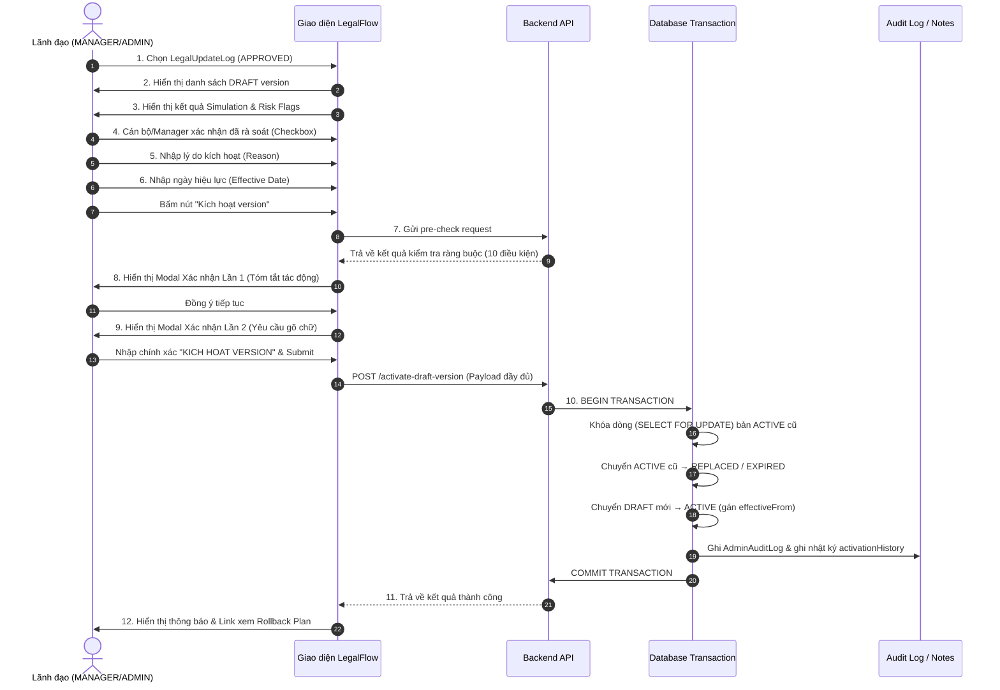
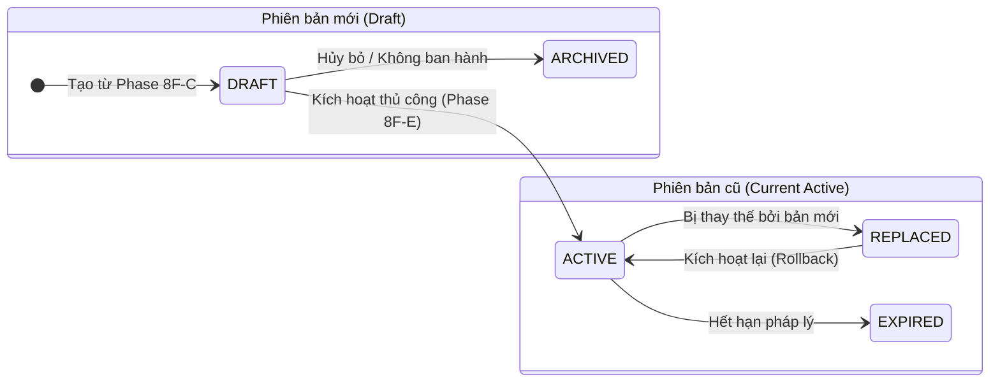
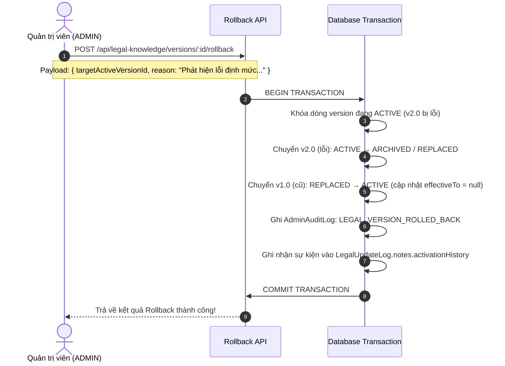
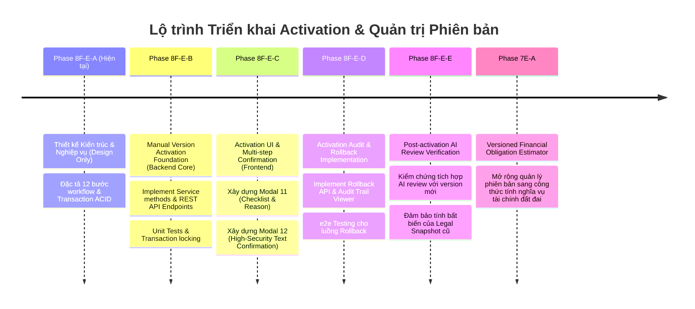

# Phase 8F-E-A Design – Manual Version Activation & Archiving

> **Tài liệu Thiết kế Nghiệp vụ & Kỹ thuật (Phase 8F-E-A)**
> **Chủ đề**: Kích hoạt thủ công phiên bản bản nháp (`DRAFT`) và lưu trữ phiên bản cũ (`ACTIVE` → `REPLACED`/`EXPIRED`).
> **Tình trạng**: Thiết kế kiến trúc & nghiệp vụ (Design Only - Chưa triển khai mã nguồn hay thay đổi schema).

---

## 1. Mục tiêu và Phạm vi

### 1.1 Mục tiêu
Phase 8F-E-A nhằm xây dựng khung thiết kế nghiệp vụ và kỹ thuật hoàn chỉnh cho quy trình **Kích hoạt thủ công (Manual Version Activation)** các phiên bản bản nháp (`DRAFT` version) của Thủ tục hành chính, Prompt AI, và Checklist nghiệp vụ sau khi đã được tạo (Phase 8F-C) và chạy kiểm thử song song / mô phỏng thành công (Phase 8F-D).

Tài liệu này là cơ sở chuẩn mực để các phase tiếp theo (8F-E-B, 8F-E-C, 8F-E-D) triển khai mã nguồn, đảm bảo việc ban hành tri thức pháp lý mới diễn ra chặt chẽ, an toàn, minh bạch và có đầy đủ dấu vết kiểm toán (audit trail).

### 1.2 Phạm vi triển khai của Phase 8F-E-A
- **CHỈ THIẾT KẾ (Design Only)**: Tập trung xác định quy trình, quy tắc ràng buộc, mô hình giao dịch (transaction), ma trận phân quyền, thiết kế API, và phương án rollback.
- **CHƯA TRIỂN KHAI CODE**: Không viết mã nguồn service hay controller trong phase này.
- **CHƯA TẠO ENDPOINT**: Các REST API endpoint chỉ nằm ở mức đề xuất đặc tả.
- **CHƯA TẠO UI**: Giao diện người dùng chỉ được mô tả thông qua wireframe/đặc tả luồng trải nghiệm.
- **CHƯA ĐỔI TRẠNG THÁI VERSION**: Không có bất kỳ lệnh update nào làm thay đổi trạng thái trong cơ sở dữ liệu hiện tại.
- **CHƯA KÍCH HOẠT VERSION THẬT**: Mọi hệ thống hiện tại tiếp tục vận hành trên các phiên bản `ACTIVE` đang có.

---

## 2. Nguyên tắc An toàn Pháp lý & Kỹ thuật

Quy trình ban hành và kích hoạt phiên bản tri thức pháp lý tại LegalFlow phải tuân thủ tuyệt đối 9 nguyên tắc an toàn cốt lõi:

1. **AI không được tự kích hoạt version**: Tuyệt đối không cho phép bất kỳ luồng xử lý tự động, background cronjob, hay tác tử AI nào tự ý chuyển trạng thái từ `DRAFT` sang `ACTIVE`. Kích hoạt version là quyền lực duy nhất của con người.
2. **Cán bộ phải kiểm tra (Human-in-the-Loop)**: Mọi phiên bản `DRAFT` trước khi kích hoạt đều phải trải qua bước rà soát, đánh giá tác động và xác nhận trách nhiệm của cán bộ nghiệp vụ.
3. **Lãnh đạo hoặc người được phân quyền mới được kích hoạt**: Chỉ người dùng có vai trò Quản lý (`MANAGER`) hoặc Quản trị viên (`ADMIN`) mới có quyền thực thi lệnh kích hoạt. Cán bộ nghiệp vụ (`STAFF`) chỉ có quyền rà soát và đề xuất.
4. **Không xóa version cũ (Immutable History)**: Khi một phiên bản mới được kích hoạt, phiên bản `ACTIVE` cũ tuyệt đối không bị xóa khỏi cơ sở dữ liệu mà chuyển sang trạng thái lưu trữ (`REPLACED` hoặc `EXPIRED`).
5. **Không xóa Legal Snapshot cũ**: Các bản ghi trong bảng `ProcedureAiAnalysisLegalSnapshot` gắn với các hồ sơ TTHC đã và đang xử lý không bị thay đổi hay xóa bỏ.
6. **Không sửa kết quả AI review cũ**: Báo cáo rà soát AI (`ProcedureAiAnalysis`) của các hồ sơ phát sinh trước thời điểm kích hoạt vẫn giữ nguyên kết quả và căn cứ pháp lý cũ.
7. **Mọi thao tác phải có Audit**: Hành động yêu cầu kích hoạt, xác nhận, thực thi thành công hay thất bại đều phải được ghi lại trong nhật ký kiểm toán hệ thống (`AdminAuditLog`) và lịch sử nhật ký cập nhật (`LegalUpdateLog.notes.activationHistory`).
8. **Mọi activation phải có Rollback Plan**: Bất kỳ sự ban hành version nào cũng phải kèm theo cơ chế khôi phục (rollback) về phiên bản trước đó trong trường hợp phát hiện sai sót pháp lý nghiêm trọng sau kích hoạt.
9. **Không được có nhiều ACTIVE version trùng phạm vi**: Tại bất kỳ thời điểm nào, trong cùng một phạm vi áp dụng (cùng mã thủ tục, cùng loại prompt, hoặc cùng checklist key), chỉ được phép tồn tại **duy nhất một (01) phiên bản ở trạng thái `ACTIVE`**.

---

## 3. Điều kiện Bắt buộc trước khi Activation (Pre-activation Checklist)

Để nút thao tác *"Kích hoạt version"* được bật (enabled) và hệ thống cho phép thực thi giao dịch, nhật ký cập nhật (`LegalUpdateLog`) và phiên bản dự thảo (`DRAFT`) phải thỏa mãn đồng thời **10 điều kiện tiên quyết**:

| Stt | Điều kiện bắt buộc | Mô tả chi tiết ràng buộc hệ thống |
| :---: | :--- | :--- |
| 1 | **LegalUpdateLog phải APPROVED** | Nhật ký cập nhật pháp lý phải đang ở trạng thái `reviewStatus = 'APPROVED'`. Các trạng thái `PENDING_REVIEW`, `IN_REVIEW`, `REJECTED`, hay `CLOSED` đều bị chặn. |
| 2 | **Có ít nhất một DRAFT version** | Nhật ký cập nhật phải đã khởi tạo ít nhất một phiên bản dự thảo (`ProcedureTypeVersion`, `AiPromptVersion`, hoặc `ChecklistVersion`) ở trạng thái `status = 'DRAFT'`. |
| 3 | **Đã chạy Simulation / Shadow Testing** | Phiên bản `DRAFT` cần kích hoạt phải trải qua ít nhất một lần chạy thử kiểm chứng trên hồ sơ mẫu (được ghi nhận trong `notes.simulations`). |
| 4 | **Simulation có ghi chú đánh giá** | Kết quả Shadow Testing gần nhất phải có ghi chú nhận xét của người rà soát (`officerNotes` không được trống). |
| 5 | **Có lý do activation (Reason)** | Người thực hiện kích hoạt buộc phải nhập văn bản tường minh giải thích lý do ban hành phiên bản mới (tối thiểu 20 ký tự). |
| 6 | **Có ngày hiệu lực dự kiến** | Phải chỉ định rõ ngày thời gian bắt đầu có hiệu lực (`effectiveFrom`). Mặc định là thời điểm kích hoạt hiện tại (`now()`) hoặc thời điểm trong tương lai theo quy định pháp luật. |
| 7 | **Có người phê duyệt hợp lệ** | Người thực hiện request phải có role `MANAGER` hoặc `ADMIN` và tài khoản đang hoạt động (`isActive = true`). |
| 8 | **Có kiểm tra Legal Basis** | Phiên bản DRAFT phải liên kết hợp lệ với ít nhất một căn cứ pháp lý (`LegalDocument`) đang có hiệu lực (`status = 'ACTIVE'`). |
| 9 | **Có cảnh báo rà soát văn bản** | Người kích hoạt phải tích chọn checkbox xác nhận: *"Tôi đã kiểm tra đối chiếu với văn bản quy phạm pháp luật hiện hành và chịu trách nhiệm về tính chính xác"*. |
| 10 | **Không có Risk Flag nghiêm trọng** | Kết quả Simulation gần nhất không được chứa các cảnh báo rủi ro mức độ Đỏ (Critical Risk Flags) chưa được xác nhận bỏ qua (override confirmation). |

---

## 4. Đối tượng được Activation

Trong phạm vi kiến trúc hiện tại, quy trình kích hoạt thủ công áp dụng cho **3 đối tượng phiên bản tri thức pháp lý**:

1. **`ProcedureTypeVersion` (Phiên bản Thủ tục hành chính)**:
   - Thay đổi các quy định về thời gian giải quyết, trình tự bước, cơ quan thực hiện, hoặc danh mục tài liệu yêu cầu.
2. **`AiPromptVersion` (Phiên bản Prompt AI rà soát)**:
   - Thay đổi chỉ dẫn hệ thống (System Prompt), tiêu chí đánh giá, hoặc quy tắc lập luận pháp lý của trợ lý AI.
3. **`ChecklistVersion` (Phiên bản Checklist kiểm tra hồ sơ)**:
   - Thay đổi danh sách tiêu chí kiểm tra, điều kiện Đạt/Không đạt của từng thành phần hồ sơ.

> [!IMPORTANT]
> **Lưu ý về `LegalDocument` (Văn bản pháp luật)**:
> Trong phase này, **chưa áp dụng workflow kích hoạt thủ công cho bảng `LegalDocument`**. Việc cập nhật trạng thái văn bản pháp luật (từ `DRAFT` sang `ACTIVE` hoặc `EXPIRED`) hiện được quản lý qua quy trình nghiệp vụ riêng của kho dữ liệu pháp lý (Phase 8C/8E). Quy trình Activation trong tài liệu này tập trung vào các cấu trúc thực thi nghiệp vụ (Procedure, Prompt, Checklist) sinh ra từ `LegalUpdateLog`.

---

## 5. Quy trình Nghiệp vụ Đề xuất (12 Bước Chuẩn)

Quy trình kích hoạt phiên bản được thiết kế theo luồng 12 bước chặt chẽ từ rà soát UI đến giao dịch cơ sở dữ liệu:



### Chi tiết từng bước nghiệp vụ:
- **Bước 1**: Người dùng Lãnh đạo truy cập trang Kho căn cứ pháp lý → tab Nhật ký cập nhật, chọn một bản ghi `LegalUpdateLog` đang ở trạng thái `APPROVED`.
- **Bước 2**: Xem danh sách các phiên bản `DRAFT` đã được tạo từ nhật ký này trong khối *"Danh sách Phiên bản Dự thảo"*.
- **Bước 3**: Xem bảng đối chiếu kết quả Shadow Testing / Simulation (đã thực hiện ở Phase 8F-D) để đánh giá tác động thực tế.
- **Bước 4**: Xác nhận trách nhiệm pháp lý bằng cách tích chọn checkbox rà soát.
- **Bước 5**: Nhập lý do kích hoạt (Ví dụ: *"Kích hoạt phiên bản mới theo Luật Đất đai 2024 và Nghị định 102/2024/NĐ-CP có hiệu lực từ 01/08/2024"*).
- **Bước 6**: Chọn ngày bắt đầu hiệu lực (mặc định là ngay lập tức).
- **Bước 7**: Hệ thống thực hiện kiểm tra ngầm (Pre-validation) 10 điều kiện bắt buộc. Nếu thiếu bất kỳ điều kiện nào, hiển thị lỗi màu đỏ và chặn tiếp tục.
- **Bước 8 (Xác nhận Lần 1)**: Hiển thị Modal tóm tắt: Danh sách version sẽ được kích hoạt, danh sách version cũ sẽ bị thay thế, và lời nhắc rủi ro.
- **Bước 9 (Xác nhận Lần 2 - High Security)**: Yêu cầu người dùng gõ chính xác cụm từ cấu hình (Ví dụ: `KICH HOAT VERSION` hoặc `ACTIVATE`) vào ô input để tránh bấm nhầm.
- **Bước 10 (Thực thi Transaction)**: Backend thực thi giao dịch ACID nguyên tử:
  - Chuyển `DRAFT` được chọn thành `ACTIVE`.
  - Chuyển `ACTIVE` cũ cùng phạm vi thành `REPLACED` (hoặc `EXPIRED`).
  - Ghi nhật ký kiểm toán hệ thống (`AdminAuditLog`).
  - Nối vết vào mảng `notes.activationHistory` của `LegalUpdateLog`.
- **Bước 11**: UI cập nhật giao diện, hiển thị huy hiệu `ACTIVE` màu xanh lá cho version mới và `REPLACED` màu xám cho version cũ.
- **Bước 12**: Cung cấp tùy chọn *"Xem phương án khôi phục (Rollback Plan)"* ngay trên giao diện thành công để Lãnh đạo nắm rõ cách xử lý nếu cần quay xe.

---

## 6. Quy tắc Chỉ một ACTIVE Version (Single Active Rule)

Toàn vẹn tri thức pháp lý đòi hỏi không bao giờ có sự nhập nhằng về phiên bản nào đang áp dụng. Hệ thống thiết lập quy tắc ràng buộc duy nhất (Unique Active Constraint):

### 6.1 Ràng buộc theo từng đối tượng
1. **Với `ProcedureTypeVersion`**:
   - Trong cùng một thủ tục hành chính (xác định bởi `procedureTypeId` hoặc `procedureType.code`), **chỉ có duy nhất 01 bản ghi có `status = 'ACTIVE'`**.
2. **Với `AiPromptVersion`**:
   - Trong cùng một khóa prompt (`promptKey`), cùng loại phân tích (`analysisType`), và cùng phạm vi thủ tục (`procedureTypeCode` hoặc `procedureGroup`), **chỉ có duy nhất 01 bản ghi có `status = 'ACTIVE'`**.
3. **Với `ChecklistVersion`**:
   - Trong cùng một mã checklist (`checklistKey`) và cùng phạm vi thủ tục (`procedureTypeCode` hoặc `procedureGroup`), **chỉ có duy nhất 01 bản ghi có `status = 'ACTIVE'`**.

### 6.2 Cơ chế thực thi (Service + Transaction Enforcement)
Do schema hiện tại (`schema.prisma`) sử dụng index thông thường (`@@index([status])`) mà chưa có ràng buộc `@@unique([procedureTypeId, status])` (để tránh lỗi khi có nhiều bản DRAFT hoặc REPLACED), quy tắc "Chỉ một ACTIVE" sẽ được bảo vệ kép bằng cơ chế ứng dụng trong Phase 8F-E-B:
- **Khóa bi quan (Pessimistic Locking / `SELECT FOR UPDATE`)**: Khi bắt đầu transaction kích hoạt, hệ thống khóa các dòng version của thủ tục tương ứng.
- **Quy tắc vô hiệu hóa trước - kích hoạt sau (Deactivate before Activate)**: Lệnh SQL luôn thực hiện chuyển trạng thái của bản `ACTIVE` cũ sang `REPLACED`/`EXPIRED` trước, sau đó mới chuyển bản `DRAFT` sang `ACTIVE`.
- **Kiểm tra hậu kiểm trong transaction**: Trước khi commit transaction, thực hiện query đếm số lượng bản ghi `status = 'ACTIVE'` trong phạm vi. Nếu `count > 1`, lập tức `ROLLBACK` transaction và ném lỗi `ConflictException`.

---

## 7. Thiết kế Trạng thái (Status Transition Design)

### 7.1 Sơ đồ chuyển đổi trạng thái
Quy trình kích hoạt quản lý sự chuyển dịch trạng thái của cả phiên bản mới và phiên bản cũ:



### 7.2 Ràng buộc chuyển đổi trạng thái
- **`DRAFT` → `ACTIVE`**: Luồng duy nhất để ban hành phiên bản mới.
- **`ACTIVE` → `REPLACED`**: Trường hợp thông thường khi phiên bản mới thay thế phiên bản cũ.
- **`ACTIVE` → `EXPIRED`**: Sử dụng khi văn bản pháp luật căn cứ hết hiệu lực hoàn toàn mà chưa có bản thay thế ngay lập tức, hoặc được quy định rõ ngày hết hạn (`effectiveTo`).
- **`REJECTED` KHÔNG ĐƯỢC ACTIVATE**: Nếu một bản dự thảo bị đánh dấu từ chối (hoặc nhật ký cập nhật bị `REJECTED`), tuyệt đối chặn mọi thao tác kích hoạt.
- **`CLOSED` LegalUpdateLog KHÔNG ĐƯỢC ACTIVATE**: Nhật ký đã đóng không được phép kích hoạt thêm version mới, trừ khi có quy trình mở lại (Reopen Workflow) được sự phê duyệt của Admin.

### 7.3 Khả năng đáp ứng của Enum hiện tại
Đã kiểm chứng trực tiếp trên `schema.prisma` (Dòng 604 & 586):
- Enum **`VersionStatus`** hiện tại ĐÃ CÓ SẴN các giá trị: `DRAFT`, `REVIEWING`, `APPROVED`, `ACTIVE`, `ARCHIVED`, `EXPIRED`, `REPLACED`.
- Enum **`LegalDocumentStatus`** hiện tại ĐÃ CÓ SẴN các giá trị: `DRAFT`, `ACTIVE`, `AMENDED`, `EXPIRED`, `REPLACED`, `ARCHIVED`.

> [!TIP]
> **Xác nhận kỹ thuật**: Cơ sở dữ liệu hiện tại hoàn toàn đáp ứng trọn vẹn mô hình trạng thái của Phase 8F-E-A mà **KHÔNG CẦN TẠO MIGRATION** hay chỉnh sửa schema!

---

## 8. Thiết kế Giao dịch (Transaction Design)

Để bảo đảm tính nguyên tử (Atomicity) và an toàn dữ liệu, toàn bộ quá trình kích hoạt phải được gói trong một database transaction duy nhất (`this.prisma.$transaction`) với 9 bước tuần tự:

```typescript
// Mô hình thiết kế giả mã (Pseudo-code Design) cho Phase 8F-E-B
await this.prisma.$transaction(async (tx) => {
  // Bước 1: Đọc và khóa bản ghi DRAFT version (SELECT FOR UPDATE)
  const draftVersion = await tx.procedureTypeVersion.findUnique({
    where: { id: dto.draftVersionId },
  });

  // Bước 2: Validate trạng thái DRAFT và các ràng buộc nghiệp vụ
  if (draftVersion.status !== 'DRAFT') {
    throw new BadRequestException('Chỉ phiên bản DRAFT mới được phép kích hoạt.');
  }

  // Bước 3: Tìm phiên bản ACTIVE hiện tại cùng phạm vi (nếu có)
  const currentActive = await tx.procedureTypeVersion.findFirst({
    where: {
      procedureTypeId: draftVersion.procedureTypeId,
      status: 'ACTIVE',
      id: { not: draftVersion.id },
    },
  });

  // Bước 4: Cập nhật phiên bản ACTIVE cũ -> REPLACED (hoặc EXPIRED)
  if (currentActive) {
    await tx.procedureTypeVersion.update({
      where: { id: currentActive.id },
      data: {
        status: dto.archiveStatus || 'REPLACED',
        effectiveTo: dto.effectiveFrom || new Date(),
      },
    });
  }

  // Bước 5: Cập nhật phiên bản DRAFT mới -> ACTIVE
  const activatedVersion = await tx.procedureTypeVersion.update({
    where: { id: draftVersion.id },
    data: {
      status: 'ACTIVE',
      effectiveFrom: dto.effectiveFrom || new Date(),
      effectiveTo: null, // Vô thời hạn cho đến khi bị thay thế
    },
  });

  // Bước 6: Cập nhật LegalUpdateLog.notes.activationHistory
  await this.appendActivationHistory(tx, logId, {
    action: 'ACTIVATE_VERSION',
    versionId: draftVersion.id,
    versionType: dto.draftType,
    previousActiveId: currentActive?.id || null,
    reason: dto.reason,
    actorId: user.id,
    timestamp: new Date(),
  });

  // Bước 7: Ghi AdminAuditLog bắt buộc
  await tx.adminAuditLog.create({
    data: {
      action: 'LEGAL_VERSION_ACTIVATED',
      entityType: dto.draftType,
      entityId: draftVersion.id,
      userId: user.id,
      details: JSON.stringify({
        oldStatus: 'DRAFT',
        newStatus: 'ACTIVE',
        replacedVersionId: currentActive?.id || null,
        reason: dto.reason,
      }),
    },
  });

  // Bước 8: Kiểm tra hậu kiểm ràng buộc "Chỉ 1 ACTIVE"
  const activeCount = await tx.procedureTypeVersion.count({
    where: { procedureTypeId: draftVersion.procedureTypeId, status: 'ACTIVE' },
  });
  if (activeCount !== 1) {
    throw new InternalServerErrorException('Lỗi vi phạm ràng buộc Single Active Version!');
  }

  // Bước 9: Trả về kết quả (Nếu có lỗi ở bất kỳ bước nào từ 1-8, toàn bộ tx tự động ROLLBACK)
  return activatedVersion;
});
```

---

## 9. Phân quyền và Bảo mật (RBAC Matrix)

Quy trình kích hoạt áp dụng phân quyền nghiêm ngặt dựa trên Role và Auth Guard của LegalFlow:

| Vai trò (Role) | Xem DRAFT / Simulation | Đề xuất / Ghi chú | Kích hoạt Version (Activate) | Rollback Version | Mô tả quyền hạn |
| :--- | :---: | :---: | :---: | :---: | :--- |
| **`VIEWER`** | ✔️ (Read-only) | ❌ | ❌ | ❌ | Chỉ được xem lịch sử và kết quả kiểm thử, không có quyền thao tác. |
| **`STAFF`** | ✔️ | ✔️ | ❌ | ❌ | Được chạy simulation, nhập đánh giá, đề xuất kích hoạt, nhưng **không được phép bấm nút kích hoạt**. |
| **`MANAGER`** | ✔️ | ✔️ | ✔️ (Nếu đủ điều kiện) | ✔️ | **Người thực thi chính**. Được quyền kích hoạt phiên bản mới trong phạm vi phụ trách sau khi rà soát. |
| **`ADMIN`** | ✔️ | ✔️ | ✔️ | ✔️ | Quản trị viên tối cao. Có toàn quyền kích hoạt, xử lý ngoại lệ, và thực thi rollback khẩn cấp. |
| **`SYSTEM` / `AI`**| ✔️ (Read-only) | ❌ | ❌ | ❌ | **Chặn tuyệt đối**. AI và các background job không bao giờ có quyền gọi endpoint activation. |

---

## 10. Thiết kế Giao diện Người dùng (UI Future Specifications)

Trong Phase 8F-E-C (khâu triển khai UI), giao diện quản lý tại `LegalKnowledgePage.tsx` và Modal Chi tiết Nhật ký (`LegalUpdateLog`) sẽ được nâng cấp với các thành phần sau:

### 10.1 Khu vực Quản lý Kích hoạt (Activation Section trong Modal 7)
- Hiển thị danh sách các bản nháp `DRAFT` kèm trạng thái kiểm thử (Đã chạy simulation / Chưa chạy).
- **Nút hành động**: Nút **"Kích hoạt Phiên bản (Activate)"** màu xanh Emerald nổi bật.
  - *Trạng thái ẩn*: Nếu user là `VIEWER` hoặc `STAFF`.
  - *Trạng thái Disabled*: Nếu chưa đủ 10 điều kiện tiên quyết (khi hover chuột vào sẽ hiển thị tooltip chỉ rõ điều kiện nào còn thiếu, ví dụ: *"Chưa có ghi chú đánh giá Simulation"*).

### 10.2 Luồng Modal Xác nhận Nhiều lớp (Multi-step Confirmation Modal)

#### Lớp 1: Modal Kiểm tra Điều kiện & Tác động (Pre-activation Checklist Modal)
- **Banner cảnh báo vàng/đỏ**:
  > ⚠️ **CẢNH BÁO TÁC ĐỘNG NGHIỆP VỤ**:
  > Kích hoạt version sẽ làm thay đổi căn cứ pháp lý áp dụng cho **các hồ sơ AI review mới phát sinh sau thời điểm kích hoạt**. Các kết quả AI review cũ vẫn giữ nguyên legal snapshot tại thời điểm tạo và không bị ảnh hưởng.
- **Bảng đối chiếu nhanh**:
  - Phiên bản sắp kích hoạt: `v2.0 (DRAFT)` - *Luật Đất đai 2024*.
  - Phiên bản sắp thay thế: `v1.0 (ACTIVE)` → sẽ chuyển thành `REPLACED`.
- **Form nhập thông tin bắt buộc**:
  - `effectiveFrom`: Date picker (Mặc định hôm nay).
  - `reason`: Textarea nhập lý do kích hoạt (Bắt buộc, tối thiểu 20 ký tự).
  - Checkbox cam kết: *"[x] Tôi đã đối chiếu văn bản quy phạm pháp luật hiện hành và xác nhận đủ điều kiện ban hành"*.

#### Lớp 2: Modal Xác nhận Bảo mật Cao (High-Security Confirmation Modal)
- Cửa sổ popup yêu cầu sự tập trung tuyệt đối của Lãnh đạo.
- Hiển thị dòng chữ hướng dẫn: *"Để xác nhận ban hành chính thức phiên bản này, vui lòng gõ chính xác cụm từ bên dưới:"*
- Mã xác nhận hiển thị chữ in đậm: **`KICH HOAT VERSION`**
- Ô input text: Nút *"Thực hiện Kích hoạt"* chỉ đổi sang màu xanh và bấm được khi chuỗi nhập vào khớp 100% với mã xác nhận.

---

## 11. Đặc tả Backend API Endpoints (Phase Sau)

Đề xuất đặc tả REST API endpoint phục vụ kích hoạt thủ công cho Phase 8F-E-B:

### 11.1 Endpoint Kích hoạt Phiên bản
- **URL**: `POST /api/legal-knowledge/update-logs/:id/activate-draft-version`
- **Authentication**: Required (JWT Bearer Token).
- **Authorization**: `@Roles(Role.MANAGER, Role.ADMIN)`.
- **Request Headers**: `Content-Type: application/json`.
- **Request Body Payload**:
  ```json
  {
    "draftType": "PROCEDURE_TYPE_VERSION",
    "draftVersionId": "proc-version-draft-uuid-1234",
    "reason": "Kích hoạt áp dụng quy trình cấp GCN mới theo Luật Đất đai 2024 có hiệu lực từ 01/08/2024. Đã chạy shadow testing đạt kết quả tốt.",
    "effectiveFrom": "2026-08-01T00:00:00.000Z",
    "archiveOldStatus": "REPLACED",
    "confirmationText": "KICH HOAT VERSION"
  }
  ```
- **Success Response (200 OK)**:
  ```json
  {
    "success": true,
    "message": "Kích hoạt phiên bản thủ tục hành chính thành công.",
    "data": {
      "activatedVersion": {
        "id": "proc-version-draft-uuid-1234",
        "version": "v2.0",
        "status": "ACTIVE",
        "effectiveFrom": "2026-08-01T00:00:00.000Z"
      },
      "replacedVersion": {
        "id": "proc-version-old-uuid-0000",
        "version": "v1.0",
        "status": "REPLACED",
        "effectiveTo": "2026-08-01T00:00:00.000Z"
      },
      "updateLogId": "log-uuid-5678",
      "auditLogId": "audit-uuid-9999",
      "activatedAt": "2026-07-05T16:15:00.000Z",
      "activatedBy": "admin-user-uuid"
    }
  }
  ```
- **Error Responses**:
  - `400 Bad Request`: Thiếu lý do, sai cụm từ xác nhận, hoặc version không phải trạng thái `DRAFT`.
  - `403 Forbidden`: Người dùng là `STAFF` hoặc `VIEWER`.
  - `409 Conflict`: Vi phạm ràng buộc điều kiện (ví dụ: `LegalUpdateLog` chưa `APPROVED` hoặc chưa chạy Simulation).
  - `500 Internal Server Error`: Lỗi transaction database.

---

## 12. Thiết kế Nhật ký Kiểm toán (Audit Log Specification)

Mọi biến động trong quá trình activation được ghi vết kép tại bảng `AdminAuditLog` (quản trị hệ thống) và trường JSON `LegalUpdateLog.notes.activationHistory` (nghiệp vụ).

### 12.1 Danh sách Action chuẩn hóa
1. **`LEGAL_VERSION_ACTIVATION_REQUESTED`**: Ghi nhận yêu cầu kích hoạt bắt đầu được gửi lên.
2. **`LEGAL_VERSION_ACTIVATION_VALIDATED`**: Hệ thống đã kiểm tra thông qua 10 điều kiện ràng buộc.
3. **`LEGAL_VERSION_ACTIVATED`**: Kích hoạt thành công phiên bản `DRAFT` thành `ACTIVE`.
4. **`LEGAL_VERSION_REPLACED_PREVIOUS`**: Ghi nhận phiên bản `ACTIVE` cũ bị chuyển thành `REPLACED`/`EXPIRED`.
5. **`LEGAL_VERSION_ACTIVATION_FAILED`**: Ghi nhận giao dịch thất bại (kèm nguyên nhân lỗi).
6. **`LEGAL_VERSION_ROLLBACK_REQUESTED`**: Yêu cầu khôi phục về phiên bản cũ.
7. **`LEGAL_VERSION_ROLLED_BACK`**: Thực thi khôi phục rollback thành công.

### 12.2 Cấu trúc dữ liệu Audit Log (`details` JSON)
Một bản ghi audit chuẩn cho thao tác kích hoạt phải lưu giữ 12 trường thông tin:

```json
{
  "userId": "usr-uuid-admin-001",
  "role": "ADMIN",
  "entityType": "PROCEDURE_TYPE_VERSION",
  "entityId": "proc-version-draft-uuid-1234",
  "oldStatus": "DRAFT",
  "newStatus": "ACTIVE",
  "previousActiveVersionId": "proc-version-old-uuid-0000",
  "newActiveVersionId": "proc-version-draft-uuid-1234",
  "reason": "Kích hoạt áp dụng quy trình cấp GCN mới theo Luật Đất đai 2024...",
  "beforeJson": {
    "version": "v2.0",
    "status": "DRAFT",
    "effectiveFrom": null
  },
  "afterJson": {
    "version": "v2.0",
    "status": "ACTIVE",
    "effectiveFrom": "2026-08-01T00:00:00.000Z"
  },
  "createdAt": "2026-07-05T16:15:00.000Z"
}
```

---

## 13. Phương án Khôi phục (Rollback Design)

Khả năng quay xe (Rollback) là yêu cầu bắt buộc để phòng ngừa rủi ro ban hành quy trình sai làm tắc nghẽn xử lý hồ sơ TTHC.

### 13.1 Nguyên tắc Rollback
1. **Không xóa version mới**: Phiên bản vừa kích hoạt bị lỗi **TUYỆT ĐỐI KHÔNG BỊ XÓA** khỏi database. Nó sẽ được chuyển trạng thái sang `REPLACED` hoặc `ARCHIVED`.
2. **Kích hoạt lại version cũ**: Rollback thực chất là một giao dịch kích hoạt ngược: Chuyển phiên bản `REPLACED` trước đó trở lại trạng thái `ACTIVE`.
3. **Bảo vệ lịch sử AI Snapshot**: Các hồ sơ TTHC đã lỡ chạy AI review trong khoảng thời gian version lỗi đang `ACTIVE` vẫn giữ nguyên bản ghi trong `ProcedureAiAnalysisLegalSnapshot`. Cán bộ sẽ sử dụng chức năng *"Chạy lại AI review"* trên hồ sơ nếu muốn áp dụng version cũ vừa rollback.
4. **Bảo vệ môi trường Production**: Trước khi thực hiện kích hoạt các phiên bản thủ tục trọng yếu trên production, hệ thống khuyến cáo (hoặc tự động kích hoạt script) tạo bản backup database snapshot (`pg_dump` hoặc Cloud SQL point-in-time recovery).

### 13.2 Luồng thực thi Rollback Transaction


---

## 14. Thiết kế Kiểm thử (Test Design Specification)

Bộ kiểm thử cho Phase 8F-E (khi triển khai code) phải bao phủ 12 kịch bản kiểm chứng (Unit Test & e2e Test):

| ID | Tên Kịch bản Kiểm thử (Test Case) | Loại Kiểm thử | Kết quả Mong đợi (Expected Result) |
| :---: | :--- | :---: | :--- |
| **TC-01** | `should deny activation for STAFF role` | RBAC / Unit | Ném lỗi `ForbiddenException (403)` khi user có role `STAFF` gọi API activation. |
| **TC-02** | `should deny activation for VIEWER role` | RBAC / Unit | Ném lỗi `ForbiddenException (403)` khi user có role `VIEWER`. |
| **TC-03** | `should deny activation if LegalUpdateLog is not APPROVED` | Business / Unit | Ném lỗi `BadRequestException (400)` khi log đang ở trạng thái `PENDING_REVIEW` hoặc `REVIEWING`. |
| **TC-04** | `should deny activation if Simulation has not been run` | Business / Unit | Ném lỗi `BadRequestException (400)` khi `log.notes.simulations` rỗng hoặc không tồn tại. |
| **TC-05** | `should deny activation if version status is not DRAFT` | Business / Unit | Ném lỗi `BadRequestException (400)` nếu attempt kích hoạt một version đang là `ACTIVE` hoặc `REPLACED`. |
| **TC-06** | `should deny activation if reason is missing or too short` | Validation / Unit | Ném lỗi `BadRequestException (400)` khi `reason` rỗng hoặc dưới 20 ký tự. |
| **TC-07** | `should deny activation if confirmationText is invalid` | Security / Unit | Ném lỗi `BadRequestException (400)` khi `confirmationText != 'KICH HOAT VERSION'`. |
| **TC-08** | `should successfully activate DRAFT and replace old ACTIVE` | Transaction / e2e| Bản DRAFT chuyển `ACTIVE`, bản ACTIVE cũ chuyển `REPLACED`, transaction commit thành công. |
| **TC-09** | `should prevent multiple ACTIVE versions in same scope` | Integrity / e2e | Nếu giả lập lỗi tạo 2 ACTIVE cùng phạm vi, transaction tự động `ROLLBACK` và ném lỗi `500/409`. |
| **TC-10** | `should use new ACTIVE version for subsequent AI reviews` | Integration / e2e| Sau khi activate, gọi API `reviewLandFirstCertificate` trên hồ sơ mới phải áp dụng version mới. |
| **TC-11** | `should preserve old legal snapshot for past AI analyses` | Auditability / e2e| Kiểm tra các bài AI review cũ, xác nhận `ProcedureAiAnalysisLegalSnapshot` vẫn trỏ về version cũ. |
| **TC-12** | `should successfully execute rollback transaction` | Rollback / e2e | Gọi API rollback: Version lỗi chuyển `ARCHIVED`, version cũ chuyển lại `ACTIVE` thành công. |

---

## 15. Quản lý Rủi ro và Biện pháp Kiểm soát (Risk Matrix)

Phân tích 8 rủi ro tiềm ẩn trong quá trình kích hoạt thủ công và các biện pháp giảm thiểu đã thiết kế:

| Stt | Rủi ro Tiềm ẩn | Mức độ | Biện pháp Kiểm soát & Kỹ thuật đã Thiết kế |
| :---: | :--- | :---: | :--- |
| 1 | **Kích hoạt nhầm version chưa hoàn thiện** | Cao | Cơ chế xác nhận 2 lớp trên UI, buộc phải gõ chữ `KICH HOAT VERSION` và bắt buộc có kết quả chạy thử Shadow Testing trước đó. |
| 2 | **Prompt AI mới gây sai lệch lập luận pháp lý** | Cao | Bắt buộc chạy Simulation trên hồ sơ mẫu ở Phase 8F-D. Hiển thị rõ khối `diffSummary` và `riskFlags` để Lãnh đạo đánh giá trước khi bấm nút. |
| 3 | **Checklist mới thiếu tiêu chí kiểm tra hồ sơ** | Trung bình | Kiểm tra chéo giữa ChecklistVersion và quy định tại tài liệu pháp lý (`LegalDocument`). Bỏ trống tiêu chí bắt buộc sẽ bị cảnh báo đỏ. |
| 4 | **Thủ tục mới chưa khớp quy định địa phương** | Trung bình | Cam kết Human-in-the-Loop: Cán bộ nghiệp vụ phải tích chọn checkbox xác nhận đã rà soát quy định địa phương trước khi trình Lãnh đạo. |
| 5 | **Nhiều quản lý cùng kích hoạt đồng thời (Race Condition)** | Cao | Sử dụng cơ chế khóa bi quan database transaction (`SELECT FOR UPDATE`) khi đọc bản ghi ACTIVE cũ, ngăn chặn vi phạm Single Active Rule. |
| 6 | **Thiếu dấu vết trách nhiệm khi xảy ra sự cố** | Trung bình | Ghi nhật ký kép tại `AdminAuditLog` (bảo vệ không thể xóa) và `LegalUpdateLog.notes.activationHistory`. Ghi nhận rõ IP, User ID, Role và Lý do. |
| 7 | **Rollback gây gián đoạn hệ thống hoặc lỗi dữ liệu** | Trung bình | Thiết kế Rollback theo nguyên tắc "Kích hoạt ngược" (thay đổi trạng thái đơn thuần), không xóa bảng, không sửa dữ liệu lịch sử hồ sơ. |
| 8 | **Schema chưa có Unique Constraint bảo vệ ACTIVE** | Low / Med | Bổ sung logic kiểm tra hậu kiểm `count === 1` ngay trong transaction ở tầng Service trước khi commit. Đề xuất thêm unique index ở phase migration tương lai nếu cần. |

---

## 16. Lộ trình Triển khai sau Thiết kế (Post-Design Roadmap)

Sau khi tài liệu thiết kế Phase 8F-E-A được Lãnh đạo phê duyệt, lộ trình phát triển tiếp theo được phân chia thành các phase nhỏ để kiểm soát chất lượng:



1. **Phase 8F-E-B (Manual Version Activation Foundation)**: Triển khai backend service method `activateDraftVersion`, viết các câu lệnh transaction Prisma, và mở endpoint REST API.
2. **Phase 8F-E-C (Activation UI & Multi-step Confirmation)**: Xây dựng giao diện nút bấm, Modal kiểm tra điều kiện (Modal 11) và Modal xác nhận gõ chữ bảo mật cao (Modal 12) trên `LegalKnowledgePage.tsx`.
3. **Phase 8F-E-D (Activation Audit & Rollback)**: Triển khai tính năng xem lịch sử activation, xây dựng API rollback khẩn cấp và giao diện quản lý khôi phục phiên bản.
4. **Phase 8F-E-E (Post-activation AI Review Verification)**: Kiểm thử tích hợp toàn diện, xác nhận hồ sơ TTHC mới áp dụng đúng version vừa kích hoạt, hồ sơ cũ giữ nguyên snapshot.
5. **Phase 7E-A (Versioned Financial Obligation Estimator)**: Áp dụng nền tảng quản lý phiên bản pháp lý này vào hệ thống tính toán và ước tính nghĩa vụ tài chính đất đai theo từng giai đoạn luật.

---

## 17. Kết luận

Phase 8F-E-A đã hoàn thành xuất sắc sứ mệnh thiết kế, tạo ra một **khung chuẩn mực nghiệp vụ và kỹ thuật vững chắc** cho việc kích hoạt thủ công các phiên bản tri thức pháp lý tại LegalFlow.

- **Khẳng định tính chất Phase**: Đây hoàn toàn là phase **THIẾT KẾ (Design Only)**. Chưa có bất kỳ dòng code backend/frontend nào được triển khai, chưa có migration nào được chạy, và chưa có phiên bản pháp lý nào bị thay đổi trạng thái trong hệ thống thực tế.
- **Bước đệm bắt buộc**: Tài liệu này là bước thẩm định kiến trúc bắt buộc trước khi cho phép dòng chảy dữ liệu chuyển từ `DRAFT` sang `ACTIVE`, bảo đảm tuyệt đối triết lý **Human-in-the-Loop** và sự an toàn pháp lý tối cao trong quản lý nhà nước về đất đai.
- **Sẵn sàng cho Phase sau**: Các đặc tả về transaction, RBAC, và test case trong tài liệu này đã sẵn sàng để đội ngũ kỹ sư tiếp nhận và triển khai ngay trong **Phase 8F-E-B (Backend Foundation)**.
